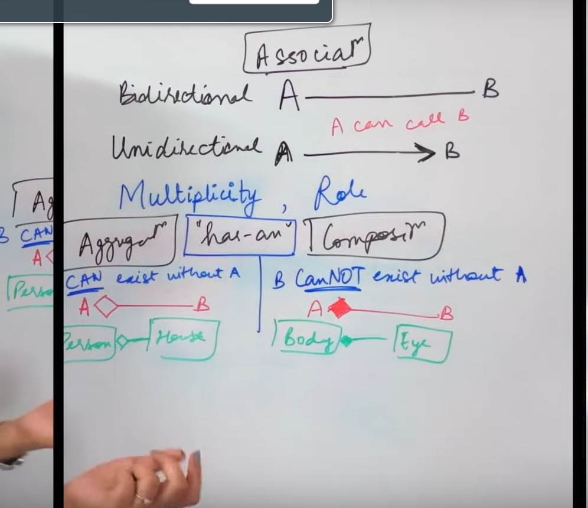
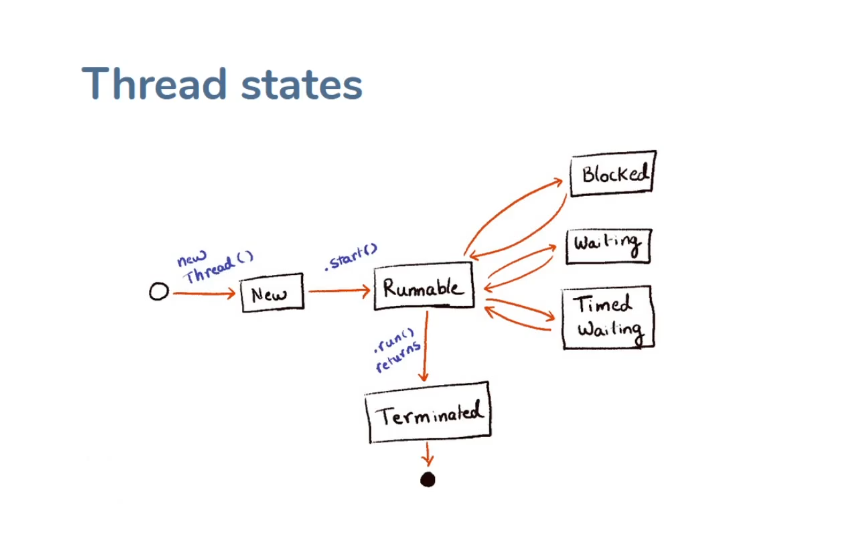
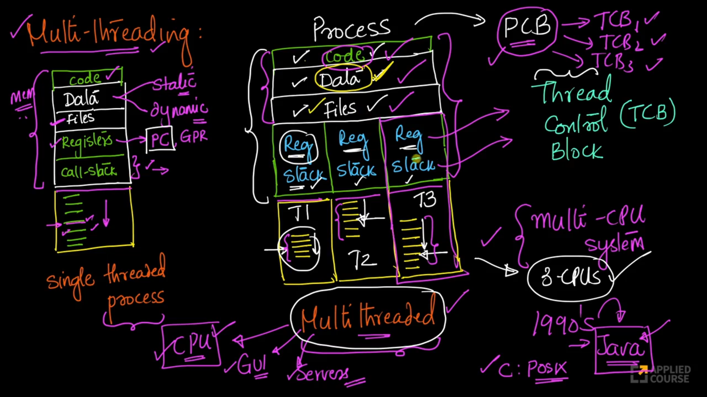

### Q-1 - Wha is JIT?

Ans: JIT is an abbreviation for Just-in-Time Compiler. It
increases efficiency of the interpreter by compiling the
bytecode in the runtime. JIT compiles Code to Machine Level
directly for higher speeds of code execution.

-----------------------------


### Q-2 - What is class Loader?

Ans:  Part of JRE
* They load Java classes into the runtime (JVM)
* This happens only when needed
* JVM requests a class
* Class loader tries to find it and load it (in the metaspace). If the class is not used for a while then it can be removed from the metaspace and on request it can loaded again.


-----------------------------

### Q-3 - What ar diff types of classloaders?

Ans:  

* Application/System class loader - it loads your classes and classes from libraries
* Extension class loader - it loads core JDK classes.
* Bootstrap class loader - Class Loaders are written in Java to start the class loading mechanism we have Bootstrap class loader.
* Custom class loaders - you can also create custom loader.


-----------------------------

### Q-4 - What are the diff memory area allocated by JVM?

Ans:

* Heap
    * Space for objects in memory
    * "Global"
    * Largest of the memory spaces
* Stack
    * Holds thread level data
    * Local variables and object references
    * Call frames for each method execution

* Code area (meta space)
    * Stores bytecode, JIT info

* Implementation / native area
    * Registers
    * C implementation stacks


-----------------------------

### Q-5 - Is the following program correct?

```java
class Head{
    static public void main(String[] args){
        Ssystem.out.println("aa");
    }
}
```

Ans: Yes.


-----------------------------

### Q-6 - What are default value stored in local variables?

Ans: There is no concept of default value for local variables.

-----------------------------


### Q-7 - What is association?

Ans: 

1. Video: https://www.youtube.com/watch?v=j84w5VM9GT8&t=1267s


-----------------------------

### Q-8 - What is copy constructor?

Ans: A Copy Constructor in Java is a constructor that initializes an object through another 
object of the same class.


-----------------------------


### Q-9 - What is marker interface?

Ans:  A marker interface is like a special label that we can put on a class in Java to tell 
the system something about it. Just like how we use labels to tell us what's in a box or what 
type of food is in a container, we can use a marker interface to tell Java something special 
about a class.

In general, marker interfaces are useful when we want to attach metadata to a class that 
cannot be expressed using other means, such as by adding methods or fields to the class. By 
implementing a marker interface, a class can signal to other parts of the system that it has 
some special behavior or properties that should be taken into account.

Examples are `Serializable`, `Cloneable`.

Video: https://www.youtube.com/watch?v=qeGCxKCWFcQ


-----------------------------

### Q-10 - What object cloning?

Ans: An ability to recreate an object completely similar to an
existing object is known as Object Cloning in Java. Java
provides clone() method to clone an existing object offering
same functionality of the original object

1. Video 1: https://www.youtube.com/watch?v=b2uFL4BFDYg
1. Video 2: https://www.youtube.com/watch?v=WIh-TVq4ifI
1. Video 3: https://www.youtube.com/watch?v=KWbr7B5LDzs


-----------------------------


### Q-11 - Why Java is not completely Object Oriented?

Ans: Because of primitive types like int, char, float etc.

-----------------------------


### Q-12 What are Wrapper classes

Ans: In Java, when you declare primitive datatypes, then
Wrapper classes are responsible for converting them into
objects (Reference types). It was introduced so primitive types can play 
nicely with the collections framework.

-----------------------------


### Q-13 Define Singleton class

Ans: In Java, when you make the constructor of a class as
private, then that particular class can generate only one
single object. This type of class is called as a Singleton Class.

-----------------------------


### Q-14 What are packages?

Ans: Just a collection of related classes. The use of packages helps and code reusability and name clash.


-----------------------------

### Q-15 Do we have pointers in Java?

Ans: No

-----------------------------

### Q-16 What is Java String Pool?

Ans: A collection of strings in Java's Heap memory is
referred as Java String Pool. In case you try to create a new
string object, JVM first checks for the presence of the object
in the pool. If available, the same object reference is shared
with the variable, else a new object is created.


-----------------------------


### Q-17 What is JDK?

Ans: 

* Stands for Java Development Kit
* It is a set of tools to help developers write Java programs
* Comes with the JRE (because you need to run what you develop)
* Based off the Java language specification

* Includes
    * Java compiler
    * Class libraries
    * Utilities


-----------------------------


### Q-18 What are access specifiers?

Ans: Access Specifiers are predefined keywords used to help
JVM with understanding the scope of a variable, method, and
a class. We have four access specifiers.

1. Public Access Specifier
1. Private Access Specifier
1. Protected Access Specifier
1. Default Access Specifier


-----------------------------


### Q-19 What is Dynamic Method Dispatch?

Ans: The Dynamic method dispatch is a process where the
method call is executed during the run-time. The overridden
method is called through a reference variable of super class.
This process is also known as Run-Time Polymorphism

-----------------------------


### Q-20 What are different thread states?

Ans: 

* when `sleep()` is called it goes to timed waiting
* when `join()` is called thread goes to waiting state
* when thread is waiting for lock it goes to blocked state

-----------------------------


### Q-21 What is daemon thread?

Ans: The Daemon thread can be defined as a thread with
least priority. This Daemon thread is designed to run in the
background during the process of Garbage Collection in
Java. The `setDaemon()` method is used to create a Daemon thread
in Java.

-----------------------------


### Q-22 Can you run the code before executing main methods?

Ans: Yes, we can execute any code, even before the main
method. We will be using a **static block** of code in the class
when creating the objects at load time of the class. Any
statements within this static block of code will get executed
at once while loading the class, even before the creation of
objects in the main method.

-----------------------------


### Q-23  How many times the finalize method called?

Ans: The `finalize()` method is called by the Garbage collector before reclaiming the memory.
For every object, the Garbage Collector calls the `finalize()` method just for one time.

-----------------------------


### Q-24  Diff b/w StringBuilder and StringBuffer?

Ans: `StringBuffer` is thread safe but `StringBuilder` is not.

-----------------------------


### Q-25 Real World use cases of Serializable interface.

Ans: 


-----------------------------


### Q-26 What is functional interface.

Ans: An Interface that contains only one abstract method is known as functional
interface. It can have any number of default and static methods.


-----------------------------


### Q-27 Can you tell few functional interface which is already there before java 8?

Ans:

* Runnable
* Callable
* Comparator (interviewer might ask about equals() method inside comparator)

-----------------------------


### Q-28 What are all functional interface introduced in java 8?

Ans:

* Function
* Predicate
* Consumer
* Supplier

-----------------------------


### Q-29 What is lambda expression?

Ans: Lambda expressions basically express instances of functional interfaces, in other
word It provides a clear and concise way to represent method of a functional using
an expression.


-----------------------------

### Q-30 What is Stream in java 8?

Ans: A stream is a sequence of objects that supports various methods which can be pipelined to 
produce the desired result.

The features of Java stream are
* A stream is not a data structure instead it takes input from the Collections, Arrays or I/O channels.
* Streams don't change the original data structure, they only provide the result as per the pipelined methods.

-----------------------------

### Q-31 What is diff bw Vector and ArrayList?

Ans: `Vector` is thread-safe but `ArrayList` is not.


-----------------------------


### Q-32 Collection framework heirarchy

Ans:


-----------------------------

### Q-33 Diff b\w Hashtable and HashMap

Ans: 

* `Hashtable` is thread-safe but `HashMap` is not.
* `HashMap` allows key with `null` value but `Hashtable` doesn't.


-----------------------------

### Q-34 What is blocking Queue

Ans: A Queue that additionally supports operations that wait for
the queue to become non-empty when retrieving an
element, and wait for space to become available in the queue when
storing an element.

-----------------------------

### Q-35 Whare are some use cases of reflection

Ans: 

1. Mapping json to class and vice-versa
1. hibernate creates DDL statements from entity using reflection

-----------------------------

### Q-36 When would you use parallelStream()


-----------------------------

### Q-37 Explain executor service and types of it.

1. Fixed thread pool executor
1. Single thread executor
1. Cached thread pool executor
1. Scheduled thread pool executor
1. Work stealing thread pool executor

Executors.newFixedThreadPool(3);


-----------------------------


### Q-38 How to make class as immutable?

Ans:

Rules to make object Immutable

1. Declare the class as final so it can't be extended.
1. Make all of the fields private so that direct access is not allowed.
1. Don't provide setter methods for variables.
1. Make all mutable fields final so that a field's value can be assigned only once.
1. Initialize all fields using a constructor method performing deep copy.
1. Perform deep copy in getter of mutable fields

Video: https://www.youtube.com/watch?v=PYJrFi4Hzsg


-----------------------------


### Q-39 What are core principles of OOP?

To remember the core principles of Object-Oriented Programming (OOP), you can use the acronym `A PIE`:

1. Abstraction
1. Polymorphism
1. Inheritance
1. Encapsulation

lets start with Polymorphism:

Doing the same thing in different ways is called polymorhphism. There are two types of polymorhphism:

1. Runtime polymorhphism
1. Compile time polymorhphism

#### Runtime Polymorphism

Consider an `Animal` class with an `eat()` method. Next, create a `Dog` class by extending `Animal` class and override the `eat()` method. Now create an pbject of type `Animal` and `Dog` and assign it to base class reference.

```java
Animal a1 = new Animal();
a1.eat();

a1 = new Dog();
a1.eat();
```

At runtime we JVM decides which version of `eat()` method should be called (i.e from `Animal` or `Dog` class). This is called **Runtime polymorhphism**.


#### Compile time Polymorphism

Method overloading is called **Compile time polymorhphism**.

Method overloading allows a class to have more than one method with the same name, but with different parameters (different type, number, or both). The correct method to call is determined by the compiler based on the method signature (the number and types of parameters).

Video Polymorphism: https://www.youtube.com/watch?v=jhDUxynEQRI&t=340s


#### Abstraction

Abstraction in object-oriented programming (OOP) is the concept of hiding the complex 
implementation details and exposing only the essential features of an object or a system. This 
helps in reducing programming complexity and effort, enhancing code readability, and providing 
a clear and concise interface for the end user or other developers.

Example:

Suppose we want to implement `Set`. There are multiple implementaions possible here:

1. Balanced Binary Tree
2. Hashtable

We start by creating a interface called `Set` with two methods `add()` and `remove()`, and leave upto the child class to define the implementation.

Video abstraction: https://www.youtube.com/watch?v=L1-zCdrx8Lk


-----------------------------

### Q-40 How many methods are there compare strings in Java?

1. Using `equals()` method
1. Using `equalsIgnorecase()` method
1. Using `compareTo()`
1. Using `compareTolgnorecase()` method
1. `Objects.equals()` method


-----------------------------

### Q-41 What are the motivations for ExecutorService?

1. Hight level API
1. Thread creation is resource intensive
1. Return result


-----------------------------

### Q-41 When ExecutorService was introduced in java?

Java 5

-----------------------------

### Q-42 Whats the diff b\w process and threads?



For more: https://www.scaler.com/topics/course/free-operating-system-course/video/1443/

-----------------------------

### Q-42 By default main thread doesn't terminate untill the child threads are done, then what's the point of join() method?

Yes the main thread does not terminate until all non-daemon child threads have completed. However, the purpose of the join() method used to control the order of execution, for example, you want to perform some action only when all the non-daemon threads are done executing. This is where you need join() method.

-----------------------------

### Q-42 What is the diff b/w objects and references?

Yes the main thread does not terminate until all non-daemon child threads have completed. However, the purpose of the join() method used to control the order of execution, for example, you want to perform some action only when all the non-daemon threads are done executing. This is where you need join() method.

-----------------------------

### Q- Exaplain stack and heap memory regions in the context of threads?

https://marcelclasses.udemy.com/course/java-multithreading-concurrency-performance-optimization/learn/lecture/11199598#notes

-----------------------------

