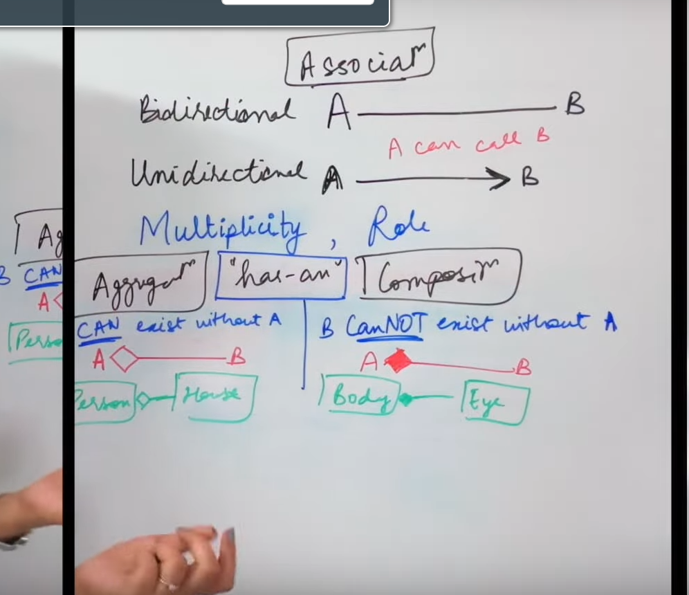
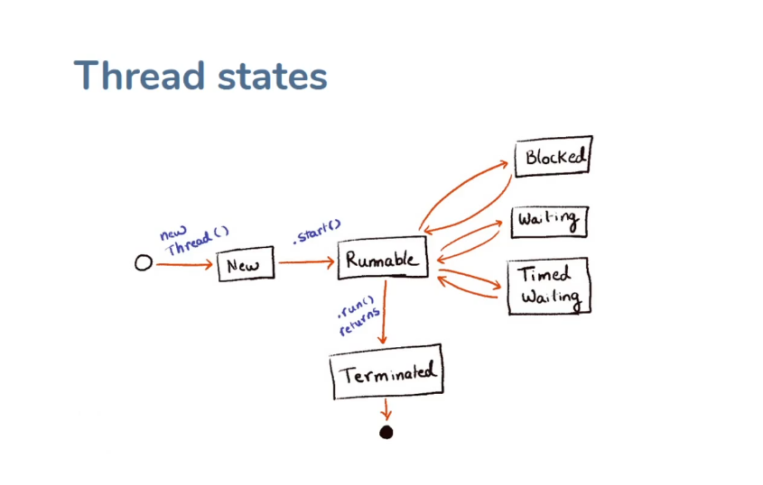
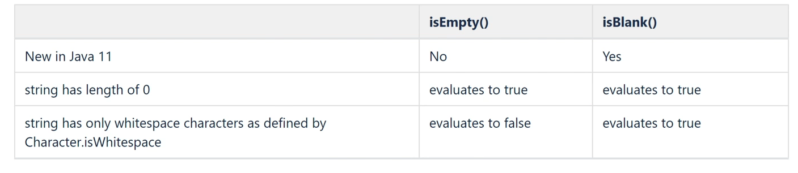
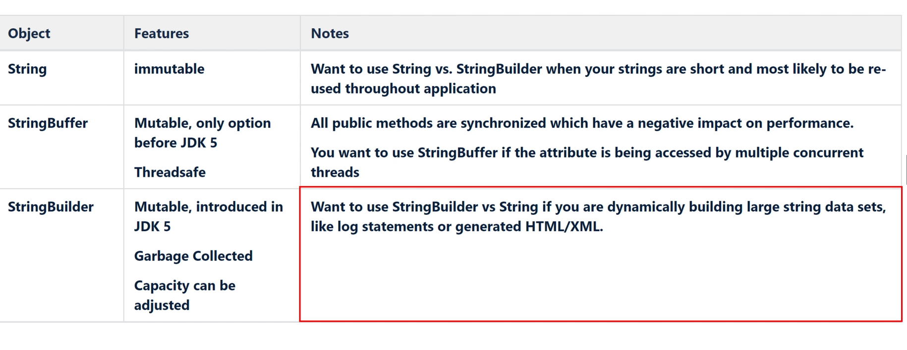

# Q-1 - Wha is JIT?

Ans: JIT is an abbreviation for Just-in-Time Compiler. It
increases efficiency of the interpreter by compiling the
bytecode in the runtime. JIT compiles Code to Machine Level
directly for higher speeds of code execution.

-----------------------------


# Q-2 - What is class Loader?

Ans:  Part of JRE
* They load Java classes into the runtime (JVM)
* This happens only when needed
* JVM requests a class
* Class loader tries to find it and load it (in the metaspace). If the class is not used for a while 
then it can be removed from the metaspace and on request it can loaded again.

In simple terms: ClassLoader = Reads `.class` (bytecode) files and makes them usable by the JVM.

-----------------------------

# Q-3 - What ar diff types of classloaders?

Ans:

**Bootstrap ClassLoader**

* **What it loads:** The bare minimum to run Java. Specifically, the `java.base` module.
* **Classes:** `java.lang.String`, `java.util.List`, `java.lang.System` etc.

**Platform ClassLoader (Java 9+; replaces Extension loader)**

* Loads platform modules / non-core JDK modules (`java.sql`, `java.xml`, etc.).
* Parent is the Bootstrap loader.

**Application (System) ClassLoader**

* Loads classes from the application classpath (`-cp`, `CLASSPATH`, `target/classes`, or the module path when running modular apps).
* Parent is Platform loader.

**Custom Class Loaders**

* Load encrypted classes
* Load classes from a database or network
* Hot-reload modules
* Plugin systems (e.g., IDEs, servers)

-----------------------------

# Q-4 - What are the diff memory area allocated by JVM?

Ans:

* Heap
    * Space for objects in memory
    * "Global"
    * Largest of the memory spaces
* Stack
    * Holds thread level data
    * Local variables and object references
    * Call frames for each method execution

* Code area (meta space)
    * Stores bytecode, JIT info

* Implementation / native area
    * Registers
    * C implementation stacks


-----------------------------

# Q-5 - Is the following program correct?

```java
class Head{
    static public void main(String[] args){
        System.out.println("aa");
    }
}
```

Ans: Yes. Notice that `public` and `static` keywords can be in any order.


-----------------------------

# Q-6 - What are default value stored in local variables?

Ans: There is no concept of default value for local variables.

-----------------------------


# Q-7 - What is association, aggregation and composition?

## Association

Association is the general relationship where one class knows about or interacts with another class.

Association often means a class has a field referencing another object - but not always (it can also be through a method).

So association is the umbrella term.


## Two forms of association

1. Aggregation
2. Composition

## Aggregation (weak ownership)

* Has-a relationship
* Class stores a field referencing another object
* The contained object can live without the container
* The contained object can be shared across containers
* UML: empty diamond

Example:

```java
class Player {
    private String name;
}

class Team {
    private List<Player> players;

    public Team(List<Player> players) {
        this.players = players;
    }
}
```

Why is this aggregation, not composition?

1. **The Team does NOT own the lifecycle of the Player**. Players already exist before being added to the team.

2. **Players can exist without the Team**.  If the Team object is deleted, Players continue to exist.

3. **The same Player can belong to multiple teams (theoretically)**. Example: National Team, Club Team → shared object.

4. **Team only stores a reference to Player**, not creating or destroying players.

##  Composition (strong ownership)

* Stronger has-a relationship
* Whole–part relationship
* Class stores a field referencing another object
* The part cannot exist without the whole
* The part is owned by the whole
* UML: filled diamond

**Example:**

```java
class OrderItem {
    private String productId;
    private int quantity;
}

class Order {
    private List<OrderItem> items = new ArrayList<>();

    public void addItem(OrderItem item) {
        items.add(item);
    }
}
```

Why is this composition?

* `OrderItem` cannot exist without its `Order`
* When the `Order` is deleted/cancelled, its items are deleted too
* `OrderItem` is not shared across multiple orders

The following diagram summarizes the relationship:

```text
Association (has-a)
   ├── Aggregation (weak has-a)
   └── Composition (strong has-a)
```

Ans: 

1. Video: https://www.youtube.com/watch?v=j84w5VM9GT8&t=1267s


-----------------------------

# Q-8 - What is copy constructor?

Ans: A Copy Constructor in Java is a constructor that initializes an object through another 
object of the same class.


-----------------------------


# Q-9 - What is marker interface?

Ans:  A marker interface is an interface with **no methods**. It's like putting a sticker on a class.

The sticker tells the JVM or a framework:
> "This class has a special property — treat it differently."

So the interface **marks** the class for special behavior.

Common marker interfaces in Java:

1. Serializable
2. Cloneable

**Example 1:** Serializable

Think of `Serializable` as putting a label on a box:

> "This object can be saved and restored!"

Java checks for this label before allowing serialization:

```java
class User implements Serializable {
    String name;
}
```

Without this label, Java refuses to serialize the object.

**Example 2:** Cloneable

If a class wants to allow `clone()`, it must "wear the badge":

```java
class Employee implements Cloneable {
    int id;
}
```

Without this badge, `clone()` throws an exception.


Video: https://www.youtube.com/watch?v=qeGCxKCWFcQ


-----------------------------

# Q-10 - What object cloning?

Object cloning is the process of creating an exact copy of an existing object in Java.
The new object has the same values as the original but is a separate instance in memory.

Cloning is done using the `clone()` method, usually with the class implementing the `Cloneable` marker interface.

## Why does Cloneable matter?

`Cloneable` is just a permission badge.

If a class does not implement it, calling `clone()` throws `CloneNotSupportedException`.

## Types of Cloning

### Shallow Clone (default)

* Creates a new object
* All primitive fields are copied by value, meaning each primitive is duplicated as an 
independent copy inside the new object.
* All reference fields are copied by reference, meaning both objects continue to point 
to the same underlying referenced objects.
* Done using `super.clone()`


Example:

```java
@Override
protected Object clone() throws CloneNotSupportedException {
    return super.clone();   // shallow clone
}
```

If the object contains references, both clones share the same internal objects.


### Deep Clone

* Creates a new object
* Also creates new copies of all nested objects
* Nothing is shared between original and clone

**Example:**

```java
Emp copy = (Emp) super.clone();
copy.address = new Address(this.address); // deep copy
```

Deep clone must be implemented manually.

1. Video 1: https://www.youtube.com/watch?v=b2uFL4BFDYg
1. Video 2: https://www.youtube.com/watch?v=WIh-TVq4ifI
1. Video 3: https://www.youtube.com/watch?v=KWbr7B5LDzs


-----------------------------


# Q-11 - Why Java is not completely Object-Oriented?

Ans: Because of primitive types like `int`, `char`, `float` etc.

-----------------------------


# Q-12 What are Wrapper classes

Ans: In Java, when you declare primitive datatypes, then
Wrapper classes are responsible for converting them into
objects (Reference types). It was introduced so primitive types can play 
nicely with the collections framework.

All wrapper classes are immutable

-----------------------------


# Q-13 Define Singleton class 

A Singleton class is a design pattern in object-oriented programming in which only one 
instance of the class can ever exist during the lifetime of an application.

**Example 1:**

A simple implementation of Singleton class:

```java
class Config {
    private static volatile Config instance;

    private int id;
    protected String name;

    public int getId() {
        return id;
    }

    public void setId(int id) {
        this.id = id;
    }

    public String getName() {
        return name;
    }

    public void setName(String name) {
        this.name = name;
    }

    public Config(int id, String name) {
        this.id = id;
        this.name = name;
    }

    synchronized public static Config getInstance() {
        if (null == instance) {
            instance = new Config(1, "Default");
        }
        return instance;
    }
}

public class Example12 {
    public static void main(String[] args) {
        Config instance1 = Config.getInstance();
        Config instance2 = Config.getInstance();
        System.out.println(instance1);
        System.out.println(instance2);
    }
}
```

**Output:**

```text
org.example.sec02.Config@58372a00
org.example.sec02.Config@58372a00
```

This implementation is simple and it works but the biggest drawback is:

After the instance is created, every call still has to acquire the lock on the method, which makes:

* Access slower
* Unnecessary synchronization after the object already exists

This is why the simple synchronized Singleton is safe but considered inefficient.

Solution is to use **Double-Checked Locking with volatile keyword**

**Example 2:**

```java
class Config {
    private static volatile Config instance;

    private int id;
    protected String name;

    public int getId() {
        return id;
    }

    public void setId(int id) {
        this.id = id;
    }

    public String getName() {
        return name;
    }

    public void setName(String name) {
        this.name = name;
    }

    public Config(int id, String name) {
        this.id = id;
        this.name = name;
    }

    public static Config getInstance() {
        if (null == instance) {                 // 1st check
            synchronized (Config.class){
                if (null == instance) {         // 2nd check
                    instance = new Config(1, "Default");
                }
            }
        }
        return instance;
    }
}

public class Example12 {
    public static void main(String[] args) {
        Config instance1 = Config.getInstance();
        Config instance2 = Config.getInstance();
        System.out.println(instance1);
        System.out.println(instance2);
    }
}
```

Here is why how double check works and why `volatile` is needed:

## Sequence of events (step-by-step)

Initial state:

```text
instance = null
```

1\. `T1` checks first `if (instance == null)` (1st check)

Result → true

`T1` proceeds toward the synchronized block.


2\. T2 checks first `if (instance == null)` (1st check)

Result → true

`T2` ALSO proceeds toward the synchronized block.

Both threads think they should create the instance.


3. `T1` acquires the lock first

`T1` enters:

```text
instance = new Config(...);
```

Instance is now created.

4. `T1` releases the lock

5. `T2` now acquires the lock

`T2` enters, the second check:

```text
synchronized (Config.class){
    if (null == instance) {         // 2nd check
```

Since `instance` is now not `null`, `T2` skips instance creation and returns the same instance created by T1.

Had there been no second check, `T2` would have created another instance overwriting the one `T1` created.

This is why **double-checked locking** is needed.

## Why volatile is required?

The line `instance = new Config(1, "Default");` looks like one instruction, but at the bytecode level, it is actually three:

* `memory = allocate()` (Allocate memory for the object)
* `ctorInstance(memory)` (Initialize the object / Run constructor)
* `instance = memory` (Assign the reference to the static field)

Without volatile, the JIT compiler or CPU is allowed to reorder 
instructions 2 and 3 for optimization (Instruction Reordering).

If the order becomes **1 -> 3 -> 2**:

* **Thread A** executes 1 and 3. The instance variable is now non-null, but the object is not initialized yet.
* **Thread A** gets paused.
* **Thread B** comes in, hits Check 1 (`if instance == null`), sees it is not `null`, and returns the instance.
* **Thread B** tries to use the object and crashes (or sees invalid null values for internal fields)
because Step 2 (Constructor) hasn't happened yet.

With volatile: It creates a Memory Barrier (specifically a "Happens-Before" relationship). 
It prevents the write to instance from being reordered with the initialization of the object. 
It ensures the write to memory is visible to all other threads only after the constructor has finished.

-----------------------------


# Q-14 What are packages?

Ans: Just a collection of related classes. The use of packages helps and code reusability and name clash.


-----------------------------

# Q-15 Do we have pointers in Java?

Ans: No

-----------------------------

# Q-16 What is Java String Pool?

Ans: A collection of strings in Java's Heap memory is
referred as Java String Pool. In case you try to create a new
string object, JVM first checks for the presence of the object
in the pool. If available, the same object reference is shared
with the variable, else a new object is created.

Its primary purpose is **Memory Efficiency**. Since String is the most widely used class in Java, 
creating a new object for every single `"Hello"` or `"Error"` string in an application would waste 
a massive amount of RAM.

To fully understand the nuance, it helps to visualize the difference between creating a String with 
a literal versus the new keyword, as they behave differently regarding the pool.

## 1. String Literal (The Efficient Way)

```java
String s1 = "Hello";
String s2 = "Hello";
```

* Action: JVM checks the pool.
* Result: It finds `"Hello"` created by `s1`.
* Outcome: `s2` simply points to the same reference as `s1`. No new object is created.

## 2. The new Keyword (The Forceful Way)

```java
String s3 = new String("Hello");
```

* Action: The `new` keyword forces the creation of a brand new object on the standard Heap, outside the
pool (even if `"Hello"` already exists in the pool).
* Result: `s1 == s3` will be false because they are at different memory addresses, even though `s1.equals(s3)` is `true`.

## Why this works: Immutability

The only reason Java can safely share one `"Hello"` object among 100 different 
variables is because **Strings are Immutable**.

If `s1` could change the content from `"Hello"` to `"Help"`, it would corrupt `s2` and 
every other variable pointing to that shared object. Because they cannot be changed, they can be safely shared.

-----------------------------


# Q-17 What is JDK?

Ans: 

* Stands for Java Development Kit
* It is a set of tools to help developers write Java programs
* Comes with the JRE (because you need to run what you develop)
* Based off the Java language specification

* Includes
    * Java compiler
    * Class libraries
    * Utilities


-----------------------------


# Q-18 What are access specifiers?

Ans: Access Specifiers are predefined keywords used to help
JVM with understanding the scope of a variable, method, and
a class. We have four access specifiers.

1\. Private
 * Keyword: private
 * Scope: Only within the same class.

2\. Default (Package-Private)
 * Keyword: (None - simply leave it blank)
 * Scope: Only within the same package.

3\. Protected
 * Keyword: protected
 * Scope: Same package + Subclasses (even in different packages).

4\. Public
 * Keyword: public
 * Scope: Everywhere.

-----------------------------


# Q-19 What is Dynamic Method Dispatch?

Ans: The Dynamic method dispatch is a process where the
method call is executed during the run-time. The overridden
method is called through a reference variable of super class.
This process is also known as Run-Time Polymorphism

-----------------------------


# Q-20 What are different thread states?

Ans: 

* when `sleep()` is called it goes to timed waiting
* when `join()` is called thread goes to waiting state
* when thread is waiting for lock it goes to blocked state

-----------------------------


# Q-21 What is daemon thread?

Ans: A Daemon Thread is a low-priority thread that runs in the background to provide services 
to other threads (User Threads).

The most important thing to remember is the JVM's exit behavior:

> The JVM waits for all User Threads (non-daemon threads) to finish. 
However, it does not wait for Daemon Threads to finish. It abruptly kills them.

Example: Thread which does the Garbage Collection in background is a Daemon thread

The `setDaemon()` method is used to create a Daemon thread in Java.

```java
Thread cleanup = new Thread(() -> {
    while(true) {
        System.out.println("Cleaning...");
        // This loop will be killed abruptly when main() finishes
    }
});

cleanup.setDaemon(true); // Must happen before start()
cleanup.start();
```

-----------------------------


# Q-22 Can you run the code before executing main methods?

Ans: Yes, we can execute any code, even before the main
method. We will be using a **static block** of code in the class
when creating the objects at load time of the class. Any
statements within this static block of code will get executed
at once while loading the class, even before the creation of
objects in the main method.

**How it works:**

When you run a Java program (e.g., `java MyClass`), the JVM performs the following steps:

* Load the Class: It finds `MyClass.class` and loads it into memory.
* Execute Static Blocks: During this loading phase, it runs all `static` blocks and initializes static variables.
* Call Main: Only after the class is fully loaded does it look for and call `public static void main`.

Example:

```java
public class PreMain {
    
    // 1. This runs FIRST (during class loading)
    static {
        System.out.println("I am running BEFORE main!");
    }

    // 2. This runs SECOND
    public static void main(String[] args) {
        System.out.println("I am running INSIDE main.");
    }
}
```

**Output:**

```text
I am running BEFORE main!
I am running INSIDE main.
```

-----------------------------


# Q-23  How many times the finalize method called?

Ans: 

## What is finalize()?

Imagine you throw an object into the garbage bin (make it eligible for Garbage Collection).

Before the JVM actually destroys it, the JVM may call a special method named `finalize()` to give the
object a chance to clean up.

Think of this as:
> "Hey object, I’m about to delete you. Do you want to do anything before you go?"

But this happens at most once per object.

## Key Idea 1: finalize() may run OR may not run

* JVM decides when GC runs.
* JVM decides if finalize() should run.
* So `finalize()` is NOT guaranteed.

## Key Idea 2: finalize() runs ONCE per object

Even if the object becomes garbage again later, `finalize()` will NOT run a second time.

Let's see a very simple example:

```java
class Demo {
    @Override
    protected void finalize() throws Throwable {
        System.out.println("finalize() called");
    }
}

public class Test {
    public static void main(String[] args) {

        Demo d = new Demo();  // create object

        d = null;             // remove reference → eligible for GC

        System.gc();          // ask JVM to run GC (may run or may not)

        Thread.sleep(1000);   // give JVM time
    }
}
```

What might happen? You might see:

```text
finalize() called
```

Or you might see nothing (GC didn't run).

Either output is normal.

## Why "ONLY ONCE"? (Simple explanation)

Let's add a twist.

In `finalize()`, the object can "save" itself:

```java
class Demo {
    static Demo savedAgain;

    @Override
    protected void finalize() throws Throwable {
        System.out.println("finalize() called");
        savedAgain = this;   // object becomes ALIVE again
    }
}
```

What happens?

* You make the object eligible for GC by doing `d = null`.
* GC runs, sees object is garbage.
* GC calls `finalize()`.
* `finalize()` saves the object back → object becomes alive again.

Now the object is alive again and GC cannot delete it.

Later, if it becomes garbage again, GC will not call `finalize()` again.

Because JVM guarantees:
> finalize() is called only once for each object.

-----------------------------


# Q-24  Diff b/w StringBuilder and StringBuffer?

Ans: `StringBuffer` is thread safe but `StringBuilder` is not.

-----------------------------


# Q-25 Real World use cases of Serializable interface.

Ans: 


-----------------------------


# Q-26 What is functional interface.

Ans: 

A Functional Interface is an interface that contains **exactly one abstract method**.
It can have:

* Any number of default methods
* Any number of static methods
* Any number of private methods

But it must have **only one abstract method**.

Functional Interfaces are the foundation of lambda expressions and method references in Java.

## Examples of Functional Interfaces in Java

1. Runnable
2. Callable
3. Comparator
4. Function
5. Supplier
6. Predicate
7. Consumer


-----------------------------


# Q-27 Can you tell few functional interface which is already there before java 8?

Ans:

* Runnable
* Callable
* Comparator (interviewer might ask about equals() method inside comparator)

-----------------------------


# Q-28 What are all functional interface introduced in java 8?

Ans:

* Function
* Predicate
* Consumer
* Supplier

-----------------------------


# Q-29 What is lambda expression?

Ans: Lambda expressions basically express instances of functional interfaces, in other
word It provides a clear and concise way to represent method of a functional using
an expression.


-----------------------------

# Q-30 What is Stream in java 8?

Ans: 

A Stream is a sequence of data elements that supports functional-style operations such as 
filtering, mapping, and reducing - without modifying the original data source.

It allows you to process data in a declarative, pipeline-based, and efficient way.

Streams are not collections. They do NOT store data - they process data.

-----------------------------

# Q-31 What is diff bw Vector and ArrayList?

Ans: `Vector` is thread-safe but `ArrayList` is not.


-----------------------------


# Q-32 Collection framework heirarchy

Ans:


-----------------------------

# Q-33 Diff b\w Hashtable and HashMap

Ans: 

* `Hashtable` is thread-safe but `HashMap` is not.
* `HashMap` allows key with `null` value but `Hashtable` doesn't.


-----------------------------

# Q-34 What is blocking Queue

Ans: A Queue that additionally supports operations that wait for
the queue to become non-empty when retrieving an
element, and wait for space to become available in the queue when
storing an element.

-----------------------------

# Q-35 Whare are some use cases of reflection

Ans: 

1. Mapping json to class and vice-versa
1. hibernate creates DDL statements from entity using reflection

-----------------------------

# Q-36 When would you use parallelStream()


-----------------------------

# Q-37 Explain executor service and types of it.

1. Fixed thread pool executor
1. Single thread executor
1. Cached thread pool executor
1. Scheduled thread pool executor
1. Work stealing thread pool executor

Executors.newFixedThreadPool(3);


-----------------------------


# Q-38 How to make class as immutable?

Ans:

Rules to make object Immutable

1. Declare the class as final so it can't be extended.
1. Make all the fields private so that direct access is not allowed.
1. Don't provide setter methods for variables.
1. Make all mutable fields final so that a field's value can be assigned only once.
1. Initialize all fields using a constructor method performing deep copy.
1. Perform deep copy in getter of mutable fields

Video: https://www.youtube.com/watch?v=PYJrFi4Hzsg


-----------------------------


# Q-39 What are core principles of OOP?

To remember the core principles of Object-Oriented Programming (OOP), you can use the acronym `A PIE`:

1. Abstraction
1. Polymorphism
1. Inheritance
1. Encapsulation

Let's start with Polymorphism:

Doing the same thing in different ways is called polymorhphism. There are two types of polymorhphism:

1. Runtime polymorphism
1. Compile time polymorphism

## Runtime Polymorphism

Consider an `Animal` class with an `eat()` method. Next, create a `Dog` class by extending `Animal` class 
and override the `eat()` method. Now create an object of type `Animal` and `Dog` and assign it to base class reference.

```java
Animal a1 = new Animal();
a1.eat();

a1 = new Dog();
a1.eat();
```

At runtime, the JVM decides which version of `eat()` method should be called (i.e. from `Animal` or `Dog` class). 
This is called **Runtime polymorhphism**.


## Compile time Polymorphism

Method overloading is called **Compile time polymorhphism**.

Method overloading allows a class to have more than one method with the same name, but with different 
parameters (different type, number, or both). The correct method to call is determined by the compiler based on the method
signature (the number and types of parameters).

Video Polymorphism: https://www.youtube.com/watch?v=jhDUxynEQRI&t=340s


## Abstraction

Abstraction in object-oriented programming (OOP) is the concept of hiding the complex 
implementation details and exposing only the essential features of an object or a system. This 
helps in reducing programming complexity and effort, enhancing code readability, and providing 
a clear and concise interface for the end user or other developers.

Example:

Suppose we want to implement `Set`. There are multiple implementations possible here:

1. Balanced Binary Tree
2. Hashtable

We start by creating a interface called `Set` with two methods `add()` and `remove()`, and leave upto the child class to define the implementation.

Video abstraction: https://www.youtube.com/watch?v=L1-zCdrx8Lk


## Encapsulation

Encapsulation is the ability of an object to hide parts of its state and behavior from the outside world.
To encapculate something means to make it `private`, and thus accessible only from within if the methods if
its own class. There is a little less restrictive mode called `protected` that makes a member of a class available to 
subclass as well.

Encapsulation helps us to change implementation without of the class without affecting the users of the class.

## Diff b/w Abstraction and Encapsulation

Consider the following analogy:

Engine is a piece of complex device. The car abstracts the complexity of the engine behind a simple interface pedals.
This is abstraction in action. To protect th engine from tampering, the engine is sealed inside a metal hood. 
This is encapsulation.

-----------------------------

# Q-40 How many methods are there compare strings in Java?

1. Using `equals()` method
1. Using `equalsIgnorecase()` method
1. Using `compareTo()`
1. Using `compareTolgnorecase()` method
1. `Objects.equals()` method


-----------------------------

# Q-41 What are the motivations for ExecutorService?

1. Hight level API
1. Thread creation is resource intensive
1. Return result


-----------------------------

# Q-41 When ExecutorService was introduced in java?

Java 5

-----------------------------

# Q-42 Whats the diff b\w process and threads?


For more: https://www.scaler.com/topics/course/free-operating-system-course/video/1443/

-----------------------------

# Q-42 By default main thread doesn't terminate until the child threads are done, then what's the point of join() method?

Yes the main thread does not terminate until all non-daemon child threads have completed. 
However, the purpose of the `join()` method used to control the order of execution, for example, you want to perform
some action only when all the non-daemon threads are done executing. This is where you need `join()` method.

-----------------------------

# Q-42 What is the diff b/w objects and references?

1\. Object

An object is the actual data stored in memory (on the heap).

It contains:

* Fields (values)
* Methods (behavior)
* Its own memory address

You cannot directly access an object - you access it through a reference.

2\. Reference

A reference is like a pointer or address that "points to" an object in memory.

* It does NOT hold the object
* It only holds the location of the object
* Multiple references can point to the same object

Example:

```java
Emp e1 = new Emp(10, "John");  // e1 is a reference, Emp(...) creates an object
Emp e2 = e1;                   // e2 is another reference pointing to the same object
```

Here:

* `new Emp(10, "John")` → creates an object on heap
* `e1` → a reference pointing to that object
* `e2` → another reference pointing to the same object

-----------------------------

# Q- Exaplain stack and heap memory regions in the context of threads?

## What is allocated on the Heap?
* Objects (anything created with the new operator)
    1. String
    1. Object
    1. Collection
* Members of classes
    1. Static variables

## Heap Memory Management

* Governed and managed by Garbage Collector
* Objects - stay as long as we have a reference to them.
* Members of classes - exist as long as their parent objects exist (same life cycle as their parents)    

## Objects vs References

References != Objects


Source: https://marcelclasses.udemy.com/course/java-multithreading-concurrency-performance-optimization/learn/lecture/11199598#notes

-----------------------------

# Q- What is latency and throughput?

* Latency - The time to completion of a task. Measured in time units
* Throughput - The amount of tasks completed in a given period. Measured in tasks/time unit

-----------------------------

# Q- What is an atomic operation?

An operation or a set of operations is considered atomic, if it appears to the rest of the system as if it 
occurred at once.

-----------------------------

# Q- Mention some atomic operations?

* Assignments to primitive types (excluding double and long)
* Assignments to references
* Assignments to double and long using volatile keyword

-----------------------------

# Q- What is deadlock?

Source: https://marcelclasses.udemy.com/course/java-multithreading-concurrency-performance-optimization/learn/quiz/4476614#notes

-----------------------------

# Q- Explain synchronized keyword

Source: https://marcelclasses.udemy.com/course/java-multithreading-concurrency-performance-optimization/learn/lecture/11200008#notes

-----------------------------

# Q- Explain synchronization problem

Source: https://marcelclasses.udemy.com/course/java-multithreading-concurrency-performance-optimization/learn/lecture/11199990#notes

-----------------------------

# Q- Explain different ways of inter-thread communication

Source: https://marcelclasses.udemy.com/course/java-multithreading-concurrency-performance-optimization/learn/lecture/11199990#notes

-----------------------------

# Q- What are some key points to remember when using virtual threads

* Virtual thread provide no direct benefit if task is CPU bound. 
* Virtual Threads and Latency
* Virtual Threads provide NO benefit
* The only performance benefit to Virtual Thread s is throughput

Source: https://marcelclasses.udemy.com/course/java-multithreading-concurrency-performance-optimization/learn/lecture/11199990#notes

-----------------------------

# Q-Explain the evolution of concurrency API in Java


-----------------------------

# Q-What is CopyOnWriteArrayList and Why is it named CopyOnWriteArrayList, why don't they use something like Collections.synchronizedList()?

## CopyOnWriteArrayList

Whenever a modification operation is performed on the Array list, the existing array is copied internally, 
the modification operation is performed on the new copy and then the new array is returned. 
The old array will be discarded. Hence the name, Copy on write.

Modification operations include add, addAll, remove, removeAll, addIf, removeIf, subList etc.


## Collections.synchronizedList

`Collections.synchronizedList()` provides a synchronized (thread-safe) list backed by the specified list.

Example:

```java
List<String> syncList = Collections.synchronizedList(new ArrayList<>());
```

Here is the breakdown of what this is, how it works, and the dangerous trap hidden inside it.

1\. How it Works (The Wrapper)

It acts as a Guardian or a wrapper around your regular, non-thread-safe `ArrayList`.

* **Mechanism**: It holds an internal reference to your list.
* **The Lock**: Every single method (`add`, `get`, `remove`, `size`) is wrapped in a `synchronized` block 
using the list object itself as the lock (mutex).
* **Behavior**: Only one thread can access the list at a time. If Thread A is calling `get(0)`, 
Thread B must wait until A is finished before it can call `add("New")`.

2\. The "Trap": Iteration is NOT Synchronized

This is the most common interview question about this topic.

While individual methods like `add()` are thread-safe, iterating over the list is not atomic. 
If one thread is iterating through the list and another thread modifies it (adds/removes an element) at the
same time, the iterator will crash with a `ConcurrentModificationException`.

**The Fix**: You must manually synchronize the entire iteration block.

```java
List<String> syncList = Collections.synchronizedList(new ArrayList<>());

// BAD CODE (Will crash in multi-threaded env)
for (String s : syncList) {
    System.out.println(s);
}

// GOOD CODE (Manually Synchronized)
synchronized (syncList) {
    for (String s : syncList) {
        System.out.println(s);
    }
}
```


-----------------------------

# Q-How many threads gets initiated when you start a basic java program?

2 threads. Main and garbage collector (which is a daemon thread).

-----------------------------

# Q-What is the diff b/w JDK and JRE?

The Hierarchy

* JVM (Java Virtual Machine): The engine that actually runs the code.

* JRE (Java Runtime Environment): The JVM + Core Libraries (the "standard library" classes you mentioned, like java.lang, java.util, etc.). This is what you need to run a program.

* JDK (Java Development Kit): The JRE + Development Tools (compilers like javac, javap, debuggers, documentation generator etc.). This is what you need to write a program.

-----------------------------

# Q-Will the following code compile?

```java
byte myByte = 'a';
char myChar = 'a';

myChar = myByte;

myShort = myChar;
myChar = myShort; 
```

No.

```java
byte myByte = 'a';
char myChar = 'a';

// The following conversions combine both widening and
// narrowing primitive conversions:
// First, the byte is converted to an int via widening primitive
// conversion (§5.1.2), and then the resulting int is converted to a char by narrowi
// So... This does not work for variables,
// compiler does not have enough information to determine if the narrowing is ok.
myChar = myByte;
// short and char are the same width but char is unsigned
// so conversion is not allowed
myShort = myChar;
myChar = myShort; 
```

-----------------------------

# Q- Do `doubles` and `float` type overflow?

Integers **wrap around**, while Floats **explode to Infinity**.

Here is the distinction:

1\. Integers (Wrap Around)

When an integer type (`int`, `long`, `byte`, `short`) overflows, it loops back to the minimum value (negative). 
This is often a silent bug.

```java
int max = Integer.MAX_VALUE; // 2,147,483,647
int result = max + 1;
// Result is -2,147,483,648 (Wraps to minimum)
```

2\. Floating Point (Infinity)

When a `float` or `double` exceeds its maximum storage capacity, it does not wrap around. Instead, it hits a special 
value called `Infinity`.

```java
double max = Double.MAX_VALUE; // approx 1.8 x 10^308
double result = max * 1.1;     
// Result is Infinity
```

-----------------------------

# Q-What is shadowing?

Shadowing happens when a variable declared in a inner scope has the same name as a variable in an outer scope.

The inner variable shadows (hides) the outer one - meaning the outer variable cannot be accessed in that inner scope.

In simple words:
> The closest variable with that name wins.

Here is an example:

```java
public class Main19 {
    public static void main(String[] args) {
        int i = 10;
        
        class SomeClass {
//            int i = 100;
            {
                 for (int i = 0; i < 10; i++) {
                     System.out.println(i);
                 }
            }
        }

        SomeClass someClass = new SomeClass();
        System.out.println(someClass);
    }
}
```

What is happening?

* You declared `int i = 10` in the main method.
* Inside the for loop, you declared another `int i`.
* The inner `i` shadows the outer `i`.

Result:

Inside the for loop:
  * When you say `i`, Java uses the loop's `i`, not the main method's `i`.

So inside the loop:

* The outer `i = 10` becomes invisible.
* Only the loop variable `i` exists.

-----------------------------

# Q-var is used for Local Variable Type Inference (LVTI). Can  we use it to declare variables?

Since Java 10, you can use `var` to let the compiler infer the type:

```java
var name = "John";   // inferred as String
var age = 25;        // inferred as int
```

But this is allowed only for local variables, not fields, not method parameters, and not return types.

Also note that, `var` is not a reserved keyword. It is a restricted type name.

This means:

* Java treats var specially only when used in variable declarations.
* But outside that context, you can use `var` as an identifier.

Example:

```java
int var = 10;        // valid
String var = "Hi";   // valid
class var { }        // valid class name (but discouraged)
```

If `var` appears where the compiler expects a type, it is treated as LVTI. Otherwise, it is treated as a normal name.

-----------------------------

# Q-Will the following code compile?

```java
var name = null;
```

No. because the type of the `name` variable can't be inferred.  

-----------------------------

### Q-Mentions some other possible scenarios where we can't use the `var` (LVTI) keyword

```java
// cannot use var declaration in a compound statement
var j = 0, k = 0;

// again, cannot use var declaration in a compound statement
var m, n = 0;

// Cannot declare a var variable without also initializing it
var someObject;

// Cannot assign null to var variable, type cannot be inferred
var newvar = null;

// Cannot use array initializer in var declaration/initialization
var myArray = {"A", "B"};

// Cannot have an array of var
var[] newArray = new int[2];

public class VarDonts {
    // Invalid - Static class variables cannot be declared with var
    static var classVariable = 10;

    // Invalid - class instance variables cannot be declared with var
    var instanceVariable = 20;

    public static void main(String[] args) {
    }

    // Invalid, cannot have a method return type of var
    public static var returnThis(String[] args) {
        return args;
    }

    // Invalid, cannot have method parameter of var
    public static String[] returnThat(var args) {
        return args;
    }
}

// var can't be used as className
class var{

}
```

We can use LVTI only for local variables in methods, code blocks and loop variables.

-----------------------------

# Q-What is string interning?

When a string is created without a constructor, aka not using `new`, the string is stored 
in a special area of the heap called **string pool**, whose purpose is to maintain a set of 
unique strings - this is called **String interning**.

We can manually intern, using the `intern()` method of the `String` object.

-----------------------------

# Q-Will the following statement adds string to the string pool?

```java
String s1 = "hello";
String s2 = s1 + " world";   // this adds the string to the string pool?
```

The expression `s1 + " world"` doesn't add the resultant string to the string pool, unless `intern()` method is called.

-----------------------------

# Q-What happens when we concatenate string with different type?

When you concatenate a string to a reference variable, if the variable is a reference type,
the `toString()` method on the object is called, if the variable is a primitive data type, 
the variable is boxed to a wrapper and its `toString()` method is called.

-----------------------------

# Q-What is the difference b/w `equals()` and `equalsIgnoreCase()` method?

The `equalsIgnoreCase()` takes a `String` object where as `equals()` takes `Object`, rest of the 
functionality remains the same.

-----------------------------

# Q-What is the differnece b/w `isEmpty()` and `isBlank()` method of String object?



-----------------------------

# Q-Diff b/w `String`, `StringBuilder` and `StringBuffer`



-----------------------------

# Q-What is hashCode() and how It's related to equals()?

The `hashCode()` method is an integer number that acts like an  "Index" for an object. 
It is primarily used by hash-based collections like `HashMap`, `HashSet`, and `Hashtable` to find objects quickly.

## The Analogy: The Library

Imagine you have a library with 1,000,000 books.

* Without `hashCode`: To find "Harry Potter," you have to start at the first book on the first shelf
and check every single book until you find it. (Slow!)

* With `hashCode`: The library is divided into numbered sections (Section 1 to 100).
  * The `hashCode()` formula tells you: "Harry Potter belongs in **Section 42**."
  * You walk straight to Section 42 and only look through the books in that small section to find the exact copy. (Fast!)


## How it works in a HashMap

When you save `map.put(key, value)`, Java does this:

1. Calculate Hash: It calls `key.hashCode()` to get a number (e.g., 12345).
2. Find Bucket: It converts that number into a small "bucket index" (e.g., bucket #5).
3. Store: It drops your data into Bucket #5.

When you retrieve `map.get(key)`:

1. Java calls `key.hashCode()` again.
2. It sees the result is 12345 (Bucket #5).
3. It goes directly to Bucket #5 and retrieves the value.


## Contract b/w hashCode() and equals()

If you override `equals()`, you MUST override `hashCode()`.

1\. If `a.equals(b)` is `true`: Then `a.hashCode()` MUST be equal to `b.hashCode()`.
  * Why? If they are "equal," they must live in the same bucket. If they were in different buckets, the HashMap would never find the second one.

2\. If `a.hashCode() == b.hashCode()`: They are NOT necessarily equal.
  * Why? This is called a Collision. Two different objects (like "Aa" and "BB") might accidentally produce 
 the same math result. They end up in the same bucket, sitting next to each other. 
 The HashMap then uses `equals()` to tell them apart.

3. `hashCode()` must return the same value every time during the object's lifetime, as long as its data doesn't change.


# Q-When should I use an interface vs an abstract class while designing a file uploader with multiple implementations (e.g., S3, GCP)?

## Use an INTERFACE when the goal is “capability” or “contract”

In your case:

* You want to define what uploading means
* You want multiple upload providers (S3, GCP)
* You want the caller to depend only on **the abstraction**, not on any specific cloud provider

This is a classic case where an **interface** is ideal.

```java
public interface FileUploader {
    void upload(String filePath);
}

public class S3Uploader implements FileUploader {
    @Override
    public void upload(String filePath) {
        // logic for AWS S3
    }
}

public class GCPUploader implements FileUploader {
    @Override
    public void upload(String filePath) {
        // logic for GCP Storage
    }
}
```

This gives you:

* Clean separation
* No shared state
* Easy dependency injection
* Easy mocking in tests
* Easy to add new providers later

This is exactly what interfaces are for.

## When to use ABSTRACT CLASS instead

Use an abstract class only if you want to share code, state, or behavior among implementations.

Example:

If `S3Uploader` and `GCPUploader` share:    

* Authorization logic
* Retry logic
* Logging

You could extract that into an abstract class:

```java
public abstract class BaseUploader {
    protected void retry(Runnable task) {
        // shared retry logic
    }
}
```

Then use:

```java
public class S3Uploader extends BaseUploader implements FileUploader {
    @Override
    public void upload(String filePath) {
        retry(() -> { /* s3 upload */ });
    }
}
```

**Short Answer**: Start with an **Interface**.

If you find yourself copying and pasting the same code (like logging or file validation) into both classes, 
then introduce an Abstract Class in the middle.

# Q-Does the finally block execute if there is a return statement inside try or catch?

Consider the following example:

```java
public class MainExample {

    static class Connection {
        public void open() {
            System.out.println("Connection opened");
        }

        public void close() {
            System.out.println("Connection closed");
        }
    }

    private static void method2() {
        Connection connection = new Connection();
        connection.open();

        try {
            // LOGIC
            String str = null;
            str.toString();   // This will throw NullPointerException
            return;           // return inside try
        }
        catch (Exception e) {
            // NOT PRINTING EXCEPTION TRACE (bad practice)
            System.out.println("Exception Handled - Method 2");
            return;           // return inside catch
        }
        finally {
            connection.close();  // will execute?
        }
    }

    public static void main(String[] args) {
        method2();
    }
}
```

Yes. Regardless of whether the try or catch block completes normally, throws an exception, 
or executes a `return` statement, the finally block always executes before the method returns.
It is typically used for cleanup tasks like closing connections.

# Q-Explain the hierarchy of exceptions in Java?

```text
java.lang.Throwable
      |
      +-- java.lang.Error (Unchecked - System Failures)
      |     |
      |     +-- OutOfMemoryError
      |     +-- StackOverflowError
      |     +-- VirtualMachineError
      |
      +-- java.lang.Exception
            |
            +-- (Checked Exceptions - Must handle/declare)
            |     |
            |     +-- java.io.IOException
            |     |     +-- FileNotFoundException
            |     |
            |     +-- java.sql.SQLException
            |     +-- java.lang.ClassNotFoundException
            |
            +-- java.lang.RuntimeException (Unchecked - Logic Errors)
                  |
                  +-- NullPointerException
                  +-- ArithmeticException
                  +-- ArrayIndexOutOfBoundsException
                  +-- ClassCastException
                  +-- IllegalArgumentException
```

1\. The Root: `Throwable`

Everything starts with the `java.lang.Throwable` class. If a class does not extend `Throwable` (directly or indirectly), 
it cannot be used with the `throw` keyword or the `try-catch` block.

It splits into two main branches: `Error` and `Exception`.


2\. The **"Fatal"** Branch: `Error`

What it is: Serious system-level problems that your application cannot reasonably recover from.

Responsibility: These are usually issues with the JVM itself or hardware resources. You should generally 
not try to catch these.

Examples:

* `OutOfMemoryError` (Heap is full).
* `StackOverflowError` (Infinite recursion).
* `VirtualMachineError`.

3\. The **"Recoverable"** Branch: `Exception`

What it is: Conditions that your application might reasonably want to catch and handle.

Responsibility: This is where developers spend 99% of their time.

This branch is further divided into two critical categories:

1. Checked Exceptions
2. Unchecked Exceptions (Runtime Exceptions)


## Checked Exceptions (Compile-Time)

* Parent: Directly extends `Exception` (but not `RuntimeException`).
* The Rule: The Compiler checks these. You are forced to handle them (using `try-catch`) or declare them
in your method signature (using `throws`).
* Philosophy: These represent "External Failures" that are often out of your control (e.g., the file isn't there, the
internet is down). Java wants to ensure you have a "Plan B"
* Examples:
  * `IOException` (File handling).
  * `SQLException` (Database issues).
  * `ClassNotFoundException`.

## Unchecked Exceptions (Runtime)

* Parent: Extends `RuntimeException`.
* The Rule: The compiler does not check these. You can compile your code without handling them.
* Philosophy: These represent "Programming Logic Errors." These are usually your fault as a 
developer (e.g., you didn't check for null, you divided by zero). You shouldn't try to catch these; 
you should fix your code so they don't happen.
* Examples:
  * `NullPointerException` (NPE).
  * `ArithmeticException` (Dividing by zero).
  * `ArrayIndexOutOfBoundsException`.


# Q-Difference between Coupling and Cohesion?

# Q-What is CharSequence?

# Q-What is serialVersionUID?

