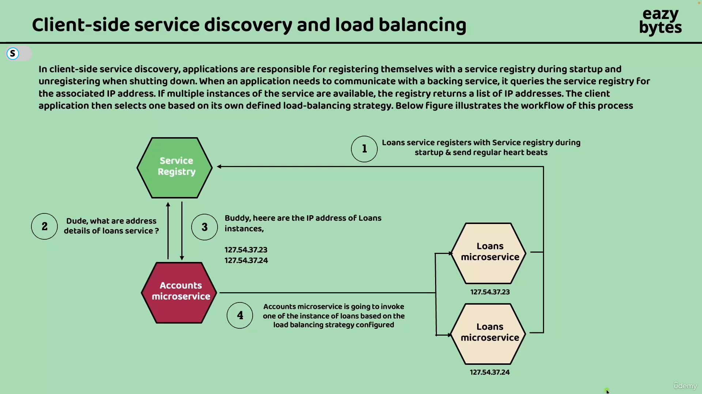

1. Docker vs Jar
1. Datasouce vs driver
1. Explain application architecture.
1. What are filters and interceptors?
1. How to use transactions across services
1. How to implement file download
1. Explain how you would implement spring security?
1. What is 2-phase commit?
1. What are different levels of logging?
1. What are Non functional requirements (NFR)?
1. What are design patterns in microservices?
1. Explain types of design patterns and when they are used
1. Explain the request flow in spring application

-----------------------------

### Q-When we define Controller, it gets converted to servlet or not?

Ans: No, spring Boot uses a dispatcher servlet to handle HTTP requests and delegate them to the appropriate controllers.

### Q-What is Dispatcher servlet?

Ans: 

-----------------------------

### Q- Mention the REST api principles

Ans: 


### Q- What Object Oriented Principles you used in the project.

Ans:

### Q-What is Data Source?

Ans: The data source is a component that manages connections to the database management
systems (DBMS). The data source uses the JDBC driver to get the connections it manages. The 
data source aims to improve the app’s performance by allowing its logic to reuse connections 
to the DBMS and request new connections only when it needs them. The data source also makes 
sure to close the connections when it releases them.

The data source manages the connections. It provides the app with connections when it’s 
requested and makes sure to create new connections only when it’s necessary.

Without an object taking the responsibility of a data source, the app would need to
request a new connection for each operation with the data. This approach is not realistic
in a production scenario because communicating through the network for establishing a new 
connection for each operation would dramatically slow down the application and cause 
performance issues. The data source makes sure your app only requests a new connection when 
it really needs it, improving the app’s performance.

A data source object can efficiently manage the connections to minimize the number
of unnecessary operations. Instead of using the JDBC driver manager directly, we use
a data source to retrieve and manage the connections.


HikariCP the default data source implementation.

### Q-What is JDBC Driver 

Ans: JDBC offers you a way to connect to a DBMS to work with a database. However, the JDK 
doesn’t provide a specific implementation for working with a particular technology (such as 
MySQL, Postgres, or Oracle). The JDK only gives you the abstractions for objects an app needs 
to work with a relational database. To gain the implementation of this abstraction and enable 
your app to connect to a certain DBMS technology, you add a runtime dependency named the JDBC 
driver (figure 12.3). Every technology vendor provides the JDBC driver you need to add to your 
app to enable it to connect to that specific technology. The JDBC driver is not something that 
comes either from the JDK or from a framework such as Spring.


### Q-What is Factory Pattern

Ans: 

### Q-How to configure multiple data sources

Ans:

-----------------------------

### Q-Why spring boot?

https://marcelclasses.udemy.com/course/hibernate-jpa-tutorial-for-beginners-in-100-steps/learn/lecture/32399796#questions

-----------------------------


### Q-What are different levels of logging (in order of less severe to more severe)?

1. TRACE: The least severe. Provides fine-grained informational events useful for debugging.
1. DEBUG: Provides detailed information for diagnosing problems.
1. INFO: Informational messages that highlight the progress of the application at a coarse-grained level.
1. WARN: Potentially harmful situations that are not necessarily errors but might need attention.
1. ERROR: Error events that might still allow the application to continue running.
1. FATAL: Very severe error events that will presumably lead the application to abort.

-----------------------------

### Q-What is AuditAware interface?

https://marcelclasses.udemy.com/course/master-microservices-with-spring-docker-kubernetes/learn/lecture/39943208#overview


-----------------------------


### Q-What are different ways to read configs in Spring Boot?

https://marcelclasses.udemy.com/course/master-microservices-with-spring-docker-kubernetes/learn/lecture/39944446#overview


-----------------------------

### Q-What are the various ways to activate spring profile?

```bash
# this method is called command line arguments
java -jar app.jar --spring.profiles.active=qa
```

or

```bash
# this method is called JVM system variables
java -Dspring.profiles.active=qa -jar target/userservice-0.0.1-SNAPSHOT.jar
```

or

```bash
# this method uses system environment variables
$ SPRING_PROFILES_ACTIVE=qa java -jar target/userservice-0.0.1-SNAPSHOT.jar
```
-----------------------------

### Q-What is the order in which the configs are processed?

1. Spring Boot uses a very particular order that is designed to allow sensible overriding of 
values. Properties are considered in the following order (with values from lower items overriding earlier ones):

* Properties present inside files like application.properties
* OS Environmental variables
* Java System properties (System.getProperties()) (JVM options)
* JNDI attributes from java:comp/env
* ServletContext init parameters
* ServletConfig init parameters
* Command line arguments

-----------------------------

### Q-How to encrypt values using spring config server?

https://marcelclasses.udemy.com/course/master-microservices-with-spring-docker-kubernetes/learn/lecture/39944642#overview

-----------------------------

### Q-Using config server how to get updated value of config without restarting microservice?

https://marcelclasses.udemy.com/course/master-microservices-with-spring-docker-kubernetes/learn/lecture/39944644#overview

-----------------------------

### Q-Refreshing configs using message bus

https://marcelclasses.udemy.com/course/master-microservices-with-spring-docker-kubernetes/learn/lecture/39944646#overview


### Q-Auto refresh config using webhooks

https://marcelclasses.udemy.com/course/master-microservices-with-spring-docker-kubernetes/learn/lecture/39944648#overview


-----------------------------

### Q-How client side load balancing works?



https://marcelclasses.udemy.com/course/master-microservices-with-spring-docker-kubernetes/learn/lecture/39944754#overview

-----------------------------


### Q-Eureka Self-preservation mode

https://marcelclasses.udemy.com/course/master-microservices-with-spring-docker-kubernetes/learn/lecture/39944828#overview


-----------------------------