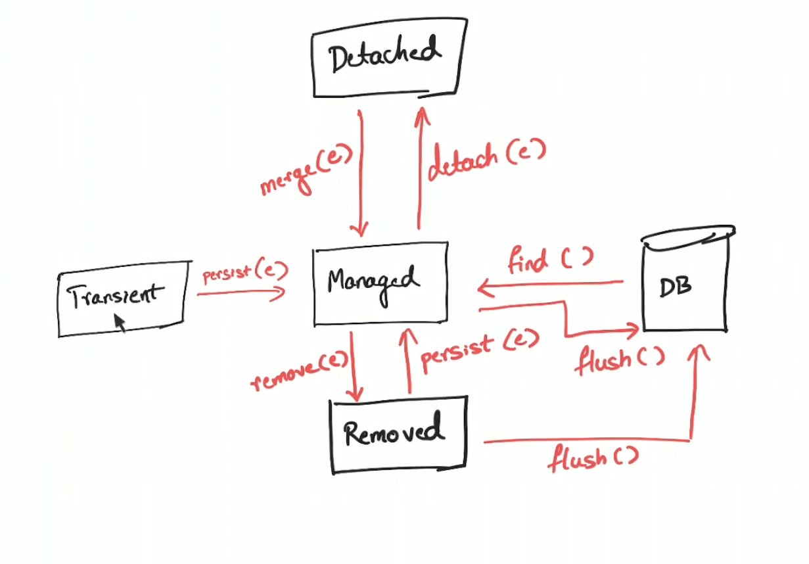

### Q1-Reading Configuration using @ConfigurationProperties

https://marcelclasses.udemy.com/course/hibernate-jpa-tutorial-for-beginners-in-100-steps/learn/lecture/32399770#questions

-----------------------------

## Q2-Enabling actuator

```xml
<dependency>
    <groupId>org.springframework.boot</groupId>
    <artifactId>spring-boot-starter-actuator</artifactId>
</dependency>
```

This will enable all endpoints:

```text
management.endpoints.web.exposure.include=*
```

To enable specific endpoints do this:

```text
management.endpoints.web.exposure.include=health, metrics
```

-----------------------------

### Q-3 Diff Spring Boot vs Spring MVC vs Spring

Understanding Spring Boot vs Spring MVC vs Spring

Spring Boot vs Spring MVC vs Spring: What's in it?
    * Spring Framework: Dependency Injection
        * @Component, @Autowired, Component Scan etc..

Just Dependency Injection is NOT sufficient (You need other frameworks to build apps)

Spring MVC (Spring Module): Simplify building web apps and REST API
    * Building web applications with Struts was very complex
    * @Controller, @RestController, @RequestMapping("/courses")

Spring Boot (Spring Project): Build PRODUCTION-READY apps QUICKLY
* Starter Projects - Make it easy to build variety of applications
* Auto configuration - Eliminate configuration to setup Spring, Spring MVC and other frameworks!
* Enable non functional requirements (NFRs):
    * Actuator: Enables Advanced Monitoring of applications
    * Embedded Server: No need for separate application servers!
    * Logging and Error Handling。 Profiles and Configuration Properties


-----------------------------

### Q-4 What is diff b/w JDBC vs Spring JDBC

https://marcelclasses.udemy.com/course/hibernate-jpa-tutorial-for-beginners-in-100-steps/learn/lecture/7907406#questions

-----------------------------


### Q-5 What is @ConditionalOn* annotation ?

-----------------------------

### Q-6 What is the diff b/w update() and query() method?

## JdbcTemplate: `query` vs `update` Method

`JdbcTemplate` is a central class in Spring's JDBC support that simplifies the use of JDBC and helps to avoid common errors. It provides several methods for querying and updating the database. The primary methods used are `query` and `update`.

#### `query` Method

The `query` method is used to execute SQL select statements. It retrieves data from the database and maps the result set to Java objects. There are multiple overloaded versions of the `query` method.

##### Example Usage:

1. **Query for a Single Object:**

    ```java
    String sql = "SELECT name FROM users WHERE id = ?";
    String name = jdbcTemplate.queryForObject(sql, new Object[]{id}, String.class);
    ```

2. **Query for a List of Objects:**

    ```java
    String sql = "SELECT id, name FROM users";
    List<User> users = jdbcTemplate.query(sql, new RowMapper<User>() {
        public User mapRow(ResultSet rs, int rowNum) throws SQLException {
            User user = new User();
            user.setId(rs.getInt("id"));
            user.setName(rs.getString("name"));
            return user;
        }
    });
    ```

3. **Query with Named Parameters:**

    ```java
    String sql = "SELECT name FROM users WHERE id = :id";
    Map<String, Object> params = new HashMap<>();
    params.put("id", id);
    String name = namedParameterJdbcTemplate.queryForObject(sql, params, String.class);
    ```

#### `update` Method

The `update` method is used to execute SQL insert, update, and delete statements. It returns the number of rows affected by the query.

##### Example Usage:

1. **Insert a Record:**

    ```java
    String sql = "INSERT INTO users (name, email) VALUES (?, ?)";
    int result = jdbcTemplate.update(sql, new Object[]{"John Doe", "john.doe@example.com"});
    ```

2. **Update a Record:**

    ```java
    String sql = "UPDATE users SET email = ? WHERE id = ?";
    int result = jdbcTemplate.update(sql, new Object[]{"john.new@example.com", id});
    ```

3. **Delete a Record:**

    ```java
    String sql = "DELETE FROM users WHERE id = ?";
    int result = jdbcTemplate.update(sql, new Object[]{id});
    ```

#### Key Differences:

- **Purpose**: 
  - `query` is used for executing SQL select statements to retrieve data.
  - `update` is used for executing SQL insert, update, and delete statements to modify data.
  
- **Return Type**: 
  - `query` returns a list of objects or a single object depending on the query.
  - `update` returns an integer indicating the number of rows affected.
  
- **Mapping Results**: 
  - `query` methods require a `RowMapper` or `ResultSetExtractor` to map rows of the result set to objects.
  - `update` methods do not require a mapper since they only execute data modification statements.

- **SQL Statements**: 
  - `query` executes `SELECT` statements.
  - `update` executes `INSERT`, `UPDATE`, and `DELETE` statements.

In summary, use the `query` method when you need to retrieve data from the database and map it to Java objects, and use the `update` method when you need to modify data in the database.

-----------------------------

### Logical evolution from JDBC to JPA to Spring Data JPA

https://marcelclasses.udemy.com/course/hibernate-jpa-tutorial-for-beginners-in-100-steps/learn/lecture/7907386#overview

-----------------------------

### What is impedence mismatch


-----------------------------

### Which relationship is eager and which one lazy

---------|-----------
`OneToOne` | Eager


-----------------------------

### What is persistent context?

https://marcelclasses.udemy.com/course/hibernate-jpa-tutorial-for-beginners-in-100-steps/learn/lecture/7907518#overview

In Hibernate Persistence Terminology, Session = Persitence Context

-----------------------------


### Q-When does Hibernate send updates to the database?

https://marcelclasses.udemy.com/course/hibernate-jpa-tutorial-for-beginners-in-100-steps/learn/lecture/7907526#overview

-----------------------------

### Q-Do Read Only methods need a transaction?

https://marcelclasses.udemy.com/course/hibernate-jpa-tutorial-for-beginners-in-100-steps/learn/lecture/7907532#overview

-----------------------------

### Q- When to use @JoinTable()?

https://marcelclasses.udemy.com/course/hibernate-jpa-tutorial-for-beginners-in-100-steps/learn/lecture/7907558#overview

-----------------------------

### Q- Explain inheritence heirarchy with JPA and hibernate

https://marcelclasses.udemy.com/course/hibernate-jpa-tutorial-for-beginners-in-100-steps/learn/lecture/7907570#overview

-----------------------------

### Q- Explain named query with entity manager


-----------------------------

### Q- How to sort using Spring Data JPA


-----------------------------

### Q- What is L1 and L2 cache in hibernate

-----------------------------

### Q-What's the advantage of using Hibernate?

-----------------------------

### Q-Explain different Id Generation Stretegy

https://www.youtube.com/watch?v=TRfQ_3CXsMU


-----------------------------

### Q-Why we define cyclic references while saving entities?

https://javabrains.thinkific.com/courses/take/jpa-and-hibernate-essentials/lessons/24372687-why-have-cyclical-relationships

### Transaction Propagation

* REQUIRED: Joins the existing transaction or starts a new one.
* REQUIRES_NEW: Always starts a new transaction, suspending the current one.
* SUPPORTS: Joins the existing transaction or runs non-transactionally.
* NOT_SUPPORTED: Runs non-transactionally, suspending any existing transaction.
* MANDATORY: Must run within an existing transaction.
* NEVER: Must run non-transactionally, throwing an exception if a transaction exists.

https://javabrains.thinkific.com/courses/take/jpa-and-hibernate-essentials/lessons/24784882-understanding-transaction-propogation


### What are read-only transactions?

https://javabrains.thinkific.com/courses/take/jpa-and-hibernate-essentials/lessons/24784877-read-only-transactions


### Explahttps://javabrains.thinkific.com/courses/take/jpa-and-hibernate-essentials/lessons/24784877-read-only-transactionsin Entity Lifecycle


