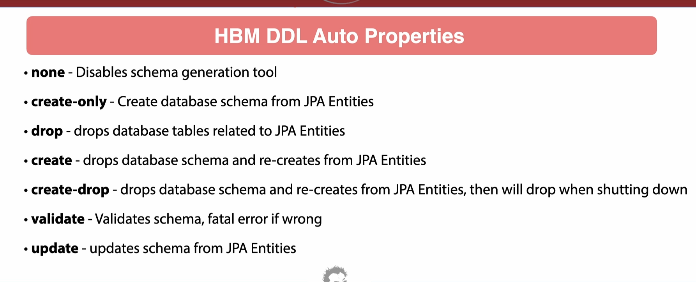

1. What are different HBM DDL auto properties




1. Use `schema.sql` file to execute DDL statements and `data.sql` to execute DML.

1. Config to setup database is as follows:

```yaml
spring:
  application:
    name: userservice
  datasource:
    url: jdbc:postgresql://localhost:5432/userservice
    username: neil
    password: pass
  jpa:
    hibernate:
      ddl-auto: update
    show-sql: true
    properties:
      hibernate:
        format_sql: true
```

1. How to define @MappedSuperclass? Different types of entity interheritance.


1. What setting is used to show binding values in SQL query?


1. What's the use of `@Column(insertable = false)` and `@Column(updatable = false)`?


1. Mention different type of stretegies that can be used in `@GeneratedValue` annotation.


1. Can we use a single DTO to merge the fields from two different entities?


1. To 

