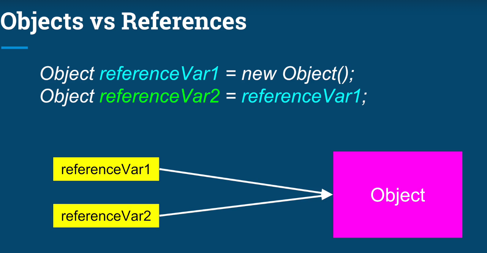
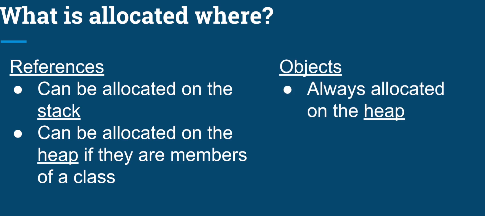
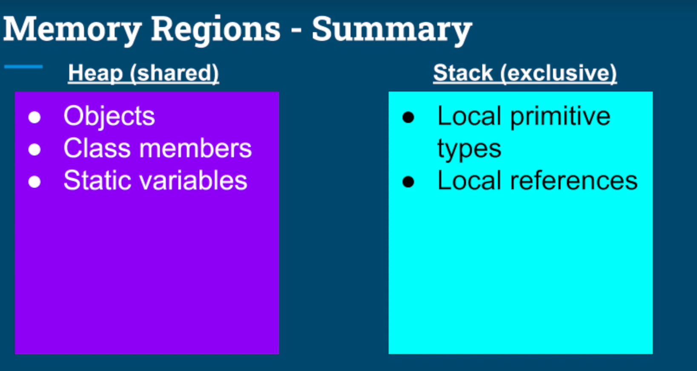

<!-- TOC -->
* [Q-1 What is JIT?](#q-1-what-is-jit)
* [Q-2 What is class Loader?](#q-2-what-is-class-loader)
* [Q-3 What are different types of classloaders?](#q-3-what-are-different-types-of-classloaders)
* [Q-4 What are the diff memory area allocated by JVM?](#q-4-what-are-the-diff-memory-area-allocated-by-jvm)
* [Q-5 Is the following program correct?](#q-5-is-the-following-program-correct)
* [Q-6 Do local variables in Java have default values?](#q-6-do-local-variables-in-java-have-default-values)
* [Q-7 What is association, aggregation and composition?](#q-7-what-is-association-aggregation-and-composition)
  * [Association](#association)
  * [Two forms of association](#two-forms-of-association)
  * [Aggregation (weak ownership)](#aggregation-weak-ownership)
  * [Composition (strong ownership)](#composition-strong-ownership)
* [Q-8 What is copy constructor?](#q-8-what-is-copy-constructor)
  * [Copy Constructor vs clone() — Which is better?](#copy-constructor-vs-clone--which-is-better)
    * [1. The "Constructor Bypass" Problem (Critical)](#1-the-constructor-bypass-problem-critical)
    * [2. The Type Casting Tax](#2-the-type-casting-tax)
    * [3. The Exception Nightmare](#3-the-exception-nightmare)
    * [4. The "Marker Interface" Confusion](#4-the-marker-interface-confusion)
* [Q-9 What is marker interface?](#q-9-what-is-marker-interface)
  * [Resources](#resources)
* [Q-10 What object cloning?](#q-10-what-object-cloning)
  * [Why does Cloneable matter?](#why-does-cloneable-matter)
  * [Types of Cloning](#types-of-cloning)
    * [Shallow Clone (default)](#shallow-clone-default)
    * [Deep Clone](#deep-clone)
  * [Resources](#resources-1)
* [Q-11 Why Java is not completely Object-Oriented?](#q-11-why-java-is-not-completely-object-oriented)
* [Q-12 What are Wrapper classes](#q-12-what-are-wrapper-classes)
* [Q-13 Define Singleton class](#q-13-define-singleton-class-)
  * [Sequence of events (step-by-step)](#sequence-of-events-step-by-step)
  * [Why volatile is required?](#why-volatile-is-required)
* [Q-14 What are packages?](#q-14-what-are-packages)
* [Q-15 Do we have pointers in Java?](#q-15-do-we-have-pointers-in-java)
* [Q-16 What is Java String Pool?](#q-16-what-is-java-string-pool)
  * [1. String Literal (The Efficient Way)](#1-string-literal-the-efficient-way)
  * [2. The new Keyword (The Forceful Way)](#2-the-new-keyword-the-forceful-way)
  * [Why this works: Immutability](#why-this-works-immutability)
* [Q-17 What is JDK?](#q-17-what-is-jdk)
* [Q-18 What are access specifiers?](#q-18-what-are-access-specifiers)
* [Q-19 What is Dynamic Method Dispatch?](#q-19-what-is-dynamic-method-dispatch)
* [Q-20 What are different thread states?](#q-20-what-are-different-thread-states)
* [Q-21 What is daemon thread?](#q-21-what-is-daemon-thread)
* [Q-22 Can you run the code before executing main methods?](#q-22-can-you-run-the-code-before-executing-main-methods)
* [Q-23  How many times is the finalize() method called in Java?](#q-23--how-many-times-is-the-finalize-method-called-in-java)
  * [What is finalize()?](#what-is-finalize)
  * [Key Idea 1: finalize() may run OR may not run](#key-idea-1-finalize-may-run-or-may-not-run)
  * [Key Idea 2: finalize() runs ONCE per object](#key-idea-2-finalize-runs-once-per-object)
  * [Why "ONLY ONCE"? (Simple explanation)](#why-only-once-simple-explanation)
* [Q-24 Which class is thread-safe: StringBuilder or StringBuffer?](#q-24-which-class-is-thread-safe-stringbuilder-or-stringbuffer)
* [Q-25 What is Serializable interface? List some real-world use-cases for it.](#q-25-what-is-serializable-interface-list-some-real-world-use-cases-for-it)
  * [Key statement](#key-statement)
    * [Serialization code (standard)](#serialization-code-standard)
    * [What the JVM actually does internally (THIS is the reflection part)](#what-the-jvm-actually-does-internally-this-is-the-reflection-part)
* [Q-26 What is functional interface.](#q-26-what-is-functional-interface)
  * [Examples of Functional Interfaces in Java](#examples-of-functional-interfaces-in-java)
* [Q-27 Can you tell few functional interface which is already there before java 8?](#q-27-can-you-tell-few-functional-interface-which-is-already-there-before-java-8)
* [Q-28 What are all functional interface introduced in java 8?](#q-28-what-are-all-functional-interface-introduced-in-java-8)
* [Q-29 What is lambda expression?](#q-29-what-is-lambda-expression)
* [Q-30 What is Stream in java 8?](#q-30-what-is-stream-in-java-8)
* [Q-31 What is diff b/w Vector and ArrayList?](#q-31-what-is-diff-bw-vector-and-arraylist)
* [Q-32 Collection framework hierarchy](#q-32-collection-framework-hierarchy)
* [Q-33 Diff b/w Hashtable and HashMap](#q-33-diff-bw-hashtable-and-hashmap)
* [Q-34 What is BlockingQueue?](#q-34-what-is-blockingqueue)
  * [Why was BlockingQueue introduced?](#why-was-blockingqueue-introduced)
  * [How BlockingQueue solves the problem](#how-blockingqueue-solves-the-problem)
  * [Core BlockingQueue methods (important)](#core-blockingqueue-methods-important)
    * [put() — blocking insert](#put--blocking-insert)
    * [take() — blocking retrieval](#take--blocking-retrieval)
    * [offer() — non-blocking insert](#offer--non-blocking-insert)
    * [poll() — non-blocking retrieval](#poll--non-blocking-retrieval)
  * [Types of BlockingQueue](#types-of-blockingqueue)
    * [1. ArrayBlockingQueue](#1-arrayblockingqueue)
    * [2. LinkedBlockingQueue](#2-linkedblockingqueue)
    * [3. PriorityBlockingQueue](#3-priorityblockingqueue)
    * [4. DelayQueue](#4-delayqueue)
    * [5. SynchronousQueue](#5-synchronousqueue)
* [Q-35 What are some use cases of reflection](#q-35-what-are-some-use-cases-of-reflection)
* [Q-36 When would you use parallelStream()](#q-36-when-would-you-use-parallelstream)
  * [Parallel Stream — Three Examples Explained (Good vs Bad vs Dangerous)](#parallel-stream--three-examples-explained-good-vs-bad-vs-dangerous)
  * [Example 1 — ✅ GOOD use of parallelStream()](#example-1---good-use-of-parallelstream)
    * [Why this is GOOD](#why-this-is-good)
    * [Final judgment](#final-judgment)
  * [Example 2 — ❌ BAD use of parallelStream()](#example-2---bad-use-of-parallelstream)
    * [Why this is BAD](#why-this-is-bad)
    * [Final judgment](#final-judgment-1)
  * [Example 3 — 💀 DANGEROUS use of parallelStream()](#example-3---dangerous-use-of-parallelstream)
    * [Why this is DANGEROUS (not just slow)](#why-this-is-dangerous-not-just-slow)
    * [Final judgment](#final-judgment-2)
  * [One-page Comparison (Interview Gold)](#one-page-comparison-interview-gold-)
  * [Final Rule to Say in Interview (Memorize This)](#final-rule-to-say-in-interview-memorize-this)
* [Q-37 List diff types of Executorservice](#q-37-list-diff-types-of-executorservice)
* [Q-38 How to make a class immutable?](#q-38-how-to-make-a-class-immutable)
* [Q-39 What are core principles of OOP?](#q-39-what-are-core-principles-of-oop)
  * [Runtime Polymorphism](#runtime-polymorphism)
  * [Compile time Polymorphism](#compile-time-polymorphism)
  * [Abstraction](#abstraction)
  * [Encapsulation](#encapsulation)
  * [Diff b/w Abstraction and Encapsulation](#diff-bw-abstraction-and-encapsulation)
* [Q-40 How many methods are there compare strings in Java?](#q-40-how-many-methods-are-there-compare-strings-in-java)
* [Q-41 What are the motivations for ExecutorService?](#q-41-what-are-the-motivations-for-executorservice)
* [Q-42 — How do you properly shut down an ExecutorService?](#q-42--how-do-you-properly-shut-down-an-executorservice)
  * [Why shutdown is required](#why-shutdown-is-required)
  * [shutdown() — Graceful shutdown](#shutdown--graceful-shutdown)
  * [shutdownNow() — Immediate shutdown](#shutdownnow--immediate-shutdown)
  * [awaitTermination() — Wait for shutdown to complete](#awaittermination--wait-for-shutdown-to-complete)
  * [Proper shutdown pattern (INTERVIEW GOLD)](#proper-shutdown-pattern-interview-gold)
* [Q-43 What's the diff b/w process and threads?](#q-43-whats-the-diff-bw-process-and-threads)
  * [Process — Components](#process--components)
    * [What a process owns](#what-a-process-owns)
  * [Thread — Components (core focus)](#thread--components-core-focus)
    * [What a thread owns (per thread)](#what-a-thread-owns-per-thread)
  * [Thread Control Block (TCB)](#thread-control-block-tcb)
  * [What Threads Share (inside the same process)](#what-threads-share-inside-the-same-process)
  * [Why Threads Are Lightweight (this is critical)](#why-threads-are-lightweight-this-is-critical)
    * [1. No separate address space](#1-no-separate-address-space)
    * [2. Cheaper context switching](#2-cheaper-context-switching)
    * [3. Minimal metadata](#3-minimal-metadata)
    * [4. Fast communication](#4-fast-communication)
  * [Interview-perfect closing line (memorize)](#interview-perfect-closing-line-memorize)
  * [Resources:](#resources-2)
* [Q-44 Is it true that main thread doesn't terminate until the child threads are done?](#q-44-is-it-true-that-main-thread-doesnt-terminate-until-the-child-threads-are-done)
* [Q-45 What is the diff b/w objects and references?](#q-45-what-is-the-diff-bw-objects-and-references)
  * [Objects vs References](#objects-vs-references)
* [Q-46 Explain stack and heap memory regions in the context of threads?](#q-46-explain-stack-and-heap-memory-regions-in-the-context-of-threads)
  * [1. Stack Memory (Thread-specific)](#1-stack-memory-thread-specific)
  * [2. Heap Memory (Shared across threads)](#2-heap-memory-shared-across-threads)
  * [3. Metaspace (not in heap)](#3-metaspace-not-in-heap)
  * [Key clarification (interview-critical)](#key-clarification-interview-critical)
  * [4. Why this matters for threads](#4-why-this-matters-for-threads)
  * [Interview-perfect closing line (memorize)](#interview-perfect-closing-line-memorize-1)
* [Q-47 What is latency and throughput?](#q-47-what-is-latency-and-throughput)
* [Q-48 What is an atomic operation?](#q-48-what-is-an-atomic-operation)
* [Q-49 Which read and write operations are atomic in Java?](#q-49-which-read-and-write-operations-are-atomic-in-java)
  * [Resources](#resources-3)
* [Q-50 What is deadlock?](#q-50-what-is-deadlock)
  * [Resources:](#resources-4)
* [Q-51 Explain synchronized keyword](#q-51-explain-synchronized-keyword)
  * [Resources](#resources-5)
* [Q-52 Explain synchronization problem](#q-52-explain-synchronization-problem)
  * [Resources](#resources-6)
* [Q-53 Explain different ways of inter-thread communication](#q-53-explain-different-ways-of-inter-thread-communication)
  * [1. wait(), notify(), notifyAll() (Intrinsic Locks)](#1-wait-notify-notifyall-intrinsic-locks)
  * [2. volatile Variables (Visibility-Based Communication)](#2-volatile-variables-visibility-based-communication)
  * [3. Lock and Condition (java.util.concurrent.locks)](#3-lock-and-condition-javautilconcurrentlocks)
  * [4. Blocking Queues (`BlockingQueue`)](#4-blocking-queues-blockingqueue)
  * [5. Semaphores](#5-semaphores)
  * [6. Latches and Barriers](#6-latches-and-barriers)
  * [7. Atomic Variables](#7-atomic-variables)
  * [8. Thread.join()](#8-threadjoin)
  * [Summary Table (Interview Gold)](#summary-table-interview-gold)
  * [Resources](#resources-7)
* [Q-54 What are some key points to remember when using virtual threads](#q-54-what-are-some-key-points-to-remember-when-using-virtual-threads)
  * [1. The Golden Rule: Throughput, Not Latency](#1-the-golden-rule-throughput-not-latency)
  * [2. CPU-Bound Tasks = No Benefit](#2-cpu-bound-tasks--no-benefit)
  * [3. The "Pinning" Problem (Critical Interview Topic)](#3-the-pinning-problem-critical-interview-topic)
  * [4. Do NOT Pool Virtual Threads](#4-do-not-pool-virtual-threads)
  * [5. ThreadLocal Explosion](#5-threadlocal-explosion)
  * [Resources](#resources-8)
* [Q-55 Explain the evolution of concurrency API in Java](#q-55-explain-the-evolution-of-concurrency-api-in-java)
* [Q-56 What is CopyOnWriteArrayList and Why is it named CopyOnWriteArrayList, why don't they use something like Collections.synchronizedList()?](#q-56-what-is-copyonwritearraylist-and-why-is-it-named-copyonwritearraylist-why-dont-they-use-something-like-collectionssynchronizedlist)
  * [CopyOnWriteArrayList](#copyonwritearraylist)
  * [Collections.synchronizedList](#collectionssynchronizedlist)
* [Q-57 Which threads are guaranteed to be created when a Java program starts?](#q-57-which-threads-are-guaranteed-to-be-created-when-a-java-program-starts)
* [Q-58 What is the diff b/w JDK and JRE?](#q-58-what-is-the-diff-bw-jdk-and-jre)
* [Q-59 Will the following code compile?](#q-59-will-the-following-code-compile)
  * [1. Widening = implicit (safe)](#1-widening--implicit-safe)
  * [2. Narrowing = explicit cast required (unsafe)](#2-narrowing--explicit-cast-required-unsafe)
  * [Why `myChar = myByte` is not allowed](#why-mychar--mybyte-is-not-allowed)
  * [Why `myShort = myChar` is not allowed](#why-myshort--mychar-is-not-allowed)
  * [Why `myChar = myShort` is not allowed](#why-mychar--myshort-is-not-allowed)
* [Q-60 Do `doubles` and `float` type overflow?](#q-60-do-doubles-and-float-type-overflow)
* [Q-61 What is shadowing?](#q-61-what-is-shadowing)
* [Q-62 var is used for Local Variable Type Inference (LVTI). Can we use it as an identifier?](#q-62-var-is-used-for-local-variable-type-inference-lvti-can-we-use-it-as-an-identifier)
* [Q-63 Will the following code compile?](#q-63-will-the-following-code-compile)
* [Q-64 Mentions some other possible scenarios where we can't use the `var` (LVTI) keyword](#q-64-mentions-some-other-possible-scenarios-where-we-cant-use-the-var-lvti-keyword)
* [Q-65 What is string interning?](#q-65-what-is-string-interning)
  * [Key Points to Mention](#key-points-to-mention)
    * [1. String literals are automatically interned](#1-string-literals-are-automatically-interned)
    * [2. new String() always creates a new object](#2-new-string-always-creates-a-new-object)
    * [3. Manual interning using intern()](#3-manual-interning-using-intern)
  * [Purpose of interning](#purpose-of-interning)
* [Q-66 Will the following statement adds string to the string pool?](#q-66-will-the-following-statement-adds-string-to-the-string-pool)
  * [The Nuance: The final Keyword](#the-nuance-the-final-keyword)
* [Q-67 What happens when we concatenate string with different type?](#q-67-what-happens-when-we-concatenate-string-with-different-type)
  * [What Actually Happens (Under the Hood)](#what-actually-happens-under-the-hood)
    * [Case 1: Primitive Types](#case-1-primitive-types)
    * [Case 2: Reference Types](#case-2-reference-types)
* [Q-68 What is the difference b/w `equals()` and `equalsIgnoreCase()` method?](#q-68-what-is-the-difference-bw-equals-and-equalsignorecase-method)
* [Q-69 What is the difference b/w `isEmpty()` and `isBlank()` method of String object?](#q-69-what-is-the-difference-bw-isempty-and-isblank-method-of-string-object)
* [Q-70 Diff b/w `String`, `StringBuilder` and `StringBuffer`](#q-70-diff-bw-string-stringbuilder-and-stringbuffer)
* [Q-71 What is hashCode() and how It's related to equals()?](#q-71-what-is-hashcode-and-how-its-related-to-equals)
  * [The Analogy: The Library](#the-analogy-the-library)
  * [How it works in a HashMap](#how-it-works-in-a-hashmap)
  * [Contract b/w hashCode() and equals()](#contract-bw-hashcode-and-equals)
* [Q-72 When should I use an interface vs an abstract class while designing a file uploader with multiple implementations (e.g., S3, GCP)?](#q-72-when-should-i-use-an-interface-vs-an-abstract-class-while-designing-a-file-uploader-with-multiple-implementations-eg-s3-gcp)
  * [Use an INTERFACE when the goal is “capability” or “contract”](#use-an-interface-when-the-goal-is-capability-or-contract)
  * [When to use ABSTRACT CLASS instead](#when-to-use-abstract-class-instead)
* [Q-73 Does the finally block execute if there is a return statement inside try or catch?](#q-73-does-the-finally-block-execute-if-there-is-a-return-statement-inside-try-or-catch)
* [Q-74 Explain the hierarchy of exceptions in Java?](#q-74-explain-the-hierarchy-of-exceptions-in-java)
  * [Checked Exceptions (Compile-Time)](#checked-exceptions-compile-time)
  * [Unchecked Exceptions (Runtime)](#unchecked-exceptions-runtime)
* [Q-75 Explain collection framework hierarchy?](#q-75-explain-collection-framework-hierarchy)
* [Q-76 Explain the evolution from SortedSet (Java 1.2) to NavigableSet (Java 6). Why was a new interface introduced instead of extending SortedSet, given that TreeSet already existed?](#q-76-explain-the-evolution-from-sortedset-java-12-to-navigableset-java-6-why-was-a-new-interface-introduced-instead-of-extending-sortedset-given-that-treeset-already-existed)
  * [1. SortedSet](#1-sortedset)
    * [What SortedSet Does Not Guarantee](#what-sortedset-does-not-guarantee)
  * [2. TreeSet Existed Before NavigableSet](#2-treeset-existed-before-navigableset)
  * [3. The Problem Before Java 6](#3-the-problem-before-java-6)
  * [4. NavigableSet](#4-navigableset)
    * [What NavigableSet Adds](#what-navigableset-adds)
  * [5. Why NavigableSet Was Introduced (Despite Existing Capability)](#5-why-navigableset-was-introduced-despite-existing-capability)
    * [What Changed in Java 6](#what-changed-in-java-6)
  * [6. Summary Table (Version-Accurate)](#6-summary-table-version-accurate)
  * [Final Interview-Ready Answer (Concise)](#final-interview-ready-answer-concise)
* [Q-77 What is Exception chaining?](#q-77-what-is-exception-chaining)
  * [Why is Exception Chaining needed?](#why-is-exception-chaining-needed)
  * [Real-World Example (ELI5)](#real-world-example-eli5)
  * [Practical Example](#practical-example)
* [Q-78 Difference between Coupling and Cohesion?](#q-78-difference-between-coupling-and-cohesion)
  * [COHESION](#cohesion)
  * [COUPLING](#coupling)
* [Q-79 What is CharSequence?](#q-79-what-is-charsequence)
  * [Key Methods](#key-methods)
  * [Why was CharSequence introduced?](#why-was-charsequence-introduced)
  * [Simple Example](#simple-example)
* [Q-80 What is serialVersionUID?](#q-80-what-is-serialversionuid)
  * [Why do we need serialVersionUID?](#why-do-we-need-serialversionuid)
  * [DEFAULT Behavior](#default-behavior)
  * [What happens if serialVersionUID changes?](#what-happens-if-serialversionuid-changes)
  * [What Happens When You Manually Define serialVersionUID](#what-happens-when-you-manually-define-serialversionuid)
    * [Add a new field](#add-a-new-field)
    * [Remove a field](#remove-a-field)
    * [Change field order](#change-field-order)
    * [Add methods](#add-methods)
    * [Changes that break compatibility](#changes-that-break-compatibility)
* [Q-81 How to prevent serialization of a field?](#q-81-how-to-prevent-serialization-of-a-field)
  * [1. The transient Keyword (The Standard Way)](#1-the-transient-keyword-the-standard-way)
  * [2. The static Modifier (The "Class-Level" Rule)](#2-the-static-modifier-the-class-level-rule)
* [Q-82 How Java resolves method conflicts from multiple interfaces?](#q-82-how-java-resolves-method-conflicts-from-multiple-interfaces)
  * [1. No Conflict for Abstract Methods (Pre–Java 8)](#1-no-conflict-for-abstract-methods-prejava-8)
  * [2. Class Always Wins over Interface](#2-class-always-wins-over-interface)
  * [3. Conflict Between Default Methods (Diamond Problem)](#3-conflict-between-default-methods-diamond-problem)
  * [4. Interface Inheritance: Most Specific Default Wins](#4-interface-inheritance-most-specific-default-wins)
  * [5. Abstract vs Default Method](#5-abstract-vs-default-method)
  * [6. Static Methods in Interfaces](#6-static-methods-in-interfaces)
  * [Conflict Resolution Priority (Memory Aid)](#conflict-resolution-priority-memory-aid)
  * [Interview-Ready One-Liner](#interview-ready-one-liner)
* [Q-83 Why `Object.clone()` is defined as protected?](#q-83-why-objectclone-is-defined-as-protected)
* [Q-84 What are the advantages of String being immutable?](#q-84-what-are-the-advantages-of-string-being-immutable)
* [Q-85 What's the default implementation of `Object.equals()` method?](#q-85-whats-the-default-implementation-of-objectequals-method)
* [Q-86 What are Fail Fast and Fail Safe Iterators?](#q-86-what-are-fail-fast-and-fail-safe-iterators)
  * [Fail-Fast Iterators](#fail-fast-iterators)
  * [Fail-Safe Iterators](#fail-safe-iterators)
* [Q-87 What is Spurious Wakeup?](#q-87-what-is-spurious-wakeup)
* [Q-88 What is Comparable interface?](#q-88-what-is-comparable-interface)
* [Q-89 What is class level lock?](#q-89-what-is-class-level-lock)
* [Q-90 How threads communicate using wait() and notify()?](#q-90-how-threads-communicate-using-wait-and-notify)
  * [The problem we are solving using wait() and notify()](#the-problem-we-are-solving-using-wait-and-notify)
  * [Very important rules (must know)](#very-important-rules-must-know)
  * [The shared resource](#the-shared-resource)
  * [Producer logic (`put()`)](#producer-logic-put)
    * [Step 1: Check the condition](#step-1-check-the-condition)
    * [Step 2: Produce data](#step-2-produce-data)
    * [Step 3: Notify waiting threads](#step-3-notify-waiting-threads)
  * [Consumer logic (`get()`)](#consumer-logic-get)
    * [Step 1: Check the condition](#step-1-check-the-condition-1)
    * [Step 2: Consume data](#step-2-consume-data)
    * [Step 3: Notify waiting threads](#step-3-notify-waiting-threads-1)
  * [`notify()` vs `notifyAll()` (critical distinction)](#notify-vs-notifyall-critical-distinction)
  * [Limitations of `wait()` / `notify()`](#limitations-of-wait--notify)
  * [Thread starvation using `wait()` and `notify()`](#thread-starvation-using-wait-and-notify)
  * [What you are observing](#what-you-are-observing)
  * [Important concept: `notifyAll()` ≠ fairness](#important-concept-notifyall--fairness)
  * [Revised Code (Fair Version) using ReentrantLock](#revised-code-fair-version-using-reentrantlock)
  * [How threads communicate using Lock and Condition](#how-threads-communicate-using-lock-and-condition)
  * [What problem this code solves](#what-problem-this-code-solves)
  * [Why Lock and Condition are used together](#why-lock-and-condition-are-used-together)
    * [`Lock` → mutual exclusion (who can enter)](#lock--mutual-exclusion-who-can-enter)
    * [`Condition` → thread coordination (who should wait and wake)](#condition--thread-coordination-who-should-wait-and-wake)
  * [Why both are required (important)](#why-both-are-required-important)
  * [Step-by-step flow (ELI5)](#step-by-step-flow-eli5)
    * [Producer (`put()`)](#producer-put)
    * [Consumer (`get()`)](#consumer-get)
  * [Why while is used instead of if](#why-while-is-used-instead-of-if)
  * [Why signalAll() is used instead of signal()](#why-signalall-is-used-instead-of-signal)
  * [Why fairness (new ReentrantLock(true)) matters](#why-fairness-new-reentrantlocktrue-matters)
* [Q-91 What is shutdown hook?](#q-91-what-is-shutdown-hook)
  * [How to implement it?](#how-to-implement-it)
  * [When does it run?](#when-does-it-run)
  * [When does it NOT run?](#when-does-it-not-run)
* [Q-92 Why default methods were introduced in interfaces?](#q-92-why-default-methods-were-introduced-in-interfaces)
  * [The Problem (Before Java 8)](#the-problem-before-java-8)
  * [The Real-World Scenario](#the-real-world-scenario)
  * [Secondary Benefit: "Optional" Methods](#secondary-benefit-optional-methods)
    * [The Classic "Mouse Listener" Problem](#the-classic-mouse-listener-problem)
    * [1. The "Old Way" (Painful)](#1-the-old-way-painful)
    * [2\. The "New Way" (With Default Methods)](#2-the-new-way-with-default-methods)
* [Q-93 How to create immutable collections in Java?](#q-93-how-to-create-immutable-collections-in-java)
* [Q-94 Can a class implement two interface with the same default method?](#q-94-can-a-class-implement-two-interface-with-the-same-default-method)
  * [The Conflict Visualization](#the-conflict-visualization)
  * [The Code Solution](#the-code-solution)
  * [Important Rule: "Class Wins"](#important-rule-class-wins)
* [Q-95 What is AutoCloseable interface?](#q-95-what-is-autocloseable-interface)
  * [1. The Core Purpose: Try-With-Resources](#1-the-core-purpose-try-with-resources)
  * [2. Code Example](#2-code-example)
  * [3. Senior Engineer Nuance: Exception Suppression](#3-senior-engineer-nuance-exception-suppression)
* [Q-96 Difference between Optional.of() and Optional.ofNullable()?](#q-96-difference-between-optionalof-and-optionalofnullable)
* [Q-97 How to manually trigger the garbage collection process?](#q-97-how-to-manually-trigger-the-garbage-collection-process)
* [Q-98 What are some Garbage collection algorithms?](#q-98-what-are-some-garbage-collection-algorithms)
  * [1. The Classics (Throughput Focused)](#1-the-classics-throughput-focused)
    * [1. Serial GC (-XX:+UseSerialGC)](#1-serial-gc--xxuseserialgc)
    * [2. Parallel GC (-XX:+UseParallelGC)](#2-parallel-gc--xxuseparallelgc)
  * [2. The Modern Standard (Balanced)](#2-the-modern-standard-balanced)
    * [3. G1 GC (Garbage First) (-XX:+UseG1GC)](#3-g1-gc-garbage-first--xxuseg1gc)
  * [3. The Low-Latency (Future)](#3-the-low-latency-future)
    * [4. ZGC (Z Garbage Collector) (-XX:+UseZGC)](#4-zgc-z-garbage-collector--xxusezgc)
  * [Senior Engineer Note: What happened to CMS?](#senior-engineer-note-what-happened-to-cms)
* [Q-99 What are sealed classes?](#q-99-what-are-sealed-classes)
  * [1. The Syntax](#1-the-syntax)
  * [2. The Three Rules for Subclasses](#2-the-three-rules-for-subclasses)
  * [3. Why use them? (The "Killer Feature")](#3-why-use-them-the-killer-feature)
* [Q-100 Why can't we override private and static methods?](#q-100-why-cant-we-override-private-and-static-methods)
  * [Why you cannot override private methods](#why-you-cannot-override-private-methods)
  * [Why you cannot override static methods](#why-you-cannot-override-static-methods)
    * [1. The Binding Difference](#1-the-binding-difference)
    * [2. They belong to the Class, not the Object](#2-they-belong-to-the-class-not-the-object)
    * [3. What actually happens? (Method Hiding)](#3-what-actually-happens-method-hiding)
* [Q-101 Does finally always execute in Java?](#q-101-does-finally-always-execute-in-java)
* [Q-102 What are methods provided by the Object class?](#q-102-what-are-methods-provided-by-the-object-class)
* [Q-103 Difference between fail-fast and fail-safe iterators?](#q-103-difference-between-fail-fast-and-fail-safe-iterators)
* [Q-104 Is Java Pass by Value or Pass by Reference?](#q-104-is-java-pass-by-value-or-pass-by-reference)
* [Q-105 What if a method in child class is more restricted than a parent class?](#q-105-what-if-a-method-in-child-class-is-more-restricted-than-a-parent-class)
* [Q-106 What is Covariant return type?](#q-106-what-is-covariant-return-type)
* [Q-107 Is default keyword one of the access modifier?](#q-107-is-default-keyword-one-of-the-access-modifier)
* [Q-108 Can you provide default hashcode() implementation in the interface?](#q-108-can-you-provide-default-hashcode-implementation-in-the-interface)
* [Q-109 How default methods in the interface cope up with the diamond problem?](#q-109-how-default-methods-in-the-interface-cope-up-with-the-diamond-problem)
  * [The solution](#the-solution)
* [Q-110 Why static methods inside interface were introduced in Java?](#q-110-why-static-methods-inside-interface-were-introduced-in-java)
  * [Important Distinction: No Inheritance](#important-distinction-no-inheritance)
* [Q-111 What is Predicate joining?](#q-111-what-is-predicate-joining)
  * [How it works](#how-it-works)
  * [Code Example](#code-example)
* [Q-112 What is Functional joining?](#q-112-what-is-functional-joining)
  * [The Methods](#the-methods)
  * [Code Example](#code-example-1)
  * [Visualizing andThen vs compose](#visualizing-andthen-vs-compose)
* [Q-113 What is Consumer chaining?](#q-113-what-is-consumer-chaining)
* [Q-114 How to use chaining with Supplier?](#q-114-how-to-use-chaining-with-supplier)
* [Q-115 Is runtime polymorphism is applicable for fields also?](#q-115-is-runtime-polymorphism-is-applicable-for-fields-also)
* [Q-116 Do we have access to `this` the lambda?](#q-116-do-we-have-access-to-this-the-lambda)
* [Q-117 Explain JVM Architecture?](#q-117-explain-jvm-architecture)
  * [1. JVM Language Class (.class file)](#1-jvm-language-class-class-file)
  * [2. Class Loader — “The Librarian”](#2-class-loader--the-librarian)
  * [3. JVM Memory (Big Box in Diagram)](#3-jvm-memory-big-box-in-diagram)
    * [3.1 Method Area — "Class Blueprint Shelf"](#31-method-area--class-blueprint-shelf)
    * [3.2 Heap — "Big Toy Box"](#32-heap--big-toy-box)
    * [3.3 Stack — "Each Thread's Notebook"](#33-stack--each-threads-notebook)
    * [3.4 PC Register — "Bookmark"](#34-pc-register--bookmark)
    * [3.5 Native Method Stack — "Foreign Language Notes"](#35-native-method-stack--foreign-language-notes)
  * [4. Execution Engine — "The Brain"](#4-execution-engine--the-brain)
    * [4.1 Interpreter — "Reads Slowly"](#41-interpreter--reads-slowly)
    * [4.2 JIT Compiler — "Learns and Gets Faster"](#42-jit-compiler--learns-and-gets-faster)
    * [4.3 Garbage Collector — "Cleaner"](#43-garbage-collector--cleaner)
  * [5. Native Method Interface (JNI) — "Translator"](#5-native-method-interface-jni--translator)
  * [6 Native Method Libraries — "External Helpers"](#6-native-method-libraries--external-helpers)
  * [How Everything Works Together (Story)](#how-everything-works-together-story)
* [Q-118 - Explain the JVM heap structure shown in this diagram and describe the role of each memory region.](#q-118---explain-the-jvm-heap-structure-shown-in-this-diagram-and-describe-the-role-of-each-memory-region)
  * [Big Picture (ELI5)](#big-picture-eli5)
  * [1. Young Generation](#1-young-generation)
    * [1.1 Eden Space (Birthplace)](#11-eden-space-birthplace)
    * [1.2 Survivor Space S0 (First Survival Test)](#12-survivor-space-s0-first-survival-test)
    * [1.3 Survivor Space S1 (Second Survival Test)](#13-survivor-space-s1-second-survival-test)
  * [2. Promotion to Old Generation](#2-promotion-to-old-generation)
  * [3. Old Generation (Tenured)](#3-old-generation-tenured)
  * [4. Why Two Survivor Spaces?](#4-why-two-survivor-spaces)
  * [5. End-to-End Example Flow](#5-end-to-end-example-flow)
  * [Resources](#resources-9)
* [Q-119 Explain Minor GC vs Major GC vs Full GC](#q-119-explain-minor-gc-vs-major-gc-vs-full-gc)
  * [1. Minor GC — "Clean the kids' room"](#1-minor-gc--clean-the-kids-room)
    * [When does Minor GC happen?](#when-does-minor-gc-happen)
    * [What does Minor GC actually do?](#what-does-minor-gc-actually-do)
    * [Why Minor GC is fast](#why-minor-gc-is-fast)
    * [Interview line (memorize)](#interview-line-memorize)
  * [2. Major GC — "Clean the storage room"](#2-major-gc--clean-the-storage-room)
    * [When does Major GC happen?](#when-does-major-gc-happen)
    * [Why Major GC is slower](#why-major-gc-is-slower)
  * [Important interview clarification](#important-interview-clarification)
  * [3. Full GC — "Clean the entire house"](#3-full-gc--clean-the-entire-house)
    * [When does Full GC happen?](#when-does-full-gc-happen)
    * [Why Full GC is dangerous](#why-full-gc-is-dangerous)
    * [Interview killer line](#interview-killer-line)
  * [Side-by-side comparison (ELI5)](#side-by-side-comparison-eli5)
* [Q-120 What is Stop-The-World(STW) problem?](#q-120-what-is-stop-the-worldstw-problem)
  * [Why does JVM need STW at all?](#why-does-jvm-need-stw-at-all)
  * [What exactly is stopped?](#what-exactly-is-stopped)
  * [Tiny code example](#tiny-code-example)
  * [ELI5 analogy](#eli5-analogy)
  * [Important truth (interview gold)](#important-truth-interview-gold)
* [Q-121 What is Allocation Failure?](#q-121-what-is-allocation-failure)
  * [Simple code example](#simple-code-example)
  * [Step-by-step what JVM does](#step-by-step-what-jvm-does)
* [Q-122 What is Promotion Failure?](#q-122-what-is-promotion-failure)
  * [Step 1: Objects are created in Eden](#step-1-objects-are-created-in-eden)
  * [Step 2: Eden becomes full → Allocation Failure](#step-2-eden-becomes-full--allocation-failure)
  * [Step 3: Minor GC starts (STW)](#step-3-minor-gc-starts-stw)
  * [Step 4: JVM tries to evacuate live objects](#step-4-jvm-tries-to-evacuate-live-objects)
  * [Step 5: JVM attempts promotion](#step-5-jvm-attempts-promotion)
  * [Step 6: Promotion Failure occurs (THIS IS THE MOMENT)](#step-6-promotion-failure-occurs-this-is-the-moment)
  * [Step 7: Old Generation cleanup attempt](#step-7-old-generation-cleanup-attempt)
  * [Step 8: JVM escalates → Full GC](#step-8-jvm-escalates--full-gc)
  * [Step 8: Why Full GC still fails here](#step-8-why-full-gc-still-fails-here)
  * [One-sentence interview answer](#one-sentence-interview-answer)
* [Q-123 Explain working of GC Roots?](#q-123-explain-working-of-gc-roots)
  * [Example 1: Single thread, single object](#example-1-single-thread-single-object)
    * [What memory looks like while main is running](#what-memory-looks-like-while-main-is-running)
    * [How GC works here (step by step)](#how-gc-works-here-step-by-step)
  * [Example 2: Multiple method calls (stack frames)](#example-2-multiple-method-calls-stack-frames)
    * [GC root traversal](#gc-root-traversal)
  * [Example 3: When stack root disappears](#example-3-when-stack-root-disappears)
    * [GC traversal now](#gc-traversal-now)
  * [Example 4: Static variable (class root)](#example-4-static-variable-class-root)
    * [GC traversal](#gc-traversal)
  * [Example 5: Multiple threads](#example-5-multiple-threads)
    * [GC traversal](#gc-traversal-1)
  * [Example 6: Following references (walking the graph)](#example-6-following-references-walking-the-graph)
    * [GC traversal](#gc-traversal-2)
  * [The single rule GC follows (memorize this)](#the-single-rule-gc-follows-memorize-this)
* [Q-124 Explain the working of G1 Garbage Collector](#q-124-explain-the-working-of-g1-garbage-collector)
  * [What is G1 GC?](#what-is-g1-gc)
  * [Code example (we will use this throughout)](#code-example-we-will-use-this-throughout)
  * [Phase 1: Object allocation (NO GC yet)](#phase-1-object-allocation-no-gc-yet)
  * [Phase 2: Remembered Set creation (during normal execution)](#phase-2-remembered-set-creation-during-normal-execution)
  * [Phase 3: GC starts (Stop-the-World)](#phase-3-gc-starts-stop-the-world)
    * [Step 1: GC Root traversal (liveness)](#step-1-gc-root-traversal-liveness)
    * [Step 2: Region accounting (THIS IS CRITICAL)](#step-2-region-accounting-this-is-critical)
    * [Step 3: Region selection (why G1 is called "Garbage First")](#step-3-region-selection-why-g1-is-called-garbage-first)
    * [Step 4: Safety check using remembered sets](#step-4-safety-check-using-remembered-sets)
    * [Step 5: Cleanup result](#step-5-cleanup-result)
  * [Now let's place this into the FULL G1 FLOW](#now-lets-place-this-into-the-full-g1-flow)
    * [Young GC (baseline behavior)](#young-gc-baseline-behavior)
    * [When Old Gen pressure appears](#when-old-gen-pressure-appears)
  * [Full escalation chain (memorize this)](#full-escalation-chain-memorize-this)
  * [When does G1 move to Full GC?](#when-does-g1-move-to-full-gc)
  * [Why classic collectors were slower](#why-classic-collectors-were-slower)
  * [Final interview-ready summary (perfect answer)](#final-interview-ready-summary-perfect-answer)
* [Q-125 What new features were introduced](#q-125-what-new-features-were-introduced)
* [Q-126 Give a walk-thorugh of the new features introduced since Java 8?](#q-126-give-a-walk-thorugh-of-the-new-features-introduced-since-java-8-)
<!-- TOC -->

# Q-1 What is JIT?

JIT (Just-In-Time) Compiler is a component of the JVM that optimizes performance. While the Interpreter 
executes bytecode line-by-line, the JIT identifies frequently used methods (Hotspots) and compiles them 
into native machine code on the fly. This allows Java to run nearly as fast as C++ after a warm-up period.

-----------------------------


# Q-2 What is class Loader?

* Part of the JVM that dynamically loads Java classes into the JVM memory (Metaspace).
* **Lazy Loading:** It does not load all classes at startup; it loads them only when the application needs them.
* **Delegation Hierarchy:** When asked to load a class, a ClassLoader first delegates the request to its Parent. 
  It only tries to load it itself if the Parent cannot find it.
* **Visibility:** A child ClassLoader can see classes loaded by the parent, but the parent cannot see classes 
  loaded by the child.

In simple terms: ClassLoader = Reads `.class` (bytecode) files and makes them usable by the JVM.

-----------------------------

# Q-3 What are different types of classloaders?


**Bootstrap ClassLoader**

* **What it loads:** The bare minimum to run Java. Specifically, the `java.base` module.
* **Classes:** `java.lang.String`, `java.util.List`, `java.lang.System` etc.

**Platform ClassLoader (Java 9+; replaces Extension loader)**

* Loads platform modules / non-core JDK modules (`java.sql`, `java.xml`, etc.).
* Parent is the Bootstrap loader.

**Application (System) ClassLoader**

* Loads classes from the application classpath (`-cp`, `CLASSPATH`, `target/classes`, or the module path when 
  running modular apps).
* Parent is Platform loader.

**Custom Class Loaders**

* Load encrypted classes
* Load classes from a database or network
* Hot-reload modules
* Plugin systems (e.g., IDEs, servers)

-----------------------------

# Q-4 What are the diff memory area allocated by JVM?

* Heap Space
    * **What:** Where all Objects live (e.g., `new Employee()`).
    * **Scope:** Shared by all threads (Global).
    * **Cleanup:** Managed by Garbage Collector.
* Stack
    * **What:** Stores method calls (Stack Frames), local variables, and partial results.
    * **Scope:** One per thread (Thread-safe).
    * **Cleanup:** Automatically cleaned when the method finishes.

* Method area (permgen/metaspace)
    * **What:** It stores:
        * Class metadata (structure of the class)
        * Method metadata
        * Field metadata (name, type, modifiers)
        * Method bytecode
        * Runtime constant pool
    * **Note:** In modern Java, this uses native memory (outside the Heap).

* PC Register (Program Counter)
    * **What:** Holds the address of the current instruction being executed.
    * **Analogy:** The "bookmark" telling the CPU which line to read next.

* Native Method Stack
    * **What:** Used for native code (C/C++ libraries) called via JNI.


-----------------------------

# Q-5 Is the following program correct?

```java
class Head{
    static public void main(String[] args){
        System.out.println("aa");
    }
}
```

Yes. Notice that `public` and `static` keywords can be in any order.


-----------------------------

# Q-6 Do local variables in Java have default values?

Local variables **do not have a default value**. Unlike instance variables (fields), they are not 
automatically initialized. You must explicitly initialize them before use; otherwise, you will get 
a compile-time error.

-----------------------------


# Q-7 What is association, aggregation and composition?

## Association

Association is the general relationship where one class knows about or interacts with another class.

or

Association is a general HAS-A relationship, where one object is connected to another, 
without implying ownership or lifecycle control.

Association often means a class has a field referencing another object - 
but not always (it can also be through a method).

## Two forms of association

1. Aggregation
2. Composition

## Aggregation (weak ownership)

* Has-a relationship
* Class stores a field referencing another object
* The contained object can live without the container
* The contained object can be shared across containers
* UML: empty diamond

Example:

```java
class Player {
    private String name;
}

class Team {
    private List<Player> players;

    public Team(List<Player> players) {
        this.players = players;
    }
}
```

Why is this aggregation, not composition?

1. **The Team does NOT own the lifecycle of the Player**. Players already exist before being added to the team.

2. **Players can exist without the Team**.  If the Team object is deleted, Players continue to exist.

3. **The same Player can belong to multiple teams (theoretically)**. Example: National Team, Club Team → shared object.

4. **Team only stores a reference to Player**, not creating or destroying players.

##  Composition (strong ownership)

* Stronger has-a relationship
* Whole–part relationship
* Class stores a field referencing another object
* The part cannot exist without the whole
* The part is owned by the whole
* UML: filled diamond

**Example:**

```java
class OrderItem {
    private String productId;
    private int quantity;
}

class Order {
    private List<OrderItem> items = new ArrayList<>();

    public void addItem(OrderItem item) {
        items.add(item);
    }
}
```

Why is this composition?

* `OrderItem` cannot exist without its `Order`
* When the `Order` is deleted/cancelled, its items are deleted too
* `OrderItem` is not shared across multiple orders

The following diagram summarizes the relationship:

```text
Association (has-a)
   ├── Aggregation (weak has-a)
   └── Composition (strong has-a)
```

1. Video: https://www.youtube.com/watch?v=j84w5VM9GT8&t=1267s


-----------------------------

# Q-8 What is copy constructor?

A copy constructor is a constructor that creates a new object by copying the state of 
another object of the same class.

In Java, copy constructors are not built-in; they are user-defined.

Example:

```java
class Employee {
    int id;
    String name;

    // Normal constructor
    Employee(int id, String name) {
        this.id = id;
        this.name = name;
    }

    // Copy constructor
    Employee(Employee other) {
        this.id = other.id;
        this.name = other.name;
    }
}
```

Usage:

```java
Employee e1 = new Employee(1, "Alice");
Employee e2 = new Employee(e1); // copy created
```

## Copy Constructor vs clone() — Which is better?

> Copy constructors are generally preferred over `clone()` in Java.
>

Here is the breakdown of why `clone()` is generally hated and Copy Constructors are preferred:

### 1. The "Constructor Bypass" Problem (Critical)

`clone()` does not call the constructor. It performs a direct memory copy of the object. 
This is dangerous because:

* **Validation Logic is Skipped:** If your constructor has logic like `if (age < 0) throw Error`, cloning an 
  object bypasses this check. You might end up with an invalid object state.
* **Initialization Logic is Skipped:** Any setup code inside your constructor is ignored.

**Copy Constructor:** It uses the `new` keyword, so it forces the standard object creation 
lifecycle, ensuring your object is always valid.

Here is an example:

```java
class User {
    private final int age;
    private final UUID id;

    // Main constructor (single source of truth)
    public User(int age) {
        if (age < 0) {
            throw new IllegalArgumentException("Age cannot be negative");
        }
        this.age = age;
        this.id = UUID.randomUUID(); // initialization logic
    }

    // Copy constructor
    public User(User other) {
        this(other.age); // ✅ validation + initialization both run
    }

    public int getAge() {
        return age;
    }

    public UUID getId() {
        return id;
    }
}
```

### 2. The Type Casting Tax

`clone()`: It returns an `Object`. You must manually cast it back to your specific class every time.

```java
// Annoying and ugly
User u2 = (User) u1.clone();
```

**Copy Constructor:** It is strongly typed. No casting required.

```java
// Clean
User u2 = new User(u1);
```


### 3. The Exception Nightmare

`clone()`: It forces you to handle `CloneNotSupportedException`. This is a **Checked Exception**, meaning you 
must wrap it in a try-catch block, even if you know your class implements Cloneable. 
It creates noisy, ugly code.

**Copy Constructor:** No exceptions. It just works.


### 4. The "Marker Interface" Confusion

The design of `clone()` is weird.

* You implement the Cloneable interface...
* ...but `Cloneable` has no methods.
* The actual `clone()` method is in the `Object` class and is `protected`.
* You have to implement an empty interface just to allow a method from a parent class to work. 
  It's a very counter-intuitive API design.

-----------------------------


# Q-9 What is marker interface?

A marker interface is an interface with **no methods**. It's like putting a sticker on a class.

The sticker tells the JVM or a framework:
> "This class has a special property — treat it differently."

So the interface **marks** the class for special behavior.

Common marker interfaces in Java:

1. `Serializable`
2. `Cloneable`

**Example 1:** Serializable

Think of `Serializable` as putting a label on a box:

> "This object can be saved and restored!"

Java checks for this label before allowing serialization:

```java
class User implements Serializable {
    String name;
}
```

Without this label, Java refuses to serialize the object.

**Example 2:** Cloneable

If a class wants to allow `clone()`, it must "wear the badge":

```java
class Employee implements Cloneable {
    int id;
}
```

Without this badge, `clone()` throws an exception.

## Resources

* [Marker Interface in Java (Tutorial) e.g. Serialization, Remote](https://www.youtube.com/watch?v=qeGCxKCWFcQ)


-----------------------------

# Q-10 What object cloning?

Object cloning is the process of creating a copy of an existing object by directly 
duplicating its memory state, without invoking any constructors.

Cloning is done using the `clone()` method, usually with the class implementing 
the `Cloneable` marker interface.

## Why does Cloneable matter?

`Cloneable` is just a permission badge.

If a class does not implement it, calling `clone()` throws `CloneNotSupportedException`.

## Types of Cloning

### Shallow Clone (default)

* Creates a new object
* All primitive fields are copied by value, meaning each primitive is duplicated as an 
independent copy inside the new object.
* All reference fields are copied by reference, meaning both objects continue to point 
to the same underlying referenced objects.
* Done using `super.clone()`


Example:

```java
@Override
protected Object clone() throws CloneNotSupportedException {
    return super.clone();   // shallow clone
}
```

If the object contains references, both clones share the same internal objects.


### Deep Clone

* Creates a new object
* Also creates new copies of all nested objects
* Nothing is shared between original and clone

**Example:**

```java
Emp copy = (Emp) super.clone();
copy.address = new Address(this.address); // deep copy
```

Deep clone must be implemented manually.

## Resources

1. Video 1: https://www.youtube.com/watch?v=b2uFL4BFDYg
1. Video 2: https://www.youtube.com/watch?v=WIh-TVq4ifI
1. Video 3: https://www.youtube.com/watch?v=KWbr7B5LDzs


-----------------------------


# Q-11 Why Java is not completely Object-Oriented?

Because of primitive types like `int`, `char`, `float` etc.

-----------------------------


# Q-12 What are Wrapper classes

In Java, when you declare primitive datatypes, then Wrapper classes are responsible 
for converting them into objects (Reference types). It was introduced so primitive types
can play nicely with the collections framework.

Wrapper classes have existed since Java 1.0; Java 5 later added autoboxing and unboxing
to make their usage seamless.

Every primitive has a corresponding Wrapper class.

| Primitive Type | Wrapper Class |
|----------------|---------------|
| `int`          | `Integer`     |
| `char`         | `Character`   |
| `double`       | `Double`      |
| `boolean`      | `Boolean`     |
| `byte`         | `Byte`        |

**All wrapper classes are immutable**

-----------------------------


# Q-13 Define Singleton class 

A Singleton class is a design pattern in object-oriented programming in which only one 
instance of the class can ever exist during the lifetime of an application.

**Example 1:**

A simple implementation of Singleton class:

```java
class Config {
    private static volatile Config instance;

    private int id;
    protected String name;

    public int getId() {
        return id;
    }

    public void setId(int id) {
        this.id = id;
    }

    public String getName() {
        return name;
    }

    public void setName(String name) {
        this.name = name;
    }

    public Config(int id, String name) {
        this.id = id;
        this.name = name;
    }

    synchronized public static Config getInstance() {
        if (null == instance) {
            instance = new Config(1, "Default");
        }
        return instance;
    }
}

public class Example12 {
    public static void main(String[] args) {
        Config instance1 = Config.getInstance();
        Config instance2 = Config.getInstance();
        System.out.println(instance1);
        System.out.println(instance2);
    }
}
```

**Output:**

```text
org.example.sec02.Config@58372a00
org.example.sec02.Config@58372a00
```

This implementation is simple and it works but the biggest drawback is:

After the instance is created, every call still has to acquire the lock on the method, which makes:

* Access slower
* Unnecessary synchronization after the object already exists

This is why the simple synchronized Singleton is safe but considered inefficient.

Solution is to use **Double-Checked Locking with volatile keyword**

**Example 2:**

```java
class Config {
    private static volatile Config instance;

    private int id;
    protected String name;

    public int getId() {
        return id;
    }

    public void setId(int id) {
        this.id = id;
    }

    public String getName() {
        return name;
    }

    public void setName(String name) {
        this.name = name;
    }

    public Config(int id, String name) {
        this.id = id;
        this.name = name;
    }

    public static Config getInstance() {
        if (null == instance) {                 // 1st check
            synchronized (Config.class){
                if (null == instance) {         // 2nd check
                    instance = new Config(1, "Default");
                }
            }
        }
        return instance;
    }
}

public class Example12 {
    public static void main(String[] args) {
        Config instance1 = Config.getInstance();
        Config instance2 = Config.getInstance();
        System.out.println(instance1);
        System.out.println(instance2);
    }
}
```

Here is why how double check works and why `volatile` is needed:

## Sequence of events (step-by-step)

Initial state:

```text
instance = null
```

1\. `T1` checks first `if (instance == null)` (1st check)

Result → true

`T1` proceeds toward the synchronized block.


2\. `T2` checks first `if (instance == null)` (1st check)

Result → true

`T2` ALSO proceeds toward the synchronized block.

Both threads think they should create the instance.


3. `T1` acquires the lock first

`T1` enters:

```text
instance = new Config(...);
```

Instance is now created.

4. `T1` releases the lock

5. `T2` now acquires the lock

`T2` enters, the second check:

```text
synchronized (Config.class){
    if (null == instance) {         // 2nd check
```

Since `instance` is now not `null`, `T2` skips instance creation and returns the same instance created by `T1`.

Had there been no second check, `T2` would have created another instance overwriting the one `T1` created.

This is why **double-checked locking** is needed.

## Why volatile is required?

The line `instance = new Config(1, "Default");` looks like one instruction, but at the bytecode level, it is actually three:

1. `memory = allocate()` (Allocate memory for the object)
2. `ctorInstance(memory)` (Initialize the object / Run constructor)
3. `instance = memory` (Assign the reference to the static field)

Without volatile, the JIT compiler or CPU is allowed to reorder 
instructions 2 and 3 for optimization (Instruction Reordering).

If the order becomes **1 -> 3 -> 2**:

* **Thread A** executes 1 and 3. The instance variable is now non-null, but the object is not initialized yet.
* **Thread A** gets paused.
* **Thread B** comes in, hits Check 1 (`if instance == null`), sees it is not `null`, and returns the instance.
* **Thread B** tries to use the object and crashes (or sees invalid null values for internal fields)
because Step 2 (Constructor) hasn't happened yet.

With `volatile`: It creates a Memory Barrier (specifically a "Happens-Before" relationship). 
It prevents the write to instance from being reordered with the initialization of the object. 
It ensures the write to memory is visible to all other threads only after the constructor has finished.

-----------------------------


# Q-14 What are packages?

Just a collection of related classes. The use of packages helps in code reusability and name clash.


-----------------------------

# Q-15 Do we have pointers in Java?

No

-----------------------------

# Q-16 What is Java String Pool?

Java String Pool (String Constant Pool) is a special memory region inside the heap that 
stores interned strings to **enable reuse and save memory**.

Since String is the most widely used class in Java, creating a new object for 
every single `"Hello"` or `"Error"` string in an application would waste 
a massive amount of RAM.

To fully understand the nuance, it helps to visualize the difference between creating a String with 
a literal versus the `new` keyword, as they behave differently regarding the pool.

## 1. String Literal (The Efficient Way)

```java
String s1 = "Hello";
String s2 = "Hello";
```

* **Action:** JVM checks the pool.
* **Result:** It finds `"Hello"` created by `s1`.
* **Outcome:** `s2` simply points to the same reference as `s1`. No new object is created.

## 2. The new Keyword (The Forceful Way)

```java
String s3 = new String("Hello");
```

* **Action:** The `new` keyword forces the creation of a brand new object on the standard Heap, outside the
  pool (even if `"Hello"` already exists in the pool).
* **Result:** `s1 == s3` will be false because they are at different memory addresses, even 
  though `s1.equals(s3)` is `true`.

## Why this works: Immutability

The only reason Java can safely share one `"Hello"` object among 100 different 
variables is because **Strings are Immutable**.

If `s1` could change the content from `"Hello"` to `"Help"`, it would corrupt `s2` and 
every other variable pointing to that shared object. Because they cannot be changed, they can be 
safely shared.

-----------------------------


# Q-17 What is JDK?

JDK (Java Development Kit) is a software development environment used to develop Java applications.

* JRE = JVM + Library Classes (`java.lang`, `java.util`, etc.)
* JDK = JRE + Development Tools (compilers like `javac`, `javap`, debuggers, documentation generator etc.)

-----------------------------


# Q-18 What are access specifiers?

Access Specifiers are predefined keywords used to help
JVM with understanding the scope of a variable, method, and
a class. We have four access specifiers.

1\. Private
 * Keyword: `private`
 * Scope: Only within the same class.

2\. Default (Package-Private)
 * Keyword: (None - simply leave it blank)
 * Scope: Only within the same package.

3\. Protected
 * Keyword: `protected`
 * Scope: Same package + Subclasses (even in different packages).

4\. Public
 * Keyword: `public`
 * Scope: Everywhere.

-----------------------------


# Q-19 What is Dynamic Method Dispatch?

Dynamic Method Dispatch is the mechanism by which the JVM decides at runtime **whether 
to invoke a superclass method or its overriding subclass implementation, based on the
actual object type**, not the reference type.

**Key rule:**
> Method resolution is based on the object, not the reference.
> 

-----------------------------


# Q-20 What are different thread states?


* when `sleep()` is called, it goes to timed waiting (but the lock is not released)
* when `wait()` / `join()` is called, thread goes to waiting state
* when thread is waiting for lock it goes to blocked state

-----------------------------


# Q-21 What is daemon thread?

A Daemon Thread is a low-priority thread that runs in the background to provide services 
to other threads (User Threads).

The most important thing to remember is the JVM's exit behavior:

> The JVM waits for all User Threads (non-daemon threads) to finish. 
However, it does not wait for Daemon Threads to finish. It abruptly kills them.

Example: Thread which does the Garbage Collection in background is a Daemon thread

The `setDaemon()` method is used to create a Daemon thread in Java.

```java
Thread cleanup = new Thread(() -> {
    while(true) {
        System.out.println("Cleaning...");
        // This loop will be killed abruptly when main() finishes
    }
});

cleanup.setDaemon(true); // Must happen before start()
cleanup.start();
```

-----------------------------


# Q-22 Can you run the code before executing main methods?

Yes, we can execute any code, even before the main
method. We will be using a **static block** of code in the class
when creating the objects at load time of the class. Any
statements within this static block of code will get executed
at once while loading the class, even before the creation of
objects in the main method.

**How it works:**

When you run a Java program (e.g., `java MyClass`), the JVM performs the following steps:

* **Load the Class:** It finds `MyClass.class` and loads it into memory.
* **Execute Static Blocks:** During this loading phase, it runs all `static` blocks and initializes static variables.
* **Call Main:** Only after the class is fully loaded does it look for and call `public static void main`.

Example:

```java
public class PreMain {
    
    // 1. This runs FIRST (during class loading)
    static {
        System.out.println("I am running BEFORE main!");
    }

    // 2. This runs SECOND
    public static void main(String[] args) {
        System.out.println("I am running INSIDE main.");
    }
}
```

**Output:**

```text
I am running BEFORE main!
I am running INSIDE main.
```

-----------------------------


# Q-23  How many times is the finalize() method called in Java?

## What is finalize()?

Imagine you throw an object into the garbage bin (make it eligible for Garbage Collection).

Before the JVM actually destroys it, the JVM may call a special method named `finalize()` to give the
object a chance to clean up.

Think of this as:
> "Hey object, I’m about to delete you. Do you want to do anything before you go?"

But this happens at most once per object.

## Key Idea 1: finalize() may run OR may not run

* JVM decides when GC runs.
* JVM decides if finalize() should run.
* So `finalize()` is NOT guaranteed.

## Key Idea 2: finalize() runs ONCE per object

Even if the object becomes garbage again later, `finalize()` will NOT run a second time.

Let's see a very simple example:

```java
class Demo {
    @Override
    protected void finalize() throws Throwable {
        System.out.println("finalize() called");
    }
}

public class Test {
    public static void main(String[] args) {

        Demo d = new Demo();  // create object

        d = null;             // remove reference → eligible for GC

        System.gc();          // ask JVM to run GC (may run or may not)

        Thread.sleep(1000);   // give JVM time
    }
}
```

What might happen? You might see:

```text
finalize() called
```

Or you might see nothing (GC didn't run).

Either output is normal.

## Why "ONLY ONCE"? (Simple explanation)

Let's add a twist.

In `finalize()`, the object can "save" itself:

```java
class Demo {
    static Demo savedAgain;

    @Override
    protected void finalize() throws Throwable {
        System.out.println("finalize() called");
        savedAgain = this;   // object becomes ALIVE again
    }
}
```

What happens?

* You make the object eligible for GC by doing `d = null`.
* GC runs, sees object is garbage.
* GC calls `finalize()`.
* `finalize()` saves the object back → object becomes alive again.

Now the object is alive again and GC cannot delete it.

Later, if it becomes garbage again, GC will not call `finalize()` again.

Because JVM guarantees:
> finalize() is called only once for each object.

-----------------------------


# Q-24 Which class is thread-safe: StringBuilder or StringBuffer?

`StringBuffer` is thread safe.

-----------------------------


# Q-25 What is Serializable interface? List some real-world use-cases for it.

`Serializable` is a marker interface in Java that indicates an object can be converted 
into a byte stream and later reconstructed back into an object.

It is primarily used when objects need to:

* Be persisted to disk
* Be transmitted over a network
* Be stored in caches or HTTP sessions
* Cross JVM boundaries


## Key statement

During serialization, the JVM uses reflection to inspect an object's fields and convert their values 
into a byte stream, even though `Serializable` has no methods.

Now let’s prove this with an example.

```java
import java.io.Serializable;

class User implements Serializable {
  int id;
  String name;

  User(int id, String name) {
    this.id = id;
    this.name = name;
  }
}
```

Notice:

* `Serializable` has no methods
* We did not write any serialization logic


### Serialization code (standard)

```java
import java.io.*;

public class Test {
    public static void main(String[] args) throws Exception {

        User user = new User(1, "Alice");

        ObjectOutputStream oos =
            new ObjectOutputStream(new FileOutputStream("user.ser"));

        oos.writeObject(user);
        oos.close();
    }
}
```

### What the JVM actually does internally (THIS is the reflection part)

When this line runs:

```text
oos.writeObject(user);
```

The JVM internally does something conceptually similar to this (simplified):

```java
Class<?> clazz = user.getClass();          // via reflection
Field[] fields = clazz.getDeclaredFields(); // via reflection

for (Field f : fields) {
    f.setAccessible(true);                 // bypass access checks
    Object value = f.get(user);            // read field value
    writeToStream(value);                  // convert to bytes
}
```

**Note:** Just writing raw values would be insufficient. Java serialization must and does write metadata.


-----------------------------


# Q-26 What is functional interface.

A Functional Interface is an interface that contains **exactly one abstract method**.
It can have:

* Any number of default methods
* Any number of static methods
* Any number of private methods

But it must have **only one abstract method**.

Functional Interfaces are the foundation of lambda expressions and method references in Java.

## Examples of Functional Interfaces in Java

1. Runnable - `run()`
2. Callable - `call()`
3. Comparator
4. Function - `apply()`
5. Supplier - `get()`
6. Predicate - `test()`
7. Consumer - `accept()`


-----------------------------


# Q-27 Can you tell few functional interface which is already there before java 8?

* Runnable
* Callable
* Comparator (interviewer might ask about equals() method inside comparator)

-----------------------------


# Q-28 What are all functional interface introduced in java 8?

* Function
* Predicate
* Consumer
* Supplier

-----------------------------


# Q-29 What is lambda expression?

A lambda expression is a compact syntax for implementing the single abstract method 
of a functional interface.


-----------------------------

# Q-30 What is Stream in java 8?

A Stream is a sequence of data elements that supports functional-style operations such as 
filtering, mapping, and reducing - without modifying the original data source.

It allows you to process data in a declarative, pipeline-based, and efficient way.

Streams are not collections. They do NOT store data - they process data.

-----------------------------

# Q-31 What is diff b/w Vector and ArrayList?

`Vector` is thread-safe but `ArrayList` is not.


-----------------------------


# Q-32 Collection framework hierarchy


-----------------------------

# Q-33 Diff b/w Hashtable and HashMap

* `Hashtable` is thread-safe but `HashMap` is not.
* `HashMap` allows key with `null` value but `Hashtable` doesn't.

Note that `Hashtable` uses method-level synchronization which is a bottleneck.
If you need a thread-safe map, use `ConcurrentHashMap` (which is much faster than `Hashtable` because it 
uses segment locking/CAS instead of locking the entire object).

-----------------------------

# Q-34 What is BlockingQueue?

A `BlockingQueue` is a thread-safe queue that automatically coordinates producer and consumer threads
by handling waiting and notification when the queue is empty or full.

## Why was BlockingQueue introduced?

Although Java already provided `synchronized`, `wait()`, and `notify()`, writing correct and reusable
producer–consumer logic using these low-level primitives was complex and error-prone.

BlockingQueue was introduced to:

* Eliminate manual synchronization
* Avoid direct use of `wait()` / `notify()`
* Handle thread waiting and signaling correctly
* Simplify producer–consumer coordination
* Provide a reusable, well-tested abstraction

In short, it encodes **correct concurrency patterns** so developers don't have to reimplement them.

## How BlockingQueue solves the problem

`BlockingQueue` automatically:

* Makes producers wait when the queue is full
* Makes consumers wait when the queue is empty
* Ensures thread safety
* Handles signaling between threads internally

This removes the need for explicit locks and condition handling.


## Core BlockingQueue methods (important)

### put() — blocking insert

* Inserts an element
* Waits if the queue is full

```java
queue.put(item);
```

### take() — blocking retrieval

* Removes and returns an element
* Waits if the queue is empty

```java
queue.take();
```

### offer() — non-blocking insert

* Attempts to insert an element
* Returns immediately
* Returns `false` if the queue is full

```java
boolean added = queue.offer(item);
```

### poll() — non-blocking retrieval

* Attempts to retrieve an element
* Returns immediately
* Returns `null` if the queue is empty

```java
Integer value = queue.poll();
```

| Method    | Waits? | On failure      |
|-----------|--------|-----------------|
| `put()`   | Yes    | Waits           |
| `take()`  | Yes    | Waits           |
| `offer()` | No     | Returns `false` |
| `poll()`  | No     | Returns `null`  |


## Types of BlockingQueue

Here is the breakdown of the 5 most important `BlockingQueue` implementations in `java.util.concurrent`.

### 1. ArrayBlockingQueue

**What it is**

* A bounded blocking queue backed by an array
* Fixed size, defined at creation

```java
BlockingQueue<Integer> queue = new ArrayBlockingQueue<>(10);
```

**Key characteristics**

* FIFO order
* Fixed capacity
* Single lock for producers and consumers
* Optional fairness policy

**Why it exists**

* To provide strict capacity control and predictable memory usage.

**Use cases**

* Producer–consumer systems with back-pressure
* Systems where memory usage must be capped
* Rate-limited pipelines

---

### 2. LinkedBlockingQueue

**What it is**

* A linked-node based blocking queue
* Can be bounded or unbounded

```java
BlockingQueue<Integer> queue = new LinkedBlockingQueue<>();
```

**Key characteristics**

* FIFO order
* Separate locks for put and take (better concurrency)
* Higher throughput than array-based queues


To allow higher concurrency between producers and consumers.

**Use cases**

* General-purpose producer–consumer problems
* Task queues
* Default queue used in many thread-pool configurations

---

### 3. PriorityBlockingQueue

**What it is**

* A **priority-based**, unbounded blocking queue
* Elements are ordered by priority, not insertion order

```java
BlockingQueue<Task> queue = new PriorityBlockingQueue<>();
```

**Key characteristics**

* Uses Comparable or Comparator
* No capacity limit
* FIFO is NOT guaranteed

**Why it exists**

* To process high-priority tasks first.

**Use cases**

* Task schedulers
* Job prioritization systems
* Event processing where priority matters

---

### 4. DelayQueue

**What it is**

* A blocking queue where elements become available **after a delay**
* Elements must implement Delayed

```java
DelayQueue<DelayedTask> queue = new DelayQueue<>();
```

**Key characteristics**

* Time-based availability
* Unbounded
* Elements retrieved only after delay expires

**Why it exists**

* To support time-based scheduling without manual timers.

**Use cases**

* Retry mechanisms
* Cache expiration
* Scheduled task execution

---

### 5. SynchronousQueue

**What it is**

* A blocking queue with zero capacity
* No storage — direct handoff between threads

```java
BlockingQueue<Integer> queue = new SynchronousQueue<>();
```

**Key characteristics**

* Each put() waits for a take()
* No buffering
* High throughput under load

**Why it exists**

To enable direct thread-to-thread handoff without queuing.

**Use cases**

* ThreadPoolExecutor (cached thread pools)
* Task handoff scenarios
* Low-latency systems


| BlockingQueue         | Capacity  | Ordering   | Primary Use Case               |
|-----------------------|-----------|------------|--------------------------------|
| ArrayBlockingQueue    | Bounded   | FIFO       | Strict capacity control        |
| LinkedBlockingQueue   | Optional  | FIFO       | General-purpose concurrency    |
| PriorityBlockingQueue | Unbounded | Priority   | Priority-based task processing |
| DelayQueue            | Unbounded | Time-based | Scheduled / delayed tasks      |
| SynchronousQueue      | Zero      | None       | Direct thread handoff          |


**Example usage of BlockingQueue with Producer-Consumer:**

```java
public class PizzaShop {

    public static void main(String[] args) {
        // 1. Create a Queue with a FIXED capacity of 3
        BlockingQueue<String> counter = new ArrayBlockingQueue<>(3);

        // --- The Chef Thread (Producer) ---
        Thread chef = new Thread(() -> {
            try {
                for (int i = 1; i <= 10; i++) {
                    String pizza = "Pizza #" + i;

                    System.out.println("👨‍🍳 Chef is baking " + pizza);
                    // put() will BLOCK here if the queue is full (size == 3)
                    counter.put(pizza);
                    System.out.println("✅ Chef placed " + pizza + " on counter. [Count: " + counter.size() + "]");

                    Thread.sleep(200); // Baking takes a little time
                }
            } catch (InterruptedException e) {
                Thread.currentThread().interrupt();
            }
        });

        // --- The Customer Thread (Consumer) ---
        Thread customer = new Thread(() -> {
            try {
                // Let the chef get a head start to fill the counter
                Thread.sleep(1000);

                while (true) {
                    // take() will BLOCK here if the queue is empty (size == 0)
                    String pizza = counter.take();
                    System.out.println("😋 Customer bought " + pizza + ". [Count: " + counter.size() + "]");

                    Thread.sleep(1000); // Eating takes longer than baking!
                }
            } catch (InterruptedException e) {
                Thread.currentThread().interrupt();
            }
        });

        chef.start();
        customer.start();
    }
}
```

**How it works:**

* The example models a classic producer–consumer problem using `ArrayBlockingQueue`.
* The chef is the producer, baking pizzas and placing them on a counter with a fixed capacity of 3.
* The customer is the consumer, taking pizzas from the counter and eating them.
* When the counter (queue) is full, the chef's call to `put()` blocks automatically until the customer removes a pizza.
* When the counter is empty, the customer’s call to `take()` blocks automatically until the chef produces a pizza.
* This shows how `BlockingQueue` handles synchronization internally, without using manual `wait()` / `notify()`.
* The example demonstrates smooth, thread-safe communication between producer and consumer, with natural backpressure
  when one becomes faster than the other.

-----------------------------

# Q-35 What are some use cases of reflection

1. **Dependency Injection Frameworks (Spring Context)**
    * **How:** When you use `@Autowired`, Spring scans your classes, finds the dependencies, and 
    injects them into private fields. It does this entirely via Reflection (because it can access 
    private members).

2. **Testing Tools (JUnit / Mockito)**
    * **How:** JUnit uses reflection to find all methods annotated with `@Test` and run them. 
    Mockito uses it to create "fake" proxy objects that look like your real classes.

3. **Serialization / Deserialization (Jackson / Gson)**
    * **How:** Converting JSON `{"name": "John"}` into a Java object `User`. 
    The library inspects the class to match keys to field names.

4. **ORM (Hibernate / JPA)**
    * **How:** Mapping database columns to entity fields and generating SQL queries dynamically based on class definitions.

5. **IDEs and Debuggers (IntelliJ / Eclipse)**
    * **How:** When you type `myObject`. and see a dropdown list of methods (Auto-complete), 
    the IDE is using reflection to inspect that object's class to see what methods exist.

-----------------------------

# Q-36 When would you use parallelStream()

## Parallel Stream — Three Examples Explained (Good vs Bad vs Dangerous)

## Example 1 — ✅ GOOD use of parallelStream()

```java
List<Integer> numbers = getOneMillionIntegers();

long count = numbers.parallelStream()
                    .filter(n -> isPrime(n)) // heavy CPU work
                    .count();
```

### Why this is GOOD

**What the code is doing**

* You have 1 million numbers
* For each number, you run `isPrime(n)`
* Checking primality requires many CPU operations


**Why parallelism helps here**

* Each number is independent
* No shared variables
* No waiting on I/O
* Heavy computation per element


**What happens internally (ELI5)**

* Java splits the list into chunks
* Multiple CPU cores work at the same time
* Each core checks different numbers
* Results are combined at the end


### Final judgment

* ✅ Correct use of parallelStream
* ✅ CPU-bound
* ✅ Large dataset
* ✅ Independent work


**Interview line:**

> Parallel streams are effective here because the workload is CPU-intensive, independent, and 
> large enough to amortize parallel overhead.
> 

## Example 2 — ❌ BAD use of parallelStream()

```java
List<Integer> numbers = Arrays.asList(1, 2, 3, ... 1000);

int sum = numbers.parallelStream()
                 .mapToInt(n -> n)
                 .sum();
```

### Why this is BAD

**What the code is doing**

* Just adding numbers
* Operation per element is extremely cheap

**Why parallelism hurts here**

ParallelStream introduces overhead:

* Splitting the list
* Creating Fork/Join tasks
* Scheduling threads
* Merging partial sums
* But the actual work:

```text
n -> n
```

takes almost no time.

**What happens internally (ELI5)**

You hired 8 workers to:

* Add very small numbers
* Spent more time organizing workers than doing work

### Final judgment

* ❌ Computation too small
* ❌ Dataset too small
* ❌ Parallel overhead > useful work

**Interview line:**

> This is inefficient because the overhead of parallel execution outweighs the 
> trivial computation being performed.


## Example 3 — 💀 DANGEROUS use of parallelStream()

```java
List<String> userIds = Arrays.asList("101", "102", ... "200");

userIds.parallelStream()
       .map(id -> database.getUser(id)) // BLOCKING I/O
       .collect(Collectors.toList());
```

### Why this is DANGEROUS (not just slow)

**What the code is doing**

* Each element performs a blocking database call
* DB call may take seconds

**Critical hidden detail**

`parallelStream()` uses:

```text
ForkJoinPool.commonPool
```

This pool:

* Is shared by the entire JVM
* Has limited threads (≈ CPU cores)
* Is designed for CPU work, not blocking I/O

**What happens internally (ELI5)**

* All ForkJoin threads make DB calls
* Threads block waiting for DB
* No threads left for:
    * other parallel streams
    * CompletableFutures
    * CPU work

Result:

* ❌ Thread starvation
* ❌ App slowdown
* ❌ Unpredictable production failures

### Final judgment

* 💀 Blocking I/O in shared ForkJoinPool
* 💀 Can break unrelated parts of the application


**Interview line:**

> Using `parallelStream()` for blocking I/O is dangerous because it blocks the shared 
> ForkJoinPool, starving unrelated parallel tasks across the JVM.
> 

## One-page Comparison (Interview Gold) 

| Example            | Verdict      | Reason                                  |
|--------------------|--------------|-----------------------------------------|
| Prime number check | ✅ GOOD       | Heavy CPU work, independent, large data |
| Summing 1–1000     | ❌ BAD        | Parallel overhead dominates             |
| Database calls     | 💀 DANGEROUS | Blocks shared ForkJoinPool              |


## Final Rule to Say in Interview (Memorize This)

> Use parallelStream() only for large, CPU-bound, stateless operations.
> Avoid it for small workloads and never use it for blocking I/O.
>

-----------------------------

# Q-37 List diff types of Executorservice

1. Fixed thread pool executor
1. Single thread executor
1. Cached thread pool executor
1. Scheduled thread pool executor
1. Work stealing thread pool executor


-----------------------------


# Q-38 How to make a class immutable?

Rules to make object Immutable:

1. Declare the class as final so it can't be extended.
2. Make all the fields private so that direct access is not allowed.
3. Don't provide setter methods for variables.
4. Make all mutable fields final so that a field's value can be assigned only once.
5. Initialize all fields using a constructor method performing deep copy.
6. Perform deep copy in getter of mutable fields

Here is an example of Immutable class:

Pay close attention to how we handle the `Date` object (which is mutable), 
versus the `String` (which is already immutable).

```java
import java.util.Date;

// Rule 1: Class is final (Cannot be extended)
public final class Student {

    // Rule 2 & 4: Fields are private and final
    private final int id;
    private final String name;
    private final Date dateOfBirth; // Mutable object! Danger!

    // Rule 5: Constructor performs Deep Copy for mutable fields
    public Student(int id, String name, Date dateOfBirth) {
        this.id = id;
        this.name = name;

        // DEEP COPY: We create a NEW Date object.
        // If we just did "this.dateOfBirth = dateOfBirth", the caller 
        // could change the date later and break our immutability.
        this.dateOfBirth = new Date(dateOfBirth.getTime());
    }

    // Rule 3: No Setters provided.

    public int getId() {
        return id;
    }

    public String getName() {
        return name;
    }

    // Rule 6: Getter performs Deep Copy (Cloning)
    public Date getDateOfBirth() {
        // DEEP COPY: Return a clone, not the original reference.
        // If we returned "this.dateOfBirth", the caller could use 
        // student.getDateOfBirth().setTime(...) to change the internal state.
        return new Date(dateOfBirth.getTime());
    }
}
```

Video: https://www.youtube.com/watch?v=PYJrFi4Hzsg


-----------------------------


# Q-39 What are core principles of OOP?

To remember the core principles of Object-Oriented Programming (OOP), you can use the acronym `A PIE`:

1. Abstraction
1. Polymorphism
1. Inheritance
1. Encapsulation

Let's start with Polymorphism:

Doing the same thing in different ways is called polymorhphism. There are two types of polymorhphism:

1. Runtime polymorphism
1. Compile time polymorphism

## Runtime Polymorphism

Consider an `Animal` class with an `eat()` method. Next, create a `Dog` class by extending `Animal` class 
and override the `eat()` method. Now create an object of type `Animal` and `Dog` and assign it to base class reference.

```java
Animal a1 = new Animal();
a1.eat();

a1 = new Dog();
a1.eat();
```

At runtime, the JVM decides which version of `eat()` method should be called (i.e. from `Animal` or `Dog` class). 
This is called **Runtime polymorhphism**.


## Compile time Polymorphism

Method overloading is called **Compile time polymorhphism**.

Method overloading allows a class to have more than one method with the same name, but with different 
parameters (different type, number, or both). The correct method to call is determined by the compiler based on the method
signature (the number and types of parameters).

Video Polymorphism: https://www.youtube.com/watch?v=jhDUxynEQRI&t=340s


## Abstraction

Abstraction in object-oriented programming (OOP) is the concept of hiding the complex 
implementation details and exposing only the essential features of an object or a system. This 
helps in reducing programming complexity and effort, enhancing code readability, and providing 
a clear and concise interface for the end user or other developers.

Example:

Suppose we want to implement `Set`. There are multiple implementations possible here:

1. Balanced Binary Tree
2. Hashtable

We start by creating a interface called `Set` with two methods `add()` and `remove()`, and leave upto the child class to define the implementation.

Video abstraction: https://www.youtube.com/watch?v=L1-zCdrx8Lk


## Encapsulation

Encapsulation is the ability of an object to hide parts of its state and behavior from the outside world.
To encapculate something means to make it `private`, and thus accessible only from within if the methods if
its own class. There is a little less restrictive mode called `protected` that makes a member of a class available to 
subclass as well.

Encapsulation helps us to change implementation without of the class without affecting the users of the class.

## Diff b/w Abstraction and Encapsulation

Consider the following analogy:

Engine is a piece of complex device. The car abstracts the complexity of the engine behind a simple interface pedals.
This is abstraction in action. To protect th engine from tampering, the engine is sealed inside a metal hood. 
This is encapsulation.

-----------------------------

# Q-40 How many methods are there compare strings in Java?

There are 5 main ways to compare Strings, depending on your goal:

1. `equals()`: Checks if contents are identical (Case-sensitive).
    * **Use case:** Authentication (Password check).

2. `equalsIgnoreCase()`: Checks contents ignoring case.
    * **Use case:** Search functionality (User types `"java"`, finds `Java`).

3. `compareTo()`: Returns an integer (negative, zero, positive) for sorting (Lexicographical order).
    * **Use case:** Sorting a list of names alphabetically.

4. `compareToIgnoreCase()`: Same as `compareTo()` but case-insensitive.
    * **Use case:** Sorting names where `"Apple"` and `"apple"` should be treated effectively the same.

5. `Objects.equals(s1, s2)`: Null-safe version of `.equals()`.
    * **Use case:** Best practice when you are not sure if `s1` is `null`. It avoids `NullPointerException`.


-----------------------------

# Q-41 What are the motivations for ExecutorService?

The `ExecutorService` framework was introduced (in Java 5) to solve three major problems 
with manual `new Thread()` management:

1. **Resource Management (Pooling):**
    * **Problem:** Creating a new Thread (new Thread()) is expensive. It requires OS resources 
    and memory stack allocation. Creating 1,000 threads for 1,000 short tasks will crash the JVM.
     
    * **Solution:** `ExecutorService` uses a Thread Pool. It creates a fixed number of 
    threads (e.g., 10) and reuses them for millions of tasks, saving memory and CPU time


2. **Abstraction (High-Level API):**
    * **Problem:** With raw threads, you have to manually code the queuing logic, 
    error handling, and lifecycle management (waiting for them to finish).
   
    * **Solution:** ExecutorService decouples "Submission" from "Execution." You just 
    say `executor.submit(task)`, and it handles the queuing, scheduling, and load balancing automatically.


3. **Returning Results (Futures):**
    * **Problem:** Standard Runnable threads cannot return a value. They have 
    a void `run()` method. To get data out, you had to write complex shared-variable hacks.
   
    * **Solution:** ExecutorService supports `Callable` tasks, which return a `Future` object. 
    This allows you to easily retrieve the result (or exception) of an asynchronous computation
    once it finishes.


-----------------------------

# Q-42 — How do you properly shut down an ExecutorService?

## Why shutdown is required

An `ExecutorService` manages non-daemon threads. 

If you do not shut it down:

* JVM will not exit
* Threads keep running or waiting
* Resources leak (memory, threads)

So shutdown is **mandatory** in production code.

## shutdown() — Graceful shutdown

**What it does:**

* Stops accepting new tasks
* Allows already submitted tasks to finish
* Does not interrupt running threads

```java
executor.shutdown();
```

**ELI5**

> "Finish your current work, but don't take new work."

**When to use**

* Normal application shutdown
* When task completion is important


## shutdownNow() — Immediate shutdown

**What it does**

* Attempts to stop everything immediately
* Interrupts running threads
* Returns a list of tasks that never started

```java
List<Runnable> pending = executor.shutdownNow();
```

**Important detail**

* Interrupt is a request, not a guarantee
* Tasks must handle interruption properly

**ELI5**
> "Drop what you’re doing and stop now."

**When to use**

* Emergency shutdown
* Application failure scenarios


## awaitTermination() — Wait for shutdown to complete

**What it does**

* Blocks the calling thread
* Waits until:
    * All tasks finish
    * Timeout expires
    * Thread is interrupted

```java
executor.awaitTermination(10, TimeUnit.SECONDS);
```

**Return value**

* `true` → executor terminated
* `false` → timeout occurred


**ELI5**

>"Wait until everyone is done or time runs out."


## Proper shutdown pattern (INTERVIEW GOLD)

```java
executor.shutdown(); // graceful

try {
    if (!executor.awaitTermination(60, TimeUnit.SECONDS)) {
        executor.shutdownNow(); // force
    }
} catch (InterruptedException e) {
    executor.shutdownNow();
    Thread.currentThread().interrupt();
}
```

**Why this is correct**

* Tries graceful shutdown first
* Escalates only if needed
* Handles interruption correctly

-----------------------------

# Q-43 What's the diff b/w process and threads?

**A Process** is an independent instance of a program in execution, possessing its own
private memory address space - partitioned into the Code Section, Data Section, Heap, and 
Stack - along with ownership of system resources like open files and sockets.

**A Thread** is the smallest unit of execution managed by the OS. 
It exists within a process and shares the process's 
resources (Heap memory, File handles, Code segment) while maintaining 
its own private execution context (Stack, Registers, and Program Counter).

## Process — Components

### What a process owns

🧠 Process Virtual Address Space

* Code section - Program instructions (read-only)
* Data section - Global & static variables
* Heap - Dynamically allocated memory
* Stack area (important) - Space where multiple thread stacks live

🧾 OS Metadata

* Process Control Block (PCB)
    Stores:
    * PID
    * Process state
    * Memory mappings (page tables)
    * Open file table
    * List of threads
    * Scheduling info


## Thread — Components (core focus)

### What a thread owns (per thread)
🧠 Execution State

1. Stack
    * Method call frames
    * Local variables
    * Return addresses

2. Registers
    * General purpose registers
    * Stack pointer
    * Instruction pointer (PC)

3. Thread Control Block (TCB) ← IMPORTANT


## Thread Control Block (TCB)

The TCB is the OS data structure that describes a thread.

**What the TCB contains**

| Field               | What it stores              |
|---------------------|-----------------------------|
| Thread ID           | Unique identifier           |
| Thread state        | Running / Ready / Blocked   |
| Program Counter     | Next instruction to execute |
| Stack pointer       | Location of thread’s stack  |
| Register snapshot   | Saved CPU registers         |
| Priority            | Scheduling priority         |
| Parent process      | Which process owns it       |
| Scheduling metadata | Time slice, CPU affinity    |

ELI5

> The TCB is the resume file of a thread.
> When the OS pauses a thread, it saves everything needed to continue later.
> 
>

## What Threads Share (inside the same process)

All threads inside one process share:

* Code section
* Data section (static variables)
* Heap (objects)
* Open files & sockets

This sharing is why threads exist.


## Why Threads Are Lightweight (this is critical)

Threads are lightweight because they reuse almost everything.

### 1. No separate address space

* Process creation → new virtual memory
* Thread creation → reuse existing memory

### 2. Cheaper context switching

Process switch requires:

* Switching page tables
* Flushing TLB
* Memory remapping

Thread switch requires only:

* Saving/restoring registers
* Switching stack pointer

Much less OS work.


### 3. Minimal metadata

* PCB = large, complex
* TCB = small and simple


### 4. Fast communication

* Processes → IPC (pipes, sockets)
* Threads → shared variables (heap)


## Interview-perfect closing line (memorize)

Threads are lightweight because they share the process's memory and resources, requiring only a stack, 
registers, and a Thread Control Block, making creation and context switching much cheaper than processes.

---


## Resources:

* https://www.scaler.com/topics/course/free-operating-system-course/video/1443/

-----------------------------

# Q-44 Is it true that main thread doesn't terminate until the child threads are done?

No, `main` does NOT wait for the child thread. Consider the following example:

```java
public class Test06 {
    public static void main(String[] args) {
        Thread t1 = new Thread(() -> {

            try {
                Thread.sleep(1_000);
            } catch (InterruptedException e) {
                throw new RuntimeException(e);
            }

            System.out.println("t1 - exit");
        });

        t1.start();
        System.out.println("main - exit");
    }
}
```

**Output:**

```text
main - exit
t1 - exit
```

Execution order (important)

1. `t1.start()` → starts a new thread
2. `main` immediately prints:
    ```text
    main - exit
    ```
3. `main` method finishes
4. JVM does NOT exit yet
5. JVM waits until all **non-daemon threads finish**
6. `t1` wakes up after 1 second
7. `t1` prints:
    ```text
    t1 - exit
    ```
8. Now JVM exits


-----------------------------

# Q-45 What is the diff b/w objects and references?

**1. Object**

An object is the actual data stored in memory (on the heap).

It contains:

* Fields (values)
* Methods (behavior)
* Its own memory address

You cannot directly access an object - you access it through a reference.

**2. Reference**

A reference is like a pointer or address that "points to" an object in memory.

* It does NOT hold the object
* It only holds the location of the object
* Multiple references can point to the same object

Example:

```java
Emp e1 = new Emp(10, "John");  // e1 is a reference, Emp(...) creates an object
Emp e2 = e1;                   // e2 is another reference pointing to the same object
```

Here:

* `new Emp(10, "John")` → creates an object on heap
* `e1` → a reference pointing to that object
* `e2` → another reference pointing to the same object


## Objects vs References

References != Objects







Source: https://marcelclasses.udemy.com/course/java-multithreading-concurrency-performance-optimization/learn/lecture/11199598#notes

-----------------------------

# Q-46 Explain stack and heap memory regions in the context of threads?

## 1. Stack Memory (Thread-specific)

The stack stores the execution state of a thread.

**Ownership**

* One stack per thread
* Not shared
* Exists inside the process address space

**What is allocated on the stack?**

* Method call frames
* Local variables (primitives)
* References to objects (not the objects themselves)

```java
void foo() {
    int x = 10;          // stack
    User u = new User(); // reference on stack
}
```

* `x` → stack
* `u` (reference) → stack
* `new User()` → heap

**Why stack is thread-safe**

Each thread has its own stack, so local variables are isolated by default.


## 2. Heap Memory (Shared across threads)

The heap stores objects and shared data that can be accessed by multiple threads.

**Ownership**

* Shared by all threads in a process
* Managed by the Garbage Collector

**What is allocated on the heap?**

**Objects:** Anything created with `new`:

```java
new Object();
new String("abc");
new ArrayList<>();
```

**Instance variables:** Instance variables live inside objects, and objects live on the heap:

```java
class User {
    int age; // heap (inside object)
}
```

**Static variables**

```java
class Counter {
    static int count = 0;
}
```

* The value of `count` → heap
* Shared across all threads
* Needs synchronization if mutable


## 3. Metaspace (not in heap)

**What is Metaspace?**

Metaspace stores class metadata, not variable values.

What goes into Metaspace?

* Class structure
* Method bytecode
* Field names and types
* Constant pool
* Annotations

Example:

```java
class A {
    static int x;
    int y;
}
```

* Metaspace:
`Class A` has a static field `x` and an instance field `y`

* Heap:
Actual value of `x` and objects containing `y`


## Key clarification (interview-critical)

* ❌ Static variables are NOT stored in Metaspace
* ✅ Static variable values are stored on the heap
* ✅ Only metadata is in Metaspace


## 4. Why this matters for threads

* Stack → isolated → safe
* Heap → shared → needs synchronization
* Metaspace → read-mostly → safe

This explains:

* Why local variables don't need locks
* Why shared objects do
* Why static fields cause race conditions


## Interview-perfect closing line (memorize)

In a multithreaded application, each thread has its own stack for execution state, all threads 
share the heap where objects and static variable values reside, and class metadata is stored 
separately in Metaspace.


-----------------------------

# Q-47 What is latency and throughput?

* Latency - Latency is the time taken to complete a single request or task.
* Throughput - Throughput is the number of tasks completed in a given time period.

-----------------------------

# Q-48 What is an atomic operation?

Atomic means "all or nothing".

An atomic operation is something that:

* Cannot be broken in the middle
* Cannot be seen half-done by others

To everyone else, it looks like it **happened in one single step**.

-----------------------------

# Q-49 Which read and write operations are atomic in Java?

Atomic Read/Write Operations

1. Reads and writes of all primitive types except `long` and `double`
    * `int`, `boolean`, `char`, `byte`, `short`, `float`
    * Atomic for both read and write

2. Reads and writes of `long` and `double` declared as `volatile`
    * Guarantees atomicity plus visibility

3. Reads and writes of object references
    * Assignment and access to references are atomic

4. Reads and writes of volatile variables (any type)
    * Atomic read/write with visibility and ordering guarantees

5. Reads and writes via classes in `java.util.concurrent.atomic`
    * Examples: `AtomicInteger.get()`, `AtomicInteger.set()`, `AtomicReference.get()`

6. Monitor enter and exit (`synchronized`)
    * Lock acquisition and release are atomic operations


## Resources

* https://www.oreilly.com/library/view/the-java-r-language/9780133260335/ch17lev1sec7.html

-----------------------------

# Q-50 What is deadlock?

Deadlock is a situation where two or more threads are stuck forever, because each 
one is waiting for the other to release something.


## Resources:

* https://marcelclasses.udemy.com/course/java-multithreading-concurrency-performance-optimization/learn/quiz/4476614#notes

-----------------------------

# Q-51 Explain synchronized keyword

The `synchronized` keyword provides **Mutual Exclusion and Visibility for critical sections of code**. 
It ensures that only one thread can execute a protected block of code at a time, preventing race conditions.

## Resources

* https://marcelclasses.udemy.com/course/java-multithreading-concurrency-performance-optimization/learn/lecture/11200008#notes

-----------------------------

# Q-52 Explain synchronization problem

The synchronization problem arises in concurrent systems when multiple threads or processes 
access shared mutable resources without proper coordination, leading to incorrect, inconsistent, 
or unpredictable results.

In essence, it is the problem of controlling concurrent access to shared data so that data 
integrity and correctness are preserved.

## Resources

* https://marcelclasses.udemy.com/course/java-multithreading-concurrency-performance-optimization/learn/lecture/11199990#notes

-----------------------------

# Q-53 Explain different ways of inter-thread communication

Inter-thread communication refers to mechanisms that allow threads to coordinate execution, share data 
safely, and signal events without busy-waiting or race conditions.

Below are the primary, interview-relevant mechanisms in Java, grouped by abstraction level.

## 1. wait(), notify(), notifyAll() (Intrinsic Locks)

These methods enable threads to communicate via object monitors.

**How it works**

* A thread calls `wait()` to release the monitor and suspend execution.
* Another thread calls `notify()` / `notifyAll()` to wake waiting threads.
* Must be used **inside a synchronized block/method**.

**Typical Use Case**

Producer–Consumer coordination.

```java
synchronized (lock) {
    while (!condition) {
        lock.wait();
    }
    // proceed
}
```

Pros:
* Low-level, powerful

Cons:
* Error-prone (missed signals, spurious wakeups)


## 2. volatile Variables (Visibility-Based Communication)

Used when one thread needs to **signal state changes** to others.

**How it works**

* Guarantees **visibility and ordering**
* Does not provide mutual exclusion

```java
volatile boolean stopped = false;
```

**Use Case**
* Simple flags (stop signals, readiness indicators)


## 3. Lock and Condition (java.util.concurrent.locks)

A more flexible alternative to `synchronized` + `wait/notify`.

**How it works**

* `Condition.await()` ≈ `wait()`
* `Condition.signal()` / `signalAll()` ≈ `notify()`

```java
lock.lock();
try {
    condition.await();
} finally {
    lock.unlock();
}
```

**Advantages:**

* Multiple conditions per lock
* Better control and readability


## 4. Blocking Queues (`BlockingQueue`)

High-level, built-in inter-thread communication.

**How it works**

* `put()` blocks if full
* `take()` blocks if empty

```java
BlockingQueue<Integer> queue = new ArrayBlockingQueue<>(10);
```

**Best for**

* Producer–Consumer patterns
* Eliminates manual synchronization


## 5. Semaphores

Used to **control access to a limited number of resources**.

**How it works**

* `acquire()` blocks if permits unavailable
* `release()` signals availability


```java
Semaphore semaphore = new Semaphore(3);
```

**Use Case**

* Connection pools
* Rate limiting


## 6. Latches and Barriers

**CountDownLatch**

* One-time synchronization point
* Threads wait until count reaches zero

**CyclicBarrier**

* Reusable barrier
* All threads wait until everyone arrives


## 7. Atomic Variables

Used for **lock-free communication** using CAS (Compare-And-Swap).

```java
AtomicInteger counter = new AtomicInteger();
counter.incrementAndGet();
```

**Use Case**

* Counters, sequence numbers
* Non-blocking coordination


## 8. Thread.join()

Allows one thread to **wait for another thread to complete**.

```java
t.join();
```

**Use Case**

* Dependency sequencing

## Summary Table (Interview Gold)

| Mechanism          | Communication Style   | Blocking | Level  |
|--------------------|-----------------------|----------|--------|
| `wait/notify`      | Condition signaling   | Yes      | Low    |
| `volatile`         | Visibility signaling  | No       | Low    |
| `Lock + Condition` | Advanced signaling    | Yes      | Medium |
| `BlockingQueue`    | Data passing          | Yes      | High   |
| `Semaphore`        | Resource permits      | Yes      | Medium |
| `CountDownLatch`   | One-time coordination | Yes      | High   |
| `CyclicBarrier`    | Group synchronization | Yes      | High   |
| Atomic variables   | Lock-free signaling   | No       | Medium |
| `join()`           | Completion dependency | Yes      | Low    |


## Resources

* https://marcelclasses.udemy.com/course/java-multithreading-concurrency-performance-optimization/learn/lecture/11199990#notes

-----------------------------

# Q-54 What are some key points to remember when using virtual threads

**Key Points:**

## 1. The Golden Rule: Throughput, Not Latency

* **Throughput (YES):** Virtual Threads allow you to handle **Millions** of concurrent connections 
  instead of thousands. This massively increases system throughput (requests per second).

* **Latency (NO):** They do not execute code faster. In fact, a single request might be micro-seconds 
  slower due to the overhead of mounting/unmounting from the carrier thread.

* **Key Phrase:** "Virtual threads scale concurrency, not speed."


## 2. CPU-Bound Tasks = No Benefit

* **Why:** Virtual threads rely on yielding (unmounting) when they hit a blocking I/O 
  operation (like waiting for a DB query).

* **The Trap:** If you run a heavy calculation (CPU-bound), the virtual thread never yields.
  It hogs the underlying OS Carrier Thread, blocking other virtual threads from running.

* **Advice:** Stick to Platform Threads for heavy computation (e.g., video processing, encryption).


## 3. The "Pinning" Problem (Critical Interview Topic)

This is the most common "gotcha" in Virtual Threads.

* **The Issue:** If you use a synchronized block or a native method, the virtual thread becomes 
  pinned to the carrier thread. Even if it hits blocking I/O, it cannot unmount.

* **The Fix:** Use `ReentrantLock` instead of `synchronized` where possible in new code, although the 
  JDK team is working on fixing this limitation.


## 4. Do NOT Pool Virtual Threads

* **Old Habit:** With Platform threads, we used `ExecutorService` pools because creating threads was 
  expensive (2MB memory + OS calls).

* **New Rule:** Virtual threads are cheap (bytes of memory + no OS call). Create a new one for every task.

* **Code:** Use `Executors.newVirtualThreadPerTaskExecutor()`, never `newFixedThreadPool()`.

## 5. ThreadLocal Explosion

* **The Danger:** In the old world, we had 200 threads, so 200 `ThreadLocal` variables were fine.

* **The New World:** If you have 1 million virtual threads, 1 million `ThreadLocal` instances can 
  instantly cause an `OutOfMemoryError`.

* **Advice:** Use `ScopedValues` (Preview feature) instead of `ThreadLocal` for passing context.


## Resources

* https://marcelclasses.udemy.com/course/java-multithreading-concurrency-performance-optimization/learn/lecture/11199990#notes

-----------------------------

# Q-55 Explain the evolution of concurrency API in Java


-----------------------------

# Q-56 What is CopyOnWriteArrayList and Why is it named CopyOnWriteArrayList, why don't they use something like Collections.synchronizedList()?

## CopyOnWriteArrayList

Whenever a modification operation is performed on the Array list, the existing array is copied internally, 
the modification operation is performed on the new copy and then the new array is returned. 
The old array will be discarded. Hence, the name, Copy on write.

Modification operations include add, addAll, remove, removeAll, addIf, removeIf, subList etc.


## Collections.synchronizedList

`Collections.synchronizedList()` provides a synchronized (thread-safe) list backed by the specified list.

Example:

```java
List<String> syncList = Collections.synchronizedList(new ArrayList<>());
```

Here is the breakdown of what this is, how it works, and the dangerous trap hidden inside it.

**1\. How it Works (The Wrapper)**

It acts as a Guardian or a wrapper around your regular, non-thread-safe `ArrayList`.

* **Mechanism**: It holds an internal reference to your list.
* **The Lock**: Every single method (`add`, `get`, `remove`, `size`) is wrapped in a `synchronized` block 
using the list object itself as the lock (mutex).
* **Behavior**: Only one thread can access the list at a time. If Thread A is calling `get(0)`, 
Thread B must wait until A is finished before it can call `add("New")`.

**2\. The "Trap": Iteration is NOT Synchronized**

This is the most common interview question about this topic.

While individual methods like `add()` are thread-safe, iterating over the list is not atomic. 
If one thread is iterating through the list and another thread modifies it (adds/removes an element) at the
same time, the iterator will crash with a `ConcurrentModificationException`.

**The Fix**: You must manually synchronize the entire iteration block.

```java
List<String> syncList = Collections.synchronizedList(new ArrayList<>());

// BAD CODE (Will crash in multi-threaded env)
for (String s : syncList) {
    System.out.println(s);
}

// GOOD CODE (Manually Synchronized)
synchronized (syncList) {
    for (String s : syncList) {
        System.out.println(s);
    }
}
```


-----------------------------

# Q-57 Which threads are guaranteed to be created when a Java program starts?

The only thread that is guaranteed to be created when a Java program starts is the `main` thread.

**Explanation (Interview-Safe)**

* The JVM must create the main (non-daemon) thread to invoke:
    ```java
    public static void main(String[] args)
    ```
* **This is the only thread mandated by the Java Language Specification**.

**All other threads—such as:**

* Garbage Collector threads
* JIT compiler threads
* Signal dispatcher
* Reference handler / finalizer threads

are **JVM implementation–dependent**:

* They may exist
* They may be multiple
* They may start lazily or dynamically

Therefore, they are **not guaranteed**.

-----------------------------

# Q-58 What is the diff b/w JDK and JRE?

The Hierarchy

* JVM (Java Virtual Machine): The engine that actually runs the code.

* JRE (Java Runtime Environment): The JVM + Core Libraries (the "standard library" classes you mentioned, like java.lang, java.util, etc.). This is what you need to run a program.

* JDK (Java Development Kit): The JRE + Development Tools (compilers like javac, javap, debuggers, documentation generator etc.). This is what you need to write a program.

-----------------------------

# Q-59 Will the following code compile?

```java
byte myByte = 'a';
char myChar = 'a';
short myShort;

myChar = myByte;
myShort = myChar;
myChar = myShort; 
```

No.

Here is the general rule:

> Java allows implicit conversions only when the conversion is a widening primitive conversion 
> that cannot lose information or change the sign. All narrowing conversions require an 
> explicit cast, except when assigning a compile-time constant that fits in the target type.
>

## 1. Widening = implicit (safe)

* Target type can represent all possible values of the source type
* Sign is preserved
* No overflow possible

## 2. Narrowing = explicit cast required (unsafe)

* Target type cannot represent all values
* Sign may change
* Overflow or truncation possible

---

## Why `myChar = myByte` is not allowed

> Because byte → char is not a widening primitive conversion.
>

**Reason:**

* `byte` is signed (`-128 to 127`)
* `char` is unsigned (`0 to 65535`)
* Some `byte` values (negative ones) cannot be represented by `char`


## Why `myShort = myChar` is not allowed

> Because char → short is not a widening primitive conversion.
> 
>

**Reason:**

* `char` is unsigned (`0 to 65535`)
* `short` is signed (`-32768 to 32767`)
* Many valid `char` values cannot fit into `short`


## Why `myChar = myShort` is not allowed

> Because short → char is not a widening primitive conversion.
>

**Reason:**

* `short` is signed (`-32768 to 32767`)
* `char` is unsigned (`0 to 65535`)
* Negative `short` values cannot be represented by `char`

-----------------------------

# Q-60 Do `doubles` and `float` type overflow?

Integers **wrap around**, while Floats **explode to Infinity**.

Here is the distinction:

**1\. Integers (Wrap Around)**

When an integer type (`int`, `long`, `byte`, `short`) overflows, it loops back to the minimum value (negative). 
This is often a silent bug.

```java
int max = Integer.MAX_VALUE; // 2,147,483,647
int result = max + 1;
// Result is -2,147,483,648 (Wraps to minimum)
```

**2\. Floating Point (Infinity)**

When a `float` or `double` exceeds its maximum storage capacity, it does not wrap around. Instead, it hits a special 
value called `Infinity`.

```java
double max = Double.MAX_VALUE; // approx 1.8 x 10^308
double result = max * 1.1;     
// Result is Infinity
```

-----------------------------

# Q-61 What is shadowing?

Shadowing happens when a variable declared in a inner scope has the same name as a variable in an outer scope.

The inner variable shadows (hides) the outer one - meaning the outer variable cannot be accessed in that inner scope.

In simple words:
> The closest variable with that name wins.

Here is an example:

```java
public class Main19 {
    public static void main(String[] args) {
        int i = 10;
        
        class SomeClass {
//            int i = 100;
            {
                 for (int i = 0; i < 10; i++) {
                     System.out.println(i);
                 }
            }
        }

        SomeClass someClass = new SomeClass();
        System.out.println(someClass);
    }
}
```

**What is happening?**

* You declared `int i = 10` in the `main` method.
* Inside the for loop, you declared another `int i`.
* The inner `i` shadows the outer `i`.

**Result:**

Inside the for loop:
  * When you say `i`, Java uses the loop's `i`, not the main method's `i`.

So inside the loop:

* The outer `i = 10` becomes invisible.
* Only the loop variable `i` exists.

-----------------------------

# Q-62 var is used for Local Variable Type Inference (LVTI). Can we use it as an identifier?

Since Java 10, you can use `var` to let the compiler infer the type:

```java
var name = "John";   // inferred as String
var age = 25;        // inferred as int
```

But this is allowed only for local variables, **not fields, not method parameters, and not return types**.

Also note that, `var` is **not a reserved keyword**. It is a restricted type name.

This means:

* Java treats `var` specially only when used in variable declarations.
* But outside that context, you can use `var` as an identifier.

Example:

```java
int var = 10;        // valid
String var = "Hi";   // valid
class var { }        // valid class name (but discouraged)
```

If `var` appears where the compiler expects a type, it is treated as LVTI. Otherwise, it is treated
as a normal name.

-----------------------------

# Q-63 Will the following code compile?

```java
var name = null;
```

No. because the type of the `name` variable can't be inferred.  

-----------------------------

# Q-64 Mentions some other possible scenarios where we can't use the `var` (LVTI) keyword

```java
// cannot use var declaration in a compound statement
var j = 0, k = 0;

// again, cannot use var declaration in a compound statement
var m, n = 0;

// Cannot declare a var variable without also initializing it
var someObject;

// Cannot assign null to var variable, type cannot be inferred
var newvar = null;

// Cannot use array initializer in var declaration/initialization
var myArray = {"A", "B"};

// Cannot have an array of var
var[] newArray = new int[2];

public class VarDonts {
    // Invalid - Static class variables cannot be declared with var
    static var classVariable = 10;

    // Invalid - class instance variables cannot be declared with var
    var instanceVariable = 20;

    public static void main(String[] args) {
    }

    // Invalid, cannot have a method return type of var
    public static var returnThis(String[] args) {
        return args;
    }

    // Invalid, cannot have method parameter of var
    public static String[] returnThat(var args) {
        return args;
    }
}

// var can't be used as className
class var{

}
```

We can use **LVTI only for local variables in methods, code blocks and loop variables**.

-----------------------------

# Q-65 What is string interning?

String interning is a JVM optimization in which identical String values are stored only once in 
a special pool called the String Pool. When a string literal is created, the JVM checks the pool; 
if an equivalent string already exists, a reference to the existing string is returned instead of 
creating a new object.

## Key Points to Mention

### 1. String literals are automatically interned

```java
String s1 = "java";
String s2 = "java";
```

* Both `s1` and `s2` reference the same object from the String Pool.


### 2. new String() always creates a new object

```java
String s3 = new String("java");
```

* `s3` is a new object on the heap
* `"java"` literal is still in the String Pool


### 3. Manual interning using intern()

```java
String s4 = s3.intern();
```

* Returns the canonical (pooled) instance of the string


## Purpose of interning

* Saves memory
* Enables fast reference comparisons (`==`)
* Useful for frequently repeated strings

-----------------------------

# Q-66 Will the following statement adds string to the string pool?

```java
String s1 = "hello";
String s2 = s1 + " world";   // this adds the string to the string pool?
```

The Explanation:

1. **Compile-Time (String Pool):** If you write "hello" + " world", the Java compiler sees that 
   both are literals (constants). It combines them into "hello world" during compilation and 
   places that single string in the pool.

2. **Run-Time (Heap):** In your code, `s1` is a variable. The compiler cannot know for 
  sure what `s1` will contain at runtime (technically it can here, but the rule is strict 
  for non-final variables). Therefore, JVM executes this as:

    ```java
    new StringBuilder().append(s1).append(" world").toString()
    ```
    **This creates a new object on the Heap**, not the Pool.

## The Nuance: The final Keyword

Follow-up question: "How can you force `s2` into the pool without using `.intern()`?"

Answer: Make `s1` final.

```java
final String s1 = "hello";  // Now it is a Constant
String s2 = s1 + " world";  // Compiler treats s1 as "hello"
```

* Because `s1` is `final`, the compiler treats it as a constant value.
* The expression becomes `"hello" + " world"`.
* The result `"hello world"` is placed in the String Pool.


-----------------------------

# Q-67 What happens when we concatenate string with different type?

When a String is concatenated with another operand using `+`, Java converts the 
other operand to a String. 

* For reference types, `toString()` is called (unless the reference is `null`).
* For primitive types, Java does not box them; instead, it uses `String.valueOf()` to convert them to a String.


## What Actually Happens (Under the Hood)

The compiler rewrites string concatenation into something like:

```java
new StringBuilder()
    .append(...)
    .append(...)
    .toString();
```

And each `append()` internally calls `String.valueOf(...)`.


### Case 1: Primitive Types

```java
String s = "Value: " + 10;
```

What happens:

* `10` is a primitive
* **No boxing occurs (a common misconception is that the primitive type 
  is boxed first and then `toString()` is called)**
* Java calls:
    ```java
    String.valueOf(10)
    ``` 
* Result: `"10"`

✔ Important:
> Primitives are NOT boxed during string concatenation.
> 


### Case 2: Reference Types

```java
Object obj = new User();
String s = "User: " + obj;
```

What happens:

* Java calls:
    ```java
    String.valueOf(obj)
    ```
* Which internally does:
    ```java
    obj.toString();
    ```

If `obj == null`:

```java
String s = "User: " + null;
```

Result:

```text
"User: null"
```

No `NullPointerException`

-----------------------------

# Q-68 What is the difference b/w `equals()` and `equalsIgnoreCase()` method?

The primary difference is case sensitivity.

1. Case Sensitivity:

* `equals()`: Is case-sensitive. It returns `true` only if the characters 
  match exactly, including casing (e.g., `"Java".equals("java")` returns `false`).
* `equalsIgnoreCase()`: Is case-insensitive. It returns `true` if the characters match regardless 
  of casing (e.g., `"Java".equalsIgnoreCase("java")` returns `true`).

2. Parameter Type:

* `equals(Object anObject)`: Accepts an argument of type `Object`. (It overrides the method 
  from the `Object` class).
* `equalsIgnoreCase(String anotherString)`: Accepts an argument of type `String`. (It is a method 
  specific to the `String` class).

-----------------------------

# Q-69 What is the difference b/w `isEmpty()` and `isBlank()` method of String object?

| Feature / Condition                      | isEmpty()            | isBlank()           |
|:-----------------------------------------|:---------------------|:--------------------|
| **New in Java 11**                       | No                   | Yes                 |
| **String has length of 0** (`""`)        | evaluates to `true`  | evaluates to `true` |
| **String has only whitespace** (`"   "`) | evaluates to `false` | evaluates to `true` |

-----------------------------

# Q-70 Diff b/w `String`, `StringBuilder` and `StringBuffer`

| Feature         | String                            | StringBuilder                       | StringBuffer                       |
|-----------------|-----------------------------------|-------------------------------------|------------------------------------|
| Mutability      | Immutable                         | Mutable                             | Mutable                            |
| Thread-safety   | Thread-safe (immutable)           | Not thread-safe                     | Thread-safe (synchronized)         |
| Performance     | Slow for frequent modifications   | Fast                                | Slower than StringBuilder          |
| Synchronization | Not required                      | None                                | Yes (methods synchronized)         |
| Use case        | Constant or rarely changed text   | Single-threaded string manipulation | Multi-threaded string manipulation |
| Introduced in   | Java 1.0                          | Java 5                              | Java 1.0                           |
| Memory usage    | Higher due to new object creation | Lower                               | Lower                              |
| String pool     | Yes (literals interned)           | No                                  | No                                 |

-----------------------------

# Q-71 What is hashCode() and how It's related to equals()?

The `hashCode()` method is an integer number that acts like an  "Index" for an object. 
It is primarily used by hash-based collections like `HashMap`, `HashSet`, and `Hashtable` to find objects quickly.

## The Analogy: The Library

Imagine you have a library with 1,000,000 books.

* Without `hashCode`: To find "Harry Potter," you have to start at the first book on the first shelf
and check every single book until you find it. (Slow!)

* With `hashCode`: The library is divided into numbered sections (Section 1 to 100).
  * The `hashCode()` formula tells you: "Harry Potter belongs in **Section 42**."
  * You walk straight to Section 42 and only look through the books in that small section to find the exact copy. (Fast!)


## How it works in a HashMap

When you save `map.put(key, value)`, Java does this:

1. **Calculate Hash:** It calls `key.hashCode()` to get a number (e.g., 12345).
2. **Find Bucket:** It converts that number into a small "bucket index" (e.g., bucket #5).
3. **Store:** It drops your data into Bucket #5.

When you retrieve `map.get(key)`:

1. Java calls `key.hashCode()` again.
2. It sees the result is 12345 (Bucket #5).
3. It goes directly to Bucket #5 and retrieves the value.


## Contract b/w hashCode() and equals()

If you override `equals()`, you MUST override `hashCode()`.

1\. If `a.equals(b)` is `true`: Then `a.hashCode() == b.hashCode()` MUST be `true`.
  * Why? If they are "equal," they must live in the same bucket. If they were in different 
  buckets, the HashMap would never find the second one.

2\. If `a.hashCode() == b.hashCode()`: `a.equals(b)` may be `true` or `false`.
  * Why? This is called a Collision. Two different objects (like "Aa" and "BB") might accidentally produce 
 the same math result. They end up in the same bucket, sitting next to each other. 
 The HashMap then uses `equals()` to tell them apart.

3\. `hashCode()` must return the same value every time during the object's lifetime, as long as 
  its data doesn't change.


# Q-72 When should I use an interface vs an abstract class while designing a file uploader with multiple implementations (e.g., S3, GCP)?

## Use an INTERFACE when the goal is “capability” or “contract”

In your case:

* You want to define what uploading means
* You want multiple upload providers (S3, GCP)
* You want the caller to depend only on **the abstraction**, not on any specific cloud provider

This is a classic case where an **interface** is ideal.

```java
public interface FileUploader {
    void upload(String filePath);
}

public class S3Uploader implements FileUploader {
    @Override
    public void upload(String filePath) {
        // logic for AWS S3
    }
}

public class GCPUploader implements FileUploader {
    @Override
    public void upload(String filePath) {
        // logic for GCP Storage
    }
}
```

This gives you:

* Clean separation
* No shared state
* Easy dependency injection
* Easy mocking in tests
* Easy to add new providers later

This is exactly what interfaces are for.

## When to use ABSTRACT CLASS instead

Use an abstract class only if you want to share code, state, or behavior among implementations.

Example:

If `S3Uploader` and `GCPUploader` share:    

* Authorization logic
* Retry logic
* Logging

You could extract that into an abstract class:

```java
public abstract class BaseUploader {
    protected void retry(Runnable task) {
        // shared retry logic
    }
}
```

Then use:

```java
public class S3Uploader extends BaseUploader implements FileUploader {
    @Override
    public void upload(String filePath) {
        retry(() -> { /* s3 upload */ });
    }
}
```

**Short Answer**: Start with an **Interface**.

If you find yourself copying and pasting the same code (like logging or file validation) into both classes, 
then introduce an Abstract Class in the middle.

# Q-73 Does the finally block execute if there is a return statement inside try or catch?

Consider the following example:

```java
public class MainExample {

    static class Connection {
        public void open() {
            System.out.println("Connection opened");
        }

        public void close() {
            System.out.println("Connection closed");
        }
    }

    private static void method2() {
        Connection connection = new Connection();
        connection.open();

        try {
            // LOGIC
            String str = null;
            str.toString();   // This will throw NullPointerException
            return;           // return inside try
        }
        catch (Exception e) {
            // NOT PRINTING EXCEPTION TRACE (bad practice)
            System.out.println("Exception Handled - Method 2");
            return;           // return inside catch
        }
        finally {
            connection.close();  // will execute?
        }
    }

    public static void main(String[] args) {
        method2();
    }
}
```

Yes. Regardless of whether the try or catch block completes normally, throws an exception, 
or executes a `return` statement, the finally block always executes before the method returns.
It is typically used for cleanup tasks like closing connections.

# Q-74 Explain the hierarchy of exceptions in Java?

```text
java.lang.Throwable
      |
      +-- java.lang.Error (Unchecked - System Failures)
      |     |
      |     +-- OutOfMemoryError
      |     +-- StackOverflowError
      |     +-- VirtualMachineError
      |
      +-- java.lang.Exception
            |
            +-- (Checked Exceptions - Must handle/declare)
            |     |
            |     +-- java.io.IOException
            |     |     +-- FileNotFoundException
            |     |
            |     +-- java.sql.SQLException
            |     +-- java.lang.ClassNotFoundException
            |
            +-- java.lang.RuntimeException (Unchecked - Logic Errors)
                  |
                  +-- NullPointerException
                  +-- ArithmeticException
                  +-- ArrayIndexOutOfBoundsException
                  +-- ClassCastException
                  +-- IllegalArgumentException
```

1\. The Root: `Throwable`

Everything starts with the `java.lang.Throwable` class. If a class does not extend `Throwable` (directly or indirectly), 
it cannot be used with the `throw` keyword or the `try-catch` block.

It splits into two main branches: `Error` and `Exception`.


2\. The **"Fatal"** Branch: `Error`

**What it is:** Serious system-level problems that your application cannot reasonably recover from.

**Responsibility:** These are usually issues with the JVM itself or hardware resources. You should generally 
not try to catch these.

Examples:

* `OutOfMemoryError` (Heap is full).
* `StackOverflowError` (Infinite recursion).
* `VirtualMachineError`.

3\. The **"Recoverable"** Branch: `Exception`

**What it is:** Conditions that your application might reasonably want to catch and handle.

**Responsibility:** This is where developers spend 99% of their time.

This branch is further divided into two critical categories:

1. Checked Exceptions
2. Unchecked Exceptions (Runtime Exceptions)


## Checked Exceptions (Compile-Time)

* **Parent:** Directly extends `Exception` (but not `RuntimeException`).
* **The Rule:** The Compiler checks these. You are forced to handle them (using `try-catch`) or declare them
in your method signature (using `throws`).
* **Philosophy:** These represent "External Failures" that are often out of your control (e.g., the file isn't there, the
internet is down). Java wants to ensure you have a "Plan B"
* Examples:
  * `IOException` (File handling).
  * `SQLException` (Database issues).
  * `ClassNotFoundException`.

## Unchecked Exceptions (Runtime)

* **Parent:** Extends `RuntimeException`.
* **The Rule:** The compiler does not check these. You can compile your code without handling them.
* **Philosophy:** These represent "Programming Logic Errors." These are usually your fault as a 
developer (e.g., you didn't check for null, you divided by zero). You shouldn't try to catch these; 
you should fix your code so they don't happen.
* Examples:
  * `NullPointerException` (NPE).
  * `ArithmeticException` (Dividing by zero).
  * `ArrayIndexOutOfBoundsException`.

# Q-75 Explain collection framework hierarchy?

**1\. Top-Level Hierarchy**

```text
Iterable (interface)
   ↓
Collection (interface)
Map (interface)   ← separate hierarchy (NOT a subtype of Collection)
```

**2\. COLLECTION HIERARCHY**

```text
Collection (interface)
   ├── List (interface)
   ├── Set (interface)
   └── Queue (interface)
```

Now let's expand each branch.

**A. LIST Hierarchy (Ordered, allows duplicates)**

```text
List (interface)
   ├── ArrayList (implementation)
   ├── LinkedList (implementation)
   ├── Vector (implementation)
   │       └── Stack (implementation)
   └── CopyOnWriteArrayList (implementation)
```

Examples:

```java
List<String> list1 = new ArrayList<>();
list1.add("A");

List<Integer> list2 = new LinkedList<>();
list2.add(10);

Stack<String> stack = new Stack<>();
stack.push("top");
```

**B. SET Hierarchy (No duplicates)**

```text
Set (interface)
   ├── HashSet (implementation)
   │       └── LinkedHashSet (implementation)
   ├── SortedSet (interface)
   │       └── NavigableSet (interface)
   │               └── TreeSet (implementation)
   ├── EnumSet (implementation)
   └── CopyOnWriteArraySet (implementation)
```

Examples:

```java
Set<String> set1 = new HashSet<>();        // no order
Set<String> set2 = new LinkedHashSet<>();  // insertion order
Set<Integer> set3 = new TreeSet<>();       // sorted
```

**C. QUEUE Hierarchy**

```text
Queue (interface)
   ├── Deque (interface)
   │       ├── ArrayDeque (implementation)
   │       └── LinkedList (implementation)
   └── PriorityQueue (implementation)
```

Examples:

```java
Queue<Integer> q1 = new PriorityQueue<>();     // min-heap
Deque<String> q2 = new ArrayDeque<>();         // stack + queue
Deque<Integer> q3 = new LinkedList<>();        // also queue
```

**3\. MAP HIERARCHY (KEY–VALUE PAIRS)**

Maps are not a part of the Collection hierarchy.

```text
Map (interface)
   ├── HashMap (implementation)
   │       └── LinkedHashMap (implementation)
   ├── SortedMap (interface)
   │       └── NavigableMap (interface)
   │               └── TreeMap (implementation)
   ├── Hashtable (implementation)
   │       └── Properties (implementation)
   └── ConcurrentMap (interface)
           ├── ConcurrentHashMap (implementation)
           └── ConcurrentSkipListMap (implementation)
```

Examples:

```java
Map<String, Integer> m1 = new HashMap<>();       // general-purpose
Map<String, Integer> m2 = new LinkedHashMap<>(); // insertion order
Map<Integer, String> m3 = new TreeMap<>();       // sorted keys
Map<String, String> p = new Properties();        // config properties
ConcurrentMap<String, Integer> m4 = new ConcurrentHashMap<>(); // thread-safe
```

**4\. CONCURRENT COLLECTIONS (java.util.concurrent)**

```text
BlockingQueue (interface)
   ├── ArrayBlockingQueue (implementation)
   ├── LinkedBlockingQueue (implementation)
   ├── PriorityBlockingQueue (implementation)
   ├── DelayQueue (implementation)
   └── SynchronousQueue (implementation)

ConcurrentLinkedQueue (implementation)
ConcurrentLinkedDeque (implementation)
```

Examples:

```java
BlockingQueue<String> bq = new ArrayBlockingQueue<>(10);
ConcurrentLinkedQueue<Integer> cq = new ConcurrentLinkedQueue<>();
```

5\. Full Condensed Diagram with Interface/Implementation Labels

```text
Iterable (I)
   ↓
Collection (I)
   ├── List (I)
   │      ├── ArrayList (C)
   │      ├── LinkedList (C)
   │      ├── Vector (C)
   │      │       └── Stack (C)
   │      └── CopyOnWriteArrayList (C)
   │
   ├── Set (I)
   │      ├── HashSet (C)
   │      │       └── LinkedHashSet (C)
   │      ├── SortedSet (I)
   │      │       └── NavigableSet (I)
   │      │               └── TreeSet (C)
   │      ├── EnumSet (C)
   │      └── CopyOnWriteArraySet (C)
   │
   └── Queue (I)
          ├── Deque (I)
          │       ├── ArrayDeque (C)
          │       └── LinkedList (C)
          └── PriorityQueue (C)

Map (I)
   ├── HashMap (C)
   │       └── LinkedHashMap (C)
   ├── SortedMap (I)
   │       └── NavigableMap (I)
   │               └── TreeMap (C)
   ├── Hashtable (C)
   │       └── Properties (C)
   └── ConcurrentMap (I)
           ├── ConcurrentHashMap (C)
           └── ConcurrentSkipListMap (C)
```

Legend:
* I = Interface
* C = Concrete Implementation

# Q-76 Explain the evolution from SortedSet (Java 1.2) to NavigableSet (Java 6). Why was a new interface introduced instead of extending SortedSet, given that TreeSet already existed?

## 1. SortedSet

**What is SortedSet?**

SortedSet is a Set that maintains its elements in sorted order, either by natural ordering or 
by a provided Comparator.

**Java version**
* Introduced in Java 1.2 (as part of the Java Collections Framework)

**What SortedSet Guarantees**

`SortedSet` defines ordering guarantees only.

* `first()` - lowest element
* `last()` - highest element
* `headSet(E toElement)` - elements strictly less than `toElement`
* `tailSet(E fromElement)` - elements greater than or equal to `fromElement`
* `subSet(E fromElement, E toElement)` - range view

These allow:

* Maintaining sorted order
* Creating range-based views


### What SortedSet Does Not Guarantee

SortedSet does **not** define:

* Closest smaller element
* Closest larger element
* Reverse traversal
* Inclusive/exclusive boundary control
* Remove-and-return operations

Even if an implementation can do these things, the **interface does not promise them**.


## 2. TreeSet Existed Before NavigableSet

**Important clarification**
> Yes, `TreeSet` already existed when `NavigableSet` was introduced.
>

**Timeline**

* **Java 1.2:**
    * `SortedSet` introduced
    * `TreeSet` introduced
    * `TreeSet` implemented SortedSet
    * Internally backed by a Red-Black Tree

A Red-Black Tree already supports:

* Predecessor / successor
* Ordered traversal
* Efficient boundary lookups

So **the underlying data structure already had the capability**.


## 3. The Problem Before Java 6

Before Java 6, developers commonly wrote patterns like:

```java
set.headSet(x).last();
```

This worked, but it had problems:

* Multiple operations instead of one
* Verbose and error-prone
* Intent not clearly expressed
* No interface-level guarantee
* Not portable across different `SortedSet` implementations

Most importantly:
> These navigation operations were not part of the `SortedSet` contract.


## 4. NavigableSet

**What is NavigableSet?**
> `NavigableSet` extends `SortedSet` by formally defining navigation operations over a sorted set.
>

**Java version**
* Introduced in Java 6


### What NavigableSet Adds

Navigation methods:

* `lower(e)` - greatest element `< e`
* `floor(e)` - greatest element `≤ e`
* `ceiling(e)` - smallest element `≥ e`
* `higher(e)` - smallest element `> e`

Traversal and mutation:

* descendingSet()
* pollFirst(), pollLast()

Precise range control:

* subSet(from, boolean, to, boolean)

These operations are now:

* Explicit
* Guaranteed
* Single-operation semantics


## 5. Why NavigableSet Was Introduced (Despite Existing Capability)

The key reason (very important)

> NavigableSet was introduced not because the data structure changed, but because 
> the API contract was insufficient.
> 
>

Specifically:

* `SortedSet` did not express navigation semantics
* Adding methods to `SortedSet` would break backward compatibility
* Java chose to extend the API safely via a new interface

### What Changed in Java 6

* `NavigableSet` was added
* `TreeSet` was updated to implement `NavigableSet`
* No new data structure was introduced
* Existing behavior remained unchanged

This preserved:

* Backward compatibility
* API clarity
* Future extensibility

## 6. Summary Table (Version-Accurate)

| Aspect                          | SortedSet    | NavigableSet                  |
|---------------------------------|--------------|-------------------------------|
| Introduced in                   | Java 1.2     | Java 6                        |
| Guarantees                      | Sorted order | Sorted order + navigation     |
| Closest element lookup          | ❌            | ✅                             |
| Reverse traversal               | ❌            | ✅                             |
| Polling boundaries              | ❌            | ✅                             |
| TreeSet present at introduction | Yes          | Yes (updated to implement it) |


## Final Interview-Ready Answer (Concise)

`SortedSet`, introduced in Java 1.2, guarantees only sorted order and basic range views. 
Its primary implementation, `TreeSet`, already existed and was backed by a Red-Black Tree that 
supported navigation internally. However, these capabilities were not part of the interface contract. 
Java 6 introduced `NavigableSet` to formally define and guarantee navigation operations 
such as predecessor, successor, reverse traversal, and precise boundary control, without breaking 
backward compatibility. `TreeSet` was then updated to implement `NavigableSet`.

**One Sentence to Remember**
> The data structure already had the ability; NavigableSet gave it a formal, portable contract.
> 


# Q-77 What is Exception chaining?

Exception chaining is a mechanism in Java where one exception is wrapped inside another exception.
This allows a method to translate a low-level exception into a higher-level exception while preserving the original cause.

In simple words:
> You throw a new exception but also attach the original exception so nothing is lost.

Java supports this through the `Throwable(Throwable cause)` constructor and `getCause()` method.

## Why is Exception Chaining needed?

1\. Convert low-level exceptions to meaningful high-level ones
  * Example: Wrap `SQLException` in a `UserNotFoundException`.

2\. Preserve root cause for debugging
  * When reading logs, you can see both the high-level error and the original cause.

3\. Avoid losing important context
  * If you throw a new exception without chaining, the original stack trace is lost.

## Real-World Example (ELI5)

Imagine this situation:
* _The database throws an `SQLException`._
* Your service should not expose SQL details to callers.
* So you wrap the low-level exception into a clean business exception.

## Practical Example

```java
public User findUser(int id) {
    try {
        return userRepository.getUser(id);
    } catch (SQLException e) {
        throw new RuntimeException("Failed to fetch user with id: " + id, e);
    }
}
```

Here:

* The NEW exception is `RuntimeException`
* The ORIGINAL exception is `SQLException`
* The ORIGINAL exception becomes the "cause"

If you print the stack trace (i.e. `e.printStackTrace()`):

```text
RuntimeException: Failed to fetch user with id: 10
    at findUser(...)
Caused by: java.sql.SQLException: Connection failure
    at ...
```

# Q-78 Difference between Coupling and Cohesion?

## COHESION

**What it means:**

How strongly the functions inside a single module/class are related to one another.

**High Cohesion = GOOD**

A class does one well-defined job.

**Low Cohesion = BAD**

A class does many unrelated things.

**ELI5 Example:**

A kitchen is cohesive: everything inside is related to cooking.
If you start storing clothes, toys, laptops → cohesion decreases.

**Programming Example (GOOD — High Cohesion)**

```java
class OrderService {
    void createOrder() {}
    void cancelOrder() {}
    void updateOrder() {}
}
```

All methods deal only with orders.

**Programming Example (BAD — Low Cohesion)**

```java
class Utils {
    void parseJson() {}
    void sendEmail() {}
    void writeToFile() {}
    void calculateTax() {}
}
```

This class does too many unrelated things.

## COUPLING

**What it means:**

How dependent one module/class is on another.

**Low Coupling = GOOD**

Classes know very little about each other. Changing one does not force changes in others.

**High Coupling = BAD**

Classes are tightly linked and depend on each other’s details.

**ELI5 Example:**

If your phone charger works only with one special outlet, coupling is high.
If it works with any USB outlet, coupling is low.

**Programming Example (BAD — High Coupling)**

```java
class PaymentService {
    BankApi bank = new BankApi();   // Direct dependency

    void makePayment() {
        bank.transferMoney();
    }
}
```

If BankApi changes → PaymentService breaks.

**Programming Example (GOOD — Low Coupling)**

```java
interface PaymentGateway {
    void pay();
}

class PaymentService {
    PaymentGateway gateway;
}
```

Now `PaymentService` doesn’t care about the specific implementation.

Here is the golden rule of software design: **You want Low Coupling and High Cohesion**.

# Q-79 What is CharSequence?

`CharSequence` is a Java interface that represents a readable sequence of characters.
It provides a common type for different kinds of text containers.


## Key Methods

Every CharSequence must implement:

```java
int length();
char charAt(int index);
CharSequence subSequence(int start, int end);
String toString();
```

These methods allow reading characters, but not modifying them.

## Why was CharSequence introduced?

* To allow methods to accept any type of character data, not just `String`.
* To provide flexibility — code can work with String OR `StringBuilder` OR `CharBuffer`.
* To reduce strict type dependencies and increase polymorphism.


## Simple Example

```java
public void print(CharSequence cs) {
    System.out.println(cs);
}

print("Hello");                 // String
print(new StringBuilder("Hi")); // StringBuilder
print(CharBuffer.wrap("Hey"));  // CharBuffer
```

All of these work because they implement CharSequence.

# Q-80 What is serialVersionUID?

`serialVersionUID` is a unique identifier used during Java serialization and deserialization to ensure that the 
sender and receiver of a serialized object have compatible class definitions.

It is used in classes that implement:

```java
class Employee implements Serializable { ... }
```

## Why do we need serialVersionUID?

When you serialize an object:

* Java converts the object into a byte stream
* Later, you deserialize it back into an object

But if the **class definition changed** between serialization and deserialization, Java needs a way to know 
whether the classes are still compatible.

This is where `serialVersionUID` helps.

## DEFAULT Behavior

If you do not define `serialVersionUID`, Java **generates one automatically** based on:

* class name
* fields
* method signatures

If the class changes (even tiny change), Java generates a **different** serialVersionUID → deserialization fails.

## What happens if serialVersionUID changes?

If mismatched:

```java
java.io.InvalidClassException
```

Meaning:

"Serialized object belongs to version X, but class is version Y."

## What Happens When You Manually Define serialVersionUID

```java
private static final long serialVersionUID = 1L;
```

Now Java uses your version number, not the automatically generated one.

After this, you can

### Add a new field

No error.
New field gets its default value on deserialization.

**Example:**

Old serialized object had no age field.
New class has:

```java
int age;
```

When deserialized → `age = 0`.

### Remove a field

No error.
Extra data in the serialized stream is ignored.

**Example:**
Old object had a mobileNumber field.
New class doesn't.

Deserialization → the old field is ignored.

### Change field order

No issue. Order does not matter.

### Add methods

No issue - methods are not serialized.

### Changes that break compatibility

* Changing the type of field
* Changing the class hierarchy


# Q-81 How to prevent serialization of a field?

To prevent a field from being serialized in Java, you have two primary options
depending on the nature of the field.

## 1. The transient Keyword (The Standard Way)

You explicitly mark the field with the `transient` keyword. 
This tells the JVM: "Ignore this field when writing the object state to a stream."

```java
class User implements Serializable {
    String username;          // Serialized
    transient String password; // NOT Serialized (ignored)
}
```

When this object is deserialized, the password field will not contain the original value; 
it will be initialized to its default value (e.g., `null` for objects, `0` for integers, `false` for booleans).

## 2. The static Modifier (The "Class-Level" Rule)

Static fields are never serialized. Because serialization saves the state of an Object (instance), and 
static fields belong to the Class, they are ignored by the serialization process entirely.

```java
class User implements Serializable {
    static String companyName; // NOT Serialized (belongs to class)
}
```


# Q-82 How Java resolves method conflicts from multiple interfaces?

Java resolves method conflicts from multiple interfaces using well-defined rules 
introduced primarily with default methods (Java 8).


## 1. No Conflict for Abstract Methods (Pre–Java 8)

If multiple interfaces declare the same abstract method:

```java
interface A {
    void foo();
}

interface B {
    void foo();
}

class C implements A, B {
    public void foo() { }
}
```

✔ No conflict

* Only one implementation is required
* Method signatures are identical


## 2. Class Always Wins over Interface

If a class (or superclass) provides a concrete implementation:

```java
class Base {
    public void foo() {}
}

interface A {
    default void foo() {}
}

class C extends Base implements A {}
```

✔ No conflict

* **Class method wins**
* Interface default method is ignored

> Rule: Class > Interface
> 
>


## 3. Conflict Between Default Methods (Diamond Problem)

If two interfaces define the **same default method**:

```java
interface A {
    default void foo() {}
}

interface B {
    default void foo() {}
}

class C implements A, B {
    // Compile-time error unless overridden
}
```

❌ Compile-time error

**Resolution:**

The **implementing class must override the method**:

```java
class C implements A, B {
    @Override
    public void foo() {
        A.super.foo(); // optional
    }
}
```

> Java forces the class to explicitly resolve ambiguity.
> 


## 4. Interface Inheritance: Most Specific Default Wins

If one interface extends another:

```java
interface A {
    default void foo() {}
}

interface B extends A {
    default void foo() {}
}

class C implements B {}
```

✔ No conflict

* B's default method is used
* More specific interface wins

> Rule: Subinterface > Superinterface


## 5. Abstract vs Default Method

If one interface provides a default method and another declares it abstract:

```java
interface A {
    default void foo() {}
}

interface B {
    void foo();
}

class C implements A, B {
    public void foo() {}
}
```

✔ Class must implement `foo()`
* Abstract declaration forces implementation


## 6. Static Methods in Interfaces

```java
interface A {
    static void foo() {}
}

interface B {
    static void foo() {}
}
```


✔ No conflict
* Static methods are **not inherited**
* Must be called using interface name

## Conflict Resolution Priority (Memory Aid)

```text
Class
  ↓
Subinterface
  ↓
Interface
```

## Interview-Ready One-Liner

> Java resolves multiple interface method conflicts by giving priority to 
> class implementations, requiring explicit overrides for conflicting default methods, and selecting
> the most specific interface implementation when inheritance is involved.


# Q-83 Why `Object.clone()` is defined as protected?

Java designers did not want cloning to be available for all classes automatically.

If `clone()` were `public` in `Object`, then every Java class would instantly be cloneable, even when it makes no sense.

Example: File handles, network sockets, database connections
- cloning these would create broken or invalid objects.

So Java designers wanted a rule:
> Only classes that explicitly opt-in should be cloneable.

How does a class opt in?

By implementing the marker interface:

```java
class Person implements Cloneable { }
```

Now `clone()` can be made public or overridden.

Once a class implements `Cloneable`, even if we don't override `clone()`, we can still call it from inside the class.
Here is an example:

```java
class A implements Cloneable{
    void test() throws CloneNotSupportedException {
        this.clone();   // COMPILES (because A is a subclass of Object)
    }
}
```

To make `clone()` publicly accessible, the class must override it and make it `public`:

```java
class A implements Cloneable {
    @Override
    public A clone() throws CloneNotSupportedException {
        return (A) super.clone();
    }
}
```


# Q-84 What are the advantages of String being immutable?

1. Thread safety
2. Memory re-use


# Q-85 What's the default implementation of `Object.equals()` method?

The default implementation of `equals()` in `Object` performs a reference comparison, meaning:

> Two objects are considered equal only if they refer to the exact same memory location.

In other words:

```text
obj1.equals(obj2)  <=>  obj1 == obj2
```

Both check identity, not content.


# Q-86 What are Fail Fast and Fail Safe Iterators?

## Fail-Fast Iterators

Fail-fast iterators immediately throw a `ConcurrentModificationException` if the 
underlying collection is structurally modified during iteration(except through the 
iterator's own `remove()` method).

Examples:

* `ArrayList`
* `HashMap`
* `HashSet`

Key points:

* Works on the original collection
* Detects concurrent modification using `modCount`
* Not thread-safe


## Fail-Safe Iterators

Fail-safe iterators do not throw `ConcurrentModificationException` because they iterate 
over a snapshot or a copy of the collection.

Examples:

* `CopyOnWriteArrayList`
* `CopyOnWriteArraySet`
* Iterators of `ConcurrentHashMap`

Key points:

* Operate on a snapshot
* Reflect state at iteration start
* Thread-safe but may not show latest changes


# Q-87 What is Spurious Wakeup?

A spurious wakeup occurs when a thread waiting on `wait()` or `await()` wakes up without any 
corresponding `notify`, `notifyAll`, or `signal` call. It happens due to JVM and OS-level scheduling 
and synchronization optimizations, which is why waiting conditions must always be checked in a loop.


# Q-88 What is Comparable interface?

A class implements Comparable when it wants to define its **natural ordering**.

```text
obj1.compareTo(obj2)
```

The `compareTo()` method returns:

1\. Negative value `(obj1 < obj2)`
  * Meaning: `obj1` should come before `obj2` when sorting.

2\. Positive value `(obj1 > obj2)`
  * Meaning: `obj1` should come after `obj2`.

3\. Zero `(obj1 == obj2)`
  * Meaning: both objects are considered equal in sorting order.

# Q-89 What is class level lock?

A class-level lock is a lock associated with the **Class object** (the `.class` object in the JVM), 
not with any instance of the class.

Every loaded class in Java has exactly one `Class` object, and therefore it has **exactly one class-level lock**.

So when you synchronize on:

```java
synchronized (MyClass.class)
```

OR use a static synchronized method:

```java
static synchronized void doSomething() { }
```

You are acquiring the same single lock - regardless of how many instances exist.

Here is an example:

```java
class Counter {
    private static int count = 0;

    public void increment() {
        synchronized (Counter.class) {
            count++;
        }
    }
}
```

or equivalent:

```java
class Counter {
    private static int count = 0;

    public static synchronized void increment() {
        count++;
    }
}
```

Now:

* Regardless of how many `Counter` objects you create
* Regardless of which object a thread uses

Only one thread in the entire JVM can execute `increment()` at a time.

# Q-90 How threads communicate using wait() and notify()?

Here is an example:

```java
package org.example.sec02;

class Resource {
    private int data;
    private boolean hasData;

    public synchronized void put(int i) {
        while (hasData) {
            try {
                wait();
            } catch (InterruptedException e) {
                throw new RuntimeException(e);
            }
        }

        data = i;
        hasData = true;
        System.out.println("Data produced: " + data);
        notify();
    }

    public synchronized void get() {
        while (!hasData) {
            try {
                wait();
            } catch (InterruptedException e) {
                throw new RuntimeException(e);
            }
        }

        System.out.println("Data consumed: " + data);
        hasData = false;
        notify();
    }
}

class Producer implements Runnable {
    private Resource resource;

    public Producer(Resource resource) {
        this.resource = resource;
    }

    @Override
    public void run() {
        for (int i = 0; i < 10; i++) {
            resource.put(i);
        }
    }
}

class Consumer implements Runnable {
    private Resource resource;

    public Consumer(Resource resource) {
        this.resource = resource;
    }

    @Override
    public void run() {
        for (int i = 0; i < 10; i++) {
            resource.get();
        }
    }
}

public class Example14 {
    public static void main(String[] args) {
        Resource resource = new Resource();
        Producer producer = new Producer(resource);
        Consumer consumer = new Consumer(resource);

        Thread t1 = new Thread(producer);
        Thread t2 = new Thread(consumer);

        t1.start();
        t2.start();
    }
}
```

## The problem we are solving using wait() and notify()

In multithreaded programs, threads often need to coordinate.

Example:

* One thread produces data
* Another thread consumes data

Rules:

* Producer must wait if data already exists
* Consumer must wait if data does not exist
* Threads must not waste CPU by busy-waiting

Java provides `wait()` and `notify()` to solve this coordination problem.

Core idea (in simple words)
> wait() makes a thread pause and release the lock until another thread signals it.
notify() or notifyAll() are used to signal waiting threads that the state has changed.

## Very important rules (must know)

* `wait()`, `notify()`, and `notifyAll()` must be called inside a synchronized context
* They work on the same object's lock (monitor)
* A thread must own the lock before calling them
* `wait()` releases the lock
* `notify()` and `notifyAll()` do NOT release the lock immediately
* Woken threads must re-acquire the same lock before continuing

## The shared resource

```java
class Resource {
    private int data;
    private boolean hasData;
```

* `data` → shared value
* `hasData` → state flag 
  * `true` → producer must wait
  * `false` → consumer must wait


## Producer logic (`put()`)

```java
public synchronized void put(int i) {
```

### Step 1: Check the condition

```java
while (hasData) {
    wait();
}
```

* If data already exists, **producer must wait**
* `wait()`:
  * releases the object's lock
  * puts the producer thread into **WAITING state**

`while` is used (not `if`) because:

* Threads can wake up spuriously
* Multiple threads may wake up
* Condition must always be re-checked

### Step 2: Produce data

```java
data = i;
hasData = true;
System.out.println("Data produced: " + data);
```

Now data is available.


### Step 3: Notify waiting threads

```java
notify();
```

What `notify()` does (very important)
> `notify()` **wakes ONE arbitrary** thread that is waiting **on the same object lock**.

Key points:

* The awakened thread does not run immediately
* It must first re-acquire the same lock
* Which thread wakes up is not guaranteed

## Consumer logic (`get()`)

```java
public synchronized void get() {
```

### Step 1: Check the condition

```java
while (!hasData) {
    wait();
}
```

* If no data exists, consumer waits
* Lock is released so producer can run

### Step 2: Consume data

```java
System.out.println("Data consumed: " + data);
hasData = false;
```

Data is now consumed.

### Step 3: Notify waiting threads

```java
notify();
```

Again:
> `notify()` wakes **one thread waiting on the same object's lock**, typically the producer.


## `notify()` vs `notifyAll()` (critical distinction)

notify()

* Wakes one arbitrary thread
* Thread must be waiting on the same object
* Risky when multiple threads are waiting

notifyAll()

* Wakes ALL threads waiting on the same object lock
* All woken threads:
  * move from WAITING → BLOCKED
  * compete to re-acquire the lock
  * re-check the condition in while

```java
notifyAll(); // wakes all threads waiting on this object's monitor
```

## Limitations of `wait()` / `notify()`

* No fairness guarantee
* Single waiting queue per object
* Easy to misuse
* Hard to scale with many threads

## Thread starvation using `wait()` and `notify()`

The following is an example of thread starvation using `wait()` and `notify()`/`notifyAll()`.

```java
class Resource {
    private int data;
    private boolean hasData;

    public synchronized void put(int i) {
        while (hasData) {
            try {
                wait();
            } catch (InterruptedException e) {
                throw new RuntimeException(e);
            }
        }

        data = i;
        hasData = true;
        System.out.println("Data produced: " + data);
        notifyAll();
    }

    public synchronized void get() {
        while (!hasData) {
            try {
                wait();
            } catch (InterruptedException e) {
                throw new RuntimeException(e);
            }
        }

        System.out.println("Data consumed: (" + Thread.currentThread().getName() + ") "  + data);
        hasData = false;
        notifyAll();
    }
}

class Producer implements Runnable {
    private Resource resource;

    public Producer(Resource resource) {
        this.resource = resource;
    }

    @Override
    public void run() {
        for (int i = 0; i < 50; i++) {
            resource.put(i);
        }
    }
}

class Consumer implements Runnable {
    private Resource resource;

    public Consumer(Resource resource) {
        this.resource = resource;
    }

    @Override
    public void run() {
        for (int i = 0; i < 50; i++) {
            resource.get();
        }
    }
}

public class Example15 {
    public static void main(String[] args) {
        Resource resource = new Resource();
        Producer producer = new Producer(resource);
        Consumer consumer = new Consumer(resource);

        Thread t1 = new Thread(producer);
        Thread t2 = new Thread(consumer, "c1");
        Thread t3 = new Thread(consumer, "c2");

        t1.start();
        t2.start();
        t3.start();
    }
}
```


**Output:**

```text
Data produced: 0
Data consumed: (c2) 0
Data produced: 1
Data consumed: (c2) 1
Data produced: 2
Data consumed: (c2) 2
Data produced: 3
Data consumed: (c2) 3
Data produced: 4
Data consumed: (c2) 4
Data produced: 5
Data consumed: (c2) 5
Data produced: 6
Data consumed: (c2) 6
Data produced: 7
Data consumed: (c2) 7
Data produced: 8
Data consumed: (c2) 8
Data produced: 9
Data consumed: (c2) 9
Data produced: 10
Data consumed: (c2) 10
Data produced: 11
Data consumed: (c2) 11
Data produced: 12
Data consumed: (c2) 12
Data produced: 13
Data consumed: (c2) 13
Data produced: 14
Data consumed: (c2) 14
Data produced: 15
Data consumed: (c2) 15
Data produced: 16
Data consumed: (c2) 16
Data produced: 17
Data consumed: (c2) 17
Data produced: 18
Data consumed: (c2) 18
Data produced: 19
Data consumed: (c2) 19
Data produced: 20
Data consumed: (c2) 20
Data produced: 21
Data consumed: (c2) 21
Data produced: 22
Data consumed: (c2) 22
Data produced: 23
Data consumed: (c2) 23
Data produced: 24
Data consumed: (c2) 24
Data produced: 25
Data consumed: (c2) 25
Data produced: 26
Data consumed: (c2) 26
Data produced: 27
Data consumed: (c2) 27
Data produced: 28
Data consumed: (c2) 28
Data produced: 29
Data consumed: (c2) 29
Data produced: 30
Data consumed: (c2) 30
Data produced: 31
Data consumed: (c2) 31
Data produced: 32
Data consumed: (c2) 32
Data produced: 33
Data consumed: (c2) 33
Data produced: 34
Data consumed: (c2) 34
Data produced: 35
Data consumed: (c2) 35
Data produced: 36
Data consumed: (c2) 36
Data produced: 37
Data consumed: (c2) 37
Data produced: 38
Data consumed: (c2) 38
Data produced: 39
Data consumed: (c2) 39
Data produced: 40
Data consumed: (c2) 40
Data produced: 41
Data consumed: (c2) 41
Data produced: 42
Data consumed: (c2) 42
Data produced: 43
Data consumed: (c2) 43
Data produced: 44
Data consumed: (c2) 44
Data produced: 45
Data consumed: (c2) 45
Data produced: 46
Data consumed: (c2) 46
Data produced: 47
Data consumed: (c2) 47
Data produced: 48
Data consumed: (c2) 48
Data produced: 49
Data consumed: (c2) 49
```

Notice that not even once the thread `c1` is invoked to consume the items.

This behavior is expected, and it reveals two very important concurrency concepts:

* `notify()` / `notifyAll()` does NOT guarantee fairness
* Sleeping while holding a lock causes thread starvation

## What you are observing

You have:
* 1 Producer
* 2 Consumers (`c1`, `c2`)
* Shared monitor: `Resource`

But only `c2` consumes all items.

This feels wrong at first, but the JVM is behaving correctly.

## Important concept: `notifyAll()` ≠ fairness

Even though you use:

```java
notifyAll();
```

This only means:
> "Wake everyone up and let them compete"

It does NOT mean:

* Round-robin scheduling
* Equal chance
* Alternating threads

The JVM scheduler is **not fair by default**.

So what's the solution?

To fix this, you must stop using `synchronized` and switch to `ReentrantLock` with fairness enabled.

This forces the lock to act like a polite queue (FIFO - First In, First Out). If c1 has been waiting longer, 
c1 will get the lock next, guaranteed.

## Revised Code (Fair Version) using ReentrantLock

```java
class Resource {
    private int data;
    private boolean hasData;
    private final Lock lock = new ReentrantLock(true);
    private final Condition condition = lock.newCondition();

    public void put(int i) {
        // Lock the door
        lock.lock();
        try {
            while (hasData) {
                try {
                    // Sit on the Single Bench
                    condition.await();
                } catch (InterruptedException e) {
                    throw new RuntimeException(e);
                }
            }

            data = i;
            hasData = true;
            System.out.println("Data produced: " + data);
            condition.signalAll(); // Wake up everyone on the Single Bench
        } finally {
            lock.unlock();
        }
    }

    public void get() {
        // Lock the door
        lock.lock();
        try {
            while (!hasData) {
                try {
                    // Sit on the Single Bench
                    condition.await();
                } catch (InterruptedException e) {
                    throw new RuntimeException(e);
                }
            }

            System.out.println("Data consumed: (" + Thread.currentThread().getName() + ") " + data);
            hasData = false;
            condition.signalAll(); // Wake up everyone on the Single Bench
        } finally {
            lock.unlock();
        }
    }
}

class Producer implements Runnable {
    private final Resource resource1;

    public Producer(Resource resource1) {
        this.resource1 = resource1;
    }

    @Override
    public void run() {
        while (true){
            resource1.put((int)(Math.random() * 4));
        }
    }
}

class Consumer implements Runnable {
    private final Resource resource1;

    public Consumer(Resource resource1) {
        this.resource1 = resource1;
    }

    @Override
    public void run() {
        while (true){
            resource1.get();
        }
    }
}

public class Example14 {
    public static void main(String[] args) {
        Resource resource1 = new Resource();
        Producer producer1 = new Producer(resource1);
        Consumer consumer1 = new Consumer(resource1);

        Thread t1 = new Thread(producer1);
        Thread t2 = new Thread(consumer1, "c1");
        Thread t3 = new Thread(consumer1, "c2");
        Thread t4 = new Thread(consumer1, "c3");

        t1.start();
        t2.start();
        t3.start();
        t4.start();
    }
}
```

## How threads communicate using Lock and Condition

This example demonstrates thread coordination between one producer and multiple 
consumers using `ReentrantLock` and `Condition`.

## What problem this code solves

We have:

* One producer thread that generates data
* Multiple consumer threads that consume data
* A shared resource that can hold only one value at a time

Rules:

* Producer must wait if data already exists
* Consumers must wait if no data exists
* Only one thread may access the resource at a time
* No thread should waste CPU by busy waiting

## Why Lock and Condition are used together

### `Lock` → mutual exclusion (who can enter)

```java
private final Lock lock = new ReentrantLock(true);
```

`Lock` replaces `synchronized`.

It provides:

* Explicit lock/unlock control
* Optional fairness (true → FIFO lock acquisition)
* More flexibility than synchronized

Without `Lock`:

* Multiple threads could read/write data simultaneously
* Race conditions would occur

👉 **Lock ensures only one thread enters the critical section at a time**.

### `Condition` → thread coordination (who should wait and wake)

```java
private final Condition condition = lock.newCondition();
```

`Condition` replaces `wait()`/`notify()`.

It provides:

* A waiting queue associated with a lock
* Ability for threads to:
  * `await()` → wait without holding the lock
  * `signal()` / `signalAll()` → wake waiting threads


Without Condition:

* Threads would have no way to sleep efficiently
* They would have to busy-wait or poll

👉 **Condition enables threads to wait until a specific condition is met**.

## Why both are required (important)

| Concern              | Solved by             |
|----------------------|-----------------------|
| Mutual exclusion     | `Lock`                |
| Waiting & signaling  | `Condition`           |
| Fair scheduling      | `ReentrantLock(true)` |
| Fine-grained control | `Lock + Condition`    |

👉 `Condition` cannot exist without a `Lock`.

👉 A `Lock` alone cannot coordinate thread waiting.

They are designed to be used **together**.

## Step-by-step flow (ELI5)

### Producer (`put()`)

1. Acquires the lock (enters the room)
2. If data already exists:
    * Calls `condition.await()`
    * Releases the lock and waits
3. Produces data
4. Calls `condition.signalAll()`
    * Wakes all waiting consumers
5. Releases the lock

### Consumer (`get()`)

1. Acquires the lock
2. If no data exists:
    * Calls `condition.await()`
    * Releases the lock and waits
3. Consumes data
4. Calls `condition.signalAll()`
    * Wakes producer and other consumers
5. Releases the lock

## Why while is used instead of if

```java
while (!hasData) {
    condition.await();
}
```

Because:

* Threads can wake up spuriously
* Multiple threads may wake up at once
* Condition must be re-checked after waking

This is **mandatory best practice**.

## Why signalAll() is used instead of signal()

Because:

* There are multiple consumers
* `signal()` may wake the wrong thread
* `signalAll()` ensures no missed wakeups

Fair lock + `signalAll()` prevents starvation.

## Why fairness (new ReentrantLock(true)) matters

```java
new ReentrantLock(true)
```

This ensures:

* Threads acquire the lock in FIFO order
* Consumers get fair turns
* No thread monopolizes the resource

This solves the starvation issue you observed earlier.

# Q-91 What is shutdown hook?

A Shutdown Hook is a special thread that you register with the Java Virtual Machine (JVM). 
The JVM promises to run this thread just before it shuts down.

## How to implement it?

You use the `Runtime` class to add a new Thread.

```java
public class ShutdownExample {
    public static void main(String[] args) {
        
        // 1. Register the Shutdown Hook
        Runtime.getRuntime().addShutdownHook(new Thread(() -> {
            System.out.println("🚨 SHUTDOWN HOOK: Saving data to disk...");
            System.out.println("🚨 SHUTDOWN HOOK: Closing DB connections...");
            System.out.println("✅ Cleanup Complete. Bye!");
        }));

        System.out.println("Application is running... (Press Ctrl+C to stop)");

        // 2. Simulate heavy work
        try {
            Thread.sleep(5000);
        } catch (InterruptedException e) {
            e.printStackTrace();
        }

        System.out.println("Main thread is finishing normally.");
    }
}
```

## When does it run?

The Shutdown Hook runs in these scenarios:

1. **Normal Exit**: The last non-daemon thread finishes.
2. **System.exit()**: You call `System.exit(0)`.
3. **User Interrupt**: You press `Ctrl+C` in the terminal.
4. OS Signal: The OS sends a `SIGTERM` (standard kill signal).

## When does it NOT run?

If the JVM is killed violently, the hook is skipped.

1. `Runtime.halt()`: This is the violent version of `System.exit()`.
2. `kill -9` (Force Kill): The OS rips the process from memory immediately.
3. Power Failure: Obviously.

# Q-92 Why default methods were introduced in interfaces?

The primary reason default methods were introduced in Java 8 was Backward Compatibility.

## The Problem (Before Java 8)

In previous versions of Java, if you modified an interface (e.g., added a new method), 
you broke **every single class** that implemented that interface. All those classes would fail to 
compile until they implemented the new method.

## The Real-World Scenario

When Java 8 introduced Streams (`.stream()`), the architects wanted to add
the `stream()` method to the standard Collection interface so that every
`ArrayList`, `HashSet`, etc., could use it.

* Without Default Methods: Every custom Collection library (like Apache Commons, Guava, or your own `MyCustomList`) 
would have broken instantly upon upgrading to Java 8.
* With Default Methods: The `Collection` interface could provide a default implementation 
of `stream()`, so existing classes continued to work without any changes.

## Secondary Benefit: "Optional" Methods

Before Java 8, interfaces were strict: if an interface had 10 methods, you had to write code for 
all 10, even if you only needed one.

### The Classic "Mouse Listener" Problem

Imagine you are writing a UI app and want to detect a mouse click. You use the `MouseListener` interface.

**The Interface (Standard Java):**

```java
interface MouseListener {
    void mouseClicked(MouseEvent e);  // You want this
    void mousePressed(MouseEvent e);  // You don't care
    void mouseReleased(MouseEvent e); // You don't care
    void mouseEntered(MouseEvent e);  // You don't care
    void mouseExited(MouseEvent e);   // You don't care
}
```

### 1. The "Old Way" (Painful)

Because the interface rules were strict, your class became filled with "dummy" empty methods 
just to satisfy the compiler.

```java
// Java 7: I just want 'clicked', but I forced to write 4 empty methods!
class MyButtonHandler implements MouseListener {
    public void mouseClicked(MouseEvent e) {
        System.out.println("Button Clicked!");
    }

    // --- Useless Boilerplate Below ---
    public void mousePressed(MouseEvent e) {}
    public void mouseReleased(MouseEvent e) {}
    public void mouseEntered(MouseEvent e) {}
    public void mouseExited(MouseEvent e) {}
}
```

### 2\. The "New Way" (With Default Methods)

With Java 8, the interface creator can mark those less-common methods as default with an empty body `{}`. 
This tells the compiler: "If the class doesn't implement this, just do nothing. Don't throw an error."

**The Modern Interface:**

```java
interface MouseListener {
    void mouseClicked(MouseEvent e); // Abstract: You MUST implement this

    // Default: You CAN implement these, but you don't have to.
    default void mousePressed(MouseEvent e) {} 
    default void mouseReleased(MouseEvent e) {}
    default void mouseEntered(MouseEvent e) {}
    default void mouseExited(MouseEvent e) {}
}
```

**Your Clean Code:**

```java
// Java 8+: Look how clean this is!
class MyButtonHandler implements MouseListener {
    @Override
    public void mouseClicked(MouseEvent e) {
        System.out.println("Button Clicked!");
    }
    // No other methods required. The defaults (empty bodies) are used automatically.
}
```

# Q-93 How to create immutable collections in Java?
    Collections.toUnmodifieableList()

# Q-94 Can a class implement two interface with the same default method?

Yes, a class can implement two interfaces with the same default method.

HOWEVER, this creates a conflict known as the **Diamond Problem**. 
The compiler will fail with an error because it doesn't know which version of the method to use.

You must resolve this conflict manually by overriding the method in your class.

## The Conflict Visualization

The compiler sees two valid paths for `show()` and gets confused.

## The Code Solution

To fix the compilation error, you have to override the method and tell Java explicitly what to do. You can:

* Call Interface A's version.
* Call Interface B's version.
* Write completely new logic.

Example:

```java
interface Alpha {
    default void show() { 
        System.out.println("Alpha's Show"); 
    }
}

interface Beta {
    default void show() { 
        System.out.println("Beta's Show"); 
    }
}

// ❌ COMPILER ERROR: "Duplicate default methods named show..."
// class MyClass implements Alpha, Beta { }

// ✅ CORRECT FIX: Override to resolve ambiguity
class MyClass implements Alpha, Beta {
    
    @Override
    public void show() {
        // Option 1: Pick Alpha
        Alpha.super.show();
        
        // Option 2: Pick Beta
        // Beta.super.show();
        
        // Option 3: Do something else entirely
        // System.out.println("My Own Logic");
    }
}
```

## Important Rule: "Class Wins"

There is one exception to this conflict. If your class extends a **Parent Class** that
has the same method name, the **Parent Class method always wins**. The interface default methods are 
ignored, and there is no ambiguity error.

> ParentClass > InterfaceDefaultMethod


# Q-95 What is AutoCloseable interface?

`AutoCloseable` is a functional interface introduced in Java 7 that allows an object to be 
used in the try-with-resources statement.

Its single method, void `close() throws Exception`, is called automatically when the `try` block exits 
(whether normally or due to an exception).

## 1. The Core Purpose: Try-With-Resources

Before Java 7, you had to close resources (files, sockets, DB connections) manually in 
a finally block. This was verbose and error-prone.

`AutoCloseable` automates this cleanup.

The Interface Definition:

```java
public interface AutoCloseable {
    void close() throws Exception;
}
```

## 2. Code Example

Here is how you implement it and use it.

```java
// 1. Create a Custom Resource
class MyResource implements AutoCloseable {
    @Override
    public void close() {
        System.out.println("Resource closed automatically!");
    }
    
    public void doWork() {
        System.out.println("Working...");
    }
}

// 2. Use it in Try-With-Resources
public class Main {
    public static void main(String[] args) {
        // Notice the parenthesis after 'try'
        try (MyResource res = new MyResource()) {
            res.doWork();
        } catch (Exception e) {
            e.printStackTrace();
        }
        // 'close()' is guaranteed to run here.
    }
}
```

## 3. Senior Engineer Nuance: Exception Suppression

**The Problem (Old finally way):** If your code throws an exception (e.g., `RuntimeException`) AND 
your `finally` block throws an exception (e.g., `IOException` while closing), the original exception is lost. 
The caller only sees the closing error, which hides the real bug.

The Solution (`AutoCloseable` way): If both the `try` block and the `close()` method throw exceptions:

1. The try block exception is **propagated** (this is the one you want to see).
2. The `close()` exception is **suppressed** and attached to the main exception.
3. You can retrieve it using **mainException.getSuppressed()**.


# Q-96 Difference between Optional.of() and Optional.ofNullable()?

The difference lies in how they handle `null` values.

The Short Answer:

* `Optional.of(value)`: Use this when you are 100% sure the value is NOT null. If it is null, 
it crashes immediately (NPE).
* `Optional.ofNullable(value)`: Use this when the value might be null. If it is null, it returns 
an empty Optional instead of crashing.

It feels redundant because `ofNullable()` handles everything, right?

But `Optional.of()` has a very specific purpose: Defensive Programming.

It is used to say: **"If this value is null, it is a BUG, not a valid state."**

1\. The "Silent Failure" Problem

If you always use `ofNullable()`, you might accidentally hide serious bugs.

**Imagine this scenario:** You are building a checkout system. You load a tax rate configuration from a file. 
This configuration must exist for the app to work.

Using `ofNullable()` (Bad Logic):

```java
// Logic: Load tax rate. If config is missing (null), wrap it safely.
Optional<Double> taxRate = Optional.ofNullable(getTaxConfig()); 

// Later in code...
double totalTax = price * taxRate.orElse(0.0); 

// RESULT: The customer pays $0 tax. No error is thrown. 
// You lose money, and you don't know why.
```

2\. The `Optional.of()` Solution (Fail Fast)

If you use `Optional.of()`, you force the program to crash immediately at the source of the error, 
rather than letting a `null` flow through your system as an "Empty Optional" and causing weird logic errors later.

Using `Optional.of()` (Good Logic):

```java
// Logic: This MUST exist. If it's null, crash NOW so I can fix the config.
Optional<Double> taxRate = Optional.of(getTaxConfig()); 

// RESULT: Immediate NullPointerException. 
// You see the log, realize the config file is missing, and fix it.
```

Summary: When to use what?

* `Optional.ofNullable()`: "I don't know if the user entered a middle name. If not, that's fine." (Valid business logic).
* `Optional.of()`: "I just created this object 2 lines ago. It SHOULD be there. If it's null, something is terrifyingly wrong." (Logic assertion).


# Q-97 How to manually trigger the garbage collection process?

Call `System.gc()`


# Q-98 What are some Garbage collection algorithms?

Here are the main Garbage Collection algorithms in Java, categorized by their 
primary goal (Throughput vs. Latency).

## 1. The Classics (Throughput Focused)

### 1. Serial GC (-XX:+UseSerialGC)

* **How it works:** Uses a single thread for both Young and Old generation cleaning. 
  It pauses the entire application (Stop-The-World) while running.

* **Best Use Case:** Single-threaded environments (like simple command-line tools) or 
  small heaps (under 100MB). It has the smallest memory footprint.


### 2. Parallel GC (-XX:+UseParallelGC)

* **How it works:** Also known as the "Throughput Collector." It freezes the app (STW) but uses multiple 
  threads to clean the heap very quickly.

* **Status:** This was the **default in Java 8**.

* **Best Use Case:** Batch processing, Number crunching, or internal backend jobs where you care about
  Throughput (jobs per hour) more than long pause times.


## 2. The Modern Standard (Balanced)

### 3. G1 GC (Garbage First) (-XX:+UseG1GC)

* **How it works:** Splits the heap into small regions (1MB–32MB). It tracks which regions have 
  the most garbage and cleans those first (hence the name).

* **Status:** This is the default in Java 9+.

* **Key Feature:** It allows you to set a Max Pause Time Target (e.g., "Try not to pause 
  for more than 200ms"), and it attempts to meet that goal.

* **Best Use Case:** General-purpose backend services (Web Servers, REST APIs) running on hardware 
  with 4GB+ RAM.


## 3. The Low-Latency (Future)

### 4. ZGC (Z Garbage Collector) (-XX:+UseZGC)

* **How it works:** A scalable low-latency collector. It performs expensive work concurrently (while 
  your app is running) using "Colored Pointers" and "Load Barriers."

* **Performance:** It guarantees pause times under 1ms (in latest versions), regardless of 
  whether your heap is 2GB or 16TB.

* **Best Use Case:** High-frequency trading, real-time bidding, or massive heaps where any pause 
  is unacceptable.

| Algorithm    | Goal                               | Threads  | Default In      |
|:-------------|:-----------------------------------|:---------|:----------------|
| **Serial**   | Low Overhead                       | 1        | Client machines |
| **Parallel** | **Throughput**                     | Multiple | Java 8          |
| **G1**       | **Balance** (Throughput + Latency) | Multiple | **Java 9+**     |
| **ZGC**      | **Ultra-Low Latency** (<1ms)       | Multiple | Java 21 (LTS)   |


## Senior Engineer Note: What happened to CMS?

You might be asked about CMS (Concurrent Mark Sweep).

Answer: It was the old "Low Latency" king. However, it suffered from **memory fragmentation**(Swiss 
Cheese heap) and erratic "Concurrent Mode Failures" that caused long pauses. It was **removed
in Java 14**. Do not recommend it for new projects.


# Q-99 What are sealed classes?

Sealed Classes (introduced in Java 17) allow a class or interface to strictly restrict which 
other classes may extend or implement it.

In simple terms: A parent class decides exactly who its children are.

## 1. The Syntax

You use the `sealed` keyword to define the class and the `permits` keyword to list the allowed subclasses.

```java
// 1. Parent restricts children to ONLY Circle and Square
public sealed class Shape permits Circle, Square { }

// 2. Child 1: Must be final, sealed, or non-sealed
public final class Circle extends Shape { }

// 3. Child 2: Can be non-sealed to open inheritance back up
public non-sealed class Square extends Shape { }
```


## 2. The Three Rules for Subclasses

Every class that extends a sealed class must specify how it relates to inheritance. 
It must choose exactly one of these three modifiers:

* `final`: "I am the end of the line." No one can extend this class.
* `sealed`: "I have specific children." It continues the restriction.
* `non-sealed`: "I am open." It breaks the seal and allows anyone to extend it from this point down.


## 3. Why use them? (The "Killer Feature")

The biggest advantage is Exhaustive Pattern Matching in switch statements.

Because the compiler knows exactly which subclasses exist, it can ensure you cover every possible case. 
You do not need a default block.

```java
// Compile-time safety!
String result = switch (shape) {
    case Circle c -> "It is a circle with radius " + c.radius();
    case Square s -> "It is a square with side " + s.side();
    // No 'default' needed because Java knows no other shapes exist!
};
```


# Q-100 Why can't we override private and static methods?

## Why you cannot override private methods

Private methods are NOT visible to subclasses. If a subclass cannot see a method, it cannot override it.

## Why you cannot override static methods

Because static methods are bound at Compile Time, while overriding is a Runtime phenomenon.

Here is the detailed breakdown:

### 1. The Binding Difference

* **Instance Methods (Overriding)**: Use **Dynamic Binding**. The JVM waits until the code is 
actually running to check "What kind of object is this really?" (e.g., is it a Dog or a Cat?) before deciding which method to run.

* **Static Methods (Hiding)**: Use **Static Binding**. The Compiler decides which method to call
**before the program even runs** based solely on the **Reference Type** (the class name you wrote)

### 2. They belong to the Class, not the Object

Overriding is all about Polymorphism (objects acting differently). 
Since static methods belong to the class definition itself, they don't care about the object instance.

### 3. What actually happens? (Method Hiding)

If you try to "override" a static method, Java doesn't give you an error, but it does something different 
called Method Hiding.

* **Overriding:** The child's method replaces the parent's method everywhere.
* **Hiding:** The child's method only exists if you look at the child directly. 
If you look at the parent reference, you still see the parent's method.


# Q-101 Does finally always execute in Java?

Not in the following cases:

* System.exit()
* System crash


# Q-102 What are methods provided by the Object class?

`Object` is the root class of all Java classes. Every class implicitly inherits its methods.

| Method                                     | Purpose                                          |
|--------------------------------------------|--------------------------------------------------|
| `boolean equals(Object obj)`               | Compares this object with another for equality   |
| `int hashCode()`                           | Returns a hash code value for the object         |
| `String toString()`                        | Returns a string representation of the object    |
| `Class<?> getClass()`                      | Returns the runtime class of the object          |
| `protected Object clone()`                 | Creates and returns a copy of the object         |
| `protected void finalize()` *(deprecated)* | Called by GC before object reclamation           |
| `void wait()`                              | Causes the current thread to wait until notified |
| `void wait(long timeout)`                  | Waits for the specified time                     |
| `void wait(long timeout, int nanos)`       | Waits with nanosecond precision                  |
| `void notify()`                            | Wakes up a single waiting thread                 |
| `void notifyAll()`                         | Wakes up all waiting threads                     |


# Q-103 Difference between fail-fast and fail-safe iterators?

# Q-104 Is Java Pass by Value or Pass by Reference?

Pass by value

# Q-105 What if a method in child class is more restricted than a parent class?

It causes a **Compile Time Error**.

This rule exists to preserve the Contract of the Parent Class (related to the **Liskov Substitution Principle**).

The Liskov Substitution Principle (LSP) states:
> Whatever the Parent can do, the Child must also be able to do.

When you override a method, you cannot make the access modifier more restrictive than the parent method.

* ✅ You CAN keep it the same.
* ✅ You CAN make it less restrictive (more visible).
* ❌ You CANNOT make it more restrictive (less visible).

# Q-106 What is Covariant return type?

Covariant Return Type is a feature (introduced in Java 5) that allows an overriding method to return 
a subclass (narrower type) of the return type declared in the parent method.

Example:

```java
class Burger {
    // Generic Burger
}

class CheeseBurger extends Burger {
    // Specific Burger
}

class BurgerShop {
    // Parent promises to return a generic Burger
    public Burger order() {
        System.out.println("Here is a standard burger");
        return new Burger();
    }
}

class CheeseBurgerShop extends BurgerShop {
    // OVERRIDING:
    // We changed the return type from 'Burger' to 'CheeseBurger'.
    // This is allowed because CheeseBurger IS-A Burger.
    @Override
    public CheeseBurger order() {
        System.out.println("Here is a cheeseburger");
        return new CheeseBurger();
    }
}

public class Test {
    public static void main(String[] args) {
        CheeseBurgerShop shop = new CheeseBurgerShop();
        
        // No casting needed! We get the specific type directly.
        CheeseBurger cb = shop.order(); 
    }
}
```

Why is this useful?

It saves you from doing annoying type-casting.

This relates directly to the Liskov Substitution Principle: 
> The Child can provide more specific guarantees than the Parent, but never less.

# Q-107 Is default keyword one of the access modifier?

No, the `default` keyword is NOT an access modifier keyword.

Here is the breakdown of the confusion:

1\. The "Default Access Modifier" (The Invisible One)

When people talk about the Default Access Modifier (also called Package-Private), 
they are talking about the absence of a keyword.

* How you write it: You literally write nothing.
* Behavior: Visible only within the same package.
* Keyword used: None.

Example:

```java
class Student {
    // No keyword used here! This is "Default Access".
    void study() { 
        System.out.println("Studying...");
    }
}
```

2\. The `default` Keyword (The Actual Keyword)

The word `default` does exist as a keyword in Java, but it is used for completely 
different things, as mentioned in your image:

**Usage A: Interface Methods (Java 8+)** To provide a fallback implementation in an 
interface so you don't break existing code

```java
interface Vehicle {
    // Here, 'default' is NOT about access control. 
    // It means "Here is the default code body".
    default void honk() {
        System.out.println("Beep!");
    }
}
```

**Usage B: Switch Statements** To specify what happens if no other case matches.

```java
switch(day) {
    case 1: print("Monday"); break;
    default: print("Weekend"); // The "Else" case
}
```


# Q-108 Can you provide default hashcode() implementation in the interface?

No, you cannot provide a default implementation for methods from the 
`Object` class (like `hashCode()`, `toString()`, or `equals()`) inside an interface.

If you try to do this, the compiler will give you an error.

The "Why" behind this rule

It might seem useful to provide a standard `toString()` for all your objects, 
but Java forbids it for a very specific architectural reason: "Class Wins."

1\. The Conflict Resolution Rule

In Java, a class can inherit behavior from two places:

* A Superclass (e.g., Object).
* An Interface (via default methods).

The Rule: If a method exists in both a parent class and an interface, the **parent class's version always wins**.

2\. The Problem

Since every Java class automatically extends Object, every single class 
you ever create already has a version of `hashCode()` inherited from `Object`.

If Java allowed you to write a default `hashCode()` in an interface:

* You implement the interface.
* You call `myObject.hashCode()`.
* Java looks at the rules: "Oh, `Object` class has defined `hashCode()`. Class wins."
* Result: Your interface's default method would never run. It would be "dead code" that
you thought was working but wasn't.


To prevent this confusion, the Java architects decided to make it a Compile Time Error 
instead of just silently ignoring your code.

Example:

```java
interface MyInterface {
    
    // ❌ COMPILE ERROR: 
    // "Default method 'toString' overrides a member of 'java.lang.Object'"
    default String toString() {
        return "Standard Interface String";
    }
}
```

# Q-109 How default methods in the interface cope up with the diamond problem?

The Diamond Problem occurs when a class implements two interfaces that both 
have a `default` method with the exact same name and signature.

Example:

```java
interface A {
    default void show() { 
        System.out.println("A"); 
    }
}

interface B {
    default void show() { 
        System.out.println("B"); 
    }
}

// ❌ COMPILE ERROR: Duplicate default methods named show
class MyClass implements A, B {
    // Java forces you to resolve this manually!
}
```

Java compiler gets confused. It asks: "You want me to run `show()`, but both 
Interface `A` and Interface `B` provided a default version. Which one do I pick?"

Because Java cannot guess your intention, it refuses to compile the code.

## The solution
To fix this override the method in your class and explicitly telling Java 
which parent's version to call using `super`.

```java
class MyClass implements A, B {
    
    @Override
    public void show() {
        // Option 1: Pick A
        A.super.show(); 
        
        // Option 2: Pick B
        // B.super.show();

        // Option 3: Write completely new logic
        // System.out.println("My own logic");
    }
}
```

# Q-110 Why static methods inside interface were introduced in Java?

The primary reason static methods were introduced in Java 8 interfaces was to allow 
utility methods to live directly inside the interface, eliminating the need for separate helper classes.

Here is the breakdown of why this matters:

**1\. The "Utility Class" Problem (Before Java 8)**

Before Java 8, interfaces could only define contracts (abstract methods). 
If you wanted to provide helpful tools or common logic related to that interface, 
you had to create a separate "plural" class.

* Interface: Collection
* Helper Class: Collections (Full of static methods like sort, reverse, etc.)

This was messy because you had to keep track of two files for one concept.

2\. The Solution (Java 8+)

By allowing static methods in interfaces means you can call 
methods directly using the interface name without creating an object.

This allows API designers to put the helper tools inside the interface itself, keeping everything in one place.

* Old Way: `Collections.sort(list);` (Uses the helper class)
* New Way: `Comparator.comparing(...)` (Uses the interface directly)

3\. Why this is efficient:

* Interfaces cannot have constructors or static blocks.
* Static methods in interfaces are effectively just "global functions" 
namespaced under the interface name. They do not hold state, making them 
cheap in terms of memory and performance.

## Important Distinction: No Inheritance

Unlike `default` methods, static methods in interfaces are NOT inherited.

* You cannot call them on an instance variable (`obj.staticMethod()`).
* You cannot call them on a subclass (`ChildClass.staticMethod()`).
* You must call them using the specific interface name (`MyInterface.staticMethod()`).

Example:

```java
// 1. The Interface
interface UserValidator {
    
    // Abstract Method (Contract for the class to implement)
    boolean hasPermission(String username);

    // Static Utility Method (Helper Tool)
    // You can call this WITHOUT creating an instance of a class!
    static boolean isValidEmail(String email) {
        return email != null && email.contains("@") && email.contains(".");
    }
}

// 2. The Implementation Class
class EmployeeValidator implements UserValidator {
    
    @Override
    public boolean hasPermission(String username) {
        // Simple logic for demo
        return "admin".equals(username);
    }
}

// 3. The Main Class
public class Main {
    public static void main(String[] args) {
        
        // --- USAGE 1: Using the Static Method ---
        // NOTICE: We call it directly on the Interface Name.
        // We do NOT need to create an object.
        boolean isEmailValid = UserValidator.isValidEmail("test@example.com");
        System.out.println("Is Email Valid? " + isEmailValid);


        // --- USAGE 2: Using the Abstract Method ---
        EmployeeValidator emp = new EmployeeValidator();
        System.out.println("Is Admin? " + emp.hasPermission("admin"));


        // --- ❌ COMMON MISTAKE (Will Not Compile) ---
        // Static methods are NOT inherited by the implementing class.
        // emp.isValidEmail("test@example.com");  // ERROR
        // EmployeeValidator.isValidEmail("..."); // ERROR
    }
}
```

# Q-111 What is Predicate joining?

Predicate Joining (often called Predicate Chaining) is a technique in Java 8 used 
to combine multiple Predicate conditions into a single, complex logical test.

It allows you to take small, simple logic units and "glue" them together using 
logical operators like `AND`, `OR`, and `NOT`.

## How it works

The Predicate interface contains default methods that let you join them:

* `p1.and(p2)` - Returns a predicate that is true only if both are true.
* `p1.or(p2)` - Returns a predicate that is true if either is true.
* `p1.negate()` - Returns the opposite (inverse) of the predicate.

## Code Example

Imagine you want to filter a list of names. You have two rules:

* Name must be longer than 3 characters.
* Name must start with "A".

Instead of writing one giant if statement, you can define them separately and join them.

Example:

```java
import java.util.function.Predicate;

public class PredicateJoinExample {
    public static void main(String[] args) {
        
        // 1. Define Simple Predicates
        Predicate<String> isLongEnough = s -> s.length() > 3;
        Predicate<String> startsWithA  = s -> s.startsWith("A");

        // 2. JOIN them using .and()
        // Logic: (length > 3) && (startsWith "A")
        Predicate<String> validName = isLongEnough.and(startsWithA);

        // 3. JOIN them using .or()
        // Logic: (length > 3) || (startsWith "A")
        Predicate<String> looseRule = isLongEnough.or(startsWithA);

        // 4. Test it
        System.out.println(validName.test("Anna")); // True (Matches both)
        System.out.println(validName.test("Bob"));  // False (Too short, no 'A')
        
        // 5. Negate (Reverse)
        // Logic: !(length > 3)
        Predicate<String> isShort = isLongEnough.negate();
        System.out.println(isShort.test("Bob"));    // True
    }
}
```

# Q-112 What is Functional joining?

Functional Joining (or Function Chaining) is a feature of the `Function<T, R>` interface
in Java 8. It allows you to combine multiple functions into a single processing pipeline.

This is widely used to create complex data transformations from small, reusable steps.

## The Methods

There are two default methods used for chaining:

* `andThen(after)`: Runs the current function first, and then uses its result as input for the next function.
* `compose(before)`: Runs the other function first, and then uses its result as input for the current function.

## Code Example

Imagine a data pipeline: Input → Multiply by 2 → Add 10 → Result.

Example:

```java
import java.util.function.Function;

public class FunctionJoinExample {
    public static void main(String[] args) {

        // 1. Define separate, simple functions
        Function<Integer, Integer> multiplyBy2 = i -> i * 2;
        Function<Integer, Integer> addTen      = i -> i + 10;

        // 2. JOIN using .andThen() (Standard Chaining)
        // Order: multiplyBy2 runs FIRST -> addTen runs SECOND
        // Input 5: (5 * 2 = 10) -> (10 + 10 = 20)
        Function<Integer, Integer> pipeline = multiplyBy2.andThen(addTen);
        
        System.out.println("andThen Result: " + pipeline.apply(5)); // Output: 20


        // 3. JOIN using .compose() (Reverse Chaining)
        // Order: addTen runs FIRST -> multiplyBy2 runs SECOND
        // Input 5: (5 + 10 = 15) -> (15 * 2 = 30)
        Function<Integer, Integer> reversePipeline = multiplyBy2.compose(addTen);
        
        System.out.println("compose Result: " + reversePipeline.apply(5)); // Output: 30
    }
}
```

## Visualizing andThen vs compose

| Method  | 	Syntax         | 	Execution Order | 	Math Equivalent |
|---------|-----------------|------------------|------------------|
| andThen | 	f1.andThen(f2) | 	f1 → f2         | 	f2(f1(x))       |
| compose | 	f1.compose(f2) | 	f2 → f1         | 	f1(f2(x))       |


# Q-113 What is Consumer chaining?

Consumer Chaining is the ability to combine multiple Consumer operations 
so they run one after another on the same input.

Since a `Consumer` returns `void`, you cannot pass a result from one to the 
next (like you do with `Function`). Instead, you use chaining to perform a 
**sequence of independent side effects** (actions) on the same object.

The Method: `andThen()`

The `Consumer` interface has a default method called `andThen`.

* **Syntax:** `firstConsumer.andThen(secondConsumer)`
* **Behavior:** It runs the first consumer, then immediately runs the second consumer using the same input.

Example:

```java
import java.util.function.Consumer;

class Product {
    String name = "Phone";
    
    @Override
    public String toString() { return name; }
}

public class ConsumerChainExample {
    public static void main(String[] args) {
        
        // 1. Define the separate actions (Consumers)
        Consumer<Product> paintProduct = p -> {
            System.out.println("1. Painting " + p.name + " Black");
            p.name = "Black " + p.name; // Modifying the object
        };

        Consumer<Product> packageProduct = p -> {
            System.out.println("2. Packaging " + p.name + " into box");
        };

        Consumer<Product> shipProduct = p -> {
            System.out.println("3. Shipping " + p.name);
        };

        // 2. CHAIN them together
        // Order: Paint -> Package -> Ship
        Consumer<Product> assemblyLine = paintProduct
                                            .andThen(packageProduct)
                                            .andThen(shipProduct);

        // 3. Run the chain
        assemblyLine.accept(new Product());
    }
}
```

# Q-114 How to use chaining with Supplier?

Supplier can't be  chained as it takes no input.


# Q-115 Is runtime polymorphism is applicable for fields also?

No, Runtime Polymorphism does NOT apply to fields (variables). It only applies to methods.

In Java, fields are accessed based on the Reference Type (the class name on the left side), 
whereas methods are accessed based on the Actual Object (the new class on the right side).

**The Rule**

* Methods (Overriding): Resolved at Runtime (Dynamic Binding). Java looks at the actual object in memory.
* Fields (Hiding): Resolved at Compile Time (Static Binding). Java looks at the reference type you are holding.

Example:

```java
class Parent {
    String value = "Parent Field";

    void show() {
        System.out.println("Parent Method");
    }
}

class Child extends Parent {
    String value = "Child Field"; // Hides Parent's 'value'

    @Override
    void show() {
        System.out.println("Child Method");
    }
}

public class FieldTest {
    public static void main(String[] args) {
        System.out.println("--- Case 1: Parent Reference, Child Object ---");
        Parent p = new Child();

        // 1. Field Access -> STATIC BINDING (Looks at 'Parent' type)
        System.out.println("p.value:    " + p.value);
        // Output: "Parent Field" 

        // 2. Method Call -> DYNAMIC BINDING (Looks at actual 'Child' object)
        p.show();
        // Output: "Child Method"


        System.out.println("\n--- Case 2: Child Reference, Child Object ---");
        Child c = (Child) p; // Downcasting the same object to Child reference

        // 1. Field Access -> STATIC BINDING (Looks at 'Child' type)
        System.out.println("c.value:    " + c.value);
        // Output: "Child Field"

        // 2. Method Call -> DYNAMIC BINDING (Still looks at actual 'Child' object)
        c.show();
        // Output: "Child Method"


        System.out.println("\n--- Case 3: The 'Magic' of Casting ---");
        // You can access the HIDDEN parent field by casting the reference temporarily
        System.out.println("((Parent) c).value: " + ((Parent) c).value);
        // Output: "Parent Field"
    }
}
```

# Q-116 Do we have access to `this` the lambda?


# Q-117 Explain JVM Architecture?


<br>
SRC: https://www.geeksforgeeks.org/java/how-jvm-works-jvm-architecture/

Think of the JVM as a factory that takes Java bytecode and safely runs it on your computer.

## 1. JVM Language Class (.class file)

**What it is (ELI5)**

This is the instruction manual written in a language the JVM understands (bytecode).

* You write Java
* Compiler converts it to `.class`
* JVM reads this file


## 2. Class Loader — “The Librarian”

**What it does**

The **Class Loader**:

* Finds `.class` files
* Loads them into JVM memory
* Verifies they are safe
* Links them for execution

**ELI5**

📚 A librarian who fetches books before reading starts.


**Important detail (simple)**

There are multiple loaders, but conceptually:

* Bootstrap → core Java (String, Object)
* Application → your code

## 3. JVM Memory (Big Box in Diagram)

### 3.1 Method Area — "Class Blueprint Shelf"

**What it stores**

* Class structure
* Method code
* Static variables
* Constant pool


**ELI5**

🏗️ Blueprints of buildings, not the buildings themselves.


**Key points**

* Shared by all threads
* One copy per class
* In Java 8+, implemented as **Metaspace**

---

### 3.2 Heap — "Big Toy Box"

**What it stores**

* Objects created using `new`
* Arrays

**ELI5**

🧸 All toys go into one big box everyone can access.

**Key points**

* Shared by all threads
* Garbage Collector cleans it
* Largest memory area

---

### 3.3 Stack — "Each Thread's Notebook"

**What it stores**

* Method calls
* Local variables
* Partial results

**ELI5**

📓 Each thread gets its own notebook.


**Key points**

* One stack per thread
* Very fast
* Automatically cleaned

---

### 3.4 PC Register — "Bookmark"

**What it stores**

* Address of the next instruction to execute

**ELI5**

🔖 A bookmark telling JVM where you stopped reading.

**Key points**

* One per thread
* Very small
* Crucial for multithreading


---

### 3.5 Native Method Stack — "Foreign Language Notes"

**What it stores**

* Calls to non-Java code (C/C++)

**ELI5**

🗒️ Notes written in another language.


## 4. Execution Engine — "The Brain"

This is where code actually runs.

###  4.1 Interpreter — "Reads Slowly"
What it does

* Reads bytecode line by line
* Executes immediately

**ELI5**

👶 Reads instructions one step at a time.

**Pros / Cons**

* ✔ Fast startup
* ❌ Slower execution

---

### 4.2 JIT Compiler — "Learns and Gets Faster"

**What it does**

* Detects frequently used code
* Converts it to machine code
* Optimizes execution

**ELI5**

🧠 Memorizes common steps to move faster next time.

**Result**

🔥 Java programs get faster as they run.

---

### 4.3 Garbage Collector — "Cleaner"

**What it does**

* Finds unused objects
* Frees heap memory

**ELI5**

🧹 Cleans toys no one is playing with.


## 5. Native Method Interface (JNI) — "Translator"

**What it does**

* Connects Java code to native libraries

**ELI5**

🌍 A translator between Java and C/C++.


## 6 Native Method Libraries — "External Helpers"

**What they are**

* OS-level libraries
* Written in C/C++

**ELI5**

🧰 Outside helpers that Java can call when needed.


## How Everything Works Together (Story)

1. `.class` file is given to JVM
2. **Class Loader** loads it
3. Code & metadata go to **Method Area**
4. Objects go to **Heap**
5. Method calls go to **Stack**
6. **Execution Engine** runs the code
7. **Garbage Collector** cleans memory
8. Program finishes 🎉


# Q-118 - Explain the JVM heap structure shown in this diagram and describe the role of each memory region.

```text
Heap
 ├── Young Generation
 │    ├── Eden
 │    ├── Survivor S0
 │    └── Survivor S1
 └── Old Generation
```

Below is an ELI5, step-by-step explanation of each heap area, using a single simple story so the behavior is 
intuitive rather than abstract.

## Big Picture (ELI5)

Imagine the JVM heap as a **school system** for objects.

* **Young Generation** = Kindergarten + Primary school
* **Old Generation** = College / Working professionals

---

* Objects start young.
* Most don't live long.
* Only the survivors grow old.

## 1. Young Generation

This is where all new objects are born.

### 1.1 Eden Space (Birthplace)

**What it is (ELI5):**

Eden is the nursery. Every new baby object is born here.

**Example:**

```java
User u = new User();
Order o = new Order();
```

Both `u` and `o` are created in Eden.

**What usually happens:**

* Eden fills up very fast
* JVM says: "Let me clean this place"

This triggers **Minor GC**.

**Reality check:**

* Most objects die here
* They are never copied anywhere else

**ELI5 analogy:**

Most toys kids ask for are forgotten in 5 minutes.

---

### 1.2 Survivor Space S0 (First Survival Test)

**What it is:**

Objects that **did not die** during Minor GC are moved here.

**Example:**

```java
List<String> cache = new ArrayList<>();
```

If `cache` is still referenced after GC:

* It survives
* It moves from **Eden → S0**

**Important rule:**

* Eden is emptied completely after Minor GC
* Only alive objects are copied

**ELI5 analogy:**

Kids who didn’t quit school move to Grade 1.

---

### 1.3 Survivor Space S1 (Second Survival Test)

**What it is:**
Objects keep hopping between S0 and S1 while aging.

**How it works:**

* Next Minor GC happens
* Objects in S0 that are still alive → moved to S1
* Their **age increases by 1**

**Age example:**

```text
GC #1 → age = 1
GC #2 → age = 2
GC #3 → age = 3
```

**ELI5 analogy:**

Students move class to class every year.


## 2. Promotion to Old Generation

**When does promotion happen?**

An object is promoted when:

* It reaches a certain age (default ~15 GCs), OR
* Survivor space is full, OR
* Object is too large

**Example:**

```java
static Map<String, Config> appConfig;
```

This object:

* Lives for the entire application lifetime
* Quickly promoted to Old Generation

**ELI5 analogy:**

Student graduates and starts working.


## 3. Old Generation (Tenured)

**What it is:**

Home for **long-living objects**.

**Typical objects here:**

* Singletons
* Caches
* Session data
* Large collections

**GC behavior:**

* Collected by Major GC / Full GC
* Happens rarely
* Much slower and more expensive

**ELI5 analogy:**

Adults change houses rarely—but moving is painful.


## 4. Why Two Survivor Spaces?

**Simple reason:**

To avoid fragmentation and keep copying clean.

**Rule:**

* JVM always copies from **one survivor → the other**
* One is empty at any time

**ELI5 analogy:**

You move students from Classroom A to Classroom B every year, never mixing old desks.


## 5. End-to-End Example Flow

```java
public void process() {
    Order o = new Order();          // Eden
    List<Item> items = new ArrayList<>(); // Eden
}
```

**Step-by-step:**

1. Objects created → **Eden**
2. Eden fills → Minor GC
3. `Order` still referenced → moved to `S0`
4. Next GC → `Order` moves to S1, age++
5. After many GCs → `Order` promoted to **Old Gen**
6. If reference removed → collected in Major GC


## Resources

* [Garbage collection in Java, with Animation and discussion of G1 GC](https://www.youtube.com/watch?v=UnaNQgzw4zY)

# Q-119 Explain Minor GC vs Major GC vs Full GC

First: one mental picture (lock this in). Think of the Heap as a house:

```text
House (Heap)
 ├── Kids Room (Young Generation)
 └── Storage Room (Old Generation)
```

Garbage Collection is **cleaning**.

## 1. Minor GC — "Clean the kids' room"

**What it is (ELI5)**

> Minor GC cleans only the Young Generation.

That means:

* Eden
* Survivor spaces (S0, S1)

It **does NOT touch Old Generation**.

### When does Minor GC happen?

When Eden gets full.

**Code example**

```java
public static void main(String[] args) {
    while (true) {
        new Object(); // lots of short-lived objects
    }
}
```

What happens?

* Objects keep filling Eden
* Eden fills up
* JVM says: "Time to clean kids' room"

👉 Minor GC happens

### What does Minor GC actually do?

Step by step:

1. Stop-the-world (very short)
2. JVM starts from GC roots
3. Live objects copied:
    * Eden → Survivor
4. Dead objects are ignored
5. Eden is cleared


### Why Minor GC is fast

* Young Gen is small
* Most objects are dead
* Copying few live objects is cheap

### Interview line (memorize)

> Minor GC collects only the Young Generation and is fast because most objects die young.
> 
> 

## 2. Major GC — "Clean the storage room"

**What it is (ELI5)**

> Major GC cleans the Old Generation.

This means:

* Long-lived objects
* Caches
* Large objects

### When does Major GC happen?

When:

* Old Gen fills up
* Promotion from Young → Old fails

**Code example**

```java
static List<byte[]> cache = new ArrayList<>();

public static void main(String[] args) {
    while (true) {
        cache.add(new byte[1_000_000]); // long-lived objects
    }
}
```

**What happens?**

* Objects go to Old Gen
* Old Gen fills up
* JVM says: "Need to clean storage room"

👉 Major GC happens


### Why Major GC is slower

* Old Gen is large
* Objects live longer
* More references to traverse


## Important interview clarification

⚠️ Major GC ≠ Full GC (always)


## 3. Full GC — "Clean the entire house"

**What it is (ELI5)**

> Full GC cleans EVERYTHING.

It includes:

* Young Generation
* Old Generation
* Metaspace (class metadata)


### When does Full GC happen?

Common causes:

* **Promotion failure** 
    
    Surviving objects cannot be promoted to Old Generation, and Old Gen cleanup (Major GC / Mixed GC) fails to free enough space.

* **Allocation failure**
    
    Eden allocation fails → Young GC runs → promotion pressure occurs → Old Gen cleanup fails → then Full GC is triggered. <br> 
    ⚠️ Allocation failure by itself does NOT immediately cause Full GC.

* **Metaspace full**

    JVM cannot allocate class metadata; triggers Full GC to attempt class unloading.

* **Explicit System.gc() (sometimes)**

    Depends on GC and JVM flags; may trigger Full GC or concurrent GC.

**Code example**

```java
static List<byte[]> cache = new ArrayList<>();

public static void main(String[] args) {
    while (true) {
        cache.add(new byte[1_000_000]); // long-lived objects
    }
}
```

**What happens?**

* Young fills → Minor GC
* Promotion fails
* Old fills
* JVM panics: “Clean EVERYTHING”

👉 Full GC

### Why Full GC is dangerous

* Long Stop-the-World
* Application freezes
* SLA violations


### Interview killer line

> Full GC pauses the entire application and should be avoided in latency-sensitive systems.
>

## Side-by-side comparison (ELI5)

| GC Type  | Cleans      | Speed     | STW     | Risk   |
|----------|-------------|-----------|---------|--------|
| Minor GC | Young Gen   | Fast      | Short   | Low    |
| Major GC | Old Gen     | Slow      | Longer  | Medium |
| Full GC  | Entire Heap | Very Slow | Longest | High   |


# Q-120 What is Stop-The-World(STW) problem?

**What STW really means (no jargon)**
> STW means: the JVM temporarily pauses ALL your application code so it can safely check memory.
>

That's it.

## Why does JVM need STW at all?

Because **your program is changing memory constantly**.

Imagine GC running while this happens:

```text
obj1.ref = obj2;
obj1.ref = null;
```

GC would get **wrong answers** if memory keeps changing.

So JVM says:
> "Everyone stop touching memory for a moment."
>

## What exactly is stopped?

* Your main() logic
* Your web requests
* Your background threads
* Everything except GC threads


## Tiny code example

```java
public static void main(String[] args) {
    while (true) {
        new Object();
    }
}
```

When Eden fills:

* JVM pauses this loop
* Runs GC
* Resumes loop

That pause is **STW**.


## ELI5 analogy

🧹 Cleaning a room

* Kids running around → chaos
* Ask kids to stop → clean safely
* Kids resume play

STW = "Everyone freeze for 5 ms"


## Important truth (interview gold)

> STW is unavoidable, but modern GC tries to make it short.

* Minor GC → short STW
* Full GC → long STW (bad)


# Q-121 What is Allocation Failure?

What it means (plain English)

> JVM tried to create a new object, but there was no space in Young Generation (Eden).
>

So JVM says:

> "I can't allocate memory. I must run minor GC."
>

That situation is called **Allocation Failure**.

## Simple code example

```java
public static void main(String[] args) {
    while (true) {
        new Object(); // keep allocating
    }
}
```

## Step-by-step what JVM does

**Step 1: Object creation**
* `new Object()` goes to Eden

**Step 2: Eden fills up**
* No space left

**Step 3: Allocation Failure occurs**
* JVM cannot allocate new object

**Step 4: JVM runs Minor GC**
* Tries to free space in Young Gen

👉 This is normal and expected


# Q-122 What is Promotion Failure?

JVM tried to move surviving objects from Young Gen to Old Gen, but Old Gen had no space. 
That's a Promotion Failure.

**Promotion Failure can lead to Full GC**. Consider the following example:

```java
static List<Object> list = new ArrayList<>();

public static void main(String[] args) {
    while (true) {
        list.add(new Object());
    }
}
```

Key facts:

* list is static → GC Root
* Every object added is long-lived
* Nothing ever becomes unreachable


## Step 1: Objects are created in Eden

Each iteration:

```java
new Object();
```


JVM does:
* Allocate object in Eden
* Eden fills quickly


## Step 2: Eden becomes full → Allocation Failure

JVM tries to allocate a new object but:

```text
Eden: ❌ no space
```

This is an **Allocation Failure**.

So JVM says:
> "Let me run a Minor GC."


## Step 3: Minor GC starts (STW)

During Minor GC, JVM does:

1. Stop-the-world
2. Find GC roots
    * list (static)
3. Traverse references

What JVM discovers:

```text
list → object1
list → object2
list → object3
...
```

👉 Every object is reachable <br>
👉 Nothing is dead


## Step 4: JVM tries to evacuate live objects

Minor GC uses copying.

JVM tries to move live objects:

```text
Eden → Survivor (S0 / S1)
```

But here’s the problem 👇

* Too many objects survived
* Survivor space is small by design

So JVM says:
> "Survivor is too small — I must promote objects to Old Gen."
>


## Step 5: JVM attempts promotion

Promotion means:

```text
Young Gen → Old Gen
```

JVM checks:

```text
Old Gen free space ?
```

Two possibilities:


**Case A: Old Gen has space ✅ (normal)**

* Objects are promoted
* Eden is cleared
* Program continues

No problem.


**Case B: Old Gen does NOT have space ❌ **

Why Old Gen is full:

* Objects have been accumulating for a long time
* list keeps references forever
* Nothing ever got deleted

So JVM sees:

```text
Old Gen: ❌ insufficient space
```

## Step 6: Promotion Failure occurs (THIS IS THE MOMENT)

> Promotion Failure = JVM tried to move surviving Young objects to Old Gen, but Old Gen had no space
>

This is a hard failure.

At this exact point:

* Young GC could not free space
* Promotion could not happen

JVM has **no safe place** to put live objects.


## Step 7: Old Generation cleanup attempt

Because the prior Young/Minor GC and promotion attempt did not reclaim enough memory to accommodate 
surviving objects, the JVM detects Old Generation pressure and attempts to free space in the Old Generation.

* **Classic collectors (Serial / Parallel GC)**
 
    → Run a Major GC to clean the Old Generation.

* **G1 GC**
 
    → Run one or more Mixed GCs, collecting Young regions along with selected Old regions that contain a 
    high amount of garbage.


## Step 8: JVM escalates → Full GC

Only if Major GC / Mixed GC cannot free enough space, then:

JVM now says:

> "I've tried everything cheap.
I must clean the entire heap."

So it triggers:
👉 Full GC

Full GC:

* Scans Young Gen
* Scans Old Gen
* Tries to compact
* Tries to free anything


## Step 8: Why Full GC still fails here

In your code:

* list still holds references
* All objects are still reachable
* Nothing can be freed

So after Full GC:

* Still no space
* JVM throws:
    ```text
    OutOfMemoryError: Java heap space
    ```

## One-sentence interview answer

> Promotion failure happens when a Minor GC cannot free enough space because surviving objects need to be 
> promoted, but the Old Generation does not have sufficient free space, forcing a Full GC.
> 


# Q-123 Explain working of GC Roots?

GC Roots are the starting points from which the Garbage Collector decides what is alive.

If an object is reachable from a GC Root → it is alive. 

If not → it is garbage.

The 3 main GC Roots:

1. All live thread stacks
2. Class metadata (static fields)
3. JNI / native references


**Goal (what we are showing)**

We want to see:

* Where GC roots come from
* How GC starts from them
* How it walks references
* How it decides what stays and what goes


## Example 1: Single thread, single object

Code

```java
public class Demo {
    public static void main(String[] args) {
        Object o = new Object();
        // GC could run here
    }
}
```

### What memory looks like while main is running

**Thread stack (main thread)**

```text
Stack (main thread)
-------------------
o  ───► Object@1
```

**Heap**

```text
Heap
----
Object@1
```

### How GC works here (step by step)

1. JVM pauses the program
2. JVM looks at active threads
3. Finds the main thread
4. Looks at its stack
5. Sees variable `o`
6. Follows `o` to `Object@1`
7. Marks `Object@1` as alive

That's it.

Nothing else is checked.

---

## Example 2: Multiple method calls (stack frames)

Code

```java
public class Demo {
    public static void main(String[] args) {
        foo();
    }

    static void foo() {
        bar();
    }

    static void bar() {
        Object o = new Object();
        // GC could run here
    }
}
```

**What the stack looks like**

```text
Stack (main thread)
-------------------
bar()
  o  ───► Object@1
foo()
main()
```

### GC root traversal

GC does this:

1. JVM pauses program
2. JVM finds the main thread
3. JVM walks every stack frame
   * `bar()` → sees `o`
   * `foo()` → nothing
   * `main()` → nothing

4. Follows `o` to `Object@1`
5. Marks it alive

**Yes — GC goes all the way down the stack**, frame by frame.

---

## Example 3: When stack root disappears

Code

```java
static void foo() {
    Object o = new Object();
}

public static void main(String[] args) {
    foo();
    // GC could run here
}
```

**After foo() returns**

```text
Stack (main thread)
-------------------
main()
```


**Heap**

```text
Object@1
```

### GC traversal now

1. JVM pauses program
2. JVM scans thread stack
3. No reference to `Object@1`
4. No other roots exist
5. `Object@1` is not reachable
6. It is garbage

---


## Example 4: Static variable (class root)

Code

```java
class Store {
    static Object shared;
}

public class Demo {
    public static void main(String[] args) {
        Store.shared = new Object();
        // GC could run here
    }
}
```

**Memory - Class area (static data)**

```text
Store.shared ───► Object@2
```

**Heap**

```text
Object@2
```

### GC traversal

1. JVM pauses program
2. JVM scans thread stacks
3. JVM scans static variables
4. Finds `Store.shared`
5. Follows it to `Object@2`
6. Marks `Object@2` alive

Even if no thread variable points to it, it stays.

---


## Example 5: Multiple threads

Code

```java
public class Demo {
    public static void main(String[] args) {
        new Thread(() -> {
            Object a = new Object();
            sleep();
        }).start();

        new Thread(() -> {
            Object b = new Object();
            sleep();
        }).start();
    }
}
```

**Memory**

```text
Thread-1 stack
--------------
a ───► Object@A

Thread-2 stack
--------------
b ───► Object@B
```

### GC traversal

GC does:

1. Pause everything
2. Scan Thread-1 stack
    * finds `a` → Object@A
3. Scan Thread-2 stack
    * finds `b` → Object@B
4. Both objects are alive

If a thread ends, its stack disappears, and so do its roots.

---

## Example 6: Following references (walking the graph)

Code

```java
public class Demo {
    public static void main(String[] args) {
        Object a = new Object();
        Object b = new Object();
        a = b;
        // GC could run here
    }
}
```

**Memory**

```text
Stack
-----
a ───► Object@B
b ───► Object@B

Heap
----
Object@A   (no references)
Object@B
```

### GC traversal

1. Start from stack
2. Follow `a` → Object@B
3. Follow `b` → Object@B
4. Object@B is alive
5. Object@A is unreachable → garbage

GC does not care that Object@A was created first.

## The single rule GC follows (memorize this)

> GC starts from known references and follows pointers.
Anything it can reach stays.
Anything it cannot reach goes.

That's all.


# Q-124 Explain the working of G1 Garbage Collector

## What is G1 GC?

G1 GC divides the heap into small regions and incrementally cleans the most garbage-heavy regions to avoid long pauses.

Instead of this (old collectors):

```text
[ Young Gen ][ Old Gen ]
```

G1 uses this:

```text
[ R1 ][ R2 ][ R3 ][ R4 ][ R5 ] ...
```

Each region:

* Same size (1–32 MB)
* Can act as Eden, Survivor, Old, or Free
* Role can change over time

Important:

> Young / Old are logical roles, not fixed memory areas.
> 


## Code example (we will use this throughout)

```java
class Demo {
    static Object root; // static → GC root

    public static void main(String[] args) {
        Object a = new Object(); // A
        Object b = new Object(); // B
        Object c = new Object(); // C
        Object d = new Object(); // D

        root = a;
        a = b;
    }
}
```

## Phase 1: Object allocation (NO GC yet)

Assume objects land like this:

```text
R1: A
R3: B, C, D
R2: empty
R4: empty
```

References created by code:

```text
GC Root → A (R1)
A (R1) → B (R3)
```

## Phase 2: Remembered Set creation (during normal execution)

When this line runs:

```java
a = b;
```

The JVM notices:

```text
Reference from R1 → R3
```

So it records:

```text
Remembered Set of R3:
  ← R1
```

Key point:

> Remembered sets are created during normal execution, not during GC.


## Phase 3: GC starts (Stop-the-World)

GC always does two distinct jobs:

1. Decide which objects are alive
2. Decide which regions to clean


### Step 1: GC Root traversal (liveness)

GC looks ONLY at GC roots:

* Static fields
* Thread stacks

Here:

```text
root → A
A → B
```

Alive objects:

```text
A (R1)
B (R3)
```

Dead objects:

```text
C (R3)
D (R3)
```

### Step 2: Region accounting (THIS IS CRITICAL)

GC now summarizes per region.

**R1**

* Contains: A
* Alive: A

```text
R1: 100% alive
```

**R2**

* Contains: nothing

```text
R2: empty (ignored)
```

**R3**

* Contains: B, C, D
* Alive: B
* Dead: C, D

```text
R3: 33% alive, 67% garbage
```

**R4**

* Contains: nothing

```text
R4: empty (ignored)
```

This accounting is **not guessed** - it comes directly from marking.


### Step 3: Region selection (why G1 is called "Garbage First")

GC asks:

> "Which region gives me the most memory back for the least work?"

Comparison:

```text
R1 → 0% garbage
R3 → ~67% garbage ✅
```

So:
> R3 is selected for cleanup
> 


### Step 4: Safety check using remembered sets

Before deleting anything in R3, GC must ensure:

> "Is anything outside R3 still pointing into R3?"

GC looks at:

```text
Remembered Set of R3 → { R1 }
```

**So GC checks only R1, not the entire heap**.

GC finds:

```text
A (R1) → B (R3)
```

So:

* B must be kept
* C and D can be deleted


### Step 5: Cleanup result

After cleanup:

```text
R3: B
```

Memory reclaimed safely.


## Now let's place this into the FULL G1 FLOW

### Young GC (baseline behavior)

Trigger:

```text
Eden regions fill up
```

Action:

* Stop the world (short)
* Collect Young regions only
* Promote survivors to Old regions

This is equivalent to Minor GC.


### When Old Gen pressure appears

Symptoms:

* Promotions increase
* Old regions accumulate
* JVM detects rising Old Gen usage

Young GC does not stop.

Instead, JVM does additional work:

* Clean selected Old regions (garbage-heavy ones)
* Use remembered sets to do this safely

This combined operation is called **Mixed GC**. 

```text
Mixed GC = Young GC + selected Old Gen cleanup
```

## Full escalation chain (memorize this)

```text
Eden fills
→ Young GC

Old Gen pressure
→ Mixed GC (Young GC + selected Old)

Mixed GC succeeds
→ continue

Mixed GC fails repeatedly
→ Full GC (last resort)

Full GC fails
→ OutOfMemoryError
```

## When does G1 move to Full GC?

> Only when repeated Mixed GCs fail to reclaim enough Old Gen space.

Common reasons:

* Almost all objects are alive
* Heavy static references
* Memory leak
* Extreme fragmentation


## Why classic collectors were slower

Serial / Parallel GC:

* Old Gen = one large block
* No regions
* No remembered sets

So:
> "To clean Old Gen, scan all of it."

Result:

* Long pauses
* Poor latency


## Final interview-ready summary (perfect answer)

> G1 divides the heap into regions, marks live objects starting from GC roots, computes garbage per region, and 
> performs Mixed GCs—Young GC plus selected garbage-heavy Old regions—using remembered sets for safety, escalating
> to Full GC only if Mixed GCs cannot reclaim enough space.
> 


# Q-125 What new features were introduced


# Q-126 Give a walk-thorugh of the new features introduced since Java 8? 