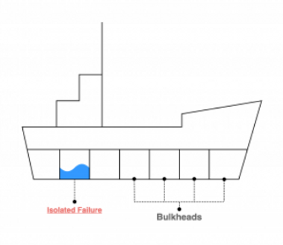

<!-- TOC -->
* [Module 1 — Core Distributed Systems Foundations](#module-1--core-distributed-systems-foundations)
  * [Q - What is Partition Tolerance?](#q---what-is-partition-tolerance)
  * [Q - What is CAP theorem?](#q---what-is-cap-theorem)
    * [Why Partition Tolerance is mandatory](#why-partition-tolerance-is-mandatory)
    * [Case 1: Choose Consistency](#case-1-choose-consistency)
    * [Case 2: Choose Availability](#case-2-choose-availability)
    * [Important correction (many people get this wrong)](#important-correction-many-people-get-this-wrong)
    * [Real-world mapping (intuition)](#real-world-mapping-intuition)
  * [Q - What are two common Replication Models?](#q---what-are-two-common-replication-models)
    * [Primary–Replica (Leader–Follower)](#primaryreplica-leaderfollower)
    * [Quorum-based Replication (Leaderless / Multi-Replica)](#quorum-based-replication-leaderless--multi-replica)
  * [Q - How to tune consistency in Leaderless Replication](#q---how-to-tune-consistency-in-leaderless-replication)
    * [1. The Variables](#1-the-variables)
    * [2. The Scenario: `R + W ≤ N`](#2-the-scenario-r--w--n)
    * [3. Why would anyone do this?](#3-why-would-anyone-do-this)
    * [4. The "Fixed" Formula (Strong Consistency)](#4-the-fixed-formula-strong-consistency)
  * [Q - What are Vector Clocks?](#q---what-are-vector-clocks)
  * [Q - What are Bloom Filters?](#q---what-are-bloom-filters)
    * [1. The problem (ELI5)](#1-the-problem-eli5)
    * [2. What a Bloom Filter is (ELI5)](#2-what-a-bloom-filter-is-eli5)
    * [3. The light-bulb board (visual example)](#3-the-light-bulb-board-visual-example)
    * [4. Adding an item (example 1)](#4-adding-an-item-example-1)
    * [5. Adding another item (example 2)](#5-adding-another-item-example-2)
    * [6. Checking if an item exists (example)](#6-checking-if-an-item-exists-example)
    * [7. Checking something that is NOT there](#7-checking-something-that-is-not-there)
    * [8. The golden rule (important)](#8-the-golden-rule-important)
    * [9. Why false positives are okay](#9-why-false-positives-are-okay)
  * [Q - What are LSM Trees?](#q---what-are-lsm-trees)
    * [Step 1: The problem LSM Trees solve (ELI5)](#step-1-the-problem-lsm-trees-solve-eli5)
    * [Step 2: The key rule (lock this in)](#step-2-the-key-rule-lock-this-in)
    * [Step 3: Start with memory (MemTable)](#step-3-start-with-memory-memtable)
      * [MemTable (sorted in RAM)](#memtable-sorted-in-ram)
    * [Step 4: MemTable fills up → flush to disk](#step-4-memtable-fills-up--flush-to-disk)
    * [Step 5: First SSTable on disk](#step-5-first-sstable-on-disk)
    * [Step 6: More writes come in](#step-6-more-writes-come-in)
    * [Step 7: Flush again → another SSTable](#step-7-flush-again--another-sstable)
    * [Step 8: How READ works (very important)](#step-8-how-read-works-very-important)
    * [Step 9: Bloom Filters help speed reads](#step-9-bloom-filters-help-speed-reads)
    * [Step 10: Deletes (tombstones)](#step-10-deletes-tombstones)
    * [Step 11: Problem: Too many SSTables](#step-11-problem-too-many-sstables)
    * [Step 12: Compaction (cleanup)](#step-12-compaction-cleanup)
    * [Step 13: Why LSM Trees are fast](#step-13-why-lsm-trees-are-fast)
    * [Step 14: One-sentence ELI5 summary (memorize this)](#step-14-one-sentence-eli5-summary-memorize-this)
  * [Q - MemTable and SSTable: Structure and Layout](#q---memtable-and-sstable-structure-and-layout)
    * [1. What a MemTable looks like (in memory)](#1-what-a-memtable-looks-like-in-memory)
      * [How it’s actually implemented](#how-its-actually-implemented)
      * [What happens on write](#what-happens-on-write)
    * [2. What happens when MemTable is flushed](#2-what-happens-when-memtable-is-flushed)
    * [3. What an SSTable looks like (on disk)](#3-what-an-sstable-looks-like-on-disk)
      * [SSTable (high-level layout)](#sstable-high-level-layout)
      * [3.1 Data Blocks (the actual data)](#31-data-blocks-the-actual-data)
      * [3.2 Index Block (how SSTable is searched)](#32-index-block-how-sstable-is-searched)
      * [3.3 Bloom Filter (quick "not here" check)](#33-bloom-filter-quick-not-here-check)
      * [3.4 Footer](#34-footer)
    * [4. SSTable example (full picture)](#4-sstable-example-full-picture)
    * [5. How reads actually happen (step-by-step)](#5-how-reads-actually-happen-step-by-step)
    * [6. Deletes (tombstones) in MemTable and SSTable](#6-deletes-tombstones-in-memtable-and-sstable)
    * [7. Key difference (very important)](#7-key-difference-very-important)
  * [Q - What is Consistent hashing?](#q---what-is-consistent-hashing)
    * [Consistent hashing: the core idea](#consistent-hashing-the-core-idea)
    * [The hash space (horizontal line)](#the-hash-space-horizontal-line)
    * [Place shards on the line](#place-shards-on-the-line)
    * [Place keys on the same line](#place-keys-on-the-same-line)
    * [Assign keys to shards (very important)](#assign-keys-to-shards-very-important)
    * [Adding a shard (this is where consistent hashing shines)](#adding-a-shard-this-is-where-consistent-hashing-shines)
    * [So far so good… but here's the problem](#so-far-so-good-but-heres-the-problem)
    * [Enter virtual nodes (this is the key)](#enter-virtual-nodes-this-is-the-key)
    * [Setup: hash space and virtual nodes](#setup-hash-space-and-virtual-nodes)
    * [Ownership rule (recap)](#ownership-rule-recap)
    * [Initial ownership ranges](#initial-ownership-ranges)
    * [Add a new physical node D](#add-a-new-physical-node-d)
    * [What moves when node D is added?](#what-moves-when-node-d-is-added)
    * [Ownership after adding D](#ownership-after-adding-d)
    * [Remove physical node B](#remove-physical-node-b)
    * [What happens to B’s ranges?](#what-happens-to-bs-ranges)
    * [Why virtual nodes make this smooth](#why-virtual-nodes-make-this-smooth)
    * [Key insight (this is the “aha”)](#key-insight-this-is-the-aha)
  * [Q - What is Gossip Protocol (SWIM-style)?](#q---what-is-gossip-protocol-swim-style)
    * [1. What problem Gossip solves](#1-what-problem-gossip-solves)
    * [2. Core data structures (very important)](#2-core-data-structures-very-important)
    * [3. Incarnation number — what it is and why it exists](#3-incarnation-number--what-it-is-and-why-it-exists)
      * [What is an incarnation?](#what-is-an-incarnation)
      * [Critical rules](#critical-rules)
    * [4. How a node gets its initial incarnation](#4-how-a-node-gets-its-initial-incarnation)
    * [5. Bootstrap phase (addresses only)](#5-bootstrap-phase-addresses-only)
    * [6. Node A starts](#6-node-a-starts)
    * [7. How gossip rounds work (high level)](#7-how-gossip-rounds-work-high-level)
    * [8. Message handling order (critical)](#8-message-handling-order-critical)
    * [9. Membership discovery example](#9-membership-discovery-example)
      * [A contacts C and E](#a-contacts-c-and-e)
      * [C and E process A’s message](#c-and-e-process-as-message)
      * [C and E reply](#c-and-e-reply)
      * [A merges replies](#a-merges-replies)
    * [10. Discovery continues (A meets B)](#10-discovery-continues-a-meets-b)
  * [11. Stable cluster view](#11-stable-cluster-view)
    * [FAILURE DETECTION (MOST IMPORTANT PART)](#failure-detection-most-important-part)
    * [12. Node D crashes silently](#12-node-d-crashes-silently)
    * [13. A probes D](#13-a-probes-d)
    * [14. A marks D as SUSPECT](#14-a-marks-d-as-suspect)
    * [15. A gossips suspicion and performs indirect probes](#15-a-gossips-suspicion-and-performs-indirect-probes)
      * [Gossip suspicion](#gossip-suspicion)
      * [Indirect probes](#indirect-probes)
    * [16. Two possible outcomes](#16-two-possible-outcomes)
      * [Case 1: D responds to someone](#case-1-d-responds-to-someone)
      * [Case 2: D responds to no one](#case-2-d-responds-to-no-one)
    * [17. Suspect timeout (`T_suspect`)](#17-suspect-timeout-t_suspect)
    * [18. A marks D as DEAD](#18-a-marks-d-as-dead)
    * [19. Death information is gossiped](#19-death-information-is-gossiped)
    * [20. Cluster converges again](#20-cluster-converges-again)
    * [NODE REVIVAL (WHY INCARNATION MATTERS)](#node-revival-why-incarnation-matters)
    * [21. D restarts](#21-d-restarts)
    * [22. D gossips ALIVE with higher incarnation](#22-d-gossips-alive-with-higher-incarnation)
    * [23. A compares incarnation](#23-a-compares-incarnation)
    * [24. Final state machine (memorize)](#24-final-state-machine-memorize)
    * [25. Why this design is correct](#25-why-this-design-is-correct)
    * [26. Perfect interview summary (one sentence)](#26-perfect-interview-summary-one-sentence)
    * [27. Ultra-short version (interrupt-safe)](#27-ultra-short-version-interrupt-safe)
* [Module 2 — System Performance & Scalability](#module-2--system-performance--scalability)
  * [Q - What is latency and throughput?](#q---what-is-latency-and-throughput)
  * [Q - What is N+1 problem?](#q---what-is-n1-problem)
    * [1. The Scenario: "Authors and Books"](#1-the-scenario-authors-and-books)
    * [2. The Bad Code (The Trap)](#2-the-bad-code-the-trap)
    * [3. The Problem (The Math)](#3-the-problem-the-math)
    * [4. The Solution: "JOIN FETCH"](#4-the-solution-join-fetch)
  * [Q - Types of caches](#q---types-of-caches)
    * [Write through cache](#write-through-cache)
    * [Write around cache](#write-around-cache)
    * [Write back cache](#write-back-cache)
  * [Q - What are different cache eviction policies?](#q---what-are-different-cache-eviction-policies)
  * [Q - What are different Rate Limiting Algorithms?](#q---what-are-different-rate-limiting-algorithms)
    * [The Problem: Why do we need this?](#the-problem-why-do-we-need-this)
    * [Algorithm 1: Token Bucket](#algorithm-1-token-bucket)
      * [1. The ELI5 Metaphor](#1-the-eli5-metaphor)
      * [2. How it works (Step-by-Step)](#2-how-it-works-step-by-step)
      * [3. Deep Dive: "Burstiness"](#3-deep-dive-burstiness)
      * [Example](#example)
    * [Algorithm 2: Leaky Bucket](#algorithm-2-leaky-bucket)
      * [1. The ELI5 Metaphor](#1-the-eli5-metaphor-1)
      * [2. How it works (Step-by-Step)](#2-how-it-works-step-by-step-1)
      * [3. Deep Dive: The Trade-off](#3-deep-dive-the-trade-off)
    * [Algorithm 3: Fixed Window Counter](#algorithm-3-fixed-window-counter)
      * [1. The ELI5 Metaphor](#1-the-eli5-metaphor-2)
      * [2. How it works (Step-by-Step)](#2-how-it-works-step-by-step-2)
      * [3. Deep Dive: The "Edge of Window" Problem](#3-deep-dive-the-edge-of-window-problem)
      * [Example - Where it works](#example---where-it-works)
      * [Example (Real Numbers)](#example-real-numbers)
      * [What Happens on Each Request](#what-happens-on-each-request)
      * [Example - Where the Algorithm Breaks (Edge Case)](#example---where-the-algorithm-breaks-edge-case)
    * [Algorithm 4: Sliding Window Log](#algorithm-4-sliding-window-log)
      * [1. The ELI5 Metaphor](#1-the-eli5-metaphor-3)
      * [2. How it works (Step-by-Step)](#2-how-it-works-step-by-step-3)
      * [3. Deep Dive: The Cost](#3-deep-dive-the-cost)
    * [Algorithm 5: Sliding Window Counter (Hybrid)](#algorithm-5-sliding-window-counter-hybrid)
      * [1. The ELI5 Metaphor](#1-the-eli5-metaphor-4)
      * [2. How it works (Step-by-Step)](#2-how-it-works-step-by-step-4)
      * [3. Deep Dive: Why this wins](#3-deep-dive-why-this-wins)
    * [Summary Table (Quick Reference)](#summary-table-quick-reference)
* [Module 3 — Resilience Patterns](#module-3--resilience-patterns)
  * [Q - Explain Bulkhead Pattern](#q---explain-bulkhead-pattern)
    * [The Problem: "Resource Exhaustion" (The Sinking Ship)](#the-problem-resource-exhaustion-the-sinking-ship)
    * [The Solution: The Bulkhead Pattern](#the-solution-the-bulkhead-pattern)
    * [Java Implementation (Resilience4j)](#java-implementation-resilience4j)
    * [Execution Flow](#execution-flow)
  * [Q - Explain Circuit Breaker pattern](#q---explain-circuit-breaker-pattern)
    * [The core idea](#the-core-idea)
    * [The Problem: "Cascading Failure" ( The Domino Effect)](#the-problem-cascading-failure--the-domino-effect)
    * [The Solution: The State Machine](#the-solution-the-state-machine)
    * [A. CLOSED (Normal Operation)](#a-closed-normal-operation)
    * [B. OPEN (The "Cut-Off")](#b-open-the-cut-off)
    * [C. HALF-OPEN (The "Probing Phase")](#c-half-open-the-probing-phase)
    * [Configuration (Resilience4j via `application.yml`)](#configuration-resilience4j-via-applicationyml)
    * [Java Implementation (Resilience4j)](#java-implementation-resilience4j-1)
  * [Q - Explain Retry pattern](#q---explain-retry-pattern)
    * [The Core Idea](#the-core-idea-1)
    * [When retries make sense (important)](#when-retries-make-sense-important)
    * [Retry strategies (from naive → correct)](#retry-strategies-from-naive--correct)
    * [Key configuration knobs](#key-configuration-knobs)
    * [Retry + Circuit Breaker (must be combined carefully)](#retry--circuit-breaker-must-be-combined-carefully)
    * [Retry vs Circuit Breaker vs Bulkhead](#retry-vs-circuit-breaker-vs-bulkhead)
    * [Java Implementation (Resilience4j)](#java-implementation-resilience4j-2)
  * [Q - Explain Saga pattern](#q---explain-saga-pattern)
    * [Saga Pattern: Distributed Transactions](#saga-pattern-distributed-transactions)
    * [Approach 1: Choreography (The "Dance")](#approach-1-choreography-the-dance)
    * [Approach 2: Orchestration (The "Conductor")](#approach-2-orchestration-the-conductor)
      * [1. How the Orchestrator is Triggered](#1-how-the-orchestrator-is-triggered)
      * [2. The Step-by-Step Flow](#2-the-step-by-step-flow)
      * [3. What if something fails? (Compensating Transactions)](#3-what-if-something-fails-compensating-transactions)
    * [Comparison Cheat Sheet](#comparison-cheat-sheet)
    * [Summary for Interview](#summary-for-interview)
  * [Q - Explain Transactional outbox pattern](#q---explain-transactional-outbox-pattern)
    * [The Problem: The "Dual Write" Dilemma](#the-problem-the-dual-write-dilemma)
    * [The Solution: The Outbox Pattern](#the-solution-the-outbox-pattern)
    * [Why use it? (Interview Key Points)](#why-use-it-interview-key-points)
    * [Summary](#summary)
* [Module 4 — Microservices Architecture](#module-4--microservices-architecture)
  * [Q - What are common microserivces design pattern?](#q---what-are-common-microserivces-design-pattern)
    * [1. Decomposition Patterns (How to break the Monolith)](#1-decomposition-patterns-how-to-break-the-monolith)
      * [A. Strangler Fig Pattern](#a-strangler-fig-pattern)
      * [B. Decompose by Subdomain (DDD)](#b-decompose-by-subdomain-ddd)
    * [2. Integration Patterns (How services talk)](#2-integration-patterns-how-services-talk)
      * [A. API Gateway Pattern](#a-api-gateway-pattern)
      * [B. Aggregator Pattern](#b-aggregator-pattern)
    * [3. Database Patterns (The hardest part)](#3-database-patterns-the-hardest-part)
      * [A. Database per Service](#a-database-per-service)
      * [B. Saga Pattern (Distributed Transactions)](#b-saga-pattern-distributed-transactions)
      * [C. CQRS (Command Query Responsibility Segregation)](#c-cqrs-command-query-responsibility-segregation)
    * [4. Cross-Cutting Concern Patterns](#4-cross-cutting-concern-patterns)
      * [A. Circuit Breaker](#a-circuit-breaker)
      * [B. Bulkhead Pattern](#b-bulkhead-pattern)
    * [5. Observability Patterns (How to see inside the black box)](#5-observability-patterns-how-to-see-inside-the-black-box)
      * [A. Distributed Tracing](#a-distributed-tracing)
      * [B. Log Aggregation](#b-log-aggregation)
      * [C. Health Check API](#c-health-check-api)
    * [Summary for the Interview (The "Must-Haves")](#summary-for-the-interview-the-must-haves)
    * [References](#references)
  * [Q - Explain CQRS Pattern](#q---explain-cqrs-pattern)
    * [CQRS (Command Query Responsibility Segregation)](#cqrs-command-query-responsibility-segregation)
    * [The Scenario: "The PlayStation 5 Launch"](#the-scenario-the-playstation-5-launch)
    * [1. The "Insanity" of the Normal Approach (CRUD)](#1-the-insanity-of-the-normal-approach-crud)
    * [2. The "Sanity" of CQRS (The Fix)](#2-the-sanity-of-cqrs-the-fix)
    * [3. The Trade-off (The Glue)](#3-the-trade-off-the-glue)
    * [Summary](#summary-1)
  * [Q - In what scenario, you should prefer orchestration saga pattern over choreography pattern?](#q---in-what-scenario-you-should-prefer-orchestration-saga-pattern-over-choreography-pattern)
    * [1. The Workflow is Complex (More than 4 steps)](#1-the-workflow-is-complex-more-than-4-steps)
    * [2. You Need Centralized Monitoring & Control](#2-you-need-centralized-monitoring--control)
    * [3. The Flow Has Cyclic Dependencies](#3-the-flow-has-cyclic-dependencies)
    * [4. Compensation (Rollback) Logic is Critical](#4-compensation-rollback-logic-is-critical)
    * [Summary Table](#summary-table)
* [Module 5 — API & REST Semantics](#module-5--api--rest-semantics)
  * [Q - What is an idempotent API? Which HTTP methods are idempotent, and why does idempotency matter in RESTful systems](#q---what-is-an-idempotent-api-which-http-methods-are-idempotent-and-why-does-idempotency-matter-in-restful-systems)
    * [What does idempotent mean? (Very basics)](#what-does-idempotent-mean-very-basics)
    * [The "Retry Test" (Interview Explanation)](#the-retry-test-interview-explanation)
    * [Why idempotency matters](#why-idempotency-matters)
    * [Idempotent ≠ Safe (important distinction)](#idempotent--safe-important-distinction)
    * [HTTP Methods — Idempotency Overview](#http-methods--idempotency-overview)
    * [Method-by-method explanation](#method-by-method-explanation)
  * [Q -  Which http status code you should pass when request is accepted but an async job is still running?](#q---which-http-status-code-you-should-pass-when-request-is-accepted-but-an-async-job-is-still-running)
    * [Why 202?](#why-202)
    * [Best Practice Implementation](#best-practice-implementation)
  * [Q - Which http status code you should pass when a request from a client is invalid?](#q---which-http-status-code-you-should-pass-when-a-request-from-a-client-is-invalid)
* [Module 6 — Deployment & DevOps](#module-6--deployment--devops)
  * [Q - Mention a few Deployment strategies](#q---mention-a-few-deployment-strategies)
    * [1. Blue-Green Deployment (The "Instant Switch")](#1-blue-green-deployment-the-instant-switch)
    * [2. Canary Deployment (The "Risk Averse")](#2-canary-deployment-the-risk-averse)
    * [3. Rolling Deployment (The "K8s Default")](#3-rolling-deployment-the-k8s-default)
    * [4. Feature Toggles (The "Senior Dev" Strategy)](#4-feature-toggles-the-senior-dev-strategy)
    * [Summary Table for Interview](#summary-table-for-interview)
  * [Q - Explain the deployment process you use in the previous project](#q---explain-the-deployment-process-you-use-in-the-previous-project)
    * [The Interview Answer: "The Release Train Strategy"](#the-interview-answer-the-release-train-strategy)
    * [1. The Architecture Stack](#1-the-architecture-stack)
    * [2. The Logic: "The Three-Phase Build"](#2-the-logic-the-three-phase-build)
      * [Phase 1: The Foundation (Sequential & Parallel)](#phase-1-the-foundation-sequential--parallel)
      * [Phase 2: The Fan-Out (Parallel)](#phase-2-the-fan-out-parallel)
      * [Phase 3: The Deployment (Kubernetes & Helm)](#phase-3-the-deployment-kubernetes--helm)
    * [3. Why we chose AWS CodeArtifact over Nexus](#3-why-we-chose-aws-codeartifact-over-nexus)
    * [4. Summary Checklist (For the Interviewer)](#4-summary-checklist-for-the-interviewer)
  * [Q - Follow-up question from the interviewer -  What if some logs into the k8s cluster and manually scaled replica?](#q---follow-up-question-from-the-interviewer---what-if-some-logs-into-the-k8s-cluster-and-manually-scaled-replica)
    * [The Problem: The "Push" Model (Jenkins)](#the-problem-the-push-model-jenkins)
    * [The Solution: The "Pull" Model (GitOps with ArgoCD)](#the-solution-the-pull-model-gitops-with-argocd)
* [Module 7 — Software Design Principles](#module-7--software-design-principles)
  * [Q - Difference between Coupling and Cohesion?](#q---difference-between-coupling-and-cohesion)
    * [COHESION](#cohesion)
    * [COUPLING](#coupling)
  * [Q - Explain SOLID](#q---explain-solid)
    * [S - Single Responsibility Principle (SRP)](#s---single-responsibility-principle-srp)
    * [O - Open/Closed Principle (OCP)](#o---openclosed-principle-ocp)
    * [L - Liskov Substitution Principle (LSP)](#l---liskov-substitution-principle-lsp)
    * [I - Interface Segregation Principle (ISP)](#i---interface-segregation-principle-isp)
    * [D - Dependency Inversion Principle (DIP)](#d---dependency-inversion-principle-dip)
    * [Summary Cheat Sheet](#summary-cheat-sheet)
  * [Q - When should I use an interface vs an abstract class while designing a file uploader with multiple implementations (e.g., S3, GCP)?](#q---when-should-i-use-an-interface-vs-an-abstract-class-while-designing-a-file-uploader-with-multiple-implementations-eg-s3-gcp)
    * [Use an INTERFACE when the goal is “capability” or “contract”](#use-an-interface-when-the-goal-is-capability-or-contract)
    * [When to use ABSTRACT CLASS instead](#when-to-use-abstract-class-instead)
* [Module 8 — Database & Messaging Guarantees](#module-8--database--messaging-guarantees)
  * [Q - What is Kafka transaction management and why is it needed?](#q---what-is-kafka-transaction-management-and-why-is-it-needed)
<!-- TOC -->

---

# Module 1 — Core Distributed Systems Foundations

## Q - What is Partition Tolerance?

Partition Tolerance is the ability of a distributed system to survive a communications
breakdown between its internal servers.

---

## Q - What is CAP theorem?

When a network partition happens, you must choose:

* Consistency OR
* Availability

You cannot have both. Partition tolerance is not optional in distributed systems.

**Note:** ✅ CAP is only about distributed systems

### Why Partition Tolerance is mandatory

If your system has:

* more than one machine
* connected by a network

Then:

* network failures will happen

So CAP really means:

```
During a partition:
Choose C or A
```

Not all three.

Let's see the choice (ELI5)

### Case 1: Choose Consistency

Network breaks.

User asks Computer A:

```
GET balance
```

Computer A says:

> "I'm not sure what B has. I'll wait."

Result:

* ❌ User may get no response
* ✅ Data stays correct

This is CP (Consistency + Partition Tolerance).

### Case 2: Choose Availability

Network breaks.

User asks Computer A:

```
GET balance
```

Computer A says:

> "Here's what I have."

Even if B has different data.

Result:

* ✅ User gets a response
* ❌ Data may be stale or inconsistent

This is AP (Availability + Partition Tolerance).

### Important correction (many people get this wrong)

CAP does NOT say:

> "You can never have all three"

It says:
**During a partition**, you must choose

When the network is healthy:

* you can have C + A

### Real-world mapping (intuition)

| System choice | What it values                  |
|---------------|---------------------------------|
| CP            | Correctness over responsiveness |
| AP            | Responsiveness over correctness |

Neither is "better". They solve different problems.

---

## Q - What are two common Replication Models?

1. Primary–Replica (Leader–Follower)
2. Quorum-based Replication (Leaderless / Multi-Replica)

### Primary–Replica (Leader–Follower)

**How it works**

* One node is the Primary (Leader)
* All writes go to the Primary
* Replicas copy data from the Primary
* Reads can go to:
    * Primary only (stronger consistency)
    * Replicas (faster, possibly stale)


---


**Key properties**

* Simple mental model
* Easy conflict resolution (single writer)
* Replication lag is common
* Consistency depends on where reads go

---

**Typical systems**

* MySQL primary/replica
* PostgreSQL streaming replicas
* Redis primary + replica
* Kafka partitions (leader/followers)

---

**Consistency story**

* Strong consistency if reads go to primary
* Eventual consistency if reads go to replicas

---

### Quorum-based Replication (Leaderless / Multi-Replica)

**How it works**

* No single “primary” for correctness
* Data is written to multiple replicas
* Reads consult multiple replicas
* Majority agreement determines the result

**Key properties**

* No single leader bottleneck
* More complex logic
* Tunable consistency
* Handles failures gracefully

**Typical systems**

* Dynamo / DynamoDB (conceptually)
* Cassandra
* Riak

**Consistency story**

* Controlled by `R` and `W`
* If `R + W > N` → latest write is guaranteed
* If not → stale reads possible


------------


## Q - How to tune consistency in Leaderless Replication

In distributed systems (like Cassandra or DynamoDB), this specific formula (`R + W ≤ N`) means you
are **NOT guaranteed to see the latest data**.

Here is the ELI5 breakdown using The Notebook Analogy.

### 1. The Variables

* N (Total Copies): You have 3 notebooks (Replicas) where you store secrets.
* W (Write Quorum): When you want to save a secret, you write it in W of them.
* R (Read Quorum): When you want to read a secret, you check R of them.

### 2. The Scenario: `R + W ≤ N`

Let's say `N=3` (3 notebooks). You decide: "I want to be fast, so I will only write to 1 notebook (`W=1`) and
read from 1 notebook (`R=1`)."
* The Math: `1+1=2`. And `2≤3`. The formula holds.

What happens?

* **The Write:** You write "The sky is Green" into **Notebook A**. (You ignore B and C because `W=1`).
* **The Read:** Your friend comes along and picks **Notebook C** to read (`R=1`).
* **The Result:** Notebook C is blank (or says "The sky is Blue"). Your friend sees stale (old) data.

### 3. Why would anyone do this?

If this formula leads to errors, why do engineers use it? Speed.

* Writing to 1 notebook is faster than writing to 3.
* Reading from 1 notebook is faster than comparing 3.
* This is called **Eventual Consistency**. You are betting that eventually Notebook A will copy
  the data to B and C in the background. But for a few milliseconds, the data is wrong.

### 4. The "Fixed" Formula (Strong Consistency)

If you want to guarantee that your friend always sees "The sky is Green," you must use the opposite formula:

>
> R+W > N
>

* **Example:** `N=3`. You write to 2 (`W=2`). You read from 2 (`R=2`).
* **Math:** `2+2=4`. And `4>3`.
* **Why it works:** Because 4 is bigger than the total number of notebooks, there must be an overlap.
  At least one of the notebooks you read must be one of the notebooks I wrote to.

| Formula       | Name                        | Meaning                                                                      | Use Case                        |
|:--------------|:----------------------------|:-----------------------------------------------------------------------------|:--------------------------------|
| $R + W \le N$ | Weak / Eventual Consistency | The Read group and Write group might not overlap. Risk of stale data.        | High speed, Likes, Feed counts. |
| $R + W > N$   | Strong Consistency          | The Read group and Write group are guaranteed to overlap. Always fresh data. | Passwords, Payments, Inventory. |


----------------


## Q - What are Vector Clocks?

(Original content unchanged — placeholder preserved.)

---

## Q - What are Bloom Filters?

### 1. The problem (ELI5)

Imagine you have a huge toy box with millions of toys.

A kid asks:

> "Is the red dinosaur toy inside?"

You don't want to:

* open the box every time (slow)
* guess randomly (wrong)

You want a quick hint that tells you:

* ❌ “Definitely NOT inside”
* 🤔 “Maybe inside”

That hint is a Bloom Filter.

### 2. What a Bloom Filter is (ELI5)

> A Bloom Filter is a quick checker that can tell you
"Definitely no" or "Maybe yes."
>

It never says:

* "Yes, for sure"

### 3. The light-bulb board (visual example)

Imagine a board with 8 light bulbs:

```text
[ 0 0 0 0 0 0 0 0 ]
```

* `0` = OFF
* `1` = ON

All bulbs start OFF.

### 4. Adding an item (example 1)

You add the word:

```text
"apple"
```

You pass "apple" through 2 magic machines (hash functions).

They say:

* Turn ON bulb #2
* Turn ON bulb #5

Board becomes:

```text
[ 0 0 1 0 0 1 0 0 ]
```

You did not store "apple" — you only flipped bulbs.

### 5. Adding another item (example 2)

Add:

```text
"banana"
```

Magic machines say:

* Turn ON bulb #3
* Turn ON bulb #5

Board becomes:

```text
[ 0 0 1 1 0 1 0 0 ]
```

Note:

* Bulb #5 was already ON — that's fine.

### 6. Checking if an item exists (example)

Someone asks:
> "Do you have ‘apple’?"
>

You:

1. Run "apple" through the same machines
2. Check bulbs #2 and #5

Both are ON →
👉 Maybe yes

You now go check the real toy box.

### 7. Checking something that is NOT there

Someone asks:
> "Do you have ‘dragon’?"
>

Machines say:

* Check bulb #1
* Check bulb #6

Board:

```text
[ 0 0 1 1 0 1 0 0 ]
```

Bulb #1 is OFF →
👉 Definitely NOT there

You skip checking the box entirely.

### 8. The golden rule (important)

| Bloom Filter answer | Meaning                |
|---------------------|------------------------|
| ❌ No                | Definitely not present |
| 🤔 Yes              | Might be present       |

It never lies about "no."
It can lie about "yes."

This lie is called a false positive.

### 9. Why false positives are okay

If Bloom Filter says:

> "Maybe yes"

Worst case:

* You checked the box unnecessarily

If Bloom Filter says:

> "No"

You saved time and avoided work.

So Bloom Filters trade:

* tiny uncertainty
* for huge speed gains


----------------


## Q - What are LSM Trees?

### Step 1: The problem LSM Trees solve (ELI5)

Imagine you keep a notebook on disk.

Every time you want to update a value, you must:

* open the notebook
* erase a line
* rewrite it

Disk hates this.


So databases asked:

> "What if we never erase and only append?"

That idea leads to **LSM Trees**.

### Step 2: The key rule (lock this in)

> Never update data in place. Always write new data.
>

Old data stays. New data is written on top.

### Step 3: Start with memory (MemTable)

When a write comes in:

```text
PUT(cat, 10)
PUT(dog, 20)
PUT(apple, 5)
```

Instead of disk, we write to memory.

#### MemTable (sorted in RAM)

```text
apple → 5
cat   → 10
dog   → 20
```

Fast. No disk yet.

###  Step 4: MemTable fills up → flush to disk

Memory is limited.

When MemTable is full:

* freeze it
* write it to disk
* start a new MemTable

The disk file is called an SSTable.


### Step 5: First SSTable on disk

```text
SSTable_1 (on disk)
------------------
apple → 5
cat   → 10
dog   → 20
```

Important:

* Sorted
* Immutable (never changes)


### Step 6: More writes come in

Now we write more data:

```text
PUT(cat, 15)   // update
PUT(egg, 3)
```

New MemTable:

```text
cat → 15
egg → 3
```

### Step 7: Flush again → another SSTable

```text
SSTable_2 (newer)
-----------------
cat → 15
egg → 3
```

Disk now has:

```text
SSTable_2 (newest)
SSTable_1 (older)
```

### Step 8: How READ works (very important)

Suppose we do:

```text
GET(cat)
```

Database checks:

* MemTable (if exists)
* SSTable_2
* SSTable_1

Finds:

```text
cat → 15
```

Stops immediately.

Newer data always wins.


### Step 9: Bloom Filters help speed reads

Before reading an SSTable:

* Bloom Filter says:
  * ❌ "Not here" → skip
  * 🤔 "Maybe here" → check

So we don't scan every file.


### Step 10: Deletes (tombstones)

If you do:

```text
DELETE(dog)
```

The MemTable records a tombstone entry:

```text
dog → TOMBSTONE
```

Later SSTable:

```text
SSTable_3
---------
dog → <tombstone>
```

This hides old values.

### Step 11: Problem: Too many SSTables

Over time:

* Many SSTables
* Reads get slower
* Disk usage grows

### Step 12: Compaction (cleanup)

Background process:

1. Read multiple SSTables
2. Merge them (like merge sort)
3. Keep only latest value per key
4. Remove tombstones
5. Write a new SSTable

Example:

Before compaction:

```text
SSTable_2: cat → 15
SSTable_1: cat → 10
```

After:

```text
SSTable_compacted: cat → 15
```

Old files are deleted.


### Step 13: Why LSM Trees are fast

Writes:

* In-memory
* Sequential disk writes
* No random IO

Reads:

* More complex
* Fixed by Bloom filters + compaction

LSM trades:

> Write speed for read complexity

### Step 14: One-sentence ELI5 summary (memorize this)

> An LSM Tree stores new data in memory, writes it to disk as immutable sorted files, and later merges
> those files to keep reads fast.
>


------------------


## Q - MemTable and SSTable: Structure and Layout

### 1. What a MemTable looks like (in memory)

A MemTable is just an in-memory sorted map.

Think of it as:

```text
SortedMap<Key, Value>
```

Example: MemTable contents

```text
MemTable
--------
apple   → 10
banana  → 20
cat     → 30
dog     → 40
```

Important properties:

* Sorted by key
* Lives entirely in RAM
* Mutable (can change)
* Fast inserts and updates

#### How it’s actually implemented

In real systems (RocksDB, Cassandra):

* Skip List (most common)
* Red-Black Tree
* AVL Tree

You don't need to know how its implemented — the key point is:
> Keys are always kept sorted.

#### What happens on write

```text
PUT(cat, 99)
```

MemTable becomes:

```text
apple   → 10
banana  → 20
cat     → 99   (newer value)
dog     → 40
```

No disk touched yet.

### 2. What happens when MemTable is flushed

When MemTable gets full:

* It is frozen (read-only)
* Written to disk
* Turned into an `SSTable`


### 3. What an SSTable looks like (on disk)

An SSTable is **immutable** and **sorted**.

But it’s not just a flat file. It has **structure**.

#### SSTable (high-level layout)

```text
+--------------------+
| Data Blocks        |
+--------------------+
| Index Block        |
+--------------------+
| Bloom Filter       |
+--------------------+
| Footer             |
+--------------------+
```

Let's go piece by piece.

#### 3.1 Data Blocks (the actual data)

Data is stored in **blocks**, not one giant list.

Example:

```text
Data Block 1
------------
apple  → 10
banana → 20

Data Block 2
------------
cat → 99
dog → 40
```

Properties:

* Sorted within the block
* Fixed-size (e.g., 4 KB)
* Read sequentially from disk


#### 3.2 Index Block (how SSTable is searched)

The index tells you which block to read.

Example:

```text
Index Block
-----------
apple → Block 1
cat   → Block 2
```

Meaning:

* If key < cat → look in Block 1
* Else → Block 2

This avoids scanning the whole file.


#### 3.3 Bloom Filter (quick "not here" check)

Each SSTable has a Bloom filter.

Example logic:

```text
GET("elephant")
Bloom Filter → definitely NOT present
→ skip this SSTable entirely
```

This avoids disk reads.

#### 3.4 Footer

Stores:

* Pointers to index
* Metadata
* Version info

Used when opening the file.


### 4. SSTable example (full picture)

```text
SSTable-42
----------
Data Blocks:
  [apple → 10, banana → 20]
  [cat → 99, dog → 40]

Index:
  apple → block-0
  cat   → block-1

Bloom Filter:
  bits = 101011001...

Footer:
  index_offset = 8192
```

Once written:

* ❌ Cannot be modified
* ❌ Cannot be appended
* ✅ Can be read efficiently


### 5. How reads actually happen (step-by-step)

Let's do:

```text
GET(cat)
```

**Step 1: Check MemTable**

* If found → return immediately

**Step 2: Check newest SSTable**

* Bloom filter → maybe present
* Index → find correct block
* Read block → binary search inside block

**Step 3: Stop at first match**

* Newest value wins


### 6. Deletes (tombstones) in MemTable and SSTable

Delete is just another entry.

**MemTable after delete**

```text
cat → TOMBSTONE
```

**SSTable on disk**

```text
SSTable (on disk)
-----------------
apple → 10
banana → 20
cat → TOMBSTONE
dog → 40
```


During compaction:

* Older values are removed
* Tombstone may disappear


### 7. Key difference (very important)

| MemTable      | SSTable               |
|---------------|-----------------------|
| In memory     | On disk               |
| Mutable       | Immutable             |
| Fast writes   | Fast sequential reads |
| One at a time | Many files            |
| Temporary     | Long-lived            |


----------------


## Q - What is Consistent hashing?

Imagine you have 10,000 users and 3 servers.

You need to decide:

> "Which user goes to which server?"
>

Naive idea (bad)

Use:

```text
userId % numberOfServers
```

If servers = 3 → works.

But now one server crashes and servers = 2.

💥 Disaster

Almost every user moves to a different server.

That means:

* Cache misses
* Data reshuffling
* Massive load spike

What problem Consistent Hashing solves
> When servers are added or removed, only a small portion of keys should move.
>

That's it. That’s the whole reason it exists.

### Consistent hashing: the core idea

Instead of mapping **keys to shard numbers**, we map:

* shards → positions on a number line
* keys → positions on the same number line

Then we use a simple rule:
> A key goes to the next shard on the right.

That's it.

### The hash space (horizontal line)

Assume a hash space from 0 to 99 (small for clarity):

```text
0 ------------------------------------------------------------ 99
```

This line wraps around:
* after 99 comes 0 again

### Place shards on the line

Suppose we have 3 shards.

We hash each shard’s ID and place it on the line:

```text
0 ------------------------------------------------------------ 99
|            |                      |
S1(10)       S2(40)                 S3(70)
```

Each shard "owns" keys to its left, up to the previous shard.


### Place keys on the same line

Now hash some keys:

```text
apple  → 12
cat    → 35
dog    → 55
zebra  → 90
```

```text
0 ------------------------------------------------------------ 99
|            |                      |
S1(10)       S2(40)                 S3(70)

 apple(12)          dog(55)                  zebra(90)
      cat(35)
```

### Assign keys to shards (very important)

Rule again:

> Key goes to the next shard on the right

| Key   | Hash | Assigned shard        |
|-------|------|-----------------------|
| apple | 12   | S2 (40)               |
| cat   | 35   | S2 (40)               |
| dog   | 55   | S3 (70)               |
| zebra | 90   | S1 (10) ← wrap around |

So shard ownership is:

```text
S1 owns (70 → 10]
S2 owns (10 → 40]
S3 owns (40 → 70]
```


### Adding a shard (this is where consistent hashing shines)

Now add S4, hashed to position 50.

```text
0 ------------------------------------------------------------ 99
|            |          |          |
S1(10)       S2(40)     S4(50)     S3(70)
```

What changes?

Only keys in one small range move:

```text
(40 → 50]
```

These keys move:

* from S3
* to S4

All other keys stay where they are.

* ✅ This is minimal movement
* ❌ No massive reshuffle

### So far so good… but here's the problem

What if shard positions are uneven?

Example:

```text
0 ------------------------------------------------------------ 99
|    |                                   |
S1(5) S2(15)                             S3(90)
```

Now:

* S3 owns a huge range
* S1 and S2 own tiny ranges

Result:

* one shard overloaded
* others idle

This happens because:
* Shard positions are random


### Enter virtual nodes (this is the key)

Instead of placing **one point per shard**, we place **many points per shard**.

These points are called **virtual nodes (vnodes)**.


### Setup: hash space and virtual nodes

Assume hash space 0–99.

We have 3 physical nodes, each with 3 virtual nodes.

Initial placement

```text
0 -------------------------------------------------------------------------------- 99

10     18     25     38     45     55     68     75     88
|      |      |      |      |      |      |      |      |
A1     B1     C1     A2     B2     C2     A3     B3     C3
```

Legend:

* `A1, A2, A3` → physical node A
* `B1, B2, B3` → physical node B
* `C1, C2, C3` → physical node C

### Ownership rule (recap)

> A key goes to the **next virtual node on the right**
(wrap around at 99 → 0)

Each virtual node owns the range from the previous vnode (exclusive) to itself (inclusive).


### Initial ownership ranges

Let's list them clearly:

```text
| Range     | Virtual Node | Physical Node |
| --------- | ------------ | ------------- |
| (88 → 10] | A1           | A             |
| (10 → 18] | B1           | B             |
| (18 → 25] | C1           | C             |
| (25 → 38] | A2           | A             |
| (38 → 45] | B2           | B             |
| (45 → 55] | C2           | C             |
| (55 → 68] | A3           | A             |
| (68 → 75] | B3           | B             |
| (75 → 88] | C3           | C             |
```

Each physical node owns **three small ranges**, spread across the space.

Balanced load.

### Add a new physical node D

Node D joins with 3 virtual nodes:

```text
D1 = 15
D2 = 50
D3 = 82
```

**New layout**

```text
0 -------------------------------------------------------------------------------- 99

10  15  18  25  38  45  50  55  68  75  82  88
|   |   |   |   |   |   |   |   |   |   |   |
A1  D1  B1  C1  A2  B2  D2  C2  A3  B3  D3  C3
```

### What moves when node D is added?

**Rule:**
Only ranges **immediately before D's virtual nodes** move.

**Affected ranges**

| New vnode | Range taken | Taken from |
|-----------|-------------|------------|
| D1(15)    | (10 → 15]   | A          |
| D2(50)    | (45 → 50]   | B          |
| D3(82)    | (75 → 82]   | B          |


Everything else stays exactly the same.

### Ownership after adding D

Now node D owns:

* `(10 → 15]`
* `(45 → 50]`
* `(75 → 82]`

Each existing node:

* loses small slices
* not a big chunk

This is the **core benefit of virtual nodes**.


### Remove physical node B

Node B goes down → all its virtual nodes disappear:

```text
B1(18), B2(45), B3(75)
```

New layout after removal

```text
0 -------------------------------------------------------------------------------- 99

10  15  25  38  50  55  68  82  88
|   |   |   |   |   |   |   |   |
A1  D1  C1  A2  D2  C2  A3  D3  C3
```


### What happens to B’s ranges?

Each range owned by B is taken over by the next vnode.

| Old B range | New owner |
|-------------|-----------|
| (10 → 18]   | C1        |
| (38 → 45]   | D2        |
| (68 → 75]   | D3        |

Again:

* no global reshuffle
* only local reassignment

### Why virtual nodes make this smooth

Without virtual nodes:

* Node B might own 40% of the data
* Removing B would overload one node

With virtual nodes:

* Node B owned many small slices
* Those slices are spread across:
  * A
  * C
  * D

Load redistribution is **even**.

### Key insight (this is the “aha”)

> Virtual nodes turn big, dangerous rebalances into many tiny, safe ones.

They are not an optimization.

They are what makes consistent hashing usable in production.


---------------


## Q - What is Gossip Protocol (SWIM-style)?

---

### 1. What problem Gossip solves

In a distributed system, every node must know:

* which other nodes are **alive**
* which nodes are **dead**

This must work:

* without a central coordinator
* under node crashes and network issues
* at large scale

Gossip achieves this using **peer-to-peer, probabilistic information exchange** with **eventual consistency**.

---

### 2. Core data structures (very important)

Each node maintains **one membership map** that tracks *other* nodes.

```text
membership = {
  node_id → {
    state: ALIVE | SUSPECT | DEAD,
    incarnation: integer,
    suspect_time: timestamp (only when state = SUSPECT)
  }
}
```

Key clarifications:

* There is **one map**, not separate lists
* `SUSPECT` is just a **state**, not a different structure
* A node does **not store itself** in the map
* “self” is implicit

---

### 3. Incarnation number — what it is and why it exists

#### What is an incarnation?

An **incarnation number** is a **version counter owned by a node about itself**.

It answers:

> “Is this information newer or older than what I already know?”

#### Critical rules

* Only the **node itself** can increment its incarnation
* Other nodes only **copy** the value they hear
* Higher incarnation **always wins**, regardless of state

Example:

```text
ALIVE (inc 6) overrides DEAD (inc 5)
```

This is how nodes safely recover from false death.

---

### 4. How a node gets its initial incarnation

When a node starts **for the very first time**:

```text
self = D
self_incarnation = 1
```

Important:

* This value is **locally initialized**
* It is **not learned from gossip**
* It is persisted to local storage

On restart:

* The node **loads the persisted value**
* Then increments it before gossiping again

---

### 5. Bootstrap phase (addresses only)

Every node is deployed with a static list:

```text
BOOTSTRAP_LIST = [A, B, C, D, E]
```

Important:

* This is **only a list of addresses**
* It contains **no liveness information**
* No node knows who is alive yet

---

### 6. Node A starts

Initial state of A:

```text
self = A
self_incarnation = 1

membership = {}   // empty
```

At this point:

* A knows no one is alive
* It only knows addresses from bootstrap

---

### 7. How gossip rounds work (high level)

Each gossip round:

1. Pick `k` random peers
2. Send current membership view
3. Receive reply
4. Merge received information

---

### 8. Message handling order (critical)

When a node receives gossip:

```text
RECEIVE → MERGE → UPDATE → REPLY
```

A node **never replies before merging**.
Replies always contain the **freshest known state**.

---

### 9. Membership discovery example

#### A contacts C and E

```text
A → C : membership={}
A → E : membership={}
```

Explanation:

* A is announcing its existence
* It is not claiming anyone else is alive

---

#### C and E process A’s message

C updates its membership:

```text
membership = {
  A → { state: ALIVE, incarnation: 1 }
}
```

Explanation:

* Receiving a message from A proves A is alive
* C records A with A’s incarnation

E does the same.

---

#### C and E reply

```text
C → A : membership={A(1)}
E → A : membership={A(1)}
```

Replies reflect **post-merge state**, not stale state.

---

#### A merges replies

```text
membership = {
  C → { state: ALIVE, incarnation: 1 },
  E → { state: ALIVE, incarnation: 1 }
}
```

Explanation:

* A infers C and E are alive because they replied
* A does not store itself

---

### 10. Discovery continues (A meets B)

```text
A → B : membership={C(1), E(1)}
```

B processes first, then replies.

B’s membership becomes:

```text
membership = {
  A → { state: ALIVE, incarnation: 1 },
  C → { state: ALIVE, incarnation: 1 },
  E → { state: ALIVE, incarnation: 1 }
}
```

B replies with this view.

A merges and adds B.

---

## 11. Stable cluster view

Eventually, after multiple rounds:

```text
membership = {
  B → { state: ALIVE, incarnation: 1 },
  C → { state: ALIVE, incarnation: 1 },
  D → { state: ALIVE, incarnation: 1 },
  E → { state: ALIVE, incarnation: 1 }
}
```

All nodes converge to the same view.

---

### FAILURE DETECTION (MOST IMPORTANT PART)

---

### 12. Node D crashes silently

* D stops responding
* No death message is sent

This is the hardest failure type.

---

### 13. A probes D

```text
A → D : ping
```

No response.

Explanation:

* A single missed probe is **not enough** to declare death
* Network issues and pauses are common

---

### 14. A marks D as SUSPECT

```text
membership[D] = {
  state: SUSPECT,
  incarnation: 1,
  suspect_time: t0
}
```

Explanation:

* This is a **local suspicion**
* Other nodes may still think D is alive

---

### 15. A gossips suspicion and performs indirect probes

A does two things in parallel.

#### Gossip suspicion

```text
A → B : D is SUSPECT (1)
A → C : D is SUSPECT (1)
```

#### Indirect probes

```text
A → B : "Ping D"
A → C : "Ping D"
```

Explanation:

* Indirect probes reduce false positives
* Other nodes try reaching D independently

---

### 16. Two possible outcomes

#### Case 1: D responds to someone

If B receives:

```text
D → B : pong
```

Then B reports back, and A updates:

```text
membership[D] = {
  state: ALIVE,
  incarnation: 1
}
```

Explanation:

* Suspicion was false
* System recovers automatically

---

#### Case 2: D responds to no one

* All indirect probes fail
* No ALIVE update arrives

---

### 17. Suspect timeout (`T_suspect`)

Each SUSPECT entry must remain suspected for a minimum time:

```text
T_suspect = e.g. 5 seconds
```

Condition:

```text
now() - suspect_time ≥ T_suspect
```

Explanation:

* Prevents killing slow but healthy nodes

---

### 18. A marks D as DEAD

```text
membership[D] = {
  state: DEAD,
  incarnation: 1
}
```

Explanation:

* Death is declared **only after time + corroboration**
* Never after a single failure

---

### 19. Death information is gossiped

```text
A → B : D is DEAD (1)
A → C : D is DEAD (1)
A → E : D is DEAD (1)
```

Other nodes merge this state.

---

### 20. Cluster converges again

Eventually all nodes have:

```text
membership[D] = {
  state: DEAD,
  incarnation: 1
}
```

D is removed from active membership.

---

### NODE REVIVAL (WHY INCARNATION MATTERS)

---

### 21. D restarts

On restart:

```text
self = D
self_incarnation = 1   // loaded from disk
self_incarnation = 2   // incremented
```

Explanation:

* Increment ensures newer truth
* Without this, D could be ignored forever

---

### 22. D gossips ALIVE with higher incarnation

```text
D → A : D is ALIVE (2)
```

---

### 23. A compares incarnation

Comparison:

```text
ALIVE (2) > DEAD (1)
```

So A updates:

```text
membership[D] = {
  state: ALIVE,
  incarnation: 2
}
```

This update spreads cluster-wide.

---

### 24. Final state machine (memorize)

```text
ALIVE
  ↓ (missed probes)
SUSPECT
  ↓ (timeout + no refutation)
DEAD
  ↑ (ALIVE with higher incarnation)
```

---

### 25. Why this design is correct

| Problem          | Mechanism                 |
|------------------|---------------------------|
| False positives  | SUSPECT + indirect probes |
| Network blips    | Timeout before death      |
| Conflicting info | Incarnation numbers       |
| SPOF             | Fully decentralized       |

---

### 26. Perfect interview summary (one sentence)

> Gossip maintains a single membership map where nodes transition from ALIVE to SUSPECT 
> to DEAD based on timed suspicion and corroborated failures, and incarnation numbers—owned 
> and incremented by the node itself—ensure newer liveness information always overrides stale gossip.

---

### 27. Ultra-short version (interrupt-safe)

> Nodes gossip membership, mark failures as SUSPECT, declare DEAD only after a timeout, and
> use incarnation numbers to resolve conflicts and allow safe recovery.


----------------


# Module 2 — System Performance & Scalability

## Q - What is latency and throughput?

* Latency - Latency is the time taken to complete a single request or task.
* Throughput - Throughput is the number of tasks completed in a given time period.

---

## Q - What is N+1 problem?


This is the most famous performance issue in ORMs (like Hibernate/JPA).

### 1. The Scenario: "Authors and Books"

Imagine you have a database with **Authors** and **Books**.

* **1 Author** has **Many Books**.

You want to print every Author's name and the title of their first book.

### 2. The Bad Code (The Trap)

You write this simple Java code:

```java
// 1. Fetch ALL authors (SELECT * FROM Author)
List<Author> authors = authorRepository.findAll();

// 2. Loop through them
for (Author author : authors) {
    // 3. Get their books (LAZY LOAD)
    System.out.println(author.getBooks().get(0).getTitle());
}

```

### 3. The Problem (The Math)

Here is what happens in the database logs:

1. **Query 1:** Hibernate runs `SELECT * FROM Author`. (Returns 100 authors).
2. **The Loop:**
  * **Iteration 1:** You call `.getBooks()`. Hibernate runs `SELECT * FROM Book WHERE author_id = 1`.
  * **Iteration 2:** You call `.getBooks()`. Hibernate runs `SELECT * FROM Book WHERE author_id = 2`.
  * ...
  * **Iteration 100:** You call `.getBooks()`. Hibernate runs `SELECT * FROM Book WHERE author_id = 100`.


**Total Queries:**

* **1** (to get the list)
* **+ N** (one for each Author to get their books)
* **= N + 1 Queries**

If you have 1,000 authors, you just ran **1,001 database queries** for a single screen. This kills performance.

### 4. The Solution: "JOIN FETCH"

You need to tell Hibernate: *"When you get the Authors, get their Books at the same time."*

**The Fix (JPQL):**

```java
@Query("SELECT a FROM Author a JOIN FETCH a.books")
List<Author> findAllWithBooks();

```

**The Result:**
Hibernate runs **1 single query**:
`SELECT * FROM Author a INNER JOIN Book b ON a.id = b.author_id`


----------------


## Q - Types of caches

### Write through cache

Every write goes to both the cache and the underlying storage (memory/disk) at the same time.

### Write around cache

Writes go directly to the storage (skipping the cache). Cache is only updated on a read miss later.

### Write back cache

Writes go to the cache only at first, and are marked as "dirty". Later, the dirty data
is flushed (written back) to storage asynchronously.

---

## Q - What are different cache eviction policies?

(Original placeholder preserved.)

---

## Q - What are different Rate Limiting Algorithms?

### The Problem: Why do we need this?

Imagine you own a popular coffee shop. If 1,000 people enter at the exact same second
and shout their orders, your baristas will collapse, and no coffee gets made.

**Rate Limiting** is the bouncer at the door. It says: "I don't care how many of you are outside;
only 5 people can order per minute." This protects your server (the barista) from crashing under load.


### Algorithm 1: Token Bucket

**The Standard Choice (Used by AWS, Stripe)**

#### 1. The ELI5 Metaphor

Imagine a bucket next to the door.

* Every second, a magical hand drops 5 tokens into the bucket.
* The bucket has a maximum size (capacity). If it's full, extra tokens spill over and are lost.
* To enter the shop, a customer must grab 1 token from the bucket.
* If the bucket is empty, the customer must wait (or go away).


#### 2. How it works (Step-by-Step)

You track two things: `current_tokens` and `last_refill_timestamp`.

On every request:

1. Refill Calculation: Calculate how much time passed since the last request.
    * `delta = now() - last_refill_timestamp`
    * `new_tokens = delta * refill_rate`

2. Update Bucket: Add `new_tokens` to the bucket, but cap it at `max_capacity`.
    * `current_tokens = min(max_capacity, current_tokens + new_tokens)`
    * `last_refill_timestamp = now()`

3. Check Request:
    * If `current_tokens >= 1`: Subtract 1 token. Allow request.
    * If `current_tokens < 1`: Reject request (HTTP 429).


**Variable Definitions**

| Variable                | Meaning                                |
|-------------------------|----------------------------------------|
| `now()`                 | Current time (seconds or milliseconds) |
| `last_refill_timestamp` | Last time tokens were added            |
| `delta`                 | Time elapsed since last refill         |
| `refill_rate`           | Tokens added **per unit time**         |
| `new_tokens`            | Tokens to add now                      |

#### 3. Deep Dive: "Burstiness"

This algorithm allows bursts.

* **Scenario:** The bucket sits idle for 1 hour. It fills up to `max_capacity` (say, 10 tokens).
* **Action:** 10 users arrive at the exact same millisecond.
* **Result:** All 10 get tokens immediately. The 11th user is blocked until the next refill.
* **Why this matters:** It's great for user experience (letting users do quick bursts of activity) but
  potentially dangerous for your database if the burst is too large.

#### Example

Assume:

```text
Bucket capacity = 10 tokens
Refill rate = 2 tokens per second
last_refill_timestamp = 100 seconds
now() = 104 seconds
```

Here is the critical calculation:

```text
delta = now() - last_refill_timestamp
new_tokens = delta * refill_rate
```

Translation:

>
> How much time has passed since we last added tokens, and based on that time, how
> many new tokens should we add to the bucket?
>

**Step 1: Calculate delta**

```text
delta = now - last_refill_timestamp
delta = 104 - 100 = 4 seconds
```

**Meaning:**

>
> 4 seconds have passed since we last refilled.
>

---

**Step 2: Calculate new_tokens**

```text
new_tokens = delta * refill_rate
new_tokens = 4 * 2 = 8 tokens
```

**Meaning:**

>
> In 4 seconds, the bucket earned 8 new tokens.
>

---

**Step 3: Add Tokens (With Capacity Check)**

If current tokens = 3:

```text
tokens = min(capacity, current_tokens + new_tokens)
tokens = min(10, 3 + 8)
tokens = 10
```

Bucket is now full.

---


### Algorithm 2: Leaky Bucket

**The Traffic Smoother (Used by NGINX)**

#### 1. The ELI5 Metaphor

Imagine a bucket with a small hole in the bottom.

* Requests enter the bucket from the top like water.
* The bucket processes requests (drips them out the bottom) at a **constant speed**.
* If the bucket is full (overflowing), new requests are discarded immediately.

#### 2. How it works (Step-by-Step)

This is actually a **Queue (FIFO)**.

1. **Request Arrives:** Check the queue size.
2. **Check Capacity:**
    * **If Queue is Full**: Reject request immediately.
    * **If Queue has Space**: Add request to the queue.

3. **Processing (Background Worker):**
    * A separate process pulls requests from the queue at a fixed rate (e.g., 1 request every 200ms).


#### 3. Deep Dive: The Trade-off

* **Advantage:** This smooths out traffic perfectly. Your database sees a steady stream, never a spike.
* **Disadvantage:** **Latency**. If the bucket is nearly full, a new request sits in the queue waiting
  for everyone ahead of it to drip out. In real-time apps (like chat), this lag is unacceptable.


---


### Algorithm 3: Fixed Window Counter

**The Simple but Flawed Approach**

#### 1. The ELI5 Metaphor

You have a whiteboard with the current minute written on it (e.g., "10:00 AM").

* Below it is a tally mark count.
* When a customer enters, add a tally mark.
* If the count hits the limit (e.g., 5), stop everyone.
* When the clock hits "10:01 AM", erase the board and start over.

#### 2. How it works (Step-by-Step)

1. **Calculate Window Key:** Get the current time window (e.g., `floor(timestamp / 60)`).
2. **Get Counter:** Read the counter for that key (e.g., Redis key `user_123:10:00`).
3. **Check:**
    * **If count < Limit**: Increment counter. Allow.
    * **If count >= Limit**: Reject.


#### 3. Deep Dive: The "Edge of Window" Problem

This algorithm is dangerous because of **double bursts**.

* *Limit:* 5 requests / minute.
* *Scenario:* User makes 5 requests at `10:00:59`. Counter is 5. Allowed.
* *Next:* Clock ticks to `10:01:00`. Counter resets to 0.
* *Next:* User makes 5 requests at `10:01:01`. Counter is 5. Allowed.
* *Result:* The user sent **10 requests in 2 seconds**. This defeats the purpose of rate limiting.


#### Example - Where it works

**Step 1: Calculate Window Key**

> **Goal:** Convert continuous time into a discrete “bucket”.

**The formula**

```text
window_key = floor(current_timestamp / window_size)
```

Where:

* `current_timestamp` = current time in seconds (Unix time)
* `window_size` = window length (60 seconds for 1 minute)

---

#### Example (Real Numbers)

Assume:

```text
Window size = 60 seconds
```

**Case 1: Time = 10:00:12**

Let’s say Unix time is:

```text
10:00:12 → 1,700,000,012 seconds
```

```text
window_key = floor(1,700,000,012 / 60)
           = floor(28,333,333.53)
           = 28,333,333
```

This means:

> “All requests between **10:00:00 and 10:00:59** belong to window `28,333,333`.”

---

**Case 2: Time = 10:00:59**

```text
window_key = floor(1,700,000,059 / 60)
           = floor(28,333,334.31)
           = 28,333,334
```

Still the **same window**.

---

**Case 3: Time = 10:01:00**

```text
window_key = floor(1,700,000,060 / 60)
           = floor(28,333,334.33)
           = 28,333,334
```

Now we have **a new window**.

---

**Why we do this**

Because computers don’t think in “minutes” — they think in numbers.

This calculation maps **wall-clock time → discrete counter key**.

---

**Step 2: Get Counter**

> **Goal:** Track how many requests happened in this window.

We store the count in Redis.

**Redis key format**

```text
rate_limit:{user_id}:{window_key}
```

Example:

```text
rate_limit:user_123:28333333
```

---

**What Redis Stores**

```text
rate_limit:user_123:28333333 = 4
```

Meaning:

> User 123 has made **4 requests** in this time window.

---

#### What Happens on Each Request

Example: Limit = 5 requests / minute

```text
##### Request #1 at 10:00:10

counter = 0 → increment to 1 → ALLOW


##### Request #5 at 10:00:50

counter = 4 → increment to 5 → ALLOW


##### Request #6 at 10:00:55

counter = 5 → REJECT
```

So far, correct behavior.

---

#### Example - Where the Algorithm Breaks (Edge Case)

Let's replay your **double-burst** example using keys.

---

**Timeline With Actual Keys**

**At 10:00:59**

```text
window_key = 28333333
rate_limit:user_123:28333333 = 5
```

5 requests allowed.

---

**At 10:01:00 (New Window)**

```text
window_key = 28333334
rate_limit:user_123:28333334 = 0
```

Counter resets **instantly**.

---

**User sends 5 more requests at 10:01:01**

```text
rate_limit:user_123:28333334 = 5
```

All allowed.

---

**Result**

```text
10 requests in ~2 seconds
```

Even though the limit was:

```text
5 requests / minute
```

---

### Algorithm 4: Sliding Window Log

**The "Perfect Accuracy" Approach**

#### 1. The ELI5 Metaphor

The bouncer keeps a logbook of **every single timestamp** a person entered.

* **Rule:** "No more than 5 entries in the last 60 seconds."
* **Customer arrives:** The bouncer looks at the current time. They look back exactly 60 seconds
  in the logbook. They cross out (ignore) anything older than that. Then they count the remaining entries.
* If the count < 5, write the new time and let them in.

#### 2. How it works (Step-by-Step)

You store a **Sorted Set** of timestamps for every user.

1. **Clean Up:** Remove all timestamps from the set that are older than `now - window_size`.
2. **Count:** Count the number of elements remaining in the set.
3. **Check:**
    * **If Count < Limit**: Add `now` to the set. Allow.
    * **If Count >= Limit**: Reject.


#### 3. Deep Dive: The Cost

* **Accuracy:** 100%. It completely solves the "Edge of Window" problem.
* **Performance:** Terrible at scale. If your limit is 1,000 requests/hour, you are storing and
  sorting 1,000 timestamps *per user* in Redis. This consumes massive memory and CPU.


---


### Algorithm 5: Sliding Window Counter (Hybrid)

**The Industry Standard (Best of Both Worlds)**

#### 1. The ELI5 Metaphor

You combine the whiteboard (Fixed Window) with some math to approximate the Log.

* You look at the count for the **current minute** AND the **previous minute**.
* You calculate a "weighted average" based on how far into the current minute you are.

#### 2. How it works (Step-by-Step)

* **Limit:** 10 requests / minute.
* **Current Time:** `10:01:15` (We are 25% into the current window).
* **Scenario:**
    * Requests in `10:00` (Previous Window): 8
    * Requests in `10:01` (Current Window): 3


**The Math:**
We want to estimate how many requests happened in the *last rolling 60 seconds*.

1. Assume requests in the previous window were evenly spread.
2. Since we are 25% into the new window, **75%** of the previous window is still "relevant."
3. Formula:
    ```text
    Weighted Count= (Previous Window Count * 0.75) + Current Window Count    
    Weighted Count= (8 × 0.75) + 3 = 6 + 3 = 9
    ```

4. Check: Allow request.

#### 3. Deep Dive: Why this wins

* **Memory:** You only store 2 numbers (previous count, current count). Efficient like Fixed Window.
* **Accuracy:** It solves the "Edge of Window" spike problem mathematically. It is not *perfectly* accurate (it assumes even distribution), but it's 99.9% good enough for production.

---

### Summary Table (Quick Reference)

| Algorithm           | Pros                            | Cons                                    | Use Case                               |
|---------------------|---------------------------------|-----------------------------------------|----------------------------------------|
| **Token Bucket**    | Allows bursts; Memory efficient | Somewhat complex to implement correctly | **Standard API limiting** (AWS)        |
| **Leaky Bucket**    | Smooths traffic perfectly       | Can introduce latency (queueing)        | **Background jobs** / packet switching |
| **Fixed Window**    | Simplest to code; Low memory    | "Double burst" at window edges          | **Basic DDoS protection**              |
| **Sliding Log**     | 100% Accurate                   | High memory cost; slow                  | **Low-volume, high-precision** limits  |
| **Sliding Counter** | Balanced accuracy & efficiency  | Slightly complex math                   | **High-scale APIs** (Cloudflare)       |


----------------


# Module 3 — Resilience Patterns

## Q - Explain Bulkhead Pattern

The Bulkhead Pattern isolates parts of a system so that failure or overload in one part does
not cascade and take down everything else - analogous to watertight compartments in a ship.



If we don't implement bulkhead pattern then one heavy feature (e.g., Image Processing) uses up
all threads/connections, starving the critical features (e.g., Login).

In Microservices, **Threads** are the water. If one service floods your app with requests, you
don't want it to sink the whole container.

---

### The Problem: "Resource Exhaustion" (The Sinking Ship)

Imagine you have a Tomcat server with **100 Threads** total. Your app has two features:

1. **Get Product Details** (Super fast, 10ms).
2. **Generate PDF Invoice** (Super slow, 5 seconds).

**The Disaster:**

* Suddenly, 100 users request "Generate PDF Invoice" at the same time.
* **Result:** All 100 Tomcat threads are now busy generating PDFs.
* **The Victim:** A new user tries to just "Get Product Details."
* **The Failure:** The server rejects them because **0 threads are free**.
* **Conclusion:** The slow "PDF" feature just killed the fast "Product" feature. The whole app is down.

---

### The Solution: The Bulkhead Pattern

We artificially restrict how many resources (threads) each feature can use.

We split the 100 Tomcat threads into distinct pools:

* **Pool A (Product Details):** Max 60 threads.
* **Pool B (PDF Invoice):** Max 40 threads.

**The New Scenario:**

* 100 users request "Generate PDF Invoice."
* The first 40 get a thread from **Pool B**.
* The other 60 are immediately rejected (Fast Fail). **Pool B is full.**
* **Meanwhile:** A user requests "Get Product Details."
* **Result:** **Success!** Pool A still has 60 threads completely free. The "ship" (app) is still
  floating, even though one compartment (PDFs) is flooded.

---

### Java Implementation (Resilience4j)

In Spring Boot, we use the `@Bulkhead` annotation to enforce this.

```java
@Service
public class InvoiceService {

    // LIMIT: Only 5 concurrent calls allowed for this specific method
    @Bulkhead(name = "invoiceService", 
            type = Bulkhead.Type.SEMAPHORE, 
            maxConcurrentCalls = 5, 
            fallbackMethod = "generateInvoiceFallback")
    public byte[] generateInvoice(String orderId) {
        // Heavy logic taking 5 seconds...
        return pdfBytes;
    }

  // Fallback method must have the SAME return type and arguments + Throwable
  public byte[] generateInvoiceFallback(String orderId, Throwable t) {
    // Handle the 'BulkheadFullException' specifically if needed
    System.out.println("Bulkhead is full or service failed for Order: " + orderId);

    // Return a default response, a cached version, or a 'Please try later' message
    return "System busy. Your invoice is being generated and will be emailed shortly.".getBytes();
  }
}
```

### Execution Flow

* **Capacity Check:** The 6th thread arrives and checks for an available slot (out of 5).
* **Immediate Action:** Since all slots are full, **it fails fast**. It does not block or wait.
* **Routing:**
  * **No Fallback:** Throws `BulkheadFullException` immediately.
  * **With Fallback:** Executes the `fallbackMethod` logic immediately.


---------------


## Q - Explain Circuit Breaker pattern

The Circuit Breaker Pattern prevents a system from repeatedly
calling a failing or slow dependency. Instead of waiting for
timeouts on every request, it fails fast and protects your service.

Here is the **Circuit Breaker Pattern**, explained with the same structure.

### The core idea

```text
Detect failures → stop calls temporarily → probe for recovery → resume safely
```

---

### The Problem: "Cascading Failure" ( The Domino Effect)

Imagine **Order Service** calls **Payment Service**.

* **Scenario:** The Payment Service is down (or very slow, taking 30 seconds to timeout).
* **The Traffic:** 1,000 users click "Pay" per second.
* **The Crash:**
  * 1,000 threads in Order Service are now stuck waiting for Payment Service.
  * They are holding memory and CPU connections.
  * **Result:** The Order Service runs out of resources and crashes.
  * **Outcome:** One bad service took down the whole company.

---

### The Solution: The State Machine


We wrap the dangerous call in a **Circuit Breaker** object. It monitors failures and
transitions between three distinct states based on the health of the downstream service.

### A. CLOSED (Normal Operation)

* **Behavior:** Requests flow through normally to the external service.
* **Monitoring:** The breaker counts failures. If the failure rate exceeds the
  threshold (e.g., 50%) within a specific window, the breaker **Trips** to OPEN.

### B. OPEN (The "Cut-Off")

* **Behavior:** The breaker blocks **ALL** requests immediately. It does not even try to call the external service.
* **Response:** It throws a `CallNotPermittedException` (or executes a fallback method) instantly. **No waiting.**
* **Duration:** It stays open for a configurable time (e.g., 10 seconds) to give the struggling service time to recover.

### C. HALF-OPEN (The "Probing Phase")

* **Behavior:** After the wait duration expires, the breaker transitions to **HALF-OPEN**.
* **The Test:** It allows a **limited, configurable number of requests** (e.g., 3 calls) to pass through to test
  if the service has recovered.
  * **If Success:** If the failure rate of these 3 calls is below the threshold, it resets to **CLOSED**.
  * **If Failure:** If the failure rate is still high, it trips back to **OPEN** for another wait duration.


---

### Configuration (Resilience4j via `application.yml`)

This configuration controls exactly when the state changes happen.

```yaml
resilience4j:
  circuitbreaker:
    instances:
      paymentService:
        # 1. CLOSED -> OPEN Rules
        slidingWindowSize: 10          # Monitor the last 10 calls
        failureRateThreshold: 50       # Trip if 50% (5 out of 10) fail
        
        # 2. OPEN -> HALF-OPEN Rules
        waitDurationInOpenState: 10s   # Stay OPEN for 10 seconds before testing
        
        # 3. HALF-OPEN -> CLOSED Rules
        permittedNumberOfCallsInHalfOpenState: 3  # Let 3 requests through to test
```

---

### Java Implementation (Resilience4j)

In Spring Boot, we use the `@CircuitBreaker` annotation.

```java
@Service
public class PaymentService {

    @CircuitBreaker(name = "paymentService", fallbackMethod = "fallbackPay")
    public String processPayment(Order order) {
        // Call external API (might be down)
        return restTemplate.postForObject("http://paypal-api/pay", order, String.class);
    }

    // This runs IMMEDIATELY if the breaker is Open (No waiting)
    public String fallbackPay(Order order, Throwable t) {
        return "Payment System is currently busy. Please try 'Cash on Delivery'.";
    }
}
```


----------------


## Q - Explain Retry pattern

The **Retry Pattern** automatically **re-attempts a failed operation** when
the failure is likely **transient** (temporary), such as a brief network glitch or momentary overload.

---

### The Core Idea

> **Some failures are temporary — retrying after a short delay can succeed.**
>

But retries must be **controlled**, or they make outages worse.

---

### When retries make sense (important)

* ✅ Network timeouts
* ✅ Connection resets
* ✅ 5xx from remote service
* ✅ Leader re-election / brief unavailability

* ❌ Invalid input
* ❌ Authentication failures
* ❌ Deterministic business errors

---

### Retry strategies (from naive → correct)

**1. Immediate retry (bad)**

```text
fail → retry now → retry now → retry now
```

* ❌ Causes retry storms
* ❌ Amplifies load during outages

---

**2. Fixed delay**

```text
retry after 100ms, 100ms, 100ms
```

* ✔ Simple
* ❌ Still synchronized across clients

---

**3. Exponential backoff (recommended)**

```text
100ms → 200ms → 400ms → 800ms
```

* ✔ Reduces pressure on failing service
* ✔ Industry standard

---

**4. Exponential backoff + jitter (best)**

```text
random(0, base * 2^n)
```

* ✔ Prevents thundering herd
* ✔ Cloud-native best practice

---

### Key configuration knobs

* **Max attempts** (e.g. 3–5)
* **Initial delay**
* **Backoff multiplier**
* **Max delay**
* **Which exceptions are retryable**

---

### Retry + Circuit Breaker (must be combined carefully)

Correct order:

```text
Retry → Circuit Breaker
```

Why:

* Retry handles **transient** failures
* Circuit breaker stops retries when failures are **persistent**

Bad combination:

```text
Retry without circuit breaker
```

→ retry storm → cascading failure

---

### Retry vs Circuit Breaker vs Bulkhead

| Pattern         | Purpose                          |
|-----------------|----------------------------------|
| Retry           | Recover from transient failures  |
| Circuit Breaker | Stop calling persistent failures |
| Bulkhead        | Isolate resources                |

* 👉 **Retry alone is dangerous**
* 👉 **Retry + Circuit Breaker + Bulkhead = resilient system**

---

### Java Implementation (Resilience4j)

In Spring Boot, we use the `@Retry` annotation.

```java
@Service
public class PaymentService {

    // Retry max 3 times.
    @Retry(name = "paymentRetry", fallbackMethod = "fallbackPay")
    public String processPayment(Order order) {
        // Unreliable call
        return restTemplate.postForObject("http://payment-service/api", order, String.class);
    }
    
    public String fallbackPay(Exception e) {
        return "Payment failed after 3 attempts. Please try again later.";
    }
}
```

```yaml
resilience4j:
  retry:
    instances:
      paymentRetry:
        maxRetryAttempts: 3              # Try 3 times total (1 initial + 2 retries)
        waitDuration: 1s                 # Initial wait time
        enableExponentialBackoff: true   # TURN THIS ON
        exponentialBackoffMultiplier: 2  # Double the wait time each failure
        randomizedWaitFactor: 0.5        # Jitter factor (0.5 = +/- 50%)
```

----------------


## Q - Explain Saga pattern

### Saga Pattern: Distributed Transactions

**The Problem:**

In a Microservices architecture we often use database-per-service model.
Hence, a single transaction cannot span multiple services. If a business
process (like "Book Trip") spans 3 services, and the last one fails, you cannot
simply `ROLLBACK` the first two.

**The Solution:**

A **Saga** is a sequence of **local transactions**. Each service updates its
own database and publishes an event/message to trigger the next step.

**The Undo Button (Compensating Transactions):**

If a step fails, the Saga executes **Compensating Transactions** to undo the
changes made by the previous steps.

* **Transaction:** `reserveCredit()`  **Compensation:** `refundCredit()`
* **Transaction:** `bookSeat()`  **Compensation:** `releaseSeat()`

---

### Approach 1: Choreography (The "Dance")

**Concept:** Decentralized. No central manager. Services listen for events and decide what to do.

**The Happy Path (Success):**

1. **Order Service:** Creates Order  Publishes `OrderCreated`.
2. **Payment Service:** Listens to `OrderCreated`  Charges Card  Publishes `PaymentProcessed`.
3. **Inventory Service:** Listens to `PaymentProcessed`  Reserves Stock  Publishes `StockReserved`.
4. **Order Service:** Listens to `StockReserved`  Updates Order to `COMPLETED`.

**The Failure Path (Rollback):**

*Scenario: Inventory is Out of Stock.*

1. **Inventory Service:** Fails to reserve stock  Publishes `StockFailed`.
2. **Payment Service:** Listens to `StockFailed`  **Executes Refund**  Publishes `RefundProcessed`.
3. **Order Service:** Listens to `StockFailed`  Updates Order to `CANCELLED`.

---

### Approach 2: Orchestration (The "Conductor")

**Concept:** Centralized. An **Orchestrator** (e.g., a specific Class or Service) tells every
participant what to do.

#### 1. How the Orchestrator is Triggered

The Orchestrator doesn't just wake up on its own. It is triggered by a **State Change**.

* **Step 0:** The user hits the `POST /orders` endpoint on the **Order Service**.
* **Step 1 (The Trigger):** The Order Service saves the order as `PENDING` and **publishes
  a "Saga Started" event** to a Kafka topic, or it calls the Orchestrator Service via a **REST/gRPC** call.
* **The Result:** The Orchestrator creates a new **Saga Instance ID** and persists the
  state as `STARTED` in its own database.

---

#### 2. The Step-by-Step Flow

**Step A: Orchestrator to Payment**

---

The Orchestrator sends a **Command** to the `payment-commands` Kafka topic: *"Process $100 for Order #1"*.

* The **Payment Service** listens, processes the card, and sends a **Reply** to the
  `payment-replies` topic: *"Payment Success"*.
* The Orchestrator consumes this, updates its state to `PAYMENT_COMPLETED`.

---

**Step B: Orchestrator to Inventory**

Seeing that payment succeeded, the Orchestrator sends a **Command** to the
`inventory-commands` topic: *"Reserve Item X for Order #1"*.

* The **Inventory Service** listens, locks the item in the DB, and sends a **Reply** to
  `inventory-replies`: *"Inventory Reserved"*.
* The Orchestrator updates its state to `INVENTORY_COMPLETED`.

---

**Step C: The Finalization**

The Orchestrator sends a final **Command** back to the **Order Service**: *"Success! Mark Order #1 as COMPLETED"*.

* The Saga reaches its `END` state.

---

#### 3. What if something fails? (Compensating Transactions)

This is where the Orchestrator earns its keep. If Step B fails (e.g., Inventory is out of stock):

1. **Inventory Service** replies: *"Out of Stock"*.
2. **Orchestrator** looks at its state and sees Payment was already done.
3. **The Compensation:** The Orchestrator sends a command to **Payment Service**: *"Refund $100 for Order #1"*.
4. **Final Step:** It tells **Order Service**: *"Cancel Order #1"*.

---

### Comparison Cheat Sheet

| Feature        | Choreography (Events)                     | Orchestration (Command)                   |
|----------------|-------------------------------------------|-------------------------------------------|
| **Coupling**   | **Low** (Services don't know each other). | **Higher** (Orchestrator knows everyone). |
| **Complexity** | Becomes "Spaghetti" at scale.             | Clean, centralized logic.                 |
| **Debugging**  | Hard (Must trace events across logs).     | Easy (Check Orchestrator state).          |
| **Best For**   | Simple flows (2-3 steps).                 | Complex flows (4+ steps).                 |


### Summary for Interview

>
> "The Saga pattern manages distributed transactions by breaking them into local steps.
> If a step fails, we execute **Compensating Transactions** to undo previous work.
> I prefer **Orchestration** for complex business logic (like Order Fulfillment) because
> it centralizes the state and makes error handling/timeouts much easier to manage than
> the event-chain of Choreography."
>


------------------


## Q - Explain Transactional outbox pattern

Here is the definitive guide to the **Transactional Outbox Pattern**.

### The Problem: The "Dual Write" Dilemma

In a microservice, you often need to do two things at once:

1. **Save to Database:** Update your local data (e.g., `INSERT INTO Orders`).
2. **Publish Event:** Notify other services via a Message Broker (e.g., Kafka/RabbitMQ).

**The Trap:** If you try to do both in your code:

```java
transaction.begin();
database.save(order); // 1. DB Success
kafka.send("OrderCreated"); // 2. Network Fails!
transaction.commit();
```

* **Result:** You have an order in your DB, but **no one else knows about it**.
  Your system is inconsistent.
* **Reverse Scenario:** You send the message first, but the DB commit fails.
  Now shipping is trying to ship a phantom order.

---

### The Solution: The Outbox Pattern

Instead of sending the message directly to the broker, you save the
message **inside the same database transaction** as your business data.

**Step 1: The Local Transaction (Atomic)**
You insert the business data *and* the event record
into a special `OUTBOX` table in the **same** database transaction.

```sql
BEGIN TRANSACTION;
  INSERT INTO Orders (id, status) VALUES (1, 'PENDING');
  INSERT INTO Outbox (id, event_type, payload) VALUES (uuid, 'OrderCreated', '{"id":1...}');
COMMIT;
```

* **Guarantee:** Either *both* happen, or *neither* happens. ACID guarantees this.

**Step 2: The Relay (The Mover)**
A separate process (The "Relay") reads the `OUTBOX` table and pushes the
messages to the Message Broker (Kafka).

* **Method A (Polling):** A scheduled job queries `SELECT * FROM Outbox WHERE processed = false`, sends
  the message, and then updates the row to `processed = true`.
* **Method B (Log Tailing / CDC):** Tools like **Debezium** read the database transaction log
  directly and stream changes to Kafka. This is more performant.

---

### Why use it? (Interview Key Points)

1. **Guaranteed Delivery:** You never lose a message, even if the Message Broker
   is down when the user clicks "Buy".
2. **At-Least-Once Delivery:** The Relay might crash after sending to Kafka but *before* marking
   the row as processed. When it restarts, it sends the message again.
  * *Constraint:* The consumers **must be Idempotent** (handle duplicates).


### Summary

> "The Outbox Pattern solves the distributed data consistency problem.
> Instead of writing to the database and the network (broker) simultaneously, we write
> to the database and an 'Outbox' table atomically. A background process then reliably
> pushes those outbox records to the broker."
>


------------


# Module 4 — Microservices Architecture

## Q - What are common microserivces design pattern?

This is a massive topic. To ace this in an interview, do not just list them. **Categorize them**
based on the problem they solve.

Here are the top 4 categories of patterns you must know, explained from the ground up.

1. Decomposition Patterns
2. Integration Patterns
3. Database Patterns
4. Cross-Cutting Concern Patterns
5. Observability Patterns

---

### 1. Decomposition Patterns (How to break the Monolith)

The first challenge is: "How do we split a 10-year-old application into small pieces?"

#### A. Strangler Fig Pattern

**The Problem:** You cannot rewrite a massive legacy system from scratch. It’s too risky.

**The Solution:** You create a new microservice for *one specific feature* (e.g., "Search"). You put a proxy in front.

* Calls to `/search` go to the **New Microservice**.
* Calls to `/everything-else` go to the **Old Monolith**.
* Over time, the new system "strangles" the old one until the monolith is gone.

#### B. Decompose by Subdomain (DDD)

**The Problem:** "Where do I draw the lines?"

**The Solution:** Use Domain-Driven Design. Break services based on **Business Capabilities**, not technical layers.

* *Bad:* `UserDBService`, `LogicService` (Technical layers).
* *Good:* `OrderService`, `PaymentService`, `InventoryService` (Business subdomains).


---


### 2. Integration Patterns (How services talk)

Once split, these services need to communicate without creating a "spaghetti mess."

#### A. API Gateway Pattern

**The Problem:** If you have 50 services, your Front End (React/Mobile) shouldn't
know about all 50 IP addresses. It’s a security nightmare.

**The Solution:** Put a single entry point (The Gatekeeper) in front.

* The client talks **only** to the Gateway.
* The Gateway routes the request to the correct internal service.
* **Bonus:** It handles Authentication, SSL, and Rate Limiting centrally.

#### B. Aggregator Pattern

**The Problem:** To build a "Profile Page," the client needs
data from `User`, `Orders`, and `Rewards` services. Making 3 calls from the mobile app is slow.

**The Solution:** Create a helper service (or use GraphQL on the Gateway) that calls
all 3 services, combines the data into one JSON, and sends it back in **one** response.


---


### 3. Database Patterns (The hardest part)

In a monolith, you have one big SQL DB with JOINs. In microservices, **sharing a database is a sin.**

#### A. Database per Service

**The Problem:** If Service A and Service B share a DB, and Service A changes a
table schema, Service B breaks. Tightly coupled.

**The Solution:** Each service has its **own private database**. `OrderService` cannot
read `CustomerService`'s tables directly. It must call the API.

#### B. Saga Pattern (Distributed Transactions)

**The Problem:** You need a transaction that spans multiple services.

* *Scenario:* "Place Order" -> "Deduct Inventory" -> "Charge Payment".
* If "Charge Payment" fails, you must **undo** the "Deduct Inventory" step.
  You can't use `ROLLBACK` because they are different DBs.

**The Solution:** A sequence of local transactions.

* If a step fails, you execute a **Compensating Transaction** (a localized "Undo" command) to
  reverse the previous steps.
* *Types:* **Choreography** (Events) vs. **Orchestration** (Central Controller).

#### C. CQRS (Command Query Responsibility Segregation)

**The Problem:** "Reads" are vastly different from "Writes."

* *Write:* Complex validation (Create Order).
* *Read:* Fast lookup (Get Order History).
* Using the same model for both is inefficient.

**The Solution:** Split the application into two parts:

* **Command Side:** Handles Creates/Updates (optimized for consistency).
* **Query Side:** Handles Reads (optimized for speed, maybe using a NoSQL view).

---

### 4. Cross-Cutting Concern Patterns

#### A. Circuit Breaker

**The Problem:** Service A calls Service B. Service B is down or slow. Service A keeps
waiting, threads pile up, and eventually Service A crashes too (Cascading Failure).

**The Solution:** Install a "Circuit Breaker."

* If calls to Service B fail 5 times in a row, the breaker **Trips (Opens)**.
* For the next 60 seconds, Service A **immediately fails** calls to B without waiting (Fast Fail).
* After 60 seconds, it lets one call through to check if B is back online.

#### B. Bulkhead Pattern

**The Problem:** One heavy feature (e.g., Image Processing) uses up all threads/connections, starving
the critical features (e.g., Login).

**The Solution:** Isolate resources into pools (like watertight compartments in a ship).

* "Image Processing" gets a max of 10 threads.
* "Login" gets a max of 20 threads.
* If Image Processing fills up, Login is unaffected.

---

### 5. Observability Patterns (How to see inside the black box)

In a monolith, you just check one log file. In microservices, a single
request hits 10 services. Debugging is a nightmare without these.

#### A. Distributed Tracing

**The Problem:** A user reports "The app is slow," but you have no idea which
of the 10 services in the chain is the bottleneck.

**The Solution:** Assign a **Unique Trace ID** to the request at the entry point (Gateway).

* This ID (`X-Trace-Id`) is passed in the headers to every internal service.
* Tools like **Zipkin** or **Jaeger** visualize the entire "waterfall" of the request, showing exactly how many milliseconds each hop took.

#### B. Log Aggregation

**The Problem:** You have 50 services running on different containers. SSH-ing into each one to `grep` logs is impossible.

**The Solution:** Centralize your logs (e.g., ELK Stack - Elasticsearch, Logstash, Kibana).

* Every service pushes logs to a central collector asynchronously.
* You search "ErrorID: 123" in one dashboard and see the full story across all services.

#### C. Health Check API

**The Problem:** The Orchestrator (Kubernetes) needs to know if a service is actually alive before sending traffic.

**The Solution:** Every service exposes a specific endpoint (e.g., `/actuator/health`).

* It checks DB connectivity and disk space.
* If it returns `DOWN` (503), Kubernetes kills the pod and restarts it.

---

### Summary for the Interview (The "Must-Haves")

If asked **"What patterns have you used?"**, pick 3-4 you are comfortable with:

> "In my experience, the most critical patterns I've used are:
> 1. **API Gateway** for centralized routing and security.
> 2. **Database per Service** to ensure loose coupling.
> 3. **Circuit Breaker** (using Resilience4j) to prevent cascading failures.
> 4. **Saga Pattern** for handling distributed transactions like Order Processing."
>
>


### References

* https://www.openlegacy.com/blog/microservices-architecture-patterns/


----------------


## Q - Explain CQRS Pattern

Here is the concise, interview-ready introduction for your notes.

### CQRS (Command Query Responsibility Segregation)

**Definition:**
A design pattern that segregates the application into two distinct parts:
one for **Writing** data (Commands) and one for **Reading** data (Queries).
Unlike standard CRUD, they use **different models** and often **different databases**.

**The Problem It Solves:**
In massive systems, **Reads** often outnumber **Writes** by 10,000 to 1.
Using the same database model for both causes performance
bottlenecks (complex JOINs lock the DB) and complex code (validation logic mixed with view logic).

**The Architecture:**

1. **Command Side ( The "Writer"):**
  * **Responsibility:** Handles Create/Update/Delete.
  * **Focus:** Complex Business Logic & Validation.
  * **Database:** Normalized **SQL** (Strict ACID consistency).
  * **Output:** Returns `void` or `ID`. Publishes an **Event** on success.

2. **Query Side (The "Reader"):**
  * **Responsibility:** Handles Reads only.
  * **Focus:** Speed & Data Projection.
  * **Database:** Denormalized **NoSQL/Cache** (e.g., Redis, ElasticSearch, Pre-calculated Views).
  * **Output:** Returns **DTOs** (Data Transfer Objects) tailored exactly for the UI.

**Data Synchronization:**

* The two sides are decoupled.
* When a **Command** updates the SQL DB, it fires an **Event** (e.g., `ProductPriceUpdated`).
* A background worker catches the event and updates the **Read DB**.
* **Trade-off:** **Eventual Consistency** (Users might see old data for a few milliseconds).

**When to Use (Sanity Check):**

* **YES:** High-traffic systems where Reads  Writes (e.g., Amazon Product Page, Social Media Feeds).
* **NO:** Simple CRUD apps (Admin panels, Blogs). The complexity overhead is not worth it.

**Key Interview Soundbite:**

> *CQRS allows us to scale Reads and Writes independently.
> We can optimize the Write side for logic/integrity and the Read side for
> pure speed (O(1) lookups), at the cost of eventual consistency.*

---


Here is the classic, undeniable use case where CQRS is the **only** sane option: **Amazon’s Product Page.**

If you tried to build Amazon using a standard "Monolith CRUD" approach, it would crash in seconds. Here is why.

### The Scenario: "The PlayStation 5 Launch"

Imagine the PlayStation 5 product page.

* **Writes (Sellers):** 1 seller (Sony) updates the inventory count once every few hours.
* **Reads (Buyers):** 10 million people refresh the page *every second* to see if it’s in stock.

### 1. The "Insanity" of the Normal Approach (CRUD)

In a normal app, you have one `Product` table in a SQL database.

When a user loads the page, the database has to execute a massive **JOIN**:
`SELECT * FROM Product P JOIN Reviews R ON ... JOIN Shipping S ON ... JOIN QnA Q ON ...`

* **The Problem:** You are asking the database to join 5 tables and
  calculate dynamic pricing **10 million times per second.**
* **The Crash:** The database locks up. The CPU hits 100%. The site goes down. Sony can't even
  update the stock because the "Readers" are blocking the "Writers."

---

### 2. The "Sanity" of CQRS (The Fix)

Amazon separates this into two completely different systems.

**System A: The Command Side (For Sony)**

* **User:** Sony Admin.
* **Action:** "Update Stock to 500."
* **Logic:**
  * Check warehouse availability.
  * Check regional pricing rules.
  * Check shipping restrictions.
  * (This is complex logic! It takes 200ms).

* **Storage:** A normalized **SQL Database** (highly consistent).
* **Output:** It publishes an event: `ProductStockUpdated`.

**System B: The Query Side (For You)**

* **User:** 10 Million Gamers.
* **Action:** "Load Product Page."
* **Logic:** **Zero.**
* **Storage:** A **NoSQL Document Store** (like DynamoDB or Redis).
  * This database does **NOT** have joined tables.
  * It has one pre-calculated JSON document called `Product_PS5_View`. It contains the
    title, price, the top 5 reviews, and the shipping date *already baked in*.

* **The Magic:** When you load the page, it just does `GET Product_PS5_View`.
  * **Complexity:** O(1).
  * **Speed:** 2 milliseconds.
  * **Load:** It can handle 100 million requests easily because there are no JOINs and no calculations.


### 3. The Trade-off (The Glue)

So how does the `Product_PS5_View` get updated?

1. Sony updates SQL DB (Command Side).
2. **Event:** `ProductStockUpdated` is fired.
3. **Worker:** A background worker catches this event.
4. **Sync:** It updates the JSON document in the NoSQL DB (Query Side).

**The Cost:**
There is a 1-second delay.

* Sony updates stock at 12:00:00.
* You might still see "Out of Stock" at 12:00:01.
* You refresh at 12:00:02 and see "In Stock."

**Is this sane?**

* For a **Blog**? **NO.** (Insanity).
* For **Amazon**? **YES.** It is the *only* way to survive the traffic.

### Summary

CQRS is "sane" when:

1. **Reads** massively outnumber **Writes** (10,000 to 1).
2. **Reads** are fundamentally different shapes than **Writes** (e.g., Writes are SQL rows, Reads are JSON documents).
3. You can afford **Eventual Consistency** (a 1-second delay is acceptable).


----------------


## Q - In what scenario, you should prefer orchestration saga pattern over choreography pattern?

This is a classic system design question. The choice between **Orchestration** (Central Conductor)
and **Choreography** (Dancers listening to music) defines how your microservices couple.

You should prefer **Orchestration** in the following specific scenarios:

### 1. The Workflow is Complex (More than 4 steps)

If your transaction involves many services (e.g., Order  Inventory  Payment  Shipping
Rewards  Notification), **Choreography** becomes a "Distributed Spaghetti" mess.

* **Choreography:** It is hard to visualize the flow just by looking at the code. You have to
  jump between 6 different repositories to understand who listens to what event.
* **Orchestration:** You have a central class (or tool like Camunda/Temporal) that defines
  the flow: `Step 1 -> Step 2 -> Step 3`. It is readable and maintainable.

### 2. You Need Centralized Monitoring & Control

In a banking or e-commerce system, if a transaction is stuck, you need to know **exactly** where it stopped.

* **Orchestration:** The Orchestrator holds the **State**. You can query it: *"Show me all Orders
  stuck at the 'Payment' stage."*
* **Choreography:** The state is distributed. You have to query logs from 5 different services to
  piece together what happened.

### 3. The Flow Has Cyclic Dependencies

* **Scenario:** Service A triggers Service B, which might need to update something back in Service A.
* **Choreography:** This creates an event loop (Ping-Pong) that is very dangerous and hard to debug.
* **Orchestration:** The Orchestrator calls A, then B, then A again. It handles the cycle logic
  internally without creating infinite event loops.

### 4. Compensation (Rollback) Logic is Critical

* If the "Shipping" step fails, you must refund the "Payment" and release the "Inventory."
* **Choreography:** Service D emits `ShippingFailed`. Service C listens and refunds. Service B listens and
  releases stock. If one of them misses the event, your data is corrupted.
* **Orchestration:** The Orchestrator catches the error and actively **commands** the
  rollback: `paymentService.refund()`, `inventoryService.release()`. It guarantees the cleanup happens.

### Summary Table

| Feature        | **Choreography** (Events) | **Orchestration** (Controller) |
|----------------|---------------------------|--------------------------------|
| **Coupling**   | Loose (Good)              | Tighter (Bad)                  |
| **Complexity** | Simple for 2-3 steps.     | Better for 4+ steps.           |
| **Visibility** | Low (Hard to track).      | High (Central Dashboard).      |
| **Rollback**   | Hard (Event chains).      | Easy (Command based).          |

**The Senior Engineer Rule:**

> "Start with Choreography for simple, linear flows. Switch to Orchestration (e.g., Temporal.io,
> Camunda, or a custom Saga Manager) as soon as the business logic spans more than 4 microservices
> or requires complex branching."
>
>

-----------------------------


# Module 5 — API & REST Semantics

## Q - What is an idempotent API? Which HTTP methods are idempotent, and why does idempotency matter in RESTful systems

### What does idempotent mean? (Very basics)

Idempotence is a fancy mathematical word that means:

**"Making the same request multiple times has the same effect as making it just once."**

In the context of REST APIs, an idempotent method is one where, if the client sends
the exact same request 100 times, the state of the server after the 100th request is
exactly the same as it was after the 1st request.

Key clarifications:

* We care about the **final state**, not how many times it ran
* Internal side effects (logs, timestamps) are ignored
* Idempotency is about **safe retries**

### The "Retry Test" (Interview Explanation)

The best way to explain this to an interviewer is the Network Timeout Scenario:

Imagine a client sends a request to pay $10. The network drops the
connection before the client gets a response. The client doesn't know
if the server processed the payment or not.

* If the method is Idempotent, the client can safely retry the request.
  Even if the server processed the first one, the second one won't double-charge.

* If the method is Non-Idempotent, retrying is dangerous. It might charge the user twice.

### Why idempotency matters

Idempotency is critical because retries are unavoidable:

* Network timeouts
* Client crashes
* Load balancers
* Mobile networks
* At-least-once delivery

Without idempotency:

* Retries can corrupt data
* Duplicate records or actions occur


### Idempotent ≠ Safe (important distinction)

| Term       | Meaning                        |
|------------|--------------------------------|
| Safe       | Does not modify server state   |
| Idempotent | Same final state after retries |


Examples:

* GET → safe and idempotent
* PUT → idempotent but not safe


### HTTP Methods — Idempotency Overview

| HTTP Method | Idempotent?        | Why                  |
|-------------|--------------------|----------------------|
| GET         | ✅ Yes              | Read-only            |
| HEAD        | ✅ Yes              | Metadata only        |
| OPTIONS     | ✅ Yes              | Capability query     |
| PUT         | ✅ Yes              | Replaces resource    |
| DELETE      | ✅ Yes              | Deletes resource     |
| POST        | ❌ No               | Creates new resource |
| PATCH       | ❌ *Not guaranteed* | Applies a change     |


### Method-by-method explanation

**GET – Idempotent**

```text
GET /users/10
```

* Repeating does not change server state
* Safe and idempotent


**PUT – Idempotent**

```text
PUT /users/10
{
  "name": "Alice"
}
```

With PUT, the client specifies the exact URL. PUT `/users/10`.
**If you don't have any id then use POST**.

* First call: creates or replaces resource
* Subsequent calls: same final state

**Important clarification**

Even if the server updates metadata like `updatedOn`, PUT is still considered idempotent
at the API semantic level. Idempotency is defined by client-meaningful state, not internal
bookkeeping.


**DELETE – Idempotent**

```text
DELETE /users/10
```

* First call: deletes resource
* Subsequent calls: resource already deleted
* Final state remains deleted


**POST – Not idempotent**

```text
POST /users
{
  "name": "Alice"
}
```

* Each call creates a new user
* Multiple calls → multiple resources


**PATCH – Conditionally idempotent**


**PATCH with append semantics**

```text
PATCH /users/10
{
  "roles": ["ADMIN"]
}
```

Repeating:

* Adds ADMIN again
* Duplicates accumulate

❌ Not idempotent

----

**PATCH with JSON Patch (RFC 6902)**

JSON Patch defines operations like add, remove, replace.

Example (RFC 6902)

```text
PATCH /users/10
[
  { "op": "add", "path": "/tags/-", "value": "vip" }
]
```

Each retry:
* Adds another `"vip"`

❌ Not idempotent by design

---

**The confusing case — PATCH can be idempotent**

```text
PATCH /users/10
{
  "email": "a@b.com"
}
```

If server logic is:

```java
user.setEmail("a@b.com");
```

Repeating:

* email remains `a@b.com`

✔ This specific PATCH is idempotent


----------------


## Q -  Which http status code you should pass when request is accepted but an async job is still running?

The correct HTTP status code is **202 Accepted**.

### Why 202?

It specifically indicates that "The request has been accepted for processing, but the
processing has not been completed."

### Best Practice Implementation

When returning a `202 Accepted`, you should not just leave the client hanging. You should
provide a way for them to check the status of the job.

**Typical Response Header:**

* **Location:** `/jobs/12345` (A URL where the client can poll for the result)

**Typical Response Body (JSON):**

```json
{
  "status": "queued",
  "job_id": "12345",
  "eta": "30s",
  "status_url": "/jobs/12345"
}
```


-------------------


## Q - Which http status code you should pass when a request from a client is invalid?

Yes, **400 Bad Request** is the standard, generic answer for an invalid client request.

However, in a mature REST API, "invalid" can mean different things. While `400` is
the catch-all for "Client Error," specific scenarios often demand more precise codes.


-------------------


# Module 6 — Deployment & DevOps

## Q - Mention a few Deployment strategies

### 1. Blue-Green Deployment (The "Instant Switch")

**Concept:** You have two identical environments: **Blue** (Live/Prod) and **Green** (Idle/Staging).

1. Current users are on **Blue**.
2. You deploy the new version (V2) to **Green**. You test it thoroughly.
3. **The Switch:** You flip the Load Balancer/Router to point to **Green**.
4. **Rollback:** If Green crashes, you instantly flip the switch back to **Blue**.


* **Pros:** Instant rollback, zero downtime, testing in actual prod environment.
* **Cons:** **Double Cost** (you need 2x the servers/pods).
* **Best For:** Critical systems where downtime is unacceptable (e.g., Banking).

---

### 2. Canary Deployment (The "Risk Averse")

**Concept:** Like a "canary in a coal mine." You expose the new version to a small subset of users to test safety.

1. Deploy V2 to a small % of traffic (e.g., **5%**).
2. **Monitor:** Check logs/metrics. Are error rates rising?
3. **Ramp Up:** If safe, increase to 10%  25%  50%  100%.
4. **Rollback:** If errors spike at 5%, you kill V2 immediately, affecting only a few users.


* **Pros:** Lowest risk of breaking the system for everyone. Cheaper than Blue-Green.
* **Cons:** Complex to set up (needs advanced Load Balancer like Istio/Linkerd).
* **Best For:** High-traffic B2C apps (Facebook, Netflix).

---

### 3. Rolling Deployment (The "K8s Default")

**Concept:** You replace instances (Pods) one by one.

1. You have 3 Pods running V1.
2. K8s starts **one** Pod of V2.
3. Once V2 is "Ready", K8s kills **one** Pod of V1.
4. Repeat until all are V2.


* **Pros:** **Zero downtime**, no extra infrastructure cost (cheap).
* **Cons:** **Slow Rollback.** If V2 has a bug, it takes time to redeploy V1. During the deployment, some users see V1 and some see V2 (inconsistency).
* **Best For:** Standard microservices where instant rollback isn't critical. **(This is likely what your previous project used if you just ran `helm upgrade`).**

---

### 4. Feature Toggles (The "Senior Dev" Strategy)

**Concept:** You deploy the code, but you hide it behind a standard `if/else` block.

* **Code:** `if (featureFlags.isOn("new-ui")) { return newUI(); } else { return oldUI(); }`
* **Strategy:** You deploy V2 to **100% of servers**, but the feature is "Off" in the database.
* **Release:** You log into a dashboard (e.g., LaunchDarkly) and turn the flag "On" for specific users or everyone.
* **Pros:** Decouples **Deployment** (moving code) from **Release** (showing features).
* **Cons:** Technical debt (you have to go back and remove the `if/else` later).

---

### Summary Table for Interview

| Strategy          | Cost      | Rollback Speed | Complexity    | Best Use Case               |
|-------------------|-----------|----------------|---------------|-----------------------------|
| **Rolling**       | Low       | Slow           | Low (Default) | Standard Apps               |
| **Blue-Green**    | High (2x) | **Instant**    | Medium        | Critical Banking/Finance    |
| **Canary**        | Low       | Fast           | **High**      | High-Scale User Apps        |
| **Feature Flags** | Low       | Instant        | Medium        | Testing new features safely |

**Recommendation:**

If they ask what you used, stick to **Rolling Deployment** (via Helm/K8s) because
it fits your "Release Train" story perfectly.

> *"We primarily used the standard **Rolling Update** strategy provided natively by
> Kubernetes Deployment objects to ensure zero downtime without the cost overhead of Blue-Green."*
>
>
>


----------------


## Q - Explain the deployment process you use in the previous project

### The Interview Answer: "The Release Train Strategy"

**The Hook:**

"In my previous project, we managed about 10 interdependent microservices.
To avoid compatibility issues—where Service A works but Service B fails because
of a mismatched library—we moved away from ad-hoc deployments to a **Centralized Release Train Strategy**."

---

### 1. The Architecture Stack

"We designed a cloud-native CI/CD ecosystem to support this:"

* **Orchestration:** Jenkins (Master-Slave architecture).
* **Build Agents:** Ephemeral **Docker Containers** (ensuring a clean Java 21 environment every time).
* **Artifact Management:**
  * **JARs:** Stored in **AWS CodeArtifact** (Fully managed Maven repo).
  * **Docker Images:** Stored in **AWS ECR** (Elastic Container Registry).

* **Deployment:** **AWS EKS** (Kubernetes) managed via **Helm Charts**.


### 2. The Logic: "The Three-Phase Build"

"The core of our strategy was a Master Pipeline (internal nickname: *'Bob the Builder'*) that
orchestrated the release in distinct phases to handle shared dependencies and deployment."

#### Phase 1: The Foundation (Sequential & Parallel)

"We had **multiple shared libraries** (`common-dto`, `common-security`, `common-utils`) that
contained our core logic. All other services depended on these."

* **The Trigger:** The Release Manager triggers the Master Pipeline, which
  generates a **Global Version Number** (e.g., `REL-2.5.0`).
* **The Parallel Build:** The pipeline used a `parallel` block to build and publish all shared libraries simultaneously.
  * *Example:* `common-dto` and `common-security` are built at the same time.

* **The Publish:** It runs `mvn deploy` to push the JARs to **AWS CodeArtifact**.
* **The Gate:** Crucially, we used `wait: true` after this block. The pipeline **pauses** here. It does not
  proceed until **ALL** base artifacts are successfully available in CodeArtifact.

---

#### Phase 2: The Fan-Out (Parallel)

"Once the foundation was solid, we triggered the microservices."

* **Parallel Execution:** The Master Pipeline used a second `parallel` block to trigger the
  build jobs for all 10 microservices (Order, Payment, Inventory, etc.) simultaneously.
* **Dependency Resolution:** Each service pulled the specific `common-dto:2.5.0` and `common-security:2.5.0` JARs
  from **AWS CodeArtifact**. Because we waited in Phase 1, we never had 'Missing Dependency' errors.
* **Containerization:**
  * We built the Spring Boot Docker image.
  * We tagged it with the same Global Version (`myapp:REL-2.5.0`).
  * We pushed it to **AWS ECR** with **Immutable Tags** enabled (to prevent overwrites).

---

#### Phase 3: The Deployment (Kubernetes & Helm)

"This is where we moved from 'Building' to 'Running'. We treated our Kubernetes manifests as code."

* **Helm Strategy:** We used **Helm** to template our K8s manifests.
* **Tag Injection:** The pipeline ran a command to update the `image.tag` in our Helm `values.yaml` with
  the new version (`REL-2.5.0`).
* **The Rollout:** It executed `helm upgrade --install` against our **AWS EKS** cluster.
  * *Command:* `helm upgrade order-service ./charts/order-service --set image.tag=REL-2.5.0`

* **Verification:** The pipeline waited for the `kubectl rollout status` to return "Success".
  If the Liveness Probes failed, it automatically issued a `helm rollback`.

---

### 3. Why we chose AWS CodeArtifact over Nexus

"We specifically chose **AWS CodeArtifact** instead of a self-hosted Nexus because
we wanted a serverless solution. It integrated seamlessly with our IAM roles, meaning
our Jenkins agents didn't need hardcoded credentials—they just used their AWS instance
profile to pull/push artifacts."

---

### 4. Summary Checklist (For the Interviewer)

If they ask for a summary, give them these 5 bullet points:

1. **Orchestration:** A Master Jenkins Pipeline using the **Release Train** pattern.
2. **Dependency Management:** A **Layered Build** (Multiple Shared Libs first  Microservices second) to
   guarantee consistency.
3. **Artifacts:** We used **AWS CodeArtifact** for Maven dependencies and **ECR** for Docker images.
4. **Deployment:** We used **Helm** to deploy to **EKS**, injecting the version tag dynamically.
5. **Consistency:** A **Global Version ID** passed to all jobs ensured that the entire platform
   was synchronized on the same release tag.


------------


## Q - Follow-up question from the interviewer -  What if some logs into the k8s cluster and manually scaled replica?

This is a fantastic "Senior-Level" follow-up question. It touches on the core weakness
of CI/CD pipelines (Jenkins) versus **GitOps**.

Here is the answer: **"Yes, that creates Configuration Drift, and
Jenkins cannot fix it until the next deployment."**

### The Problem: The "Push" Model (Jenkins)

In the architecture we just designed, Jenkins **pushes** changes to Kubernetes using `helm upgrade`.

* **Scenario:** You deploy 3 replicas.
* **The Drift:** A developer SSHs in and runs `kubectl scale --replicas=10`.
* **The Gap:** Jenkins has no idea this happened. It is asleep. The cluster is now
  running 10 pods, but Git says 3.
* **The Fix:** The drift persists **until the next time someone triggers the pipeline**. When the
  pipeline runs `helm upgrade` again, it will force the count back to 3.

---

### The Solution: The "Pull" Model (GitOps with ArgoCD)

To solve this permanently, modern architectures use **ArgoCD** (or Flux).

**How it works:**

1. **The Agent:** You install ArgoCD inside your EKS cluster.
2. **The Watcher:** It constantly compares the **Live State** (Cluster) against the **Desired State** (Git Repo).
3. **Self-Healing:** If it detects a drift (e.g., someone manually scaled replicas), ArgoCD immediately
   sees the mismatch and **automatically reverts it** back to the Git configuration.


----------------


# Module 7 — Software Design Principles

## Q - Difference between Coupling and Cohesion?

### COHESION

**What it means:**

How strongly the functions inside a single module/class are related to one another.

**High Cohesion = GOOD**

A class does one well-defined job.

**Low Cohesion = BAD**

A class does many unrelated things.

**ELI5 Example:**

A kitchen is cohesive: everything inside is related to cooking.
If you start storing clothes, toys, laptops → cohesion decreases.

**Programming Example (GOOD — High Cohesion)**

```java
class OrderService {
    void createOrder() {}
    void cancelOrder() {}
    void updateOrder() {}
}
```

All methods deal only with orders.

**Programming Example (BAD — Low Cohesion)**

```java
class Utils {
    void parseJson() {}
    void sendEmail() {}
    void writeToFile() {}
    void calculateTax() {}
}
```

This class does too many unrelated things.

### COUPLING

**What it means:**

How dependent one module/class is on another.

**Low Coupling = GOOD**

Classes know very little about each other. Changing one does not force changes in others.

**High Coupling = BAD**

Classes are tightly linked and depend on each other’s details.

**ELI5 Example:**

If your phone charger works only with one special outlet, coupling is high.
If it works with any USB outlet, coupling is low.

**Programming Example (BAD — High Coupling)**

```java
class PaymentService {
    BankApi bank = new BankApi();   // Direct dependency

    void makePayment() {
        bank.transferMoney();
    }
}
```

If BankApi changes → PaymentService breaks.

**Programming Example (GOOD — Low Coupling)**

```java
interface PaymentGateway {
    void pay();
}

class PaymentService {
    PaymentGateway gateway;
}
```

Now `PaymentService` doesn’t care about the specific implementation.

Here is the golden rule of software design: **You want Low Coupling and High Cohesion**.


----------------


## Q - Explain SOLID

Here is the **SOLID** breakdown with "Bad" vs. "Good" Java examples.

### S - Single Responsibility Principle (SRP)

**Definition:** A class should have **one, and only one, reason to change.**

* *Don't create "God Classes" that do everything.*

**The Bad Example (The "Swiss Army Knife")**

Here, the `Invoice` class handles math, database logic, and printing. If
the **Database** changes, this class changes. If the **Print Format** changes, this class changes.

```java
class Invoice {
    public void calculateTotal() { /* ... */ }
    public void saveToDB() { /* JDBC Code ... */ }  // Violation
    public void print() { /* System.out.println ... */ } // Violation
}

```

**The Good Example (The Specialist)**

Split the responsibilities into focused classes.

```java
class Invoice {
    public void calculateTotal() { /* logic */ }
}

class InvoiceRepository {
    public void save(Invoice invoice) { /* DB logic */ }
}

class InvoicePrinter {
    public void print(Invoice invoice) { /* Print logic */ }
}
```


----------------


### O - Open/Closed Principle (OCP)

**Definition:** Software entities should be **Open for Extension, but Closed for Modification.**

* *You should be able to add new features without touching existing, tested code.*

**The Bad Example (The "If-Else" Hell)**

Every time you add a new payment method (e.g., Bitcoin), you have to modify
this class and risk breaking existing logic.

```java
class PaymentProcessor {
    public void process(String type) {
        if (type.equals("PayPal")) {
            // process PayPal
        } else if (type.equals("CreditCard")) {
            // process CreditCard
        }
        // Changing this file for every new type violates OCP
    }
}
```

**The Good Example (Polymorphism)**

Use an interface. To add Bitcoin, you just create a *new* class. You never touch `PaymentProcessor`.

```java
interface PaymentMethod {
    void pay();
}

class PayPal implements PaymentMethod {
    public void pay() { /* ... */ }
}

class PaymentProcessor {
    public void process(PaymentMethod method) {
        method.pay(); // Works for PayPal, CreditCard, Bitcoin...
    }
}
```

---

### L - Liskov Substitution Principle (LSP)

**Definition:** Subtypes must be **substitutable** for their base types without breaking the program.

* _"If the parent class can do X, the child class MUST also be able to do X and much more"_

**The Bad Example (The "Fake" Implementation)**

Here is a **practical, real-world scenario** that happens in almost every legacy codebase: **Read-Only Files.**

You are building a system to manage documents.
You have a base class `Document` that assumes all documents can be **Opened** and **Saved**.

You create a base class with a `save()` method.
Then, you introduce a `ReadOnlyDocument` (like a PDF report or a historical archive) that **cannot be modified**.

```java
// Parent Class
class Document {
    public void open() { /* logic */ }
    public void save() { 
        System.out.println("Saving to disk..."); 
    }
}

// Child Class (Violates LSP)
class ReadOnlyDocument extends Document {
    @Override
    public void save() {
        // BREAKS THE TRUST!
        // The parent said "I can save", but the child says "I crash if you try".
        throw new UnsupportedOperationException("Cannot save read-only file!");
    }
}
```


You have a `ProjectManager` class that saves all open documents when the app closes.
It expects every `Document` to behave like the parent.

```java
public void saveAllProjects(List<Document> docs) {
    for (Document doc : docs) {
        doc.save(); 
    }
}
```

* **If the list contains standard Documents:** It works perfectly.
* **If the list contains ONE Read-Only Document:** The entire application **crashes** with
  an Exception. The auto-save fails, and the user might lose data from the *other* valid
  documents because the loop stopped halfway.

---

**The Good Example**

The problem is that `Document` assumed **everything** is writable. That was a lie.
We fix this by splitting the capabilities.

**Step 1: Create Specific Interfaces**

```java
interface Openable {
    void open();
}

interface Savable extends Openable {
    void save();
}

```

**Step 2: Implement Honestly**

```java
// Standard Doc can do both
class StandardDocument implements Savable {
    public void open() { /*...*/ }
    public void save() { /*...*/ }
}

// Read-Only Doc only implements Openable
class ReadOnlyDocument implements Openable {
    public void open() { /*...*/ }
    // It physically DOES NOT HAVE a save() method.
}

```

**Step 3: Update the Manager**

Now, the `saveAllProjects` method can only accept `Savable` objects.

```java
public void saveAllProjects(List<Savable> docs) {
    for (Savable doc : docs) {
        doc.save(); // 100% safe. No crashes possible.
    }
}
```

**The Compilation Safety:**
If you try to add a `ReadOnlyDocument` to that list, the **compiler** will stop you
immediately: *"Error: ReadOnlyDocument is not Savable."*

---

### I - Interface Segregation Principle (ISP)

**Definition:** Clients should not be forced to depend on methods they do not use.

* *Make fine-grained interfaces, not huge "Fat" interfaces.*

**The Bad Example (The "Fat" Interface)**

A `Robot` worker implements `Worker`, but it has to implement `eat()` even though robots don't eat.

```java
interface Worker {
    void work();
    void eat();
}

class Robot implements Worker {
    public void work() { /* ... */ }
    public void eat() { 
        // Forced to implement dummy code
        throw new RuntimeException("I don't eat"); 
    }
}
```

**The Good Example (Segregated Interfaces)**

Break it down.

```java
interface Workable { void work(); }
interface Eatable { void eat(); }

class Robot implements Workable {
    public void work() { /* ... */ }
}

class Human implements Workable, Eatable {
    public void work() { /* ... */ }
    public void eat() { /* ... */ }
}
```

---

### D - Dependency Inversion Principle (DIP)

**Definition:** High-level modules should not depend on low-level modules.
Both should depend on **Abstractions**.

* *Don't use `new` to create dependencies inside your class. Ask for them in the constructor.*

**The Bad Example (Tightly Coupled)**

The `Store` is hard-coded to use `Stripe`. You cannot easily switch to PayPal or test
this class without a real Stripe API.

```java
class Store {
    private StripePaymentService stripe;

    public Store() {
        this.stripe = new StripePaymentService(); // Hard dependency!
    }
}
```

**The Good Example (Dependency Injection)**

The `Store` doesn't care *what* payment service you use, as long as it follows the contract.

```java
class Store {
    private PaymentService paymentService;

    // Inject via Constructor
    public Store(PaymentService paymentService) {
        this.paymentService = paymentService;
    }
}
// Usage: new Store(new PayPalService());
```

---

### Summary Cheat Sheet

| Principle | Meaning               | The Fix                                                           |
|-----------|-----------------------|-------------------------------------------------------------------|
| **SRP**   | Single Responsibility | **Split classes** that do too much.                               |
| **OCP**   | Open/Closed           | Use **Interfaces/Polymorphism** instead of `if/else`.             |
| **LSP**   | Liskov Substitution   | Subclasses should not **throw exceptions** for parent methods.    |
| **ISP**   | Interface Segregation | Split **fat interfaces** into smaller ones.                       |
| **DIP**   | Dependency Inversion  | **Inject dependencies** (Constructor Injection) instead of `new`. |


----------------


## Q - When should I use an interface vs an abstract class while designing a file uploader with multiple implementations (e.g., S3, GCP)?

### Use an INTERFACE when the goal is “capability” or “contract”

In your case:

* You want to define what uploading means
* You want multiple upload providers (S3, GCP)
* You want the caller to depend only on **the abstraction**, not on any specific cloud provider

This is a classic case where an **interface** is ideal.

```java
public interface FileUploader {
    void upload(String filePath);
}

public class S3Uploader implements FileUploader {
    @Override
    public void upload(String filePath) {
        // logic for AWS S3
    }
}

public class GCPUploader implements FileUploader {
    @Override
    public void upload(String filePath) {
        // logic for GCP Storage
    }
}
```

This gives you:

* Clean separation
* No shared state
* Easy dependency injection
* Easy mocking in tests
* Easy to add new providers later

This is exactly what interfaces are for.

### When to use ABSTRACT CLASS instead

Use an abstract class only if you want to share code, state, or behavior among implementations.

Example:

If `S3Uploader` and `GCPUploader` share:

* Authorization logic
* Retry logic
* Logging

You could extract that into an abstract class:

```java
public abstract class BaseUploader {
    protected void retry(Runnable task) {
        // shared retry logic
    }
}
```

Then use:

```java
public class S3Uploader extends BaseUploader implements FileUploader {
    @Override
    public void upload(String filePath) {
        retry(() -> { /* s3 upload */ });
    }
}
```

**Short Answer**: Start with an **Interface**.

If you find yourself copying and pasting the same code (like logging or file validation) into both classes,
then introduce an Abstract Class in the middle.


----------------


# Module 8 — Database & Messaging Guarantees

## Q - What is Kafka transaction management and why is it needed?

(Original placeholder preserved.)

---

If you want, I can now:

* Clean up heading hierarchy for Notion
* Convert this into printable revision sheets
* Or create a 30-day structured revision sprint for SDE-3 level mastery
