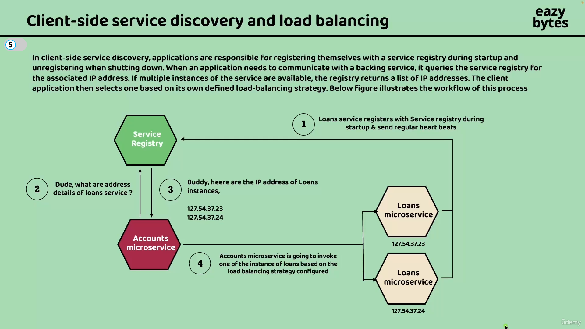

# Q-1 What are two essentials feature of Spring Core?

Essential features of Spring Core:

* IOC
* AOP

Other Features in Spring Core

* Resource management
* Internationalization (i18n)
* Type conversion
* Spring Expression Language (SpEL)

# Q-2 What is IOC?

Spring Core

* Spring Core is the foundation of the Spring Framework.
* It is built around the principle of Inversion of Control (IoC).

Inversion of Control (IoC)

* In IoC, the application does not control object creation or execution flow.
* Instead, the Spring Framework controls the application.
* The framework:
    * Creates objects (beans)
    * Manages their lifecycle
    * Injects dependencies
    * Intercepts method calls when required

> Control here means actions like creating instances and invoking methods.

## Without IoC

* The application:
    * Creates its own dependencies
    * Controls execution directly
    * Is tightly coupled to implementations

## With IoC

* The framework:
    * Creates and manages application objects
    * Controls execution based on configuration
    * Decouples components from each other

## IoC Container (Spring Context)

* The IoC container (Spring Context):
    * Holds and manages application objects (beans)
    * "Glues" application components to the Spring framework
    * Uses configuration to decide how objects behave and interact


# Q-3 What is Spring AOP?

## Spring AOP (part of Spring Core)

* Spring can intercept method executions of beans managed by the IoC container.
* This interception is called Aspect-Oriented Programming (AOP).
* Common use cases:
    * Logging
    * Error handling
    * Transactions
    * Security

# Q-4 What is context or application context in spring app?

Spring Context:
* The **Spring Context** is a core component of the Spring Framework.
* It is a **container in application memory** where Spring stores and manages objects.
* These objects are called **beans**.
* The **Spring context is the IoC container**.

There are actually two types of containers in Spring:

1\. The `BeanFactory` (The Heart)

This is the root interface. It provides the basic configuration mechanism and the core IoC functionality
(creating beans and injecting dependencies).
  * Role: It is the "Engine" of the framework.
  * Use Case: Almost never used directly by developers anymore 
(mostly used for mobile/embedded systems where memory is extremely limited).

2\. The ApplicationContext (The Complete Car)

This is a sub-interface of `BeanFactory`. It includes everything the `BeanFactory` does, plus enterprise-specific features.

  * Role: It is the "Engine" + "Dashboard" + "AC" + "GPS".
  * Use Case: This is what you use 99.9% of the time 
(e.g., `ClassPathXmlApplicationContext`, `AnnotationConfigApplicationContext` - these are the implementation).

## Why use `ApplicationContext` instead of just `BeanFactory`?

Since `ApplicationContext` extends `BeanFactory`, it can do everything the basic container does, plus these "Pro" features:

1. Event Publishing: It allows beans to talk to each other using the Observer pattern (`ApplicationEvents`).
2. Internationalization (i18n): It can read message bundles for multi-language support.
3. Environment Abstraction: It understands "Profiles" (Dev, Test, Prod) and properties files.
4. Automatic BeanPostProcessor Registration: This is crucial. It automatically 
detects annotations like `@Autowired` and `@Transactional`. If you used plain `BeanFactory`, 
you would have to manually register the processors that make those annotations work.

Here is how to create an `ApplicationContext`:

```java
// This object IS the IoC Container
ApplicationContext context = new AnnotationConfigApplicationContext(AppConfig.class);

// You ask the container for a bean
MyService service = context.getBean(MyService.class);
```

# Q-5 What are the different ways of adding a bean to the spring context?

There are four main ways to add a bean to the Spring context.

1\. Using Stereotype Annotations (`@Component`, `@Service`, etc.)

Spring automatically detects beans during component scanning.

```java
@Component
class Parrot {
}
```

📌 Requirement: Class must be in a package scanned by `@ComponentScan`

2\. Using `@Bean` Methods in a `@Configuration` Class

Beans are created explicitly using factory methods.

Example:

```java
@Configuration
class ProjectConfig {

    @Bean
    Parrot parrot() {
        return new Parrot("Blue");
    }
}
```

📌 Used when:
* You need full control over object creation
* You want to configure third-party classes
* Bean construction is complex

3\. Programmatic Registration (`registerBean()` / `registerSingleton()`)

Beans are **registered manually at runtime** using the Spring container API.

Example:

```java
AnnotationConfigApplicationContext context =
        new AnnotationConfigApplicationContext();

context.registerBean(Parrot.class, () -> new Parrot("Green"));
context.refresh();
```

📌 Characteristics:

* No annotations required
* Bean registered programmatically
* Useful for:
    * Dynamic beans
    * Frameworks
    * Conditional runtime registration
    * Tests

4\. Using XML Configuration (Legacy Approach)

Beans are defined in XML configuration files.

Example:

```xml
<bean id="parrot" class="org.example.Parrot"/>
```

📌 Mostly legacy; rarely used in modern Spring apps.

# Q-6 Can we define multiple beans of the same type?

Spring allows **multiple beans of the same type** to exist in the application context.

Example:

```java
@Configuration
class ProjectConfig {

    @Bean
    Parrot parrot1() {
        return new Parrot("Blue");
    }

    @Bean
    Parrot parrot2() {
        return new Parrot("Green");
    }
}
```

Here:

* Both beans are of type Parrot
* They have different bean names
* Both are registered in the context

## The real issue: Injection ambiguity

When Spring sees:

```java
@Autowired
Parrot parrot;
```

Spring fails with:

```text
NoUniqueBeanDefinitionException
```

Because, Spring doesn't know **which Parrot to inject**.

## How to resolve ambiguity

1\. Use `@Qualifier`

```java
@Autowired
@Qualifier("parrot1")
Parrot parrot;
```

* Most common
* Explicit and clear


2\. Use `@Primary`

```java
@Bean
@Primary
Parrot parrot1() {
    return new Parrot("Blue");
}
```

* Default choice
* Used when one bean is the "main" one

3\. Inject all beans as a collection

```java
@Autowired
List<Parrot> parrots;
```

Useful when processing all implementations

## Key rules to remember

* Multiple beans of the same type are allowed
* Each bean must have a unique name
* Injection by type becomes ambiguous
* Ambiguity must be resolved explicitly

# Q-7 What is Dependency Injection (DI) in spring?

* **Dependency Injection (DI)** is a technique where the framework provides required dependencies to a class
instead of the class creating them.
* In Spring, the framework **injects values or objects** into:
    * Constructors
    * Method parameters
    * Fields
* DI is a practical application of Inversion of Control (IoC).
* IoC means the framework controls execution and object wiring, not the application.

## Simple Example (Method Parameter Injection)

```java
@Configuration
class ProjectConfig {

    @Bean
    Parrot parrot() {
        return new Parrot("Blue");
    }

    @Bean
    Person person(Parrot parrot) {
        return new Person(parrot);
    }
}
```

## What happens here

* Spring creates the `Parrot` bean
* When calling `person()`, Spring:
  * Resolves the `Parrot` dependency
  * Injects it into the method parameter
* The `Person` object receives its dependency without creating it

# Q-8 What are the different Ways of Using @Autowired annotation

Spring can inject dependencies in three primary ways.

1. Constructor Injection (Recommended)
2. Field Injection
3. Setter Injection

## Constructor Injection (Recommended)

Dependencies are injected through the constructor.

```java
@Component
class Person {

    private final Parrot parrot;

    @Autowired
    public Person(Parrot parrot) {
        this.parrot = parrot;
    }
}
```

* ✔ Best practice
* ✔ Immutable dependencies
* ✔ Easy to test
* ✔ Works well with `final` fields

📌 Note: If there is only one constructor, @Autowired is optional (Spring 4.3+).

## Field Injection

Spring injects dependencies directly into fields.

```java
@Component
class Person {

    @Autowired
    private Parrot parrot;
}
```

* ✔ Short and simple
* ❌ Hard to test
* ❌ Breaks immutability
* ❌ Uses reflection

📌 Not recommended for production code

## Setter Injection

Spring injects dependencies through setter methods.

```java
@Component
class Person {

    private Parrot parrot;

    @Autowired
    public void setParrot(Parrot parrot) {
        this.parrot = parrot;
    }
}
```

* ✔ Useful for optional dependencies
* ✔ Allows re-injection
* ❌ Dependency can change after construction

## Special Cases of @Autowired

### Method Parameter Injection

```java
@Bean
Person person(@Autowired Parrot parrot) {
    return new Person(parrot);
}
```
* 📌 Mostly used in `@Configuration` classes
* 📌 `@Autowired` is optional here

### Collection Injection

Inject all beans of the same type.

```java
@Autowired
List<Parrot> parrots;
```

✔ Useful for strategies / plugins

## Controlling Autowiring Behavior

### Optional Dependency

```java
@Autowired(required = false)
private Parrot parrot;
```

### Using `@Qualifier`

```java
@Autowired
@Qualifier("parrot1")
Parrot parrot;
```

Resolves ambiguity when multiple beans exist.

# Q-3 What are Spring bean scopes?

# Q-4 What is RestControllerAdvice?
 
1. Docker vs Jar
1. Datasouce vs driver
1. Explain application architecture.
1. What are filters and interceptors?
1. How to use transactions across services
1. How to implement file download
1. Explain how you would implement spring security?
1. What is 2-phase commit?
1. What are different levels of logging?
1. What are Non functional requirements (NFR)?
1. What are design patterns in microservices?
1. Explain types of design patterns and when they are used
1. Explain the request flow in spring application

-----------------------------

### Q-When we define Controller, it gets converted to servlet or not?

Ans: No, spring Boot uses a dispatcher servlet to handle HTTP requests and delegate them to the appropriate controllers.

### Q-What is Dispatcher servlet?

Ans: 

-----------------------------

### Q- Mention the REST api principles

Ans: 


### Q- What Object Oriented Principles you used in the project.

Ans:

### Q-What is Data Source?

Ans: The data source is a component that manages connections to the database management
systems (DBMS). The data source uses the JDBC driver to get the connections it manages. The 
data source aims to improve the app’s performance by allowing its logic to reuse connections 
to the DBMS and request new connections only when it needs them. The data source also makes 
sure to close the connections when it releases them.

The data source manages the connections. It provides the app with connections when it’s 
requested and makes sure to create new connections only when it’s necessary.

Without an object taking the responsibility of a data source, the app would need to
request a new connection for each operation with the data. This approach is not realistic
in a production scenario because communicating through the network for establishing a new 
connection for each operation would dramatically slow down the application and cause 
performance issues. The data source makes sure your app only requests a new connection when 
it really needs it, improving the app’s performance.

A data source object can efficiently manage the connections to minimize the number
of unnecessary operations. Instead of using the JDBC driver manager directly, we use
a data source to retrieve and manage the connections.


HikariCP the default data source implementation.

### Q-What is JDBC Driver 

Ans: JDBC offers you a way to connect to a DBMS to work with a database. However, the JDK 
doesn’t provide a specific implementation for working with a particular technology (such as 
MySQL, Postgres, or Oracle). The JDK only gives you the abstractions for objects an app needs 
to work with a relational database. To gain the implementation of this abstraction and enable 
your app to connect to a certain DBMS technology, you add a runtime dependency named the JDBC 
driver (figure 12.3). Every technology vendor provides the JDBC driver you need to add to your 
app to enable it to connect to that specific technology. The JDBC driver is not something that 
comes either from the JDK or from a framework such as Spring.


### Q-What is Factory Pattern

Ans: 

### Q-How to configure multiple data sources

Ans:

-----------------------------

### Q-Why spring boot?

https://marcelclasses.udemy.com/course/hibernate-jpa-tutorial-for-beginners-in-100-steps/learn/lecture/32399796#questions

-----------------------------


### Q-What are different levels of logging (in order of less severe to more severe)?

1. TRACE: The least severe. Provides fine-grained informational events useful for debugging.
1. DEBUG: Provides detailed information for diagnosing problems.
1. INFO: Informational messages that highlight the progress of the application at a coarse-grained level.
1. WARN: Potentially harmful situations that are not necessarily errors but might need attention.
1. ERROR: Error events that might still allow the application to continue running.
1. FATAL: Very severe error events that will presumably lead the application to abort.

-----------------------------

### Q-What is AuditAware interface?

https://marcelclasses.udemy.com/course/master-microservices-with-spring-docker-kubernetes/learn/lecture/39943208#overview


-----------------------------


### Q-What are different ways to read configs in Spring Boot?

https://marcelclasses.udemy.com/course/master-microservices-with-spring-docker-kubernetes/learn/lecture/39944446#overview


-----------------------------

### Q-What are the various ways to activate spring profile?

```bash
# this method is called command line arguments
java -jar app.jar --spring.profiles.active=qa
```

or

```bash
# this method is called JVM system variables
java -Dspring.profiles.active=qa -jar target/userservice-0.0.1-SNAPSHOT.jar
```

or

```bash
# this method uses system environment variables
$ SPRING_PROFILES_ACTIVE=qa java -jar target/userservice-0.0.1-SNAPSHOT.jar
```
-----------------------------

### Q-What is the order in which the configs are processed?

1. Spring Boot uses a very particular order that is designed to allow sensible overriding of 
values. Properties are considered in the following order (with values from lower items overriding earlier ones):

* Properties present inside files like application.properties
* OS Environmental variables
* Java System properties (System.getProperties()) (JVM options)
* JNDI attributes from java:comp/env
* ServletContext init parameters
* ServletConfig init parameters
* Command line arguments

-----------------------------

### Q-How to encrypt values using spring config server?

https://marcelclasses.udemy.com/course/master-microservices-with-spring-docker-kubernetes/learn/lecture/39944642#overview

-----------------------------

### Q-Using config server how to get updated value of config without restarting microservice?

https://marcelclasses.udemy.com/course/master-microservices-with-spring-docker-kubernetes/learn/lecture/39944644#overview

-----------------------------

### Q-Refreshing configs using message bus

https://marcelclasses.udemy.com/course/master-microservices-with-spring-docker-kubernetes/learn/lecture/39944646#overview


### Q-Auto refresh config using webhooks

https://marcelclasses.udemy.com/course/master-microservices-with-spring-docker-kubernetes/learn/lecture/39944648#overview


-----------------------------

### Q-How client side load balancing works?



https://marcelclasses.udemy.com/course/master-microservices-with-spring-docker-kubernetes/learn/lecture/39944754#overview

-----------------------------


### Q-Eureka Self-preservation mode

https://marcelclasses.udemy.com/course/master-microservices-with-spring-docker-kubernetes/learn/lecture/39944828#overview


-----------------------------