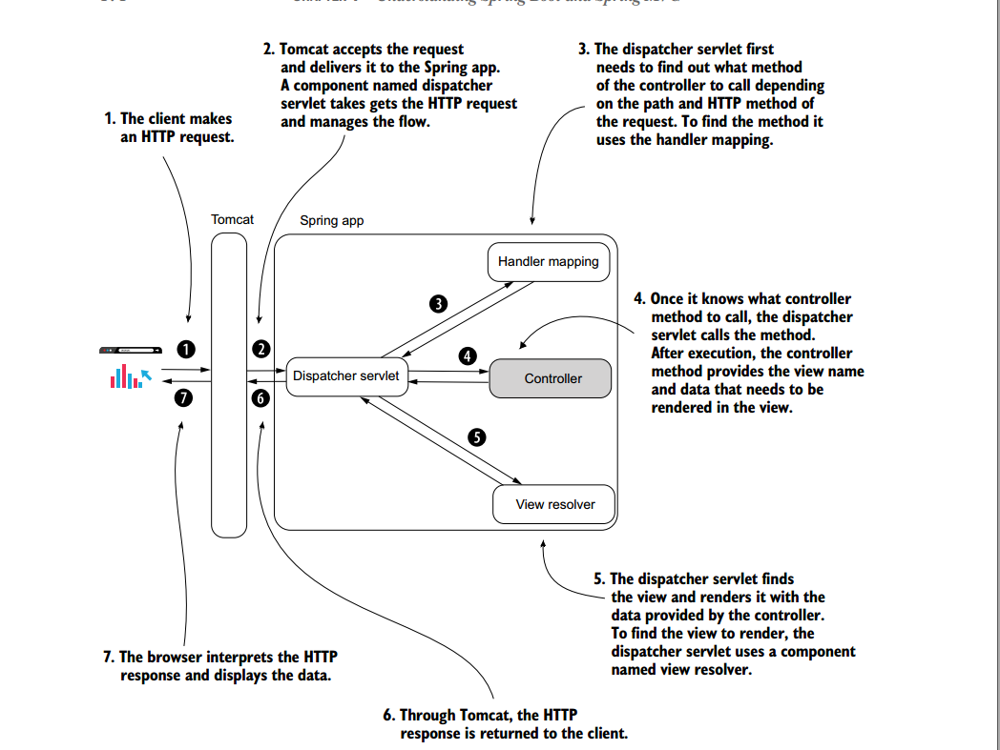
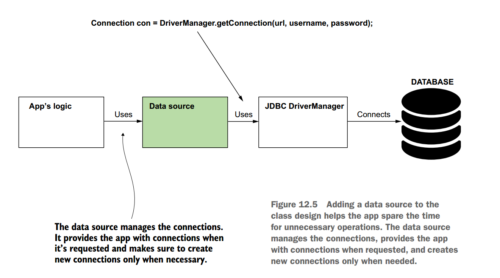

<!-- TOC -->
* [Q-1 What are two essentials feature of Spring Core?](#q-1-what-are-two-essentials-feature-of-spring-core)
* [Q-2 What is IOC?](#q-2-what-is-ioc)
  * [Without IoC](#without-ioc)
  * [With IoC](#with-ioc)
  * [IoC Container (Spring Context)](#ioc-container-spring-context)
* [Q-3 What is Spring AOP?](#q-3-what-is-spring-aop)
  * [Spring AOP (part of Spring Core)](#spring-aop-part-of-spring-core)
* [Q-4 What is context or application context in spring app?](#q-4-what-is-context-or-application-context-in-spring-app)
  * [1. The `BeanFactory` (The Heart)](#1-the-beanfactory-the-heart)
  * [2. The ApplicationContext (The Complete Car)](#2-the-applicationcontext-the-complete-car)
  * [Why use `ApplicationContext` instead of just `BeanFactory`?](#why-use-applicationcontext-instead-of-just-beanfactory)
* [Q-5 What are the different ways of adding a bean to the spring context?](#q-5-what-are-the-different-ways-of-adding-a-bean-to-the-spring-context)
  * [1. Using Stereotype Annotations (`@Component`, `@Service`, etc.)](#1-using-stereotype-annotations-component-service-etc)
  * [2. Using `@Bean` Methods in a `@Configuration` Class](#2-using-bean-methods-in-a-configuration-class)
  * [3. Programmatic Registration (`registerBean()` / `registerSingleton()`)](#3-programmatic-registration-registerbean--registersingleton)
  * [4. Using XML Configuration (Legacy Approach)](#4-using-xml-configuration-legacy-approach)
* [Q-6 Can we define multiple beans of the same type?](#q-6-can-we-define-multiple-beans-of-the-same-type)
  * [The real issue: Injection ambiguity](#the-real-issue-injection-ambiguity)
  * [How to resolve ambiguity](#how-to-resolve-ambiguity)
    * [1. Use `@Qualifier`](#1-use-qualifier)
    * [2. Use `@Primary`](#2-use-primary)
    * [3. Inject all beans as a collection](#3-inject-all-beans-as-a-collection)
  * [Key rules to remember](#key-rules-to-remember)
* [Q-7 What is Dependency Injection (DI) in spring?](#q-7-what-is-dependency-injection-di-in-spring)
  * [Simple Example (Method Parameter Injection)](#simple-example-method-parameter-injection)
  * [What happens here](#what-happens-here)
* [Q-8 What are the different Ways of Using @Autowired annotation](#q-8-what-are-the-different-ways-of-using-autowired-annotation)
  * [Constructor Injection (Recommended)](#constructor-injection-recommended)
  * [Field Injection](#field-injection)
  * [Setter Injection](#setter-injection)
  * [Special Cases of @Autowired](#special-cases-of-autowired)
    * [Method Parameter Injection](#method-parameter-injection)
    * [Collection Injection](#collection-injection)
  * [Controlling Autowiring Behavior](#controlling-autowiring-behavior)
    * [Optional Dependency](#optional-dependency)
    * [Using `@Qualifier`](#using-qualifier)
* [Q-9 How to use abstractions with the Spring Context?](#q-9-how-to-use-abstractions-with-the-spring-context)
  * [Introducing the Abstraction](#introducing-the-abstraction)
  * [Concrete Implementations](#concrete-implementations)
  * [Case 1 – Using a Single Implementation](#case-1--using-a-single-implementation)
  * [Case 2 – Multiple Implementations, One Selected by Spring](#case-2--multiple-implementations-one-selected-by-spring)
    * [Using `@Qualifier`](#using-qualifier-1)
  * [Case 3 – Using Multiple Implementations at the Same Time](#case-3--using-multiple-implementations-at-the-same-time)
  * [Case 4 – Selecting an Implementation at Runtime](#case-4--selecting-an-implementation-at-runtime)
* [Q-10 How is a singleton in Spring different from a singleton in core Java?](#q-10-how-is-a-singleton-in-spring-different-from-a-singleton-in-core-java)
  * [Why Spring does this](#why-spring-does-this)
* [Q-11 Why should singleton beans in Spring be immutable?](#q-11-why-should-singleton-beans-in-spring-be-immutable)
  * [Why mutable singleton beans are dangerous](#why-mutable-singleton-beans-are-dangerous)
  * [Immutable singleton beans are safe](#immutable-singleton-beans-are-safe)
* [Q-12 What are lazy and eager bean initialization?](#q-12-what-are-lazy-and-eager-bean-initialization)
  * [Eager Loading (The Default)](#eager-loading-the-default)
  * [Lazy Loading](#lazy-loading)
* [Q-13 What are the different bean scopes in Spring?](#q-13-what-are-the-different-bean-scopes-in-spring)
  * [Singleton (Default)](#singleton-default)
  * [Prototype](#prototype)
  * [Important Spring Design Nuance (Frequently Asked in Interviews)](#important-spring-design-nuance-frequently-asked-in-interviews)
  * [Correct Solutions](#correct-solutions)
    * [1. Use ObjectProvider (Recommended)](#1-use-objectprovider-recommended)
    * [2. Inject `ApplicationContext`](#2-inject-applicationcontext)
* [Q-14 What is Spring Boot? Why did you use Spring Boot in your project not Spring?](#q-14-what-is-spring-boot-why-did-you-use-spring-boot-in-your-project-not-spring)
  * [Why I used Spring Boot in my project](#why-i-used-spring-boot-in-my-project)
* [Q-15 What the purpose of @Configuration annotation in Spring boot?](#q-15-what-the-purpose-of-configuration-annotation-in-spring-boot)
  * [Key interview points (important nuance included):](#key-interview-points-important-nuance-included)
  * [The Senior Follow-Up: `proxyBeanMethods = false`](#the-senior-follow-up-proxybeanmethods--false)
* [Q-16 What does the @SpringBootApplicaton annotation does?](#q-16-what-does-the-springbootapplicaton-annotation-does)
  * [1. @Configuration](#1-configuration)
  * [2. @EnableAutoConfiguration (The Magic)](#2-enableautoconfiguration-the-magic)
  * [3. @ComponentScan](#3-componentscan)
  * [Code Equivalence](#code-equivalence)
  * [Senior Engineer Nuance](#senior-engineer-nuance)
* [Q-17 How to disable specific configuration class?](#q-17-how-to-disable-specific-configuration-class)
  * [1. Using the Annotation (Compile Time)](#1-using-the-annotation-compile-time)
  * [2. Using Properties File (Runtime)](#2-using-properties-file-runtime)
  * [@ConditionalOnProperty and @Profile](#conditionalonproperty-and-profile)
  * [1. Using @Profile (Environment-Based Control)](#1-using-profile-environment-based-control)
  * [2. Using @ConditionalOnProperty (Feature Flag Control)](#2-using-conditionalonproperty-feature-flag-control)
* [Q-18 Can we replace Embedded Tomcat server in Spring boot?](#q-18-can-we-replace-embedded-tomcat-server-in-spring-boot)
  * [1. The Supported Alternatives](#1-the-supported-alternatives)
  * [2. How to do it (Maven)](#2-how-to-do-it-maven)
* [Q-19 What is RestController and how it's related to @Controller?](#q-19-what-is-restcontroller-and-how-its-related-to-controller)
  * [The Relationship (The Formula)](#the-relationship-the-formula)
  * [1. @Controller (The Traditional Way)](#1-controller-the-traditional-way)
  * [2. @ResponseBody](#2-responsebody)
  * [3. @RestController (The Modern Way)](#3-restcontroller-the-modern-way)
* [Q-20 What's the difference between @RequestMapping and @GetMapping?](#q-20-whats-the-difference-between-requestmapping-and-getmapping)
  * [@RequestMapping](#requestmapping)
  * [@GetMapping](#getmapping)
  * [Relationship between them](#relationship-between-them)
  * [Key differences (interview table)](#key-differences-interview-table)
  * [When to use which?](#when-to-use-which)
* [Q-21 What's Profile in Spring boot?](#q-21-whats-profile-in-spring-boot)
  * [Why do we need Profiles?](#why-do-we-need-profiles)
  * [How Profiles work](#how-profiles-work)
    * [1. Activating a profile](#1-activating-a-profile)
  * [2. Profile-specific configuration files](#2-profile-specific-configuration-files)
* [Q-22 How do you read configuration values in a Spring Boot application?](#q-22-how-do-you-read-configuration-values-in-a-spring-boot-application)
  * [1. Using @Value (Simple, small use cases)](#1-using-value-simple-small-use-cases)
  * [2. Using Environment (Dynamic / conditional access)](#2-using-environment-dynamic--conditional-access)
  * [3. Using @ConfigurationProperties (RECOMMENDED)](#3-using-configurationproperties-recommended)
* [Q-23 What is RestControllerAdvice?](#q-23-what-is-restcontrolleradvice)
  * [Why it exists (the problem it solves)](#why-it-exists-the-problem-it-solves)
  * [What you typically use it for](#what-you-typically-use-it-for)
  * [Typical usage pattern](#typical-usage-pattern)
  * [Difference between related annotations](#difference-between-related-annotations)
* [Q-24 What is Spring Actuator?](#q-24-what-is-spring-actuator)
  * [Why Spring Actuator exists (the problem it solves)](#why-spring-actuator-exists-the-problem-it-solves)
  * [What Spring Actuator provides](#what-spring-actuator-provides)
  * [How you enable Spring Actuator](#how-you-enable-spring-actuator)
* [Q-25 How to change Actuator port?](#q-25-how-to-change-actuator-port)
* [Q-26 How to expose / hide Actuator endpoints?](#q-26-how-to-expose--hide-actuator-endpoints)
* [Q-27 How to create a custom Actuator endpoint?](#q-27-how-to-create-a-custom-actuator-endpoint)
  * [Custom endpoint using @Endpoint](#custom-endpoint-using-endpoint)
  * [Supported operations](#supported-operations)
* [Q-28 What is spring-boot-maven-plugin?](#q-28-what-is-spring-boot-maven-plugin)
  * [1. The Problem: Standard Maven Builds](#1-the-problem-standard-maven-builds)
  * [2. The Solution: The "Fat JAR"](#2-the-solution-the-fat-jar)
  * [3. Key Goals (Interview Checklist)](#3-key-goals-interview-checklist)
* [Q-29 What are the advantages of yaml over properties file?](#q-29-what-are-the-advantages-of-yaml-over-properties-file)
  * [Key advantages of YAML over .properties](#key-advantages-of-yaml-over-properties)
    * [1. Hierarchical and structured configuration (biggest advantage)](#1-hierarchical-and-structured-configuration-biggest-advantage)
    * [2. Better readability for large configs](#2-better-readability-for-large-configs)
    * [3. Native support for lists](#3-native-support-for-lists)
    * [5. Reduced duplication and better maintainability](#5-reduced-duplication-and-better-maintainability)
    * [6. Strong fit with @ConfigurationProperties](#6-strong-fit-with-configurationproperties)
  * [Disadvantages of YAML (important to mention)](#disadvantages-of-yaml-important-to-mention)
* [Q-30 What's the difference between liveness and readiness?](#q-30-whats-the-difference-between-liveness-and-readiness)
  * [Liveness Probe — "Should this app be restarted?"](#liveness-probe--should-this-app-be-restarted)
  * [Readiness Probe — "Can this app receive traffic?"](#readiness-probe--can-this-app-receive-traffic)
  * [Side-by-side comparison](#side-by-side-comparison)
* [Q-31 What are Servlets? What is a Web (Servlet) Container, and why is it needed? What problems did developers face with Servlets that led to frameworks like Spring MVC?](#q-31-what-are-servlets-what-is-a-web-servlet-container-and-why-is-it-needed-what-problems-did-developers-face-with-servlets-that-led-to-frameworks-like-spring-mvc)
  * [1. What are Servlets?](#1-what-are-servlets)
  * [2️. What is a Web / Servlet Container?](#2-what-is-a-web--servlet-container)
    * [Responsibilities of a Servlet Container](#responsibilities-of-a-servlet-container)
    * [WSGI analogy (important and correct)](#wsgi-analogy-important-and-correct)
  * [3. What was the problem with Servlets?](#3-what-was-the-problem-with-servlets)
  * [Key problems with Servlets](#key-problems-with-servlets)
    * [1. Excessive boilerplate](#1-excessive-boilerplate)
    * [2. Tight coupling to HTTP](#2-tight-coupling-to-http)
    * [3. Poor separation of concerns](#3-poor-separation-of-concerns)
    * [4. No built-in MVC abstraction](#4-no-built-in-mvc-abstraction)
    * [5. Weak support for cross-cutting concerns](#5-weak-support-for-cross-cutting-concerns)
* [Q-32 When we define Controller, it gets converted to servlet or not?](#q-32-when-we-define-controller-it-gets-converted-to-servlet-or-not)
* [Q-33 Explain Filter and Interceptor. How do they differ?](#q-33-explain-filter-and-interceptor-how-do-they-differ)
  * [1. What is a Filter?](#1-what-is-a-filter)
    * [Key characteristics](#key-characteristics)
    * [Typical use cases](#typical-use-cases)
  * [2. What is an Interceptor?](#2-what-is-an-interceptor)
    * [Key characteristics](#key-characteristics-1)
    * [Lifecycle hooks](#lifecycle-hooks)
    * [Typical use cases](#typical-use-cases-1)
  * [3. Execution order (critical)](#3-execution-order-critical)
* [Q-34 Why can a Servlet Filter execute more than once for a single HTTP request? Explain the underlying mechanism and give concrete examples?](#q-34-why-can-a-servlet-filter-execute-more-than-once-for-a-single-http-request-explain-the-underlying-mechanism-and-give-concrete-examples)
  * [1. Very Basics — What does “execute once” even mean?](#1-very-basics--what-does-execute-once-even-mean)
  * [2. What is a dispatch?](#2-what-is-a-dispatch)
  * [3. Core Rule (must be memorized)](#3-core-rule-must-be-memorized)
  * [4. Case 1 — ERROR dispatch (most common in Spring Boot)](#4-case-1--error-dispatch-most-common-in-spring-boot)
  * [5. Case 2 — FORWARD dispatch (server-side routing)](#5-case-2--forward-dispatch-server-side-routing)
  * [6. Case 3 — ASYNC dispatch (modern Spring MVC)](#6-case-3--async-dispatch-modern-spring-mvc)
  * [7. Case 4 — INCLUDE dispatch (legacy but valid)](#7-case-4--include-dispatch-legacy-but-valid)
  * [8. Why this does NOT always happen in Spring Boot](#8-why-this-does-not-always-happen-in-spring-boot)
  * [9. How double execution actually happens in real projects](#9-how-double-execution-actually-happens-in-real-projects)
  * [10. How OncePerRequestFilter fits in](#10-how-onceperrequestfilter-fits-in)
  * [11. Special case — Spring Security (important gotcha)](#11-special-case--spring-security-important-gotcha)
  * [12. Summary Table (Interview Gold)](#12-summary-table-interview-gold)
* [Q-35 What is an idempotent API? Which HTTP methods are idempotent, and why does idempotency matter in RESTful systems](#q-35-what-is-an-idempotent-api-which-http-methods-are-idempotent-and-why-does-idempotency-matter-in-restful-systems)
  * [1. What does idempotent mean? (Very basics)](#1-what-does-idempotent-mean-very-basics)
  * [2. Why idempotency matters](#2-why-idempotency-matters)
  * [3. Idempotent ≠ Safe (important distinction)](#3-idempotent--safe-important-distinction)
  * [4. HTTP Methods — Idempotency Overview](#4-http-methods--idempotency-overview)
  * [5. Method-by-method explanation](#5-method-by-method-explanation)
    * [GET – Idempotent](#get--idempotent)
    * [PUT – Idempotent](#put--idempotent)
    * [DELETE – Idempotent](#delete--idempotent)
    * [POST – Not idempotent](#post--not-idempotent)
    * [PATCH – Conditionally idempotent](#patch--conditionally-idempotent)
* [Q-36 If multiple Servlet Filters are registered in a Spring Boot application, how is their execution order determined, and how can we explicitly control that order?](#q-36-if-multiple-servlet-filters-are-registered-in-a-spring-boot-application-how-is-their-execution-order-determined-and-how-can-we-explicitly-control-that-order)
  * [How Spring Boot decides filter order (important)](#how-spring-boot-decides-filter-order-important)
  * [How to explicitly control the order (BEST PRACTICE)](#how-to-explicitly-control-the-order-best-practice)
    * [Option 1: Use @Order (simple & common)](#option-1-use-order-simple--common)
    * [Option 2: Use FilterRegistrationBean (most control)](#option-2-use-filterregistrationbean-most-control)
  * [Important interview clarification](#important-interview-clarification)
* [Q-37 How can we make a Servlet Filter execute only for certain endpoints in a Spring Boot application?](#q-37-how-can-we-make-a-servlet-filter-execute-only-for-certain-endpoints-in-a-spring-boot-application)
  * [Option 1 - Use FilterRegistrationBean with URL patterns (BEST & CLEANEST)](#option-1---use-filterregistrationbean-with-url-patterns-best--cleanest)
  * [URL pattern rules (Servlet spec)](#url-pattern-rules-servlet-spec)
  * [Option 2 - Use OncePerRequestFilter.shouldNotFilter() (Spring-style)](#option-2---use-onceperrequestfiltershouldnotfilter-spring-style)
  * [Option 3 - Manual if check inside doFilter (NOT recommended)](#option-3---manual-if-check-inside-dofilter-not-recommended)
  * [Option 4 - Use Interceptor instead (important distinction)](#option-4---use-interceptor-instead-important-distinction)
  * [Execution flow (important)](#execution-flow-important)
* [Q-38 How does transaction management work in Spring? Explain the role of @Transactional, proxies, and what happens at runtime.](#q-38-how-does-transaction-management-work-in-spring-explain-the-role-of-transactional-proxies-and-what-happens-at-runtime)
  * [1. What is a transaction? (Very basics)](#1-what-is-a-transaction-very-basics)
  * [2. How Spring manages transactions (big picture)](#2-how-spring-manages-transactions-big-picture)
  * [3. What happens at runtime (step-by-step)](#3-what-happens-at-runtime-step-by-step)
  * [4. Key components involved](#4-key-components-involved)
    * [1. @Transactional](#1-transactional)
    * [2. Transaction Proxy (AOP)](#2-transaction-proxy-aop)
    * [3. PlatformTransactionManager](#3-platformtransactionmanager)
  * [5. Rollback rules (very important)](#5-rollback-rules-very-important)
* [Q-39 What is Transaction Propagation?](#q-39-what-is-transaction-propagation)
  * [Why propagation exists (intuition)](#why-propagation-exists-intuition)
  * [1. REQUIRED (Default)](#1-required-default)
  * [2. REQUIRES_NEW](#2-requires_new)
    * [Now let’s execute this step by step](#now-lets-execute-this-step-by-step)
    * [Key observation (this is the point)](#key-observation-this-is-the-point)
    * [One concrete, neutral example (no notifications)](#one-concrete-neutral-example-no-notifications)
  * [3. NESTED](#3-nested)
    * [Important prerequisite (must know)](#important-prerequisite-must-know)
    * [Simple code example](#simple-code-example)
    * [Step-by-step execution (very literal)](#step-by-step-execution-very-literal)
    * [Key observation (this is the core)](#key-observation-this-is-the-core)
  * [4. SUPPORTS](#4-supports)
    * [Case 1. SUPPORTS is called inside a transaction](#case-1-supports-is-called-inside-a-transaction)
    * [Case 2. SUPPORTS is called without a transaction](#case-2-supports-is-called-without-a-transaction)
    * [Key observation (important)](#key-observation-important)
  * [5. NOT_SUPPORTED](#5-not_supported)
    * [Simple code example](#simple-code-example-1)
    * [Step-by-step execution](#step-by-step-execution)
    * [Key observation (this is the core)](#key-observation-this-is-the-core-1)
  * [6. MANDATORY](#6-mandatory)
    * [Case 1. MANDATORY is called inside a transaction](#case-1-mandatory-is-called-inside-a-transaction)
    * [Case 2. MANDATORY is called without a transaction](#case-2-mandatory-is-called-without-a-transaction)
    * [Key observation (this is the point)](#key-observation-this-is-the-point-1)
  * [7. NEVER](#7-never)
    * [Case 1 - NEVER is called without a transaction](#case-1---never-is-called-without-a-transaction)
    * [Case 2 - NEVER is called inside a transaction](#case-2---never-is-called-inside-a-transaction)
    * [Key observation (this is the core)](#key-observation-this-is-the-core-2)
* [Q-40 What is the @Async annotation in Spring? How does it work internally, and when should we use it?](#q-40-what-is-the-async-annotation-in-spring-how-does-it-work-internally-and-when-should-we-use-it)
  * [What problem does it solve?](#what-problem-does-it-solve)
  * [How it works internally (step by step)](#how-it-works-internally-step-by-step)
  * [Basic usage](#basic-usage)
  * [Return types supported by @Async](#return-types-supported-by-async)
  * [Thread pool behavior (very important)](#thread-pool-behavior-very-important)
  * [Exception handling in @Async](#exception-handling-in-async)
  * [Common gotchas (interview favorites)](#common-gotchas-interview-favorites)
  * [When should you use @Async?](#when-should-you-use-async)
* [Q-41 What is Data Source?](#q-41-what-is-data-source)
* [Q-42 What is JDBC Driver](#q-42-what-is-jdbc-driver-)
* [Q-43 How to configure multiple data sources in Spring Boot?](#q-43-how-to-configure-multiple-data-sources-in-spring-boot)
  * [1. Why do we need multiple data sources?](#1-why-do-we-need-multiple-data-sources)
  * [2. Core concepts involved (must know)](#2-core-concepts-involved-must-know)
  * [3. High-level steps (interview checklist)](#3-high-level-steps-interview-checklist)
  * [4. Step 1: Define properties (application.yml)](#4-step-1-define-properties-applicationyml)
  * [5. Step 2: Create DataSource beans](#5-step-2-create-datasource-beans)
  * [6. Step 3: Configure EntityManagerFactory (JPA)](#6-step-3-configure-entitymanagerfactory-jpa)
  * [7. How Spring knows which DB to use](#7-how-spring-knows-which-db-to-use)
* [Q-44 What are different levels of logging (in order of less severe to more severe)?](#q-44-what-are-different-levels-of-logging-in-order-of-less-severe-to-more-severe)
* [Q-45 What are the various ways to activate spring profile?](#q-45-what-are-the-various-ways-to-activate-spring-profile)
* [Q-46 What is the order in which Spring Boot configuration is processed?](#q-46-what-is-the-order-in-which-spring-boot-configuration-is-processed)
  * [1. Command-line arguments](#1-command-line-arguments)
  * [2. JVM system properties](#2-jvm-system-properties)
  * [3. OS environment variables](#3-os-environment-variables)
  * [4. `application.properties` / `application.yml` (external)](#4-applicationproperties--applicationyml-external)
  * [5. Profile-specific config files](#5-profile-specific-config-files)
  * [6. @TestPropertySource (tests only)](#6-testpropertysource-tests-only)
  * [7. @PropertySource](#7-propertysource)
  * [8. Default properties](#8-default-properties)
  * [Final precedence list (clean)](#final-precedence-list-clean)
<!-- TOC -->

# Q-1 What are two essentials feature of Spring Core?

Essential features of Spring Core:

* IOC
* AOP

Other Features in Spring Core

* Resource management
* Internationalization (i18n)
* Type conversion
* Spring Expression Language (SpEL)


# Q-2 What is IOC?

Spring Core

* Spring Core is the foundation of the Spring Framework.
* It is built around the principle of Inversion of Control (IoC).

Inversion of Control (IoC)

* In IoC, the application does not control object creation or execution flow.
* Instead, the Spring Framework controls the application.
* The framework:
    * Creates objects (beans)
    * Manages their lifecycle
    * Injects dependencies
    * Intercepts method calls when required

> Control here means actions like creating instances and invoking methods.

## Without IoC

* The application:
    * Creates its own dependencies
    * Controls execution directly
    * Is tightly coupled to implementations

## With IoC

* The framework:
    * Creates and manages application objects
    * Controls execution based on configuration
    * Decouples components from each other

## IoC Container (Spring Context)

* The IoC container (Spring Context):
    * Holds and manages application objects (beans)
    * "Glues" application components to the Spring framework
    * Uses configuration to decide how objects behave and interact


# Q-3 What is Spring AOP?

## Spring AOP (part of Spring Core)

* Spring can intercept method executions of beans managed by the IoC container.
* This interception is called Aspect-Oriented Programming (AOP).
* Common use cases:
    * Logging
    * Error handling
    * Transactions
    * Security


# Q-4 What is context or application context in spring app?

Spring Context:
* The **Spring Context** is a core component of the Spring Framework.
* It is a **container in application memory** where Spring stores and manages objects.
* These objects are called **beans**.
* The **Spring context is the IoC container**.

There are actually two types of containers in Spring:

## 1. The `BeanFactory` (The Heart)

This is the root interface. It provides the basic configuration mechanism and the core IoC functionality
(creating beans and injecting dependencies).
  * Role: It is the "Engine" of the framework.
  * Use Case: Almost never used directly by developers anymore 
(mostly used for mobile/embedded systems where memory is extremely limited).

## 2. The ApplicationContext (The Complete Car)

This is a sub-interface of `BeanFactory`. It includes everything the `BeanFactory` does, plus 
enterprise-specific features.

  * Role: It is the "Engine" + "Dashboard" + "AC" + "GPS".
  * Use Case: This is what you use 99.9% of the time 
(e.g., `ClassPathXmlApplicationContext`, `AnnotationConfigApplicationContext` - these are the implementation).

## Why use `ApplicationContext` instead of just `BeanFactory`?

Since `ApplicationContext` extends `BeanFactory`, it can do everything the basic container does, plus 
these "Pro" features:

1. **Event Publishing:** It allows beans to talk to each other using the Observer pattern (`ApplicationEvents`).
2. **Internationalization (i18n):** It can read message bundles for multi-language support.
3. **Environment Abstraction:** It understands "Profiles" (Dev, Test, Prod) and properties files.
4. **Automatic BeanPostProcessor Registration:** This is crucial. It automatically 
detects annotations like `@Autowired` and `@Transactional`. If you used plain `BeanFactory`, 
you would have to manually register the processors that make those annotations work.

Here is how to create an `ApplicationContext`:

```java
// This object IS the IoC Container
ApplicationContext context = new AnnotationConfigApplicationContext(AppConfig.class);

// You ask the container for a bean
MyService service = context.getBean(MyService.class);
```


# Q-5 What are the different ways of adding a bean to the spring context?

There are four main ways to add a bean to the Spring context.

## 1. Using Stereotype Annotations (`@Component`, `@Service`, etc.)

Spring automatically detects beans during component scanning.

```java
@Component
class Parrot {
}
```

📌 Requirement: Class must be in a package scanned by `@ComponentScan`

## 2. Using `@Bean` Methods in a `@Configuration` Class

Beans are created explicitly using factory methods.

Example:

```java
@Configuration
class ProjectConfig {

    @Bean
    Parrot parrot() {
        return new Parrot("Blue");
    }
}
```

📌 Used when:
* You need full control over object creation
* You want to configure third-party classes
* Bean construction is complex

## 3. Programmatic Registration (`registerBean()` / `registerSingleton()`)

Beans are **registered manually at runtime** using the Spring container API.

Example:

```java
AnnotationConfigApplicationContext context =
        new AnnotationConfigApplicationContext();

context.registerBean(Parrot.class, () -> new Parrot("Green"));
context.refresh();
```

📌 Characteristics:

* No annotations required
* Bean registered programmatically
* Useful for:
    * Dynamic beans
    * Frameworks
    * Conditional runtime registration
    * Tests

## 4. Using XML Configuration (Legacy Approach)

Beans are defined in XML configuration files.

Example:

```xml
<bean id="parrot" class="org.example.Parrot"/>
```

📌 Mostly legacy; rarely used in modern Spring apps.


# Q-6 Can we define multiple beans of the same type?

Yes, Spring allows **multiple beans of the same type** to exist in the application context.

Example:

```java
@Configuration
class ProjectConfig {

    @Bean
    Parrot parrot1() {
        return new Parrot("Blue");
    }

    @Bean
    Parrot parrot2() {
        return new Parrot("Green");
    }
}
```

Here:

* Both beans are of type `Parrot`
* They have different bean names
* Both are registered in the context

## The real issue: Injection ambiguity

When Spring sees:

```java
@Autowired
Parrot parrot;
```

Spring fails with:

```text
NoUniqueBeanDefinitionException
```

Because, Spring doesn't know **which Parrot to inject**.

## How to resolve ambiguity

### 1. Use `@Qualifier`

```java
@Autowired
@Qualifier("parrot1")
Parrot parrot;
```

* Most common
* Explicit and clear


### 2. Use `@Primary`

```java
@Bean
@Primary
Parrot parrot1() {
    return new Parrot("Blue");
}
```

* Default choice
* Used when one bean is the "main" one

### 3. Inject all beans as a collection

```java
@Autowired
List<Parrot> parrots;
```

Useful when processing all implementations

## Key rules to remember

* Multiple beans of the same type are allowed
* Each bean must have a unique name
* Injection by type becomes ambiguous
* Ambiguity must be resolved explicitly


# Q-7 What is Dependency Injection (DI) in spring?

* **Dependency Injection (DI)** is a technique where the framework provides required dependencies to a class
instead of the class creating them.
* In Spring, the framework **injects values or objects** into:
    * Constructors
    * Method parameters
    * Fields
* DI is a practical application of Inversion of Control (IoC).
* IoC means the framework controls execution and object wiring, not the application.

## Simple Example (Method Parameter Injection)

```java
@Configuration
class ProjectConfig {

    @Bean
    Parrot parrot() {
        return new Parrot("Blue");
    }

    @Bean
    Person person(Parrot parrot) {
        return new Person(parrot);
    }
}
```

## What happens here

* Spring creates the `Parrot` bean
* When calling `person()`, Spring:
  * Resolves the `Parrot` dependency
  * Injects it into the method parameter
* The `Person` object receives its dependency without creating it


# Q-8 What are the different Ways of Using @Autowired annotation

Spring can inject dependencies in three primary ways.

1. Constructor Injection (Recommended)
2. Field Injection
3. Setter Injection

## Constructor Injection (Recommended)

Dependencies are injected through the constructor.

```java
@Component
class Person {

    private final Parrot parrot;

    @Autowired
    public Person(Parrot parrot) {
        this.parrot = parrot;
    }
}
```

* ✔ Best practice
* ✔ Immutable dependencies
* ✔ Easy to test
* ✔ Works well with `final` fields

📌 Note: If there is only one constructor, `@Autowired` is optional (Spring 4.3+).

## Field Injection

Spring injects dependencies directly into fields.

```java
@Component
class Person {

    @Autowired
    private Parrot parrot;
}
```

* ✔ Short and simple
* ❌ Hard to test
* ❌ Breaks immutability
* ❌ Uses reflection

📌 Not recommended for production code

## Setter Injection

Spring injects dependencies through setter methods.

```java
@Component
class Person {

    private Parrot parrot;

    @Autowired
    public void setParrot(Parrot parrot) {
        this.parrot = parrot;
    }
}
```

* ✔ Useful for optional dependencies
* ✔ Allows re-injection
* ❌ Dependency can change after construction

## Special Cases of @Autowired

### Method Parameter Injection

```java
@Bean
Person person(@Autowired Parrot parrot) {
    return new Person(parrot);
}
```
* 📌 Mostly used in `@Configuration` classes
* 📌 `@Autowired` is optional here

### Collection Injection

Inject all beans of the same type.

```java
@Autowired
List<Parrot> parrots;
```

✔ Useful for strategies / plugins

## Controlling Autowiring Behavior

### Optional Dependency

```java
@Autowired(required = false)
private Parrot parrot;
```

### Using `@Qualifier`

```java
@Autowired
@Qualifier("parrot1")
Parrot parrot;
```

Resolves ambiguity when multiple beans exist.


# Q-9 How to use abstractions with the Spring Context?

This example demonstrates how Spring encourages programming to abstractions (interfaces) 
rather than concrete implementations.

## Introducing the Abstraction

We start with an interface that defines what the application needs to do, not how.

```java
public interface FileTransfer {
    void upload();
}
```

This interface represents the capability of uploading a file, without tying the application 
to any specific cloud provider.

## Concrete Implementations

Now we provide different implementations of the same abstraction.

```java
@Component
public class AWSFileTransfer implements FileTransfer {
    @Override
    public void upload() {
        System.out.println("File uploaded to AWS");
    }
}

@Component
public class GCPFileTransfer implements FileTransfer {
    @Override
    public void upload() {
        System.out.println("File uploaded to GCP");
    }
}
```

Spring detects both classes during component scanning and registers two beans of type `FileTransfer`.

## Case 1 – Using a Single Implementation

If there is only one implementation, Spring can inject it directly.

```java
@Component
public class Person {

    private final FileTransfer fileTransfer;

    public Person(FileTransfer fileTransfer) {
        this.fileTransfer = fileTransfer;
    }

    public void upload() {
        fileTransfer.upload();
    }
}
```

📌 This works only when exactly one bean of type `FileTransfer` exists.

## Case 2 – Multiple Implementations, One Selected by Spring

When multiple implementations exist, Spring needs help choosing one.

### Using `@Qualifier`

```java
@Component
@Qualifier("aws")
public class AWSFileTransfer implements FileTransfer { }
```

```java
@Component
@Qualifier("gcp")
public class GCPFileTransfer implements FileTransfer { }
```

```java
@Component
public class Person {

    private final FileTransfer fileTransfer;

    public Person(@Qualifier("gcp") FileTransfer fileTransfer) {
        this.fileTransfer = fileTransfer;
    }

    public void upload() {
        fileTransfer.upload();
    }
}
```

📌 Spring injects only the selected implementation.

## Case 3 – Using Multiple Implementations at the Same Time

Sometimes the application needs all implementations.

```java
@Component
public class Person {

    private final List<FileTransfer> fileTransfers;

    public Person(List<FileTransfer> fileTransfers) {
        this.fileTransfers = fileTransfers;
    }

    public void uploadAll() {
        fileTransfers.forEach(FileTransfer::upload);
    }
}
```

📌 Spring automatically injects all beans implementing `FileTransfer`.

## Case 4 – Selecting an Implementation at Runtime

In advanced scenarios, selection may depend on runtime logic.

```java
@Component
public class Person {

    private final FileTransfer selected;

    public Person(List<FileTransfer> fileTransfers) {
        this.selected = fileTransfers.stream()
                .filter(ft -> ft instanceof GCPFileTransfer)
                .findFirst()
                .orElseThrow();
    }

    public void upload() {
        selected.upload();
    }
}
```

📌 This allows dynamic selection, but introduces coupling to concrete classes.


# Q-10 How is a singleton in Spring different from a singleton in core Java?

In Spring, a singleton does not mean "only one instance per application" as it does in classic Java.

Instead:

* Singleton in Spring = one instance per bean name, per Spring context
* Spring can create multiple instances of the same type
* Each instance is unique by bean name, not by class

So:

* Same class ✅ multiple instances allowed
* Same bean name ❌ only one instance allowed

That's why Spring singleton ≠ Java singleton.

Example:

```java
@Bean
public Parrot parrot1() {
    return new Parrot("Blue");
}

@Bean
public Parrot parrot2() {
    return new Parrot("Green");
}
```

Here:

* Both beans are of type `Parrot`
* Both are singletons
* Spring creates two different instances
* Each is unique per bean name

## Why Spring does this

Because Spring:

* Manages beans, not classes
* Allows flexibility and configuration
* Supports multiple implementations and instances cleanly


# Q-11 Why should singleton beans in Spring be immutable?

In Spring, a singleton bean is shared by all threads that access the application context.
Because of this, **singleton beans should ideally be immutable**.

## Why mutable singleton beans are dangerous

* A singleton bean has only one instance
* Multiple threads may access it at the same time
* If the bean has mutable state, then:
    * One thread can change the state
    * Another thread may see inconsistent or unexpected data
    * Race conditions and thread-safety bugs can occur

## Immutable singleton beans are safe

An immutable bean:

* Has no setters
* State is set only once (usually via constructor)
* Cannot be modified after creation

This makes singleton beans:

* Thread-safe
* Predictable
* Easy to reason about

If you need to make an object bean in the Spring context, it should be singleton
only if it's immutable. Avoid designing mutable singleton beans.


# Q-12 What are lazy and eager bean initialization?

Eager and Lazy refer to WHEN Spring creates your beans (objects).

## Eager Loading (The Default)

By default, Spring creates all Singleton beans immediately when the application starts up.

* **Behavior:** "I will build everything right now."
* **Startup:** Slower (because it's doing all the work upfront).
* **First Request:** Fast (because the bean is already sitting there waiting).
* **Error Detection:** Fail-Fast. If you have a typo or a missing dependency, the app crashes immediately at
  startup (This is good for Production).


## Lazy Loading

Spring waits and creates the bean **only when it is requested** for the first time.

* **Behavior:** "I will wait until someone actually asks for it."
* **Startup:** Faster (skips creating unused beans).
* **First Request:** Slightly slower (has to create the bean on the fly).
* **Error Detection:** Risky. If there is a configuration error, you won't know until a user actually clicks
  that specific button and the app crashes.

Example:

You control this using the `@Lazy` annotation.

**Eager Bean (Default):**

```java
@Component
public class PaymentService {
    public PaymentService() {
        System.out.println("PaymentService Created! (I am Eager)");
    }
}
```

* Console Output on Startup: `PaymentService` Created!

**Lazy Bean:**

```java
import org.springframework.context.annotation.Lazy;
import org.springframework.stereotype.Component;

@Component
@Lazy // <--- The Switch
public class ReportService {
    public ReportService() {
        System.out.println("ReportService Created! (I am Lazy)");
    }
}
```

* Console Output on Startup: (Nothing).
* Console Output only after you call `context.getBean(ReportService.class)`: `ReportService Created! (I am Lazy)`


# Q-13 What are the different bean scopes in Spring?

A bean scope defines how many instances of a bean Spring creates and how long those instances live.

Spring primarily provide two types of scopes:

1. Singleton
2. Prototype

## Singleton (Default)

Meaning

* One bean instance per Spring `ApplicationContext`
* Shared across the entire application

Important

* Singleton ≠ one instance per JVM
* It is one instance per bean name per context

Example:

```java
@Component
public class ServiceA { }
```

Behavior:

```text
Every injection → same object
```

When to use
* Stateless services
* Immutable configuration objects

Risk
* Mutable state → thread-safety issues

## Prototype

Meaning
* New bean instance every time it is requested

Example:

```java
@Component
@Scope(BeanDefinition.SCOPE_PROTOTYPE)
public class Task { }
```

Behavior:

```text
Each injection → new object
```

Important

* Spring creates the object
* Spring does NOT manage its full lifecycle (no destroy callbacks)

When to use

* Stateful objects
* Per-request or per-task data holders

## Important Spring Design Nuance (Frequently Asked in Interviews)

Problem Scenario:
> Singleton bean A depends on prototype bean B

```java
@Component
class A {

    @Autowired
    private B b;

    public void doWork() {
        b.process();
    }
}
```

What actually happens?

* `A` is created once (singleton).
* During creation of `A`, Spring injects one instance of `B`.
* Even though `B` is `@Scope("prototype")`, it is created only once here.
* Every call to `doWork()` uses the same `B` instance.

⚠️ This defeats the purpose of prototype scope.

**Key Rule**
> Prototype scope is honored only when the bean is requested from the container.

Injection happens only once for singleton beans.

Correct Design Principle

>If a singleton needs a fresh prototype instance per method call,
do NOT inject the prototype as a field.

Instead, request it at runtime.

## Correct Solutions

### 1. Use ObjectProvider (Recommended)

```java
@Component
class A {

    private final ObjectProvider<B> bProvider;

    public A(ObjectProvider<B> bProvider) {
        this.bProvider = bProvider;
    }

    public void doWork() {
        B b = bProvider.getObject();  // NEW instance every call
        b.process();
    }
}
````

### 2. Inject `ApplicationContext`

```java
@Component
class A {

    @Autowired
    ApplicationContext context;

    public void doWork() {
        B b = context.getBean(B.class);
        b.process();
    }
}
```


# Q-14 What is Spring Boot? Why did you use Spring Boot in your project not Spring?

Spring Boot is an opinionated framework built on top of the Spring Framework that simplifies 
the development of production-ready Java applications.

## Why I used Spring Boot in my project

* Providing auto-configuration based on classpath dependencies
* Offering starter dependencies (e.g., spring-boot-starter-web)
* Embedding application servers (Tomcat, Jetty, Undertow)
* Enabling standalone, executable JARs
* Exposing production features via Actuator (health, metrics, monitoring)


# Q-15 What the purpose of @Configuration annotation in Spring boot?

The `@Configuration` annotation tells Spring this class provides bean definitions.

## Key interview points (important nuance included):

* It indicates that the class contains `@Bean` methods
* Spring **registers the configuration class itself as a bean**
* Spring creates a **CGLIB proxy** for the configuration class
* **CGLIB is required only when one `@Bean` method calls another `@Bean` method within the same 
  configuration class**
    * The proxy intercepts such calls
    * Ensures **singleton reuse** instead of creating new objects
* **CGLIB is not involved when beans are injected into services or other components**
    * Services receive beans **directly from the container**
    * They never call `@Bean` methods


## The Senior Follow-Up: `proxyBeanMethods = false`

Interviewers often ask: "Can we disable this CGLIB behavior to improve performance?"

**The Answer:** Yes, by using `@Configuration(proxyBeanMethods = false)`.

* **What it does:** It turns off CGLIB proxying for that configuration class. 
  The class is treated as a plain factory.
* **The Benefit:** Faster startup time and less memory usage (no extra proxy class generated). 
  This is often called "Lite Mode".
* **The Risk:** You lose the Singleton guarantee for inter-bean method calls. 
  If `beanA()` calls `beanB()` directly, `beanB` will be created from scratch every time.
* **When to use it:** When your beans don't depend on each other within the configuration 
  class (i.e., no method calls each other), or if you purely use parameter injection.


# Q-16 What does the @SpringBootApplicaton annotation does?

The `@SpringBootApplication` annotation is a convenience annotation that acts as the main 
entry point for a Spring Boot application.

It is a "3-in-1" meta-annotation that combines three critical Spring annotations into one 
to save you from writing boilerplate code.

The 3 Annotations it Wraps:

```text
@Configuration
@EnableAutoConfiguration
@ComponentScan
```

When you use `@SpringBootApplication`, you are implicitly applying:

## 1. @Configuration

* **Role:** Marks the class as a source of bean definitions.
* **Significance:** It allows you to define `@Bean` methods in your main class 
  if needed (though usually, we keep the main class clean).


## 2. @EnableAutoConfiguration (The Magic)

**Role:** This enables Spring Boot's auto-configuration mechanism.

**Significance:** It tells Spring Boot to look at the JARs on your classpath and 
  automatically configure beans.

* **Example:** "I see spring-boot-starter-web on the classpath, so I will configure Tomcat and Spring MVC."
* **Example:** "I see a DataSource class, so I will configure a database connection."


## 3. @ComponentScan

* **Role:** Tells Spring to scan for components (`@Controller`, `@Service`, `@Repository`) in the 
  current package and all of its sub-packages.
* **Significance:** This is why we always place the main application class in 
  the root package (e.g., `com.example.project`). If you put it in a sub-package, it won't 
  find your services defined in sibling packages.


## Code Equivalence

Writing this:

```java
@SpringBootApplication
public class MyApplication {
    public static void main(String[] args) {
        SpringApplication.run(MyApplication.class, args);
    }
}
```

Is exactly the same as writing this (but much cleaner):

```java
@Configuration
@EnableAutoConfiguration
@ComponentScan
public class MyApplication {
    public static void main(String[] args) {
        SpringApplication.run(MyApplication.class, args);
    }
}
```

## Senior Engineer Nuance

Q: Can we customize it? A: Yes. Since it wraps `@ComponentScan`, you can pass parameters to it 
to change the scanning behavior.

* `@SpringBootApplication(scanBasePackages = "com.other.library")` This is useful if you have a 
 multi-module project or need to include beans from a library outside your main package structure.


# Q-17 How to disable specific configuration class?

In Spring Boot, you might sometimes want to prevent a specific default behavior (like Spring 
automatically configuring a database you don't need). You can do this in two ways:


## 1. Using the Annotation (Compile Time)

This is the most common approach. You can use the exclude attribute on the 
main `@SpringBootApplication` annotation.

**Example:** Disabling the default Database Auto-Configuration.

```java
@SpringBootApplication(exclude = { DataSourceAutoConfiguration.class })
public class MyApplication {
    public static void main(String[] args) {
        SpringApplication.run(MyApplication.class, args);
    }
}
```


## 2. Using Properties File (Runtime)

This approach is useful if you want to disable configuration based on the 
environment (e.g., disable security in Dev but keep it in Prod) without changing Java code.

In `application.properties`:

```properties
spring.autoconfigure.exclude=org.springframework.boot.autoconfigure.jdbc.DataSourceAutoConfiguration
```

In `application.yml`:

```yaml
spring:
  autoconfigure:
    exclude: org.springframework.boot.autoconfigure.jdbc.DataSourceAutoConfiguration
```


## @ConditionalOnProperty and @Profile

`@ConditionalOnProperty` and `@Profile` annotations are actually the preferred ways to control 
configuration loading in a production application because they offer more flexibility than 
hard-coding an exclusion.


However, there is a key distinction:

* `exclude` (previous answer) is for **removing Spring Boot's default** auto-configurations.
* `@Profile` and `@ConditionalOnProperty` are typically used to control YOUR own configuration
  classes or beans.

Here is how to use them effectively:

## 1. Using @Profile (Environment-Based Control)

Use this when you want to load a configuration only in **specific environments** (e.g., Dev vs. Prod).

**Scenario:** You want an H2 database for local development, but a PostgreSQL connection for production.

```java
@Configuration
@Profile("dev") // This class ONLY loads if 'dev' profile is active
public class DevDatabaseConfig {
    @Bean
    public DataSource dataSource() {
        return new EmbeddedDatabaseBuilder().build();
    }
}
```

**How to activate:** Add `spring.profiles.active=dev` in your `application.properties`.


## 2. Using @ConditionalOnProperty (Feature Flag Control)

This is the most powerful option. It allows you to enable or disable entire modules based on a 
simple property in `application.properties`. This is how Spring Boot's own internal starters work.

**Scenario:** You have an Email Service, but you want to disable it entirely for now 
without deleting the code.

```java
@Configuration
// Load this config ONLY if 'app.email.enabled' is 'true' in properties
@ConditionalOnProperty(
    name = "app.email.enabled", 
    havingValue = "true", 
    matchIfMissing = false // If property is missing, do NOT load this config
)
public class EmailConfig {
    
    @Bean
    public EmailService emailService() {
        return new EmailService();
    }
}
```

In `application.properties`:

```properties
app.email.enabled=true  # Set to false to disable the entire config
```

| Method                       | Use Case                                                                                                         | Best For...                           |
|:-----------------------------|:-----------------------------------------------------------------------------------------------------------------|:--------------------------------------|
| **`exclude`**                | You want to **permanently** remove a default Spring Boot behavior (e.g., "I never want the default DataSource"). | Cleaning up conflicts with libraries. |
| **`@Profile`**               | You want different beans for **different environments** (Dev vs. Test vs. Prod).                                 | Database configs, Mock services.      |
| **`@ConditionalOnProperty`** | You want to toggle **specific features** on/off via configuration.                                               | Feature flags, optional modules.      |


# Q-18 Can we replace Embedded Tomcat server in Spring boot?

Yes, absolutely. Spring Boot is designed to be flexible, and the embedded Tomcat 
server is just the default.

You can easily replace it with Jetty or Undertow.


## 1. The Supported Alternatives

* Tomcat: (Default) Robust, widely used, standard for Servlet stack.
* Jetty: Known for being lightweight and having a smaller memory footprint. 
  Excellent for long-lived connections (like WebSockets).
* Undertow: (By JBoss) A high-performance, non-blocking web server. It is often faster 
  than Tomcat for high-throughput applications.
* Netty: The default for Spring WebFlux (Reactive stack), but generally not used for standard Spring MVC.


## 2. How to do it (Maven)

To switch servers, you must first `exclude` the default Tomcat dependency from 
the `spring-boot-starter-web` and then add the dependency for the server you want.

**Example: Switching to Jetty**

```xml
<dependencies>
    <dependency>
        <groupId>org.springframework.boot</groupId>
        <artifactId>spring-boot-starter-web</artifactId>
        <exclusions>
            <exclusion>
                <groupId>org.springframework.boot</groupId>
                <artifactId>spring-boot-starter-tomcat</artifactId>
            </exclusion>
        </exclusions>
    </dependency>

    <dependency>
        <groupId>org.springframework.boot</groupId>
        <artifactId>spring-boot-starter-jetty</artifactId>
    </dependency>
</dependencies>
```


# Q-19 What is RestController and how it's related to @Controller?

`@RestController` is a specialized version of the `@Controller` annotation used in Spring MVC. 
It is a convenience annotation designed specifically for creating RESTful Web Services.

## The Relationship (The Formula)

The most important thing to remember (and mention in an interview) is this equation:

```text
@RestController = @Controller + @ResponseBody
```

It combines two annotations into one.

Detailed Breakdown

## 1. @Controller (The Traditional Way)

* **Purpose:** Marks the class as a Spring MVC Controller.
* **Behavior:** By default, methods in a `@Controller` are expected to return a View 
  Name (like "index.html" or "home.jsp").
* **The Problem for APIs:** If you want to return JSON data (like a `User` object), you explicitly 
  have to add `@ResponseBody` to every single method. Otherwise, Spring will try to find a file 
  named "User" and fail.

```java
@Controller
public class PageController {

    @GetMapping("/home")
    public String home() {
        return "home"; // view name
    }
}
```


## 2. @ResponseBody

* **Purpose:** Tells Spring: "Do not interpret the return value as a view name. 
  Instead, write the return value directly into the HTTP Response Body."
* **Mechanism:** It triggers a message converter (usually Jackson) to serialize your 
  Java Object into JSON or XML.


```java
@Controller
public class OldUserController {

    @GetMapping("/users")
    @ResponseBody  
    public List<String> getUsers() {
        return List.of("Alice", "Bob");
    }
}
```


## 3. @RestController (The Modern Way)

* **Purpose:** Since 99% of modern APIs return JSON, `@RestController` adds `@ResponseBody` to every
  method in the class automatically.
* **Benefit:** It saves you from typing `@ResponseBody` on every method.


```java
@RestController // @ResponseBody is automatic for all methods
public class NewUserController {

    @GetMapping("/users")
    public List<String> getUsers() {
        return List.of("Alice", "Bob"); // Automatically converted to JSON
    }
}
```


# Q-20 What's the difference between @RequestMapping and @GetMapping?

In Spring Framework, both annotations are used to map HTTP requests to controller methods, but they 
differ in scope, intent, and clarity.

## @RequestMapping

`@RequestMapping` is the generic and oldest request-mapping annotation.

Key characteristics:

* Can handle any HTTP method (GET, POST, PUT, DELETE, etc.)
* HTTP method must be specified explicitly
* Can be used at class level and method level

```java
@RequestMapping(value = "/users", method = RequestMethod.GET)
public List<User> getUsers() {
    return userService.findAll();
}
```


## @GetMapping

`@GetMapping` is a **specialized shortcut annotation** introduced in Spring 4.3.

Key characteristics:

* Handles **only HTTP GET** requests
* More **readable and expressive**
* Cannot accidentally map other HTTP methods

```java
@GetMapping("/users")
public List<User> getUsers() {
    return userService.findAll();
}
```


## Relationship between them

```text
@GetMapping ≡ @RequestMapping(method = RequestMethod.GET)
```

Similarly:

* `@PostMapping`
* `@PutMapping`
* `@DeleteMapping`
* `@PatchMapping`


## Key differences (interview table)

| Aspect        | `@RequestMapping`           | `@GetMapping`      |
|---------------|-----------------------------|--------------------|
| HTTP methods  | Any                         | Only GET           |
| Readability   | Verbose                     | Clean and explicit |
| Risk          | Can forget method attribute | No ambiguity       |
| Introduced in | Early Spring                | Spring 4.3         |


## When to use which?

* Use `@GetMapping` for GET APIs (recommended best practice)
* Use `@RequestMapping`:
    * At **class level** for common paths
    * When mapping **multiple HTTP methods** to the same handler

Example:

```java
@RequestMapping("/users")
public class UserController {

    @GetMapping
    public List<User> getUsers() { ... }

    @PostMapping
    public User createUser() { ... }
}
```


# Q-21 What's Profile in Spring boot?

In Spring Boot, a Profile is a mechanism used to group and activate beans and configuration based
on the runtime environment.

In simple terms:
> Profiles allow you to load different configurations for different environments 
> such as dev, test, qa, and prod.


## Why do we need Profiles?

Different environments require different behavior:

* Different databases (H2 vs MySQL vs PostgreSQL)
* Different security settings
* Different logging levels
* Feature toggles

Profiles solve this **cleanly without code changes**.


## How Profiles work

### 1. Activating a profile

Profiles can be activated using:

Properties file (`application.properties`) :

```text
spring.profiles.active=dev
```

Command line:

```text
-Dspring.profiles.active=prod
```

Environment variable:

```text
SPRING_PROFILES_ACTIVE=prod
```


## 2. Profile-specific configuration files

Spring Boot automatically picks:

```text
application-dev.properties
application-prod.properties
```


# Q-22 How do you read configuration values in a Spring Boot application?


## 1. Using @Value (Simple, small use cases)

Best when you need **1–2 configuration values**.

```text
app.name=Order Service
app.timeout=5000
```

```java
@RestController
public class OrderController {

    @Value("${app.name}")
    private String appName;

    @Value("${app.timeout}")
    private int timeout;

    @GetMapping("/info")
    public String info() {
        return appName + " - " + timeout;
    }
}
```

**Pros**

* Very simple
* Quick to use

**Cons**

* Not type-safe
* Hard to manage for many properties
* No validation


## 2. Using Environment (Dynamic / conditional access)

Useful when keys are **dynamic** or optional.

```java
@Service
public class PaymentService {

    private final Environment environment;

    public PaymentService(Environment environment) {
        this.environment = environment;
    }

    public void process() {
        String mode = environment.getProperty("payment.mode", "CASH");
    }
}
```

**Pros**

* Supports default values
* Useful for conditional logic

**Cons**

* String-based (not type-safe)
* Less readable


## 3. Using @ConfigurationProperties (RECOMMENDED)

This is the **best practice** for real projects and interviews.

**Step 1: Define config**

```yaml
app:
  name: Order Service
  timeout: 5000
  retry:
    max-attempts: 3
```

**Step 2: Create config class**

```java
@Component
@ConfigurationProperties(prefix = "app")
public class AppProperties {

    private String name;
    private int timeout;
    private Retry retry;

    public static class Retry {
        private int maxAttempts;
        // getters & setters
    }

    // getters & setters
}
```

**Step 3: Inject into service/controller**

```java
@Service
public class OrderService {

    private final AppProperties appProperties;

    public OrderService(AppProperties appProperties) {
        this.appProperties = appProperties;
    }

    public void process() {
        int retries = appProperties.getRetry().getMaxAttempts();
    }
}
```

**Pros**

* Type-safe
* Clean structure
* Easy to maintain
* Supports validation


# Q-23 What is RestControllerAdvice?

`@RestControllerAdvice` is a specialized Spring annotation used to implement global 
exception handling and response customization for REST APIs.

It is part of the Spring Framework ecosystem and applies across all `@RestControllers` in the application.

Formally:

```text
@RestControllerAdvice = @ControllerAdvice + @ResponseBody
```

This means:

* `@ControllerAdvice` → applies logic globally to multiple controllers
* `@ResponseBody` → ensures responses are serialized as JSON/XML, not views

## Why it exists (the problem it solves)

**Without @RestControllerAdvice:**

* Each controller must handle exceptions individually
* Error responses become inconsistent
* Duplicate try–catch blocks spread across controllers

**With @RestControllerAdvice:**

* Exception handling is centralized
* Error responses are consistent
* Controllers remain clean and focused on business logic


## What you typically use it for

1. Global exception handling
2. Mapping exceptions to HTTP status codes
3. Standardizing error response structure
4. Cross-cutting REST concerns (errors, validation failures)


##  Typical usage pattern

```java
@RestControllerAdvice
public class GlobalExceptionHandler {

    @ExceptionHandler(ResourceNotFoundException.class)
    @ResponseStatus(HttpStatus.NOT_FOUND)
    public ErrorResponse handleNotFound(ResourceNotFoundException ex) {
        return new ErrorResponse("NOT_FOUND", ex.getMessage());
    }

    @ExceptionHandler(MethodArgumentNotValidException.class)
    @ResponseStatus(HttpStatus.BAD_REQUEST)
    public ErrorResponse handleValidation(MethodArgumentNotValidException ex) {
        return new ErrorResponse("VALIDATION_ERROR", "Invalid request data");
    }

    @ExceptionHandler(Exception.class)
    @ResponseStatus(HttpStatus.INTERNAL_SERVER_ERROR)
    public ErrorResponse handleGeneric(Exception ex) {
        return new ErrorResponse("INTERNAL_ERROR", "Something went wrong");
    }
}
```

**How it works internally (flow)**

1. A request hits a `@RestController`
2. An exception is thrown
3. Spring checks registered `@RestControllerAdvice` beans
4. The matching `@ExceptionHandler` method is invoked
5. Response is serialized and returned to the client


## Difference between related annotations

| Annotation              | Purpose                                                   |
|-------------------------|-----------------------------------------------------------|
| `@ControllerAdvice`     | Global advice for MVC controllers (usually returns views) |
| `@RestControllerAdvice` | Global advice for REST controllers (returns JSON/XML)     |
| `@ExceptionHandler`     | Handles specific exceptions                               |
| `@ResponseStatus`       | Sets HTTP status for response                             |


# Q-24 What is Spring Actuator?

Spring Boot Actuator is a production-ready module of Spring Boot that provides built-in 
endpoints to monitor, manage, and inspect a running application.

It exposes operational information such as:

* Application health
* Metrics
* Environment properties
* Thread dumps
* HTTP request traces


## Why Spring Actuator exists (the problem it solves)

In real systems, deploying an application is not enough. You must answer:

* Is the application up or down?
* Is it healthy?
* How much memory / CPU is it using?
* Are threads blocked or leaking?
* Is a downstream dependency failing?

Spring Actuator answers these without writing custom code.

## What Spring Actuator provides

Actuator exposes management endpoints over HTTP or JMX.

Common built-in endpoints

| Endpoint               | Purpose                   |
|------------------------|---------------------------|
| `/actuator/health`     | Application health status |
| `/actuator/info`       | Application metadata      |
| `/actuator/metrics`    | JVM & app metrics         |
| `/actuator/env`        | Environment properties    |
| `/actuator/beans`      | Spring beans info         |
| `/actuator/threaddump` | Thread dump               |
| `/actuator/heapdump`   | Heap snapshot             |
| `/actuator/loggers`    | View/change log levels    |


## How you enable Spring Actuator

Add dependency:

```xml
<dependency>
  <groupId>org.springframework.boot</groupId>
  <artifactId>spring-boot-starter-actuator</artifactId>
</dependency>
```

Expose endpoints:

```text
management.endpoints.web.exposure.include=health,info,metrics
```

Q-25 How to change the Actuator base endpoint?

**Default**

```text
/actuator
```

**Change base path**

```text
management.endpoints.web.base-path=/manage
```

Now:

```text
/manage/health
/manage/metrics
```

# Q-25 How to change Actuator port?

Default

* Actuator runs on same port as application

Run Actuator on a separate port (best practice)

```text
management.server.port=8081
```

Now:

* App → http://localhost:8080
* Actuator → http://localhost:8081/actuator/health


# Q-26 How to expose / hide Actuator endpoints?

**Expose specific endpoints**

```text
management.endpoints.web.exposure.include=health,info,metrics
```

**Expose all endpoints (NOT recommended)**

```text
management.endpoints.web.exposure.include=*
```

**Exclude sensitive endpoints**

```text
management.endpoints.web.exposure.exclude=env,beans
```

# Q-27 How to create a custom Actuator endpoint?

## Custom endpoint using @Endpoint

```java
@Component
@Endpoint(id = "buildinfo")
public class BuildInfoEndpoint {

    @ReadOperation
    public Map<String, String> buildInfo() {
        return Map.of(
            "version", "1.0.0",
            "owner", "Payments Team",
            "status", "stable"
        );
    }
}
```

Access URL:

```text
/actuator/buildinfo
```

## Supported operations

| Annotation         | HTTP mapping |
|--------------------|--------------|
| `@ReadOperation`   | GET          |
| `@WriteOperation`  | POST         |
| `@DeleteOperation` | DELETE       |


# Q-28 What is spring-boot-maven-plugin?

The spring-boot-maven-plugin is a vital tool that bridges the gap between 
a standard Maven build and a Spring Boot application.

Its primary job is to Repackage your application into an Executable JAR (often 
called a "Fat JAR" or "Uber JAR").

## 1. The Problem: Standard Maven Builds

By default, when you run mvn package, Maven creates a **"Skinny JAR"**.

* It contains only your compiled classes (`.class` files).
* It does not contain your dependencies (like Spring Web, Jackson, Hibernate, Tomcat).
* If you try to run it (`java -jar app.jar`), it fails immediately with `ClassNotFoundException` 
  because it can't find the libraries it needs.

## 2. The Solution: The "Fat JAR"

The Spring Boot plugin steps in after the standard package phase. It creates a new JAR that includes:

1. **Your Code:** All your compiled classes.
2. **Dependencies:** All the JAR files defined in your pom.xml (nested inside BOOT-INF/lib).
3. **Embedded Server:** The Tomcat/Jetty server binaries.
4. **A Special Loader:** A custom ClassLoader that knows how to read those nested JARs.


## 3. Key Goals (Interview Checklist)

* `repackage`: The main goal. It takes the original JAR and bundles all dependencies inside it 
  so you can run it with `java -jar myapp.jar`.
* `run`: Allows you to start the application directly from the command line during development
  using `mvn spring-boot:run`.
* `build-info`: Generates a `build-info.properties` file containing version, time, and artifact
  details (useful for actuator health checks).


# Q-29 What are the advantages of yaml over properties file?

In Spring Boot, configuration can be written using either:

* `application.properties` (key–value format), or
* `application.yml` (YAML — Yet Another Markup Language).

YAML is functionally equivalent to `.properties`, but offers several structural and 
readability advantages, especially in large or complex configurations.


## Key advantages of YAML over .properties

### 1. Hierarchical and structured configuration (biggest advantage)

YAML is natively hierarchical, while .properties is flat.

YAML

```yaml
spring:
  datasource:
    url: jdbc:mysql://localhost:3306/appdb
    username: root
    password: secret
```

Properties

```properties
spring.datasource.url=jdbc:mysql://localhost:3306/appdb
spring.datasource.username=root
spring.datasource.password=secret
```

* ✔ YAML mirrors the object structure used by Spring
* ✔ Easier to reason about nested configurations


### 2. Better readability for large configs

* Indentation replaces long prefixes
* Visually groups related settings
* Reduces repetition

This becomes critical when configs exceed 100+ lines.


### 3. Native support for lists

YAML

```yaml
app:
  servers:
    - host1
    - host2
    - host3
```

Properties

```properties
app.servers[0]=host1
app.servers[1]=host2
app.servers[2]=host3
```

* ✔ YAML is cleaner and less error-prone
* ✔ Much easier to bind to `List<T>` or `Set<T>`


### 5. Reduced duplication and better maintainability

Because YAML is structured:

* Common prefixes appear once
* Changes are localized
* Less copy-paste

This reduces configuration drift over time.


### 6. Strong fit with @ConfigurationProperties

YAML aligns naturally with Spring’s type-safe configuration binding.

```yaml
app:
  cache:
    ttl: 60
    max-size: 1000
```

```java
@ConfigurationProperties(prefix = "app.cache")
public class CacheProperties {
    private int ttl;
    private int maxSize;
}
```

* ✔ YAML reads almost like a POJO
* ✔ Easier mapping and debugging


## Disadvantages of YAML (important to mention)

| Limitation                   | Explanation                               |
|------------------------------|-------------------------------------------|
| Indentation-sensitive        | Whitespace errors can break startup       |
| Harder to diff sometimes     | Indentation changes create noisy diffs    |
| No inline comments per value | Less flexible than `.properties` comments |

Note:

If both `application.yml` and `application.properties` exist, Spring Boot loads both, but values 
from `application.properties` override those from `application.yml`.


# Q-30 What's the difference between liveness and readiness?

* **Liveness:** "Is the application running?"
* **Readiness:** "Is the application ready to accept traffic?"

## Liveness Probe — "Should this app be restarted?"

**What it checks**

* Is the application alive?
* Is it stuck, deadlocked, or non-responsive?

**Behavior**

* If the liveness probe fails repeatedly → Kubernetes kills and restarts the container.


**Typical failure causes**

* Deadlock
* Infinite loop
* Memory corruption
* JVM hung but process still running


**Mental model**

> "This app is broken beyond recovery — restart it."
> 

## Readiness Probe — "Can this app receive traffic?"

**What it checks**

* Is the application **ready to serve requests** right now?

**Behavior**

* If the readiness probe fails → Kubernetes **removes the pod from Service endpoints**
* **No restart happens**

**Typical failure causes**

* Database temporarily down
* Cache warming
* Startup not completed
* Dependency unavailable

**Mental model**

> "This app is alive, but not ready — stop sending traffic."
>
> 

## Side-by-side comparison

| Aspect            | Liveness      | Readiness                      |
|-------------------|---------------|--------------------------------|
| Question answered | Is it alive?  | Can it serve traffic?          |
| Failure action    | Pod restarted | Pod removed from load balancer |
| Traffic impact    | Indirect      | Immediate                      |
| Used for          | Self-healing  | Traffic control                |
| Restart triggered | ✅ Yes         | ❌ No                           |


# Q-31 What are Servlets? What is a Web (Servlet) Container, and why is it needed? What problems did developers face with Servlets that led to frameworks like Spring MVC?

## 1. What are Servlets?

A Servlet is a Java class that runs on a server and handles **HTTP requests and responses**.

* Defined by the **Servlet API** (Jakarta / Java EE specification)
* Used to build **server-side web applications** in Java
* Executes inside a **Servlet Container**, not directly on the JVM

**Key characteristics**

* Receives requests as `HttpServletRequest`
* Sends responses via `HttpServletResponse`
* Lifecycle managed by the container
* Low-level, HTTP-centric programming model

**Example**

```java
@WebServlet("/hello")
public class HelloServlet extends HttpServlet {

    @Override
    protected void doGet(HttpServletRequest req, HttpServletResponse resp)
            throws IOException {
        resp.getWriter().write("Hello World");
    }
}
```

**One-line (interview-safe)**

> A Servlet is a Java server-side component that processes HTTP requests 
> and generates HTTP responses.


## 2️. What is a Web / Servlet Container?

A Servlet Container is a runtime environment that:

* Loads Java Servlets
* Manages their lifecycle
* Handles HTTP communication on their behalf

It acts as the **bridge between the web server and Java application code**.

**Why it is needed**

A server **cannot execute Java web code directly**. 
It needs a component that understands:

* Java bytecode
* Servlet APIs
* HTTP request/response mapping

That component is the **Servlet Container**.


### Responsibilities of a Servlet Container

* Accept HTTP requests
* Convert them into `HttpServletRequest`
* Invoke the correct servlet
* Manage threads and concurrency
* Handle sessions and security
* Control servlet lifecycle (`init`, `service`, `destroy`)


### WSGI analogy (important and correct)

A Servlet Container plays the **same role in Java** that a **WSGI server** plays in Python.

| Java              | Python           |
|-------------------|------------------|
| Servlet Container | WSGI Server      |
| Servlet API       | WSGI Spec        |
| Tomcat / Jetty    | Gunicorn / uWSGI |

**One-line (interview-safe)**

> A Servlet Container is like WSGI in Python — it allows the web server to execute Java web 
> applications by providing a standard runtime and interface.


## 3. What was the problem with Servlets?

Servlets are **too low-level** for building large, maintainable applications.

They work well, but they force developers to handle **too many concerns in one place**.

## Key problems with Servlets

### 1. Excessive boilerplate

* Manual request parsing
* Manual response writing
* Repetitive error handling

### 2. Tight coupling to HTTP

* Business logic tied directly to `HttpServletRequest`
* Hard to test outside a container

### 3. Poor separation of concerns

* Routing, validation, business logic, and view handling often mixed
* Leads to "fat servlets"

### 4. No built-in MVC abstraction

* MVC had to be implemented manually
* Inconsistent across applications

### 5. Weak support for cross-cutting concerns

* Logging, security, transactions require repetitive code
* Filters become overloaded and hard to manage


# Q-32 When we define Controller, it gets converted to servlet or not?

❌ No. A Spring `@Controller` **is NOT converted into a Servlet**.

✔ It is a Spring-managed bean that is **invoked by a Servlet**.

The servlet involved is `DispatcherServlet`.



* The Servlet container (Tomcat/Jetty) manages servlets
* Spring MVC registers **one front-controller servlet**
* All HTTP requests flow through that servlet
* Controllers are **plain Java objects (POJOs)**


# Q-33 Explain Filter and Interceptor. How do they differ?

## 1. What is a Filter?

**Definition**

A Filter is a **Servlet-level component** defined by the **Servlet specification**.
It intercepts HTTP requests and responses **before they reach Spring MVC**.

**Filters are executed by the Servlet Container**, not by Spring MVC.


### Key characteristics

* Part of Servlet API
* Executes before `DispatcherServlet`
* Applies to all requests (including static resources)
* Works with raw `ServletRequest` / `ServletResponse`
* Lifecycle managed by the Servlet container


### Typical use cases

* Authentication / authorization (low-level)
* CORS handling
* Request/response logging
* Compression
* Character encoding
* Security headers

Example:

```java
@Component
public class LoggingFilter extends OncePerRequestFilter {
    @Override
    protected void doFilterInternal(HttpServletRequest req,
                                    HttpServletResponse res,
                                    FilterChain chain)
            throws IOException, ServletException {
        log.info("Request received");
        chain.doFilter(req, res);
    }
}
```

## 2. What is an Interceptor?

**Definition**

An Interceptor is a Spring MVC component that intercepts requests around controller execution.

It executes inside Spring MVC, after `DispatcherServlet` has chosen a handler.

### Key characteristics

* Spring-managed bean
* Executes after `DispatcherServlet`
* Applies only to controller requests
* Has access to:
    * Handler (controller + method)
    * ModelAndView
* Not part of Servlet specification


### Lifecycle hooks

```text
preHandle()        // before controller
postHandle()       // after controller, before view
afterCompletion()  // after request completion
```

### Typical use cases

* Authorization based on controller/method
* Auditing
* Metrics and timing
* Locale / tenant resolution
* Business-level logging


## 3. Execution order (critical)

```text
Client
  ↓
Servlet Filter(s)
  ↓
DispatcherServlet
  ↓
Interceptor.preHandle()
  ↓
Controller
  ↓
Interceptor.postHandle()
  ↓
View Rendering
  ↓
Interceptor.afterCompletion()
  ↓
Response
```

**Filters always run before Interceptors**.


# Q-34 Why can a Servlet Filter execute more than once for a single HTTP request? Explain the underlying mechanism and give concrete examples?

## 1. Very Basics — What does “execute once” even mean?

**Common assumption (WRONG)**

> One HTTP request → filter executes once

**Actual rule (CORRECT)**

> A Servlet Filter executes once per dispatch, not once per request.

This distinction is the root cause of **all double-execution cases**.


## 2. What is a dispatch?

A dispatch occurs when the **Servlet Container** routes a request through the servlet pipeline.

The Servlet specification defines these **dispatcher types**:

| DispatcherType | Meaning                      |
|----------------|------------------------------|
| REQUEST        | Initial client request       |
| FORWARD        | Internal server-side forward |
| ERROR          | Error handling               |
| ASYNC          | Async resume                 |
| INCLUDE        | Resource inclusion           |

Each dispatcher type represents **a new entry into the filter chain**.


## 3. Core Rule (must be memorized)

> Every dispatch re-enters the filter chain.
>

**So if a single HTTP request causes multiple dispatches, the filter may execute multiple times**.


## 4. Case 1 — ERROR dispatch (most common in Spring Boot)

**Code**

```java
@RestController
public class UserController {

    @GetMapping("/user")
    public String getUser() {
        throw new RuntimeException("boom");
    }
}
```

**What happens internally**

```text
DISPATCH #1 → REQUEST
  ↓
Filter executes
  ↓
Controller throws exception

DISPATCH #2 → ERROR
  ↓
Filter executes again (if mapped to ERROR)
  ↓
/error handler
```

**Important Spring Boot default**

* Filters are auto-registered for **REQUEST** only
* **ERROR** dispatch still happens
* Filter runs **again only if ERROR is enabled explicitly**


## 5. Case 2 — FORWARD dispatch (server-side routing)

**Code**

```java
@Controller
public class UserController {

    @GetMapping("/v1/user")
    public String v1() {
        return "forward:/v2/user";
    }

    @GetMapping("/v2/user")
    @ResponseBody
    public String v2() {
        return "user v2";
    }
}
```

**Dispatch flow**

```text
DISPATCH #1 → REQUEST (/v1/user)
  ↓
Filter executes
  ↓
Controller returns forward

DISPATCH #2 → FORWARD (/v2/user)
  ↓
Filter executes again (if mapped to FORWARD)
```

**Key point**

* Same HTTP request
* Same request object
* Browser URL unchanged
* Two dispatches → possible double execution


## 6. Case 3 — ASYNC dispatch (modern Spring MVC)

**Code**

```java
@GetMapping("/async")
public Callable<String> async() {
    return () -> "done";
}
```

**Dispatch flow**

```text
DISPATCH #1 → REQUEST
  ↓
Filter executes
  ↓
Async started
  ↓
Thread released

DISPATCH #2 → ASYNC
  ↓
Filter executes again (if mapped to ASYNC)
  ↓
Response written
```

**Why this happens**

Async is `pause + resume`, not continuation. The container must re-dispatch to complete the response.


## 7. Case 4 — INCLUDE dispatch (legacy but valid)

**Code**

```java
request.getRequestDispatcher("/header").include(request, response);
```

**Dispatch flow**

```text
DISPATCH #1 → REQUEST
DISPATCH #2 → INCLUDE
```

Filter executes twice if INCLUDE is enabled.


## 8. Why this does NOT always happen in Spring Boot

Spring Boot design decision

> Auto-registered filters are mapped to:


```text
DispatcherType.REQUEST only
```

So:

* Multiple dispatches still occur
* Filters participate only in REQUEST
* This avoids accidental double execution


## 9. How double execution actually happens in real projects

Explicit dispatcher type configuration

```java
@Bean
FilterRegistrationBean<MyFilter> reg() {
    FilterRegistrationBean<MyFilter> bean = new FilterRegistrationBean<>();
    bean.setFilter(new MyFilter());
    bean.setDispatcherTypes(
        DispatcherType.REQUEST,
        DispatcherType.ERROR,
        DispatcherType.FORWARD
    );
    return bean;
}
```

Now the filter executes once **per matching dispatch**.


## 10. How OncePerRequestFilter fits in

Even if multiple dispatches occur:

```java
public class MyFilter extends OncePerRequestFilter { }
```

Spring ensures:

```text
REQUEST → executes
ERROR   → skipped
FORWARD → skipped
ASYNC   → skipped
```

So the filter runs **once per logical HTTP request**.


## 11. Special case — Spring Security (important gotcha)

A filter may execute twice **even without multiple dispatches if**:

* Registered in **Servlet filter chain**
* AND added to **Spring Security filter chain**

This is a **registration issue**, not a dispatch issue.


## 12. Summary Table (Interview Gold)

| Cause             | Why filter runs twice    |
|-------------------|--------------------------|
| ERROR dispatch    | Exception handling       |
| FORWARD dispatch  | Internal routing         |
| ASYNC dispatch    | Async resume             |
| INCLUDE dispatch  | Resource inclusion       |
| Dual registration | Servlet + Security chain |


# Q-35 What is an idempotent API? Which HTTP methods are idempotent, and why does idempotency matter in RESTful systems

## 1. What does idempotent mean? (Very basics)

> An API operation is idempotent if making the same request multiple times results 
> in the same meaningful final state on the server.

Key clarifications:

* We care about the **final state**, not how many times it ran
* Internal side effects (logs, timestamps) are ignored
* Idempotency is about **safe retries**


## 2. Why idempotency matters

Idempotency is critical because retries are unavoidable:

* Network timeouts
* Client crashes
* Load balancers
* Mobile networks
* At-least-once delivery

Without idempotency:

* Retries can corrupt data
* Duplicate records or actions occur


## 3. Idempotent ≠ Safe (important distinction)

| Term       | Meaning                        |
|------------|--------------------------------|
| Safe       | Does not modify server state   |
| Idempotent | Same final state after retries |


Examples:

* GET → safe and idempotent
* PUT → idempotent but not safe


## 4. HTTP Methods — Idempotency Overview

| HTTP Method | Idempotent?        | Why                  |
|-------------|--------------------|----------------------|
| GET         | ✅ Yes              | Read-only            |
| HEAD        | ✅ Yes              | Metadata only        |
| OPTIONS     | ✅ Yes              | Capability query     |
| PUT         | ✅ Yes              | Replaces resource    |
| DELETE      | ✅ Yes              | Deletes resource     |
| POST        | ❌ No               | Creates new resource |
| PATCH       | ❌ *Not guaranteed* | Applies a change     |


## 5. Method-by-method explanation

### GET – Idempotent

```text
GET /users/10
```

* Repeating does not change server state
* Safe and idempotent


### PUT – Idempotent

```text
PUT /users/10
{
  "name": "Alice"
}
```

* First call: creates or replaces resource
* Subsequent calls: same final state

**Important clarification**

Even if the server updates metadata like `updatedOn`, PUT is still considered idempotent 
at the API semantic level. Idempotency is defined by client-meaningful state, not internal 
bookkeeping.


### DELETE – Idempotent

```text
DELETE /users/10
```

* First call: deletes resource
* Subsequent calls: resource already deleted
* Final state remains deleted


### POST – Not idempotent

```text
POST /users
{
  "name": "Alice"
}
```

* Each call creates a new user
* Multiple calls → multiple resources

### PATCH – Conditionally idempotent


**PATCH with append semantics**

```text
PATCH /users/10
{
  "roles": ["ADMIN"]
}
```

Repeating:

* Adds ADMIN again
* Duplicates accumulate

❌ Not idempotent

----

**PATCH with JSON Patch (RFC 6902)**

JSON Patch defines operations like add, remove, replace.

Example (RFC 6902)

```text
PATCH /users/10
[
  { "op": "add", "path": "/tags/-", "value": "vip" }
]
```

Each retry:
* Adds another `"vip"`

❌ Not idempotent by design

---

**The confusing case — PATCH can be idempotent**

```text
PATCH /users/10
{
  "email": "a@b.com"
}
```

If server logic is:

```java
user.setEmail("a@b.com");
```

Repeating:

* email remains `a@b.com`

✔ This specific PATCH is idempotent

# Q-36 If multiple Servlet Filters are registered in a Spring Boot application, how is their execution order determined, and how can we explicitly control that order?

Assume we have the following two filters:

```java
@Component
public class Filter_01 implements Filter {
    @Override
    public void doFilter(ServletRequest servletRequest,
                         ServletResponse servletResponse,
                         FilterChain filterChain) throws IOException, ServletException {
        System.out.println("Filter_01");
        filterChain.doFilter(servletRequest, servletResponse);
    }
}

@Component
public class Filter_02 implements Filter {
    @Override
    public void doFilter(ServletRequest servletRequest,
                         ServletResponse servletResponse,
                         FilterChain filterChain) throws IOException, ServletException {
        System.out.println("Filter_02");
        filterChain.doFilter(servletRequest, servletResponse);
    }
}
```

The execution order is NOT guaranteed.

Why:

* Both filters are:
    * `@Component`
    * Auto-registered by Spring Boot
    * Have **no explicit order**
* Spring assigns them **the same default order** (`Ordered.LOWEST_PRECEDENCE`)
* The container may execute them in **any order**

You might see:

```text
Filter_01
Filter_02
```

or

```text
Filter_02
Filter_01
```

Both are valid and **should not be relied upon**.


## How Spring Boot decides filter order (important)

Servlet filter execution order is determined by:

1. `@Order` annotation
2. `FilterRegistrationBean.setOrder()`
3. Default order (lowest precedence)

**Lower order value => earlier execution**


## How to explicitly control the order (BEST PRACTICE)


### Option 1: Use @Order (simple & common)

```java
@Component
@Order(1)
public class Filter_01 implements Filter { }

@Component
@Order(2)
public class Filter_02 implements Filter { }
```

**Execution order**

```text
Filter_01
Filter_02  
```

### Option 2: Use FilterRegistrationBean (most control)

```java
@Bean
public FilterRegistrationBean<Filter_01> filter01() {
    FilterRegistrationBean<Filter_01> bean = new FilterRegistrationBean<>();
    bean.setFilter(new Filter_01());
    bean.setOrder(1);
    return bean;
}

@Bean
public FilterRegistrationBean<Filter_02> filter02() {
    FilterRegistrationBean<Filter_02> bean = new FilterRegistrationBean<>();
    bean.setFilter(new Filter_02());
    bean.setOrder(2);
    return bean;
}
```

* ✔ Explicit
* ✔ Predictable
* ✔ Preferred in production

```text
Client
  ↓
Filter_01 (order = 1)
  ↓
Filter_02 (order = 2)
  ↓
DispatcherServlet
```

## Important interview clarification

* `@Component` alone **does not define order**
* Alphabetical class name **does not matter**
* Execution order **must be explicitly defined**


# Q-37 How can we make a Servlet Filter execute only for certain endpoints in a Spring Boot application?


## Option 1 - Use FilterRegistrationBean with URL patterns (BEST & CLEANEST)

This is the correct and recommended approach.

**Example**

```java
@Bean
public FilterRegistrationBean<MyFilter> myFilter() {
    FilterRegistrationBean<MyFilter> bean = new FilterRegistrationBean<>();
    bean.setFilter(new MyFilter());

    bean.addUrlPatterns("/api/*", "/admin/*");
    bean.setOrder(1);

    return bean;
}
```

**Behavior**

* Filter executes only for:

```text
/api/...
/admin/...
```

* Filter does not execute for:

```text
/health
/actuator
/login
```

## URL pattern rules (Servlet spec)

| Pattern  | Matches                       |
|----------|-------------------------------|
| `/api/*` | `/api/users`, `/api/orders/1` |
| `/*`     | All endpoints                 |
| `*.json` | `/data.json`                  |
| `/login` | Only `/login`                 |


## Option 2 - Use OncePerRequestFilter.shouldNotFilter() (Spring-style)

Use this when:

* You already have a global filter
* You want logic-based exclusion

**Example**

```java
@Component
public class MyFilter extends OncePerRequestFilter {

    @Override
    protected boolean shouldNotFilter(HttpServletRequest request) {
        String path = request.getRequestURI();
        return !path.startsWith("/api/");
    }

    @Override
    protected void doFilterInternal(
            HttpServletRequest request,
            HttpServletResponse response,
            FilterChain filterChain)
            throws IOException, ServletException {

        System.out.println("Filter executed");
        filterChain.doFilter(request, response);
    }
}
```

Behavior

* Filter runs **only for /api/**
* Cleaner than writing `if` inside `doFilter`


## Option 3 - Manual if check inside doFilter (NOT recommended)

```java
public void doFilter(...) {
    if (!request.getRequestURI().startsWith("/api")) {
        filterChain.doFilter(request, response);
        return;
    }
    // filter logic
}
```

* ❌ Harder to read
* ❌ Easy to mess up
* ❌ Poor interview answer


## Option 4 - Use Interceptor instead (important distinction)

If your requirement is:

* Controller-specific
* Method-aware
* Spring MVC only

➡ **Use Interceptors, not Filters**

```java
registry.addInterceptor(myInterceptor)
        .addPathPatterns("/api/**")
        .excludePathPatterns("/api/public/**");
```


## Execution flow (important)

```text
Client
  ↓
Servlet Filter (URL matched)
  ↓
DispatcherServlet
  ↓
Interceptor
  ↓
Controller
```


# Q-38 How does transaction management work in Spring? Explain the role of @Transactional, proxies, and what happens at runtime.

## 1. What is a transaction? (Very basics)

A transaction is a sequence of operations that must follow ACID properties:

* Atomicity – All operations succeed or all fail
* Consistency – Data remains valid
* Isolation – Concurrent transactions don’t interfere incorrectly
* Durability – Committed data is persisted

Spring's job is to manage transaction boundaries reliably and consistently.


## 2. How Spring manages transactions (big picture)

Spring uses **declarative transaction management**, mainly via `@Transactional`.

Under the hood, Spring:

* Creates a proxy around your bean
* Intercepts method calls
* Starts, commits, or rolls back a transaction automatically

**You do not write transaction code yourself**.


## 3. What happens at runtime (step-by-step)

Consider this service method:

```java
@Transactional
public void createOrder() {
    orderRepo.save(order);
    paymentRepo.save(payment);
}
```

**Runtime flow**

1. Client calls `createOrder()`
2. Call goes to **Spring proxy**, not the actual method
3. Proxy checks `@Transactional`
4. Proxy asks `TransactionManager` to:
    * Start transaction
5. Method executes
6. If method completes normally:
    * Proxy commits transaction
7. If method throws exception:
    * Proxy rolls back transaction


## 4. Key components involved

### 1. @Transactional

* Declares transaction boundary
* Can be applied at:
    * Method level
    * Class level


### 2. Transaction Proxy (AOP)

* Created using **Spring AOP**
* Intercepts method calls
* Controls transaction lifecycle

⚠️ Important:
**Only external method calls go through the proxy**


### 3. PlatformTransactionManager

* Strategy interface for transaction management
* Examples:
    * `DataSourceTransactionManager` (JDBC)
    * `JpaTransactionManager` (JPA/Hibernate)

Spring picks the correct one automatically.


## 5. Rollback rules (very important)

**Default behavior**

* ✅ Rollback on unchecked exceptions (`RuntimeException`)
* ❌ No rollback on checked exceptions

Customizing rollback

```java
@Transactional(rollbackFor = Exception.class)
```

or

```java
@Transactional(noRollbackFor = CustomException.class)
```


# Q-39 What is Transaction Propagation?

Transaction propagation defines how a transactional method behaves when it is called from 
another transactional method—specifically, whether it **joins**, **creates**, **suspends**, 
or **rejects** a transaction.

In Spring, this is configured via:

```java
@Transactional(propagation = Propagation.REQUIRED)
```

## Why propagation exists (intuition)

In real applications:

* One service method often calls another
* Both may be transactional
* Spring must decide: **one transaction or multiple?**

Propagation answers that question.

The following are 7 Propagation Types.

| Propagation          | Behavior                              |
|----------------------|---------------------------------------|
| REQUIRED  (default)  | Join existing or create new           |
| REQUIRES_NEW         | Always create new, suspend existing   |
| SUPPORTS             | Join if exists, else no transaction   |
| NOT_SUPPORTED        | Always no transaction                 |
| MANDATORY            | Must have existing transaction        |
| NEVER                | Must not have transaction             |
| NESTED               | Savepoint within existing transaction |


## 1. REQUIRED (Default)

Consider the following example:

```java
@Transactional
public void outer() {
    inner();
}

@Transactional
public void inner() {
}
```

Question:

> Should this be one transaction or two transactions?
>

Spring must decide.

Spring's default rule is:

> "If there is already a transaction, use it."
> 

This rule is called:

```text
Propagation.REQUIRED
```

What happens

* `outer()` starts a transaction
* `inner()` **joins the same transaction**
* There is **only one transaction**

If `inner()` fails:

* Whole transaction rolls back

This is the **simplest and most common case**.


## 2. REQUIRES_NEW

First: the rule (plain English)

> `REQUIRES_NEW` means:
> "Always run this work in its own transaction, no matter what."
>

If another transaction already exists:

* Pause it
* Do the new work
* Finish it
* Resume the old one

That's all it means.

Very simple code example:

```java
@Transactional
public void outer() {
    stepA();
    inner();   // REQUIRES_NEW
    stepC();
}

@Transactional(propagation = Propagation.REQUIRES_NEW)
public void inner() {
    stepB();
}
```

### Now let’s execute this step by step

**Step 1 — Call outer()**

* Spring starts Transaction TX-1
* TX-1 is active

```text
TX-1: ACTIVE
```

---

**Step 2 — stepA()**

* Runs inside TX-1
* Changes are not committed yet

```text
TX-1: ACTIVE (uncommitted work)
```

---

**Step 3 — Call inner() (REQUIRES_NEW)**

Spring sees:

* TX-1 already exists
* `inner()` demands a new transaction

So Spring does **exactly this**:

**3.1 Pause TX-1**

* TX-1 is suspended
* Nothing is committed
* Nothing is rolled back

```text
TX-1: SUSPENDED
```

**3.2 Start TX-2**

* Brand new transaction

```text
TX-2: ACTIVE
```

---

**Step 4 — stepB() runs**

* Runs inside TX-2
* Changes belong **only to TX-2**

---

**Step 5 — Finish inner()**

Two possibilities:

Case A: `inner()` succeeds

* TX-2 is committed

```text
TX-2: COMMITTED
```

Case B: **inner()** fails

* TX-2 is rolled back

```text
TX-2: ROLLED BACK
```

Either way, TX-2 is now finished.

---

**Step 6 — Resume TX-1**

* TX-1 is re-attached
* Execution continues in `outer()`

```text
TX-1: ACTIVE again
```

---


**Step 7 — stepC() runs**

* Still inside TX-1

---

**Step 8 — Finish outer()**

* If `outer()` succeeds → TX-1 commits
* If `outer()` fails → TX-1 rolls back

---

### Key observation (this is the point)

* TX-1 and TX-2 are **completely independent**
* What happens in TX-2 does not decide TX-1
* What happens in TX-1 does not undo TX-2

### One concrete, neutral example (no notifications)

Think of:

* **TX-1** = main business operation
* **TX-2** = side operation that must stand on its own

For example:

* Save main record (TX-1)
* Save reference/history record (TX-2)
* Main operation later fails

TX-2 can still be committed.


## 3. NESTED

The rule (plain English):

> NESTED means:
> "Create a checkpoint inside the current transaction so I can roll back just part of it."
>

Key idea:

* There is **only ONE transaction**
* No new transaction is created
* A **savepoint** is created inside the transaction


### Important prerequisite (must know)

`NESTED` works only if:

* There is **already a transaction**
* The database supports **savepoints**

If no transaction exists:

* `NESTED` behaves like `REQUIRED`


### Simple code example

```java
@Transactional
public void outer() {
    stepA();
    inner();   // NESTED
    stepC();
}

@Transactional(propagation = Propagation.NESTED)
public void inner() {
    stepB();
}
```


### Step-by-step execution (very literal)

**Step 1 — Call outer()**

* Spring starts Transaction TX-1
* TX-1 is active

```text
TX-1: ACTIVE
```

---

**Step 2 — stepA()**

* Runs inside TX-1
* Changes are not committed yet

```text
TX-1: ACTIVE (work done)
```

---

**Step 3 — Call inner() (NESTED)**

Spring sees:

* TX-1 exists
* Propagation = `NESTED`

So Spring does:

3.1 Create a savepoint

* Savepoint = "remember this exact state"

```text
TX-1:
  - stepA done
  - SAVEPOINT created
```

No new transaction is started.

---

**Step 4 — stepB() runs**

* Runs inside TX-1
* Changes are made after the savepoint

---

**Step 5 — What if inner() fails?**

If `inner()` throws an exception:

* Spring rolls back to the savepoint
* Changes from `stepB()` are undone
* Changes from `stepA()` remain

```text
TX-1:
  - stepA kept
  - stepB undone
```

TX-1 is still active.

---

**Step 6 — Continue in outer()**

Execution resumes in `outer()`:

```text
stepC();
```

* Still inside TX-1

---

**Step 7 — Finish outer()**

* If outer succeeds → TX-1 commits
* If outer fails → TX-1 rolls back completely

---

### Key observation (this is the core)

* There is **only one transaction**
* `NESTED` allows **partial rollback**
* Outer code **controls what happens next**

**Note:**

> Rollback happens till the savepoint if the nested method fails.
> Rollback happens entirely if the outer transaction fails.

## 4. SUPPORTS

The rule (plain English)

> SUPPORTS means:
> "If there is a transaction, use it.
> If there isn’t one, don’t create one."
> 

That's all.

**Simple code example**

```java
@Transactional
public void outer() {
    stepA();
    inner();   // SUPPORTS
    stepC();
}

@Transactional(propagation = Propagation.SUPPORTS)
public void inner() {
    stepB();
}
```

### Case 1. SUPPORTS is called inside a transaction

Step-by-step

1. `outer()` starts → TX-1
2. `stepA()` runs inside TX-1
3. `inner()` is called
4. Spring sees:
    * Transaction exists
    * Propagation = SUPPORTS
5. Spring joins TX-1

```text
TX-1:
  stepA
  stepB
  stepC
```

**Result**

* Only **one transaction**
* If TX-1 rolls back → everything rolls back

`SUPPORTS` behaves exactly like `REQUIRED` in this case.


### Case 2. SUPPORTS is called without a transaction

```text
public void caller() {
    inner();   // SUPPORTS
}
```

**Step-by-step**

1. No transaction exists
2. `inner()` is called
3. Spring sees:
    * No transaction
    * Propagation = SUPPORTS
4. Spring **does nothing**
5. Method runs **non-transactionally**

```text
NO TRANSACTION
```

Result

* No transaction created
* No commit / rollback control
* Each DB operation is auto-committed


### Key observation (important)

`SUPPORTS` never starts a transaction.

It only:

* Participates if one already exists
* Otherwise stays out


## 5. NOT_SUPPORTED

The rule (plain English)

> NOT_SUPPORTED means:
> "Do NOT run this code inside a transaction - ever."
>

If a transaction already exists:

* Pause it
* Run this code without a transaction
* Resume the old transaction


### Simple code example

```java
@Transactional
public void outer() {
    stepA();
    inner();   // NOT_SUPPORTED
    stepC();
}

@Transactional(propagation = Propagation.NOT_SUPPORTED)
public void inner() {
    stepB();
}
```

### Step-by-step execution

**Step 1 — Call outer()**

* Spring starts Transaction TX-1

```text
TX-1: ACTIVE
```

---


**Step 2 — stepA()**

* Runs inside TX-1
* Changes are uncommitted

---

**Step 3 — Call inner() (NOT_SUPPORTED)**

Spring sees:

* TX-1 exists
* Propagation = `NOT_SUPPORTED`

Spring does:

**3.1 Suspend TX-1**

* TX-1 is paused
* No commit
* No rollback

```text
TX-1: SUSPENDED
```


**3.2 Run inner() without a transaction**

* `stepB()` runs non-transactionally
* Each DB operation auto-commits immediately

```text
NO TRANSACTION
```

---

**Step 4 — Finish inner()**

* Nothing to commit or rollback
* Changes are already permanent

---

**Step 5 — Resume TX-1**

```text
TX-1: ACTIVE again
```

---

**Step 6 — stepC()**

```text
Runs inside TX-1
```

---

**Step 7 — Finish outer()**

* If outer succeeds → TX-1 commits
* If outer fails → TX-1 rolls back

---

### Key observation (this is the core)

* Work inside `NOT_SUPPORTED`:
    * Is never transactional
    * Cannot be rolled back
* Outer transaction rollback:
    * Does not affect `inner()` 


## 6. MANDATORY

First: the rule (plain English)

> MANDATORY means:
> "This method MUST be called inside an existing transaction."
>

If no transaction exists:

* Fail immediately

Spring does not start a transaction for you.


**Simple code example**

```java
@Transactional
public void outer() {
    stepA();
    inner();   // MANDATORY
}

@Transactional(propagation = Propagation.MANDATORY)
public void inner() {
    stepB();
}
```

### Case 1. MANDATORY is called inside a transaction

**Step-by-step**

1. outer() starts → TX-1
2. stepA() runs inside TX-1
3. inner() is called
4. Spring sees:
    * Transaction exists
    * Propagation = MANDATORY
5. Spring joins TX-1

```text
TX-1:
  stepA
  stepB
```

**Result**

* One transaction
* Normal execution


### Case 2. MANDATORY is called without a transaction

```java
public void caller() {
    inner();   // MANDATORY
}
```

**Step-by-step**

1. No transaction exists
2. `inner()` is called
3. Spring checks propagation
4. Exception is thrown immediately

```text
IllegalTransactionStateException
```

**Result**

* No method execution
* Fail-fast behavior

### Key observation (this is the point)

`MANDATORY`:

* Never creates a transaction
* Never suspends a transaction
* Simply **enforces a rule**


## 7. NEVER

First: the rule (plain English)

> NEVER means:
> "This method must NOT run inside a transaction."
>

If a transaction exists:

* Fail immediately

Spring does not suspend the transaction here — it **rejects the call**.

Simple code example

```java
@Transactional
public void outer() {
    stepA();
    inner();   // NEVER
}

@Transactional(propagation = Propagation.NEVER)
public void inner() {
    stepB();
}
```

### Case 1 - NEVER is called without a transaction

```java
public void caller() {
    inner();   // NEVER
}
```

**Step-by-step**

1. No transaction exists
2. `inner()` is called
3. Spring checks propagation
4. Method runs normally


```text
NO TRANSACTION
stepB executed
```

**Result**

* Method executes successfully
* No transaction involved

### Case 2 - NEVER is called inside a transaction

**Step-by-step**

1. outer() starts → TX-1
2. inner() is called
3. Spring sees:
    * Transaction exists
    * Propagation = NEVER
4. Spring throws an exception immediately

```text
IllegalTransactionStateException
```

**Result**

* `inner()` does NOT execute
* TX-1 continues or fails depending on handling


### Key observation (this is the core)

`NEVER` is the opposite of `MANDATORY`:

* `MANDATORY` → requires a transaction
* `NEVER` → forbids a transaction


# Q-40 What is the @Async annotation in Spring? How does it work internally, and when should we use it?

`@Async` is a Spring annotation used to execute a method asynchronously—that is, the 
method runs in a separate thread so the caller does not block waiting for it to finish.


## What problem does it solve?

Synchronous execution blocks the caller thread.

For non-critical or long-running tasks, this reduces throughput and hurts responsiveness.

Common examples:

* Sending emails/SMS
* Publishing events
* Calling slow external services
* Background cleanup or processing

`@Async` improves responsiveness and scalability.


## How it works internally (step by step)

1. You annotate a method with `@Async`
2. Spring creates a proxy around the bean (AOP)
3. When the method is called:
    * The proxy submits the method execution to a thread pool
    * The caller thread returns immediately
4. The method executes on a different thread

Important:
**Only external calls through the proxy are async.**


## Basic usage

**1. Enable async support**

```java
@EnableAsync
@Configuration
public class AsyncConfig { }
```

**2. Annotate a method**

```java
@Async
public void sendEmail() {
    // runs in a separate thread
}
```

Calling `sendEmail()` returns immediately.

## Return types supported by @Async

| Return Type            | Behavior                |
|------------------------|-------------------------|
| `void`                 | Fire-and-forget         |
| `Future<T>`            | Legacy async result     |
| `CompletableFuture<T>` | Preferred, non-blocking |

Example:

```java
@Async
public CompletableFuture<String> process() {
    return CompletableFuture.completedFuture("done");
}
```

## Thread pool behavior (very important)

If you don’t configure a pool:

* Spring uses `SimpleAsyncTaskExecutor`
* ❌ Creates a new thread per task
* ❌ Not suitable for production


**Recommended: define a thread pool**

```java
@Bean
public Executor taskExecutor() {
    ThreadPoolTaskExecutor executor = new ThreadPoolTaskExecutor();
    executor.setCorePoolSize(10);
    executor.setMaxPoolSize(20);
    executor.setQueueCapacity(100);
    executor.setThreadNamePrefix("async-");
    executor.initialize();
    return executor;
}
```

Then:

```java
@Async("taskExecutor")
public void sendEmail() { }
```

## Exception handling in @Async

`void` return type

* Exceptions are **not propagated to the caller**
* Must be handled via `AsyncUncaughtExceptionHandler`

`Future / CompletableFuture`

* Exceptions are captured in the future
* Caller can handle them


## Common gotchas (interview favorites)

1. ⚠️ Self-invocation

```java
this.asyncMethod(); // NOT async
```

Why?

* Call does not go through the proxy

Fix:

* Call from another bean


2. ⚠️ @Async on private methods

* ❌ Does not work
* Proxies cannot intercept private methods


3. ⚠️ Transactions and @Async

* Async method runs in a different thread
* Transaction context is NOT propagated
* Requires a new transaction if needed


4. ⚠️ Ordering and consistency

* Async execution is non-deterministic
* Not suitable for strict ordering requirements


## When should you use @Async?

✅ Use it when:

* The task is independent
* Result is not immediately required
* Failures can be handled separately

❌ Avoid it when:

* You need transactional consistency
* You need guaranteed execution order
* The task is CPU-bound without proper limits


1. transaction
2. async
3. gateway filters
1. Docker vs Jar
1. Datasouce vs driver
1. Explain application architecture.
1. What are filters and interceptors?
1. How to use transactions across services
1. How to implement file download
1. Explain how you would implement spring security?
1. What is 2-phase commit?
1. What are different levels of logging?
1. What are Non functional requirements (NFR)?
1. What are design patterns in microservices?
1. Explain types of design patterns and when they are used
1. Explain the request flow in spring application


# Q-41 What is Data Source?

Ans: The data source is a component that manages connections to the database management
systems (DBMS). The data source uses the JDBC driver to get the connections it manages. The 
data source aims to improve the app's performance by allowing its logic to reuse connections 
to the DBMS and request new connections only when it needs them. The data source also makes 
sure to close the connections when it releases them.

The data source manages the connections. It provides the app with connections when it's 
requested and makes sure to create new connections only when it's necessary.

Without an object taking the responsibility of a data source, the app would need to
request a new connection for each operation with the data. This approach is not realistic
in a production scenario because communicating through the network for establishing a new 
connection for each operation would dramatically slow down the application and cause 
performance issues. The data source makes sure your app only requests a new connection when 
it really needs it, improving the app's performance.

A data source object can efficiently manage the connections to minimize the number
of unnecessary operations. Instead of using the JDBC driver manager directly, we use
a data source to retrieve and manage the connections.



HikariCP the default data source implementation.

# Q-42 What is JDBC Driver 

Ans: JDBC offers you a way to connect to a DBMS to work with a database. However, the JDK 
doesn’t provide a specific implementation for working with a particular technology (such as 
MySQL, Postgres, or Oracle). The JDK only gives you the abstractions for objects an app needs 
to work with a relational database. To gain the implementation of this abstraction and enable 
your app to connect to a certain DBMS technology, you add a runtime dependency named the JDBC 
driver. Every technology vendor provides the JDBC driver you need to add to your 
app to enable it to connect to that specific technology. The JDBC driver is not something that 
comes either from the JDK or from a framework such as Spring.


# Q-43 How to configure multiple data sources in Spring Boot?

## 1. Why do we need multiple data sources?

In real systems, multiple data sources are used when:

* Different modules use different databases
    * e.g. user-db, order-db
* One database is read-only, another is write
* Legacy database + new database
* Multi-tenant or sharded systems
* Reporting DB separated from OLTP DB
  
## 2. Core concepts involved (must know)

When using multiple data sources, Spring needs to know:

| Component              | One per DB? |
|------------------------|-------------|
| `DataSource`           | ✅ Yes       |
| `EntityManagerFactory` | ✅ Yes       |
| `TransactionManager`   | ✅ Yes       |
| `@Entity` packages     | ✅ Yes       |
| `@Repository` packages | ✅ Yes       |


👉 Each database must be isolated end-to-end


## 3. High-level steps (interview checklist)

1. Define multiple DataSource properties
2. Create multiple DataSource beans
3. Create EntityManagerFactory per DataSource
4. Create TransactionManager per DataSource
5. Map repositories to the correct DataSource
6. Mark one as `@Primary` (optional but recommended)


## 4. Step 1: Define properties (application.yml)

```yaml
spring:
  datasource:
    userdb:
      url: jdbc:mysql://localhost:3306/user_db
      username: user
      password: user123
      driver-class-name: com.mysql.cj.jdbc.Driver

    orderdb:
      url: jdbc:mysql://localhost:3306/order_db
      username: order
      password: order123
      driver-class-name: com.mysql.cj.jdbc.Driver
```

👉 Spring Boot does not auto-configure multiple data sources - we must do it manually.


## 5. Step 2: Create DataSource beans

```java
@Configuration
public class DataSourceConfig {

    @Primary
    @Bean(name = "userDataSource")
    @ConfigurationProperties(prefix = "spring.datasource.userdb")
    public DataSource userDataSource() {
        return DataSourceBuilder.create().build();
    }

    @Bean(name = "orderDataSource")
    @ConfigurationProperties(prefix = "spring.datasource.orderdb")
    public DataSource orderDataSource() {
        return DataSourceBuilder.create().build();
    }
}
```

Why `@Primary`?
* Resolves ambiguity when Spring needs a default `DataSource`


## 6. Step 3: Configure EntityManagerFactory (JPA)

**User DB configuration**

```java
@Configuration
@EnableJpaRepositories(
    basePackages = "com.example.user.repository",
    entityManagerFactoryRef = "userEntityManagerFactory",
    transactionManagerRef = "userTransactionManager"
)
public class UserDbConfig {

    @Primary
    @Bean(name = "userEntityManagerFactory")
    public LocalContainerEntityManagerFactoryBean userEntityManagerFactory(
            EntityManagerFactoryBuilder builder,
            @Qualifier("userDataSource") DataSource dataSource) {

        return builder
                .dataSource(dataSource)
                .packages("com.example.user.entity")
                .persistenceUnit("userPU")
                .build();
    }

    @Primary
    @Bean(name = "userTransactionManager")
    public PlatformTransactionManager userTransactionManager(
            @Qualifier("userEntityManagerFactory") EntityManagerFactory emf) {

        return new JpaTransactionManager(emf);
    }
}
```

**Order DB configuration**

```java
@Configuration
@EnableJpaRepositories(
    basePackages = "com.example.order.repository",
    entityManagerFactoryRef = "orderEntityManagerFactory",
    transactionManagerRef = "orderTransactionManager"
)
public class OrderDbConfig {

    @Bean(name = "orderEntityManagerFactory")
    public LocalContainerEntityManagerFactoryBean orderEntityManagerFactory(
            EntityManagerFactoryBuilder builder,
            @Qualifier("orderDataSource") DataSource dataSource) {

        return builder
                .dataSource(dataSource)
                .packages("com.example.order.entity")
                .persistenceUnit("orderPU")
                .build();
    }

    @Bean(name = "orderTransactionManager")
    public PlatformTransactionManager orderTransactionManager(
            @Qualifier("orderEntityManagerFactory") EntityManagerFactory emf) {

        return new JpaTransactionManager(emf);
    }
}
```

After this configuration, the repositories in `com.example.user.repository` and `com.example.order.repository`
will use the correct datasource. But if you want to implement `@Transaction` to a service class then 
the default datasource will be picked up. To be explicit, you explicitly specify the transaction manager.

```java
@Transactional("userTransactionManager")
public void createUser() {
    // works on user DB
}

@Transactional("orderTransactionManager")
public void createOrder() {
    // works on order DB
}
```


## 7. How Spring knows which DB to use

Spring resolves DB usage based on:

| Layer              | Mapping                  |
|--------------------|--------------------------|
| Repository package | `@EnableJpaRepositories` |
| Entity package     | `packages()`             |
| Transaction        | `transactionManagerRef`  |
| DataSource         | injected via qualifier   |


# Q-44 What are different levels of logging (in order of less severe to more severe)?

1. `TRACE`: The least severe. Provides fine-grained informational events useful for debugging.
2. `DEBUG`: Provides detailed information for diagnosing problems.
3. `INFO`: Informational messages that highlight the progress of the application at a coarse-grained level.
4. `WARN`: Potentially harmful situations that are not necessarily errors but might need attention.
5. `ERROR`: Error events that might still allow the application to continue running.
6. `FATAL`: Very severe error events that will presumably lead the application to abort.


# Q-45 What are the various ways to activate spring profile?

```bash
# this method is called command line arguments
java -jar app.jar --spring.profiles.active=qa
```

or

```bash
# this method is called JVM system variables
java -Dspring.profiles.active=qa -jar target/userservice-0.0.1-SNAPSHOT.jar
```

or

```bash
# this method uses system environment variables
$ SPRING_PROFILES_ACTIVE=qa java -jar target/userservice-0.0.1-SNAPSHOT.jar
```


# Q-46 What is the order in which Spring Boot configuration is processed?

Configuration precedence (HIGHEST → LOWEST)

## 1. Command-line arguments

```bash
java -jar app.jar --server.port=9090
```

* Highest priority
* Overrides everything else
* Very common in production

## 2. JVM system properties

```bash
java -Dserver.port=9090 -jar app.jar
```


* Slightly lower than CLI args
* Common in CI/CD and containers


## 3. OS environment variables

```bash
export SERVER_PORT=9090
```

* Used heavily in Docker / Kubernetes
* Spring automatically maps:

```text
SERVER_PORT → server.port
```

## 4. `application.properties` / `application.yml` (external)

Loaded in this order:

* `./config/application.yml`
* `./application.yml`
* `classpath:/config/application.yml`
* `classpath:/application.yml`

👉 Files closer to the runtime directory override classpath files.


## 5. Profile-specific config files

If profile dev is active:

```text
application-dev.yml
```

Overrides values from:

```text
application.yml
```

But still overridden by CLI, env vars, JVM args.

## 6. @TestPropertySource (tests only)

```java
@TestPropertySource(properties = "server.port=0")
```

* Overrides application configs
* Used only in test context


## 7. @PropertySource

```java
@PropertySource("classpath:custom.properties")
```

* Explicitly added property sources
* Lower priority than application configs


## 8. Default properties

```text
SpringApplication.setDefaultProperties(...)
```

* Lowest priority
* Used as fallback


## Final precedence list (clean)

```text
1. Command-line arguments (--key=value)
2. JVM system properties (-Dkey=value)
3. OS environment variables
4. application-{profile}.yml / properties (external)
5. application.yml / properties (external)
6. application-{profile}.yml / properties (classpath)
7. application.yml / properties (classpath)
8. @PropertySource
9. Default properties
```


