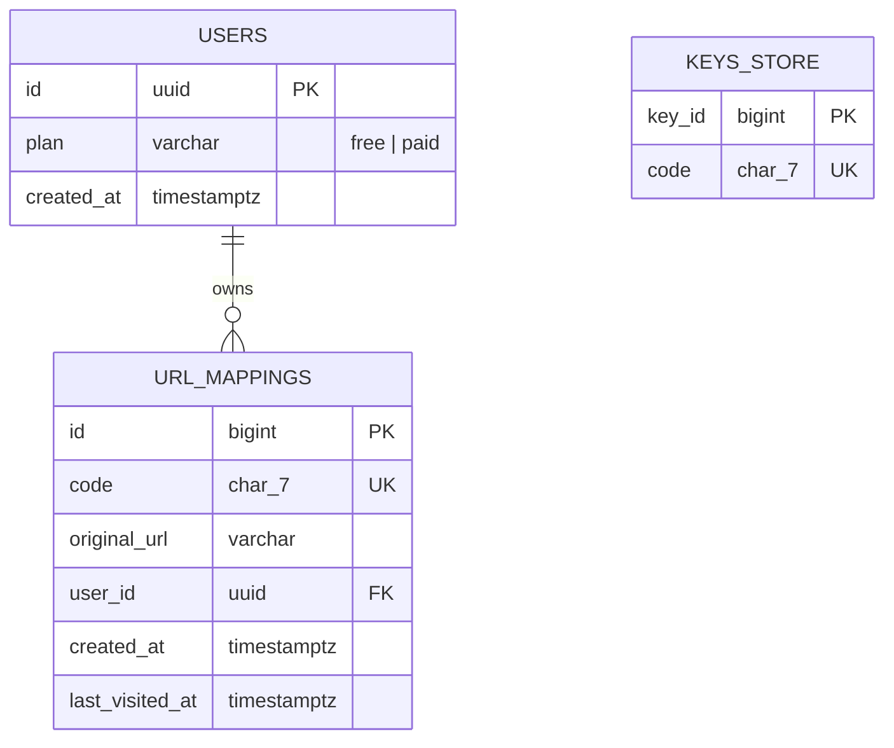
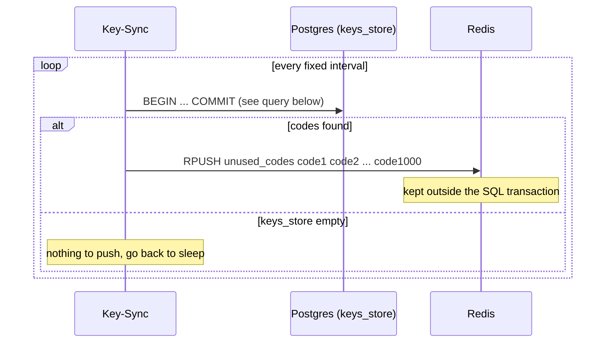
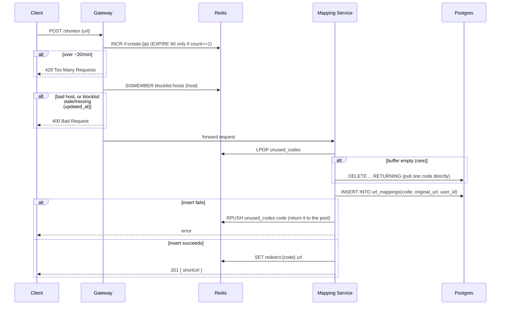
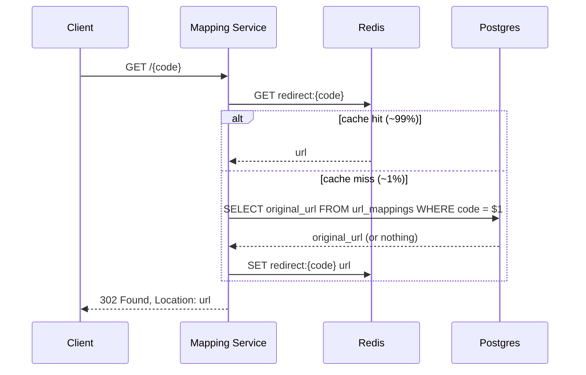
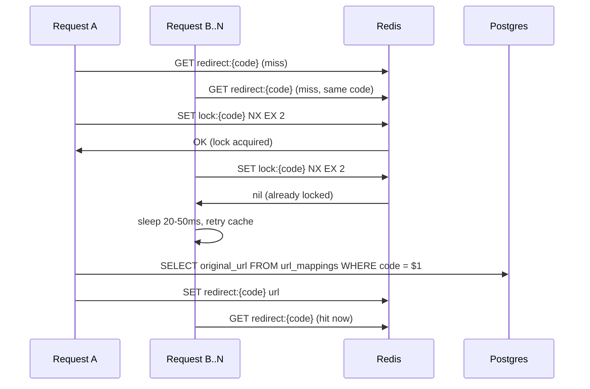
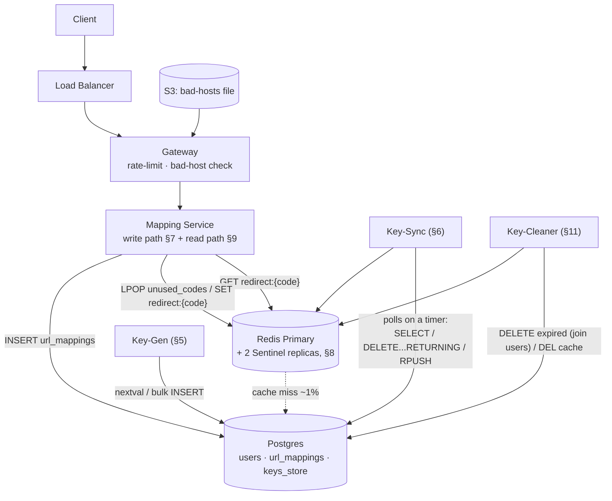
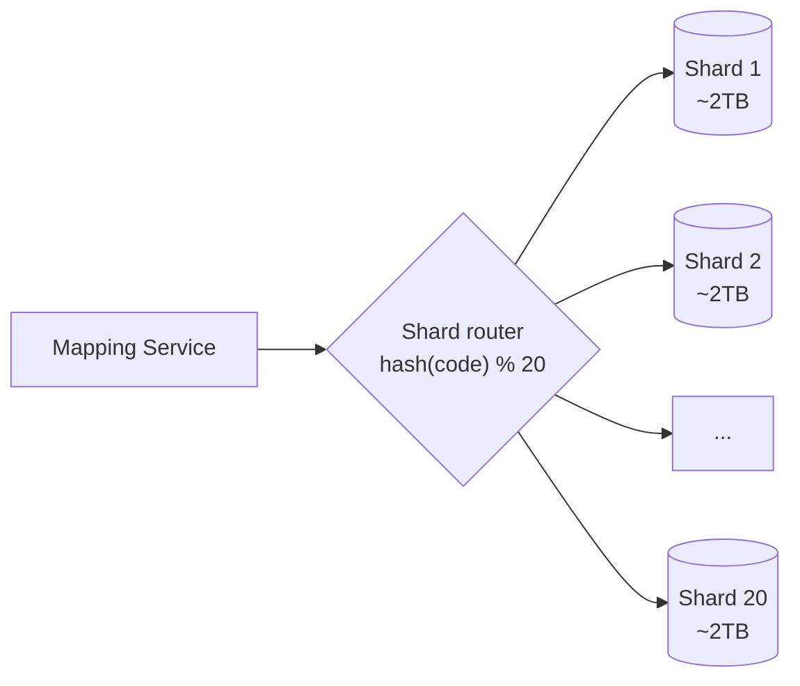

# Distributed URL Shortener — System Design

This doc explains how to design a TinyURL-style service, one piece at a time. Each component gets two parts: **the
idea** (what it does and why, in plain language) and **the details** (the actual mechanics, numbers, and code). Read it
in order — later sections assume you've read the earlier ones.

---

## Contents

1. [The problem](#1-the-problem)
2. [The two paths through the system](#2-the-two-paths-through-the-system)
3. [The cast: what each piece does](#3-the-cast-what-each-piece-does)
4. [The database tables](#4-the-database-tables)
5. [Making codes ahead of time — Key-Gen](#5-making-codes-ahead-of-time-key-gen)
6. [Keeping a ready supply of codes — Key-Sync](#6-keeping-a-ready-supply-of-codes-key-sync)
7. [Creating a short link — the write path](#7-creating-a-short-link-the-write-path)
8. [Making Redis reliable — Sentinel](#8-making-redis-reliable-sentinel)
9. [Following a short link — the read path](#9-following-a-short-link-the-read-path)
10. [Protecting the database from a traffic spike](#10-protecting-the-database-from-a-traffic-spike)
11. [Cleaning up old links — Key-Cleaner](#11-cleaning-up-old-links-key-cleaner)
12. [Architecture recap](#12-architecture-recap)
13. [How big does this need to be?](#13-how-big-does-this-need-to-be)
14. [How much storage do we need over 5 years?](#14-how-much-storage-do-we-need-over-5-years)
15. [Scaling order](#15-scaling-order)
16. [How to build this in stages](#16-how-to-build-this-in-stages)
17. [One-paragraph summary](#17-one-paragraph-summary)

---

## 1. The problem

A URL shortener takes a long URL and gives back a short code, like `abc1234`. Later, anyone who opens `short.ly/abc1234`
gets redirected to the original long URL.

That sounds simple. Three things make it genuinely hard at scale:

1. **The short codes must never collide.** Two different long URLs can never end up with the same short code.
2. **There must be no single point of failure.** If one server goes down, the service should keep working.
3. **It has to keep working for years**, without the database quietly running out of room or grinding to a halt.

Everything in this doc is one design decision in service of those three constraints.

---

## 2. The two paths through the system

Before looking at any component, it helps to know that every request the system handles is one of exactly two kinds:

- **Create a short link** (a write). Someone submits a long URL and gets a short code back.
- **Follow a short link** (a read). Someone opens a short URL and gets redirected.

Reads happen far more often than writes — roughly **100 reads for every 1 write**. If 500 links are created per second,
that means around 50,000 redirects happen per second.

That ratio matters for everything that follows. It's why the design leans so heavily on making reads cheap, even when
that costs a little extra work on the write side.

---

## 3. The cast: what each piece does

Here's every component this doc covers, in one line each. Come back to this table any time you forget what something
does.

| Component           | What it does                                                                                                                                                    |
|---------------------|-----------------------------------------------------------------------------------------------------------------------------------------------------------------|
| **Key-Gen**         | Generates batches of short codes ahead of time, offline, and writes them into Postgres                                                                          |
| **Key-Sync**        | Wakes up on a regular interval, checks Postgres for unused codes, and pushes any it finds into Redis                                                            |
| **Gateway**         | The front door for creating a link — checks rate limits and blocked domains before anything else happens                                                        |
| **Mapping Service** | Handles both sides of a link's life: assigns a ready code to a long URL when it's created, and looks the code back up to redirect the browser when it's clicked |
| **Key-Cleaner**     | Runs in the background, permanently deleting expired links (codes are not reused)                                                                               |
| **Redis**           | An in-memory store used for: the ready-to-use code buffer, the redirect cache, rate-limit counters, and short-lived locks                                       |
| **Postgres**        | The durable database — the permanent record of every code and every link                                                                                        |

---

## 4. The database tables

The whole system uses just three tables. It's worth seeing them up front, because every component in the sections that
follow reads or writes one of these — having the shape in your head first makes the rest easier to follow. Come back
here whenever a later section references a column.



*Fig. 1 — `keys_store` has no relationship to `url_mappings`. A code lives in exactly one of the two tables, never both,
matching the three-stage lifecycle described in §5.*

```sql
CREATE TABLE users
(
    id         UUID PRIMARY KEY,
    plan       VARCHAR(10) NOT NULL DEFAULT 'free', -- 'free' | 'paid'
    created_at TIMESTAMPTZ NOT NULL DEFAULT now()
);

CREATE SEQUENCE key_id_seq INCREMENT BY 1000 CACHE 1;

CREATE TABLE keys_store
(
    key_id BIGINT PRIMARY KEY, -- the monotonic sequence value; already unique & ordered
    code   CHAR(7) NOT NULL
);

-- code is unique, but it's random (§5) — so it's a secondary unique index,
-- not the primary key, for the same B-tree reason explained below.
CREATE UNIQUE INDEX idx_keys_store_code ON keys_store (code);

CREATE TABLE url_mappings
(
    id              BIGINT GENERATED ALWAYS AS IDENTITY PRIMARY KEY,
    code            CHAR(7)       NOT NULL,
    original_url    VARCHAR(2048) NOT NULL,
    user_id         UUID          NOT NULL REFERENCES users (id),
    created_at      TIMESTAMPTZ   NOT NULL DEFAULT now(),
    last_visited_at TIMESTAMPTZ
);

-- The lookup key for every redirect, and the final backstop against a
-- code ever being assigned twice (§8). See the note below on why this is
-- a separate unique index rather than the primary key.
CREATE UNIQUE INDEX idx_url_mappings_code ON url_mappings (code);

-- Used for "list my links" dashboards. Cursor pagination on this pair,
-- never OFFSET, because two links can share the same created_at; the
-- monotonic id breaks the tie.
CREATE INDEX idx_url_mappings_created_id ON url_mappings (created_at, id);
```

### Where the tier (free/paid) lives

A link's tier is kept in one place only: `users.plan`. It is not copied onto `url_mappings`. This is worth a note
because the tier does matter — it decides how long a link lives before Key-Cleaner deletes it (§11): free links go at a
flat 6 months, paid links survive until 2 years of no visits.

The reason it doesn't need to sit on the link row comes down to *who reads it, and when*:

- **The read path (redirect) never reads the tier.** A redirect is just "look up code → return the URL." It behaves
  identically for free and paid links — same 302, same lookup. Whether a link is *about* to expire is irrelevant at
  click time; if a soon-to-be-deleted link serves one more redirect before the next Key-Cleaner sweep removes it, no
  harm is done. So the hottest path in the system stays a bare single-table primary-key lookup (§9).
- **Only Key-Cleaner reads the tier**, and it runs offline, where a join is cheap. It joins `url_mappings` to `users` on
  its periodic scan to check `users.plan` (§11). Nobody is waiting on that query.

Keeping the tier in one place (**normalized**) avoids the usual duplication headache: when a user upgrades or
downgrades, there's no scattered copy across their old links to reconcile — the one row in `users` is the whole truth.

> **The assumption this rests on:** that a redirect never has to behave differently for a paid link *at click time* — no
> instant "this free link expired" response, no paid-only redirect features. If that ever changed, the tier would have to
> move onto the link row so the read path could see it without a join. For a plain shortener it doesn't, so it stays where
> it is.

### Why the primary key is a `bigint id`, not the `code`

Both tables use a monotonic `bigint` primary key with `code` as a separate unique index, rather than making `code` the
primary key. The reason is how B-tree indexes handle inserts: a monotonically increasing key always lands in the
rightmost leaf (cheap — the tree grows on one edge), while a random key like the scrambled `code` (§5) lands in random
leaves that are already full, forcing page splits and constant rebalancing. This hurts `keys_store` most, since Key-Gen
inserts 1,000 codes at a time — a random PK would scatter all 1,000 across the tree at once.

So each table gets a monotonic PK: `keys_store` reuses `key_id` (the pre-scramble sequence number, already monotonic and
unique), and `url_mappings` gets a dedicated `bigint id`. It also gives foreign keys and pagination a compact 8-byte
handle instead of a 7-char string.

**The honest caveat:** this doesn't remove the random-insert cost, it relocates it. Postgres is heap-organized, so every
index is separate — and because `code` still has to be looked up by value and kept unique, there must be an index on
`code` regardless, and *that* one still takes the random inserts. The `bigint` PK just ensures the random inserts hit
only *one* index (the `code` unique index) rather than two. (In an index-organized engine like MySQL's InnoDB, where the
table itself is the PK's B-tree, this choice matters even more — a random PK would scatter the actual rows, not just one
index.)

---

## 5. Making codes ahead of time — Key-Gen

### The idea

You could generate a short code at the exact moment someone creates a link — just pick something random and check the
database for a collision. But that means every single create request has to gamble on a database check, and occasionally
retry if it picked a code that's already taken. That's slow and adds unpredictability.

Instead, this design **makes codes in advance**, in big batches, completely offline. By the time a real user wants to
create a link, a valid, guaranteed-unique code is already sitting in a buffer, ready to be handed out instantly.

### The details

Key-Gen runs as several independent instances. Each one asks Postgres for a block of 1,000 numbers at a time, using a
database sequence (`key_id_seq`) that's configured to increment by 1,000 (see the `CREATE SEQUENCE` in §4). A single
call to `nextval('key_id_seq')` returns the *first* number of the next free block, and Postgres guarantees that call is
atomic — so even with several instances calling it at the same time, no two instances can ever get an overlapping block.
The instances don't need to talk to each other at all; Postgres's sequence is the only coordination required.

Here's what that looks like with three instances all pulling blocks, in the order their calls happen to arrive:

| Call # | Instance   | `nextval()` returns | Block this instance owns |
|--------|------------|---------------------|--------------------------|
| 1      | Instance A | 1                   | 1 – 1,000                |
| 2      | Instance B | 1,001               | 1,001 – 2,000            |
| 3      | Instance A | 2,001               | 2,001 – 3,000            |
| 4      | Instance C | 3,001               | 3,001 – 4,000            |
| 5      | Instance B | 4,001               | 4,001 – 5,000            |

Notice instance A calls `nextval()` again for call #3, once it has used up its first block — it just asks for the next
one, and gets whatever is next in line at that moment. Which instance gets which block isn't planned in advance; it just
depends on who happens to ask next.

Each instance then turns its numbers into codes, entirely in memory:

1. **Scramble the number** so sequential numbers don't produce sequential-looking codes. This uses a *bijection* — a
   function where every input maps to exactly one output, and no two inputs ever produce the same output. A **Feistel
   network** (or a library like Hashids/Sqids) does this. The scrambling is what stops someone from guessing `/aaa0002`
   right after seeing `/aaa0001`.
2. **Base62/64-encode** the scrambled number and pad it to exactly 7 characters.
3. **Bulk-insert the whole batch of 1,000 codes into `keys_store`** in one write, instead of writing one row at a time.

> **Why not just hash something and truncate it?** Hashing and truncating (e.g. SHA-256 cut down to 7 characters) *can*
> collide — two different inputs can produce the same truncated output. A bijection over a fixed range of numbers
> mathematically cannot, as long as you never reuse a number.

**What happens if an instance crashes mid-batch?** The insert never commits, so the whole block of numbers is simply
wasted — never duplicated, never reused. That's an acceptable trade, because the code space is enormous compared to how
many codes will ever actually be needed. Here's where that comparison comes from.

**Where the ~79 billion figure comes from.** This design targets a 5-year horizon at 500 creates/sec:

| Step                 | Calculation                 | Result               |
|----------------------|-----------------------------|----------------------|
| Creates per day      | 500/sec × 86,400 sec/day    | ~43.2 million/day    |
| Creates per year     | 43.2 million/day × 365 days | ~15.8 billion/year   |
| Creates over 5 years | 15.8 billion/year × 5 years | **~79 billion rows** |

This ~79 billion number is the one figure the rest of this doc keeps coming back to — it's what the code space needs to
comfortably exceed (below), and it's also what drives the storage math in §14.

**Why 7 characters, and not 6:**

| Code length  | Total possible codes | Calculation | Runway at 500/sec                                             | Enough for 79 billion codes?                                                                  |
|--------------|----------------------|-------------|---------------------------------------------------------------|-----------------------------------------------------------------------------------------------|
| 6 characters | ~68.7 billion        | 64⁶         | ~4.4 years' worth of codes                                    | **No** — fewer total codes than the ~79 billion needed, so it runs out before the 5-year mark |
| 7 characters | ~4.4 trillion        | 64⁷         | ~279 years' worth of codes (4.4 trillion ÷ 15.8 billion/year) | **Yes** — over 50x more codes than the 5-year target needs                                    |

Seven characters isn't a tight fit for 5 years — it's overkill by a wide margin, and that margin is exactly what makes
wasting the occasional batch a non-issue. Six characters, by contrast, would leave no room for waste at all: it doesn't
even cover 5 years of *perfectly* efficient, zero-waste code generation.

```java
// Reversible integer scramble so sequential sequence numbers
// (1, 2, 3, ...) don't produce sequential-looking codes.
final class FeistelScrambler {
	private static final int ROUNDS = 4;
	private static final long HALF_MASK = 0xFFFFFL; // 20 bits per half -> 40-bit domain
	private final long key;

	FeistelScrambler(long key) {
		this.key = key;
	}

	long scramble(long n) {
		long left = (n >>> 20) & HALF_MASK;
		long right = n & HALF_MASK;
		for (int round = 0; round < ROUNDS; round++) {
			long f = round(right, round);
			long newRight = left ^ f;
			left = right;
			right = newRight & HALF_MASK;
		}
		return (left << 20) | right;
	}

	private long round(long half, int round) {
		// Cheap mixing function; swap for a keyed hash (e.g. SipHash) in production.
		long mixed = (half * 2654435761L) ^ (key + round);
		return mixed & HALF_MASK;
	}
}

final class CodeGenerator {
	private static final char[] ALPHABET =
			"ABCDEFGHIJKLMNOPQRSTUVWXYZabcdefghijklmnopqrstuvwxyz0123456789-_"
					.toCharArray(); // 64 symbols
	private final FeistelScrambler scrambler;

	CodeGenerator(long instanceKey) {
		this.scrambler = new FeistelScrambler(instanceKey);
	}

	String toCode(long sequenceNumber) {
		long scrambled = scrambler.scramble(sequenceNumber);
		StringBuilder sb = new StringBuilder(7);
		for (int i = 0; i < 7; i++) {
			sb.append(ALPHABET[(int) (scrambled & 0x3F)]);
			scrambled >>>= 6;
		}
		return sb.reverse().toString();
	}
}

// Key-Gen loop: one nextval call per 1000 codes, one bulk insert per block.
List<String> block = new ArrayList<>(1000);
long startId = jdbc.queryForObject(
		"SELECT nextval('key_id_seq')", Long.class); // sequence increments by 1000
for(
long id = startId;
id<startId +1000;id++){
		block.

add(generator.toCode(id));
		}
		jdbc.

batchUpdate("INSERT INTO keys_store(code, key_id) VALUES (?, ?)",block, ...);
```

**A code's life has exactly three stages, and it's only ever in one at a time:**

| Stage                | Where it lives                  | Meaning                                                        |
|----------------------|---------------------------------|----------------------------------------------------------------|
| 1. Made, unused      | `keys_store` table (Postgres)   | Generated by Key-Gen, nobody owns it yet                       |
| 2. Ready to hand out | `unused_codes` list (Redis)     | Moved there by Key-Sync (next section), waiting to be assigned |
| 3. Assigned          | `url_mappings` table (Postgres) | A real user's link — `code → long URL`                         |

---

## 6. Keeping a ready supply of codes — Key-Sync

### The idea

Key-Gen writes codes into a Postgres table. But reading from Postgres every time someone creates a link would be slow.
So a separate process, Key-Sync, moves batches of fresh codes out of Postgres and into a Redis list — a fast in-memory
buffer that the create path can pop from instantly.

Key-Sync runs on a simple timer. At a regular interval, it wakes up, checks Postgres for codes that haven't been moved
to Redis yet, and if it finds any, pushes a batch of them into Redis. Then it goes back to sleep until the next
interval. There's no coordination with Key-Gen and no watching of Redis's current level — just a plain, repeating loop.

### The details



*Fig. 2 — Key-Sync just polls on a timer: check Postgres, push whatever it finds, repeat.*

On each wake-up, Key-Sync runs the following against Postgres, inside a single transaction:

```sql
BEGIN;

-- Grab up to 1000 unused codes, skipping any rows another
-- Key-Sync instance already has locked.
WITH batch AS (SELECT code
               FROM keys_store
    FOR UPDATE SKIP LOCKED
    LIMIT 1000
)
DELETE
FROM keys_store
WHERE code IN (SELECT code FROM batch) RETURNING code;

COMMIT;
```

`FOR UPDATE SKIP LOCKED` is what lets several Key-Sync instances run at the same time without stepping on each other —
if one instance already has a row locked, another instance just skips it and grabs different rows instead of waiting.
`RETURNING code` hands the deleted codes straight back in the same round trip, no separate `SELECT` needed.

Once that transaction commits, Key-Sync pushes the same codes into Redis with one command, kept **outside** the SQL
transaction above:

```
RPUSH unused_codes code1 code2 ... code1000
```

That ordering — commit the delete first, push to Redis second — is deliberate. To see why, it helps to compare it
against the opposite ordering: push to Redis first, then delete from Postgres.

| Step order                                                    | Where it can crash                   | What's left behind                                                                                                                                | Is that okay?                                                                                |
|---------------------------------------------------------------|--------------------------------------|---------------------------------------------------------------------------------------------------------------------------------------------------|----------------------------------------------------------------------------------------------|
| **Delete first, then push** (what this design does)           | Right after `COMMIT`, before `RPUSH` | The code is gone from `keys_store`, and never made it into `unused_codes` either. It simply doesn't exist anywhere for a while.                   | **Yes.** It's just a wasted code — the same acceptable trade as a wasted Key-Gen batch (§5). |
| **Push first, then delete** (the ordering this design avoids) | Right after `RPUSH`, before `COMMIT` | The code is sitting in Redis's `unused_codes`, ready to be handed out — but it's *also* still sitting in Postgres's `keys_store`, looking unused. | **No.** This is the failure case explained below.                                            |

The second row is the one worth walking through. If a code is still sitting in `keys_store` even though it's already in
Redis, then the *next* time Key-Sync wakes up and polls Postgres (§6), it has no way of knowing this code was already
pushed — it looks exactly like every other untouched row. Key-Sync would happily pick it up again and push it into Redis
a second time.

Now that same code exists **twice** in the `unused_codes` list. Two separate create requests can each `LPOP` a copy of
it, and both will try to insert it into `url_mappings` (§7). The unique index on `url_mappings.code` (§4) stops the
second insert from actually succeeding — so the code can't end up pointing at two different long URLs — but one of those
two create requests still fails with an error it should never have hit, for reasons that have nothing to do with
anything the user did wrong.

Deleting from Postgres *before* pushing to Redis is what closes off this whole scenario. Once the delete has committed,
there is no way for that code to still look "available" to a future Key-Sync poll — so it can never be pushed twice, and
it can never sit in the ready-to-hand-out list more than once.

Codes are pushed onto the **right** end of the list (`RPUSH`) and popped from the **left** end (`LPOP`, used by the
create path in §7) — that makes the list FIFO, and `LPOP` is atomic, so two create requests can never grab the same
code.

---

## 7. Creating a short link — the write path

### The idea

This is the first path a real user touches. Someone submits a long URL. Before anything is written to a database, the
request needs to pass a couple of cheap safety checks (is this person creating too many links too fast? is the URL
pointing somewhere blocked?). Only then does the system grab a ready code from Redis and record the new link permanently
in Postgres.

### The details



*Fig. 3 — The Gateway's checks run first, so a rejected request never even reaches the point of consuming a code. If the
Redis buffer is ever empty, the Mapping Service falls back to Postgres rather than failing.*

Walking through it step by step:

1. **Rate limiting.** The Gateway increments a per-IP counter in Redis and reads the value that `INCR` returns:

   ```
   count = INCR rl:create:{ip}

   if count == 1:
       EXPIRE rl:create:{ip} 60   # only on the FIRST request of a window
   if count > 20:
       reject with 429 Too Many Requests
   ```

   The logic hinges on the value `INCR` returns. `INCR` creates the key if it doesn't exist, sets it to 1, and returns
   1 — so a returned value of `1` means *this is the first request of a new window*, and only then does the Gateway set
   the 60-second expiry. Every later request in that same window just increments the counter and gets back 2, 3, 4, and
   so on, without touching the expiry. If the returned value is above 20, the request is rejected with
   `429 Too Many Requests`.

   Setting `EXPIRE` only when the count is 1 is the important detail. If the Gateway called `EXPIRE` on *every* request,
   each new request would keep pushing the 60-second countdown back to a full 60 seconds — the key would never actually
   expire as long as requests kept coming, and the counter would never reset. By setting the expiry only on the first
   request, the window is a true fixed 60 seconds from that first request, after which Redis deletes the key and the
   count starts fresh from zero.

2. **Blocked-domain check.** The Gateway checks two things — is the host on the blocklist, and is the blocklist itself
   fresh enough to trust:

   ```
   blocked = SISMEMBER blocklist:hosts {host}
   updated = GET blocklist:updated_at

   if updated is missing OR (now - updated) > MAX_AGE:   # e.g. MAX_AGE = 48h
       reject with 400 Bad Request     # list is stale or was never loaded
   if blocked == 1:
       reject with 400 Bad Request     # host is on the blocklist
   ```

   `SISMEMBER` answers "is this host blocked?" But that answer is only worth trusting if the list behind it is current,
   which is what the `blocklist:updated_at` timestamp is for. If that timestamp is missing (the list was never loaded)
   or older than a threshold like 48 hours (the list has gone stale), the Gateway refuses *every* create request
   regardless of the host — refusing is safer than trusting a list that might be missing hosts that turned malicious
   since it was last built.

3. **Grab a code.** Only after both checks pass does the Mapping Service pop one code off the front of Redis's
   `unused_codes` list (`LPOP`).
4. **Fallback if the buffer is empty.** In the rare case where `LPOP` comes back empty — Redis has run out of ready
   codes, perhaps because Key-Sync fell behind or Redis was just restarted and lost the list — the Mapping Service
   doesn't fail the request. Instead it falls back to pulling a code straight from `keys_store` in Postgres, using the
   same `DELETE ... RETURNING` shape Key-Sync uses (§6), just for a single code:

   ```sql
   DELETE FROM keys_store
   WHERE code = (
       SELECT code FROM keys_store
       FOR UPDATE SKIP LOCKED
       LIMIT 1
   )
   RETURNING code;
   ```

   This is slower than a normal `LPOP`, so it should almost never happen — but it means an empty buffer degrades to "a
   bit slower" instead of "creates are down," which is the more robust behaviour.

5. **Write the link.** The code, the long URL, and the owning user are inserted into `url_mappings`. The user's tier
   isn't copied here — it stays in `users` and is only consulted later by Key-Cleaner (§4):

   ```sql
   INSERT INTO url_mappings (code, original_url, user_id)
   VALUES ($1, $2, $3);
   ```

   This is the durable, permanent record — this is the row that makes the short URL real.
6. **If the insert fails**, the code is pushed back onto `unused_codes` (`RPUSH`) so it isn't lost — it can be handed to
   the next request instead.
7. **Warm the cache.** On success, the mapping is also written straight into Redis (`SET redirect:{code} url`), so the
   very first click on this brand-new link is already a cache hit instead of a database read.

### The bad-host list loader — a separate background job

The `blocklist:hosts` set and the `blocklist:updated_at` timestamp the Gateway checks above don't come from nowhere — a
separate job is responsible for keeping them up to date, and it's worth walking through on its own.

Once a day, this job downloads a bad-hosts file from S3 and loads it into Redis. It does **not** write directly into
`blocklist:hosts` — writing into the live set in place would mean, for a brief window, the set contains a mix of old and
new entries, and any Gateway request checked during that window would get an inconsistent answer. Instead it builds a
fresh set under a temporary name and swaps it in atomically:

```
# 1. Build the new list under a temporary key (in batches, not one host per call)
SADD blocklist:hosts:building host1.example.com host2.example.com ...

# 2. Atomically swap it in — the old set disappears and the new one
#    takes its name in a single operation, so readers never see a
#    half-built set
RENAME blocklist:hosts:building blocklist:hosts

# 3. ONLY after the swap succeeds, advance the freshness timestamp
SET blocklist:updated_at {now}
```

**Why a freshness timestamp, and not a simple "ready" flag.** An earlier version of this design used a plain
`blocklist:ready` flag — set to `1` once the first load succeeded. That flag has a subtle hole. Walk through it:

1. The very first run succeeds and sets `blocklist:ready = 1`. The Gateway starts accepting traffic. Good.
2. A day later, the job re-runs to refresh the list — but it crashes *before* the `RENAME` (say, the S3 download fails
   halfway). The new build under `blocklist:hosts:building` is incomplete and abandoned. `blocklist:hosts` still holds
   yesterday's list.
3. Here's the problem: `blocklist:ready` is **still `1`** from step 1. The flag only ever answered "has the list *ever*
   loaded?", so a failed refresh leaves it untouched — and the Gateway happily keeps checking every request against a
   stale list. If a host was added to the S3 file today because it just turned malicious, the Gateway is now letting it
   straight through, with nothing anywhere signalling that something is wrong.

The same blind spot covers the case where the job simply stops running for days (a dead cron, an unreachable S3) —
nothing errors loudly, the flag sits at `1`, and the list silently rots.

The timestamp fixes this because it answers the question the Gateway actually cares about: not "was the list ever
loaded?" but "is the list *fresh*?" `blocklist:updated_at` is written **last**, only after a `RENAME` has fully
succeeded, so it advances only on a completely clean refresh. A failed run leaves the old timestamp in place — and once
that timestamp ages past `MAX_AGE`, the Gateway starts refusing creates on its own (per step 2 above), instead of
trusting a stale list forever. This also naturally covers first boot: before the job has ever run,
`blocklist:updated_at` doesn't exist at all, so the missing-timestamp branch of the check refuses creates until the
first successful load. One timestamp handles both "never loaded" and "loaded but gone stale," which is why the separate
`ready` flag is gone.


---

## 8. Making Redis reliable — Sentinel

### The idea

At this point, Redis is sitting in the middle of both the create path and (as you'll see next) the read path — both
handled by the same Mapping Service. If Redis goes down, the whole service goes down with it. So before going any
further, Redis itself needs to not be a single point of failure.

### The details

Redis runs with **Sentinel: one primary and two replicas.** All writes (`LPOP`, `RPUSH`, `SADD`, `INCR`, `SET`) go to
the primary, and the primary copies them to the replicas in the background (asynchronously). Sentinel watches the
primary and, if it dies, promotes one of the replicas to take over.

Because replication is asynchronous, a primary crash can lose the last few writes that hadn't been copied to a replica
yet. That sounds alarming, but walk through what's actually lost in the worst case:

- A lost entry in `unused_codes` just means one code goes unused — cheap, as established in §5.
- A lost or stale `redirect:{code}` cache entry is harmless — the next request for that code just falls through to
  Postgres and re-populates the cache.

**One more thing worth being explicit about:** Sentinel's replicas exist for failover, not for spreading out load. They
are not a load balancer. In this design, all reads and writes go to the single primary by default — see §13 for why
that's fine at the target scale, and when you'd reconsider it.

---

## 9. Following a short link — the read path

### The idea

This is the path that runs 100x more often than link creation, so it needs to be as cheap as possible. The core idea:
check Redis first. Almost every request finds its answer there and never touches Postgres at all.

This is handled by the same Mapping Service from §7, not a separate service — creating a link and following one are just
two different endpoints on the same service, sharing the same connection to Redis and Postgres. There's no real benefit
to splitting them apart: they're both simple, stateless request handlers, and running them together means one less thing
to deploy, monitor, and capacity-plan separately.

### The details



*Fig. 4 — Roughly 99% of redirects are answered by Redis alone; Postgres only sees the misses.*

On a cache miss, the query is a plain single-table primary-key lookup — no join:

```sql
SELECT original_url
FROM url_mappings
WHERE code = $1;
```

A few choices here matter more than they look:

- **The read never joins `users`.** Everything a redirect needs is the destination URL, which is right on the
  `url_mappings` row. The link's tier (free/paid) isn't needed at click time — that only matters to Key-Cleaner (§4) —
  so the single most frequent query in the system stays a bare primary-key lookup on one table, about as cheap as a
  relational read gets.
- **The redirect is always a `302` (temporary), never a `301` (permanent).** This matters more than it sounds like it
  should: browsers cache a `301` forever. If this service ever returned `301`, a browser that visited once would keep
  redirecting on its own, without ever asking the server again — which would both hide real click data from us and keep
  a link "working" in the browser even after Key-Cleaner has deleted it. That second point is what breaks the paid-tier
  expiry rule (§11): it deletes paid links that have gone 2 years without a visit, and "without a visit" is only
  trustworthy if every click actually reaches us. `302` keeps every single click coming back through the Mapping
  Service.

---

## 10. Protecting the database from a traffic spike

### The idea

Section 8 said "about 1% of reads miss the cache." Normally that's a small, steady trickle. But imagine a single link
suddenly goes viral, or a cache entry just expired — now thousands of requests for the *same* code can miss the cache at
the same instant, and without protection, all of them would fire the same database query at once. That's enough to
overload the database over one popular link. This section is about preventing that pile-up.

### The details

The fix is a short-lived lock in Redis, scoped to a single code:

```
SET lock:{code} NX EX 2
```

`NX` means "only set this if it doesn't already exist," so only the first request to reach Redis for a given code
succeeds in acquiring the lock. `EX 2` makes it expire automatically after 2 seconds, so the lock always frees itself
even if the process holding it crashes.



*Fig. 5 — Only the request that wins the lock reads Postgres. Everyone else waits briefly and retries the cache
instead.*

The one request that acquires the lock becomes responsible for reading Postgres and refilling the cache. Every other
concurrent request for that same code simply waits 20–50ms and checks the cache again — by which point the winner has
almost always already filled it in.

(This single-key lock is enough for one Redis primary. The formally correct version of this pattern across multiple
independent Redis nodes is called **Redlock**, if you ever need that.)

The same idea protects against a flood of requests for a code that doesn't exist at all — a short-lived "not found"
marker gets cached too, so repeated hits on a bad code don't each go all the way to Postgres to confirm the same
negative answer.

---

## 11. Cleaning up old links — Key-Cleaner

### The idea

Links that are long dead are wasted space. Key-Cleaner is a background job that periodically deletes them. When a link
is deleted, its code is gone for good — **codes are never recycled or handed out again.** That's a deliberate choice:
with a 7-character code space of ~4.4 trillion against only ~79 billion needed over 5 years (§5), there's over 50x more
capacity than the design will ever use, so reclaiming dead codes buys nothing and only adds complexity. Deleting a link
is a single, clean `DELETE` — no reinsertion, no ordering hazards.

### The rules: when does a link get deleted?

There are exactly two rules, one per tier. They're deliberately different:

| Tier     | Deleted when                                     | Does it look at `last_visited_at`?                    |
|----------|--------------------------------------------------|-------------------------------------------------------|
| **Free** | 6 months after `created_at`                      | **No** — a flat 6-month lifetime, visited or not      |
| **Paid** | 2 years after the last visit (`last_visited_at`) | **Yes** — only truly abandoned paid links are removed |

The reasoning behind the split: free links are cheap and disposable, so they get a simple fixed expiry — six months from
creation, and it doesn't matter how popular they were. Paid links are something the user paid to keep, so they're only
removed if they've genuinely gone unused for a long time (two years with no clicks at all).

### The details

Two timestamps matter here, and it's important not to mix them up:

- **`created_at`** — when the link was made. Never changes. Drives the **free**-tier rule.
- **`last_visited_at`** — when the link was last clicked. Drives the **paid**-tier rule. (Because the free rule ignores
  visits entirely, `last_visited_at` only ever matters for paid links.)

**`last_visited_at` is never updated on the redirect path itself** (§9) — doing that would turn every single click into
a database write, which defeats the entire point of caching. Instead, each visit is noted cheaply in Redis, and a
separate background job periodically batches those into one `UPDATE` per link. The timestamp only needs to be roughly
right, since it's only used for the paid-tier cleanup decision, not for analytics. That batched update looks like:

```sql
-- Run periodically, once per link that had visits since the last run.
UPDATE url_mappings
SET last_visited_at = $2
WHERE code = $1;
```

Key-Cleaner runs as multiple instances (using `SKIP LOCKED`, the same trick from §6, so they don't step on each other).
The tier lives in `users.plan`, not on the `url_mappings` row (§4), so each rule joins to `users` to check the plan.
That join is fine here — Key-Cleaner is an offline batch job and nobody is waiting on it. The two rules are two separate
delete queries.

**Free tier — delete 6 months after creation:**

```sql
DELETE
FROM url_mappings m USING users u
WHERE m.user_id = u.id
  AND u.plan = 'free'
  AND m.created_at
    < now() - INTERVAL '6 months'
  AND m.code IN (
    SELECT code FROM url_mappings
    FOR UPDATE SKIP LOCKED
    LIMIT 1000
    );
```

**Paid tier — delete after 2 years with no visits:**

```sql
DELETE
FROM url_mappings m USING users u
WHERE m.user_id = u.id
  AND u.plan = 'paid'
  AND COALESCE (m.last_visited_at
    , m.created_at)
    < now() - INTERVAL '2 years'
  AND m.code IN (
    SELECT code FROM url_mappings
    FOR UPDATE SKIP LOCKED
    LIMIT 1000
    );
```

`COALESCE(last_visited_at, created_at)` handles a paid link that was never visited at all: with no `last_visited_at`
recorded, it falls back to `created_at`, so a paid link created 2 years ago and never clicked is correctly eligible.

After each delete, Key-Cleaner drops the now-stale cache entry for the removed codes:

```
# Drop the stale redirect cache entry for each deleted code.
DEL redirect:{code}
```

That's the entire cleanup — a delete plus a cache eviction. Because codes aren't recycled, there's no reinsertion into
`keys_store` and none of the delete-then-push ordering care that Key-Sync needs (§6); a deleted code simply ceases to
exist everywhere.

This is also why the redirect must always be a `302`, never a `301` (§9). The paid rule trusts "no visits in 2 years" —
and that's only trustworthy if every click actually comes back through the service. A `301` that a browser cached would
let a link keep working invisibly, and Key-Cleaner would wrongly conclude it was abandoned.

> **Note on the sharding wrinkle:** once `url_mappings` is sharded by `hash(code)` (§14) while `users` stays unsharded,
> these delete queries become cross-shard joins. For an offline batch job that's acceptable — but if it ever became
> painful, the fallback is exactly the denormalization this design otherwise avoids: copy the tier onto each
> `url_mappings` row so the cleaner needs no join. It's a deliberate "not yet" rather than a "never."

---

## 12. Architecture recap

With every component explained, here's the full picture in one diagram.



*Fig. 6 — One Mapping Service handles both paths; every arrow here corresponds to a step you've already walked through
in a section above.*

---

## 13. How big does this need to be?

This section works out, step by step, how much hardware this design actually needs. Each step builds on the one before
it — don't skip ahead.

### 13.1 The two starting numbers

Everything below is derived from two numbers already introduced in §2:

- **Writes: ~500 link creations per second.**
- **Reads: ~100x that, so ~50,000 redirects per second** — and from §9, about 99% of those never reach Postgres at all.

### 13.2 How long does one create request hold onto resources?

A single create request (§7) does three sequential steps. Timing each, all in-datacenter round trips:

```
LPOP  unused_codes      ~1ms
INSERT url_mappings      ~5ms   (mostly disk fsync: ~4.5ms disk-wait + ~0.5ms CPU)
SET   redirect:{code}    ~1ms
```

Two different things are held for two different durations. The Postgres connection is only checked out for the `INSERT`;
the application thread is held for the entire request, all three steps:

```
DB connection held  =  INSERT
                    =  5ms

App thread held     =  LPOP + INSERT + SET
                    =  1ms  + 5ms   + 1ms
                    =  7ms
```

| Resource              | Held for                | Why                                                                                                                        |
|-----------------------|-------------------------|----------------------------------------------------------------------------------------------------------------------------|
| A Postgres connection | 5ms — just the `INSERT` | The connection is only checked out for the one database round trip.                                                        |
| An application thread | 7ms — the whole request | The thread stays busy across all three steps, including the two Redis calls that never touch a database connection at all. |

> **What's deliberately left out of this math:** the ~150ms round trip to a user who might be far away. That's
> user-facing latency — it affects how fast the response *feels*, but with non-blocking I/O the server isn't spending a
> thread or a database connection while it waits on the network. It's a separate concern (an SLA question), not a capacity
> question.

### 13.3 Turning hold time into a connection count

**Little's Law** is the formula for this: `L = λ × W` — the number of things in flight equals the arrival rate times how
long each one stays.

```
DB connections in flight  =  500/sec × 0.005s  =  2.5
App threads in flight     =  500/sec × 0.007s  =  3.5
```

Those are the **floors** — the average number in flight at steady state. You provision above them: round up, then
apply ~1.5–2× headroom for bursts and slow-tail requests:

```
DB connection pool  =  ceil(2.5) × 2  ≈  5–6
App thread pool     =  ceil(3.5) × 2  ≈  7–8
```

So this workload genuinely needs only a handful of connections and threads. Two things are worth knowing here, though,
because they set practical floors that sit *above* these tiny numbers:

- **Framework defaults are already higher than this.** Tomcat ships with a default `maxThreads` of **200**, and Postgres
  ships with a default `max_connections` of **100**. Common JDBC pools (HikariCP) default to a pool of **10**. In other
  words, nobody actually runs a 5-connection pool — the defaults alone give you far more than 500 writes/sec demands.
  The Little's Law number tells you the workload is *nowhere near* stressing those defaults, which is the real
  conclusion: at this scale, connections and threads are not your bottleneck.
- **App threads should always be ≥ DB connections**, because a thread is held for a longer slice of the request than a
  connection is. If you under-provision connections, threads don't disappear — they just pile up waiting for a free
  connection, which makes the thread number *worse*.

And the hard ceiling the fleet must stay under — Postgres's `max_connections` (default 100, often raised) — written as
an inequality:

```
(app instances × pool size per instance) + reserved slots  ≤  max_connections
```

That left-hand sum, not CPU or memory, is usually the real ceiling. (The reserved slots cover superuser and maintenance
connections Postgres keeps aside — see §13.6, where PgBouncer is introduced to keep the sum bounded as instance count
grows.)

### 13.4 Turning connections into CPU cores

Cores are *not* sized as `rate × time` — that would count time spent waiting on disk as if it were CPU work, which
overstates the need. Postgres has its own rule of thumb instead:

```
cores ≈ (connections − effective_spindle_count) / 2
```

A "spindle" here means one parallel disk. On SSD or cloud storage, you can treat this as ≈1 and largely ignore it — it's
a rounding correction next to `cores × 2`, not a major factor.

Feeding in the provisioned connection number from §13.3 (~5–6):

```
cores ≈ (connections − effective_spindle_count) / 2
      ≈ (6            − 1)                       / 2
      ≈ 5 / 2
      ≈ 2.5   →  ~2-3 cores
```

So the *write workload alone* barely needs a 2–3 core box. That lines up with the obvious sanity check — 500 inserts/sec
is a tiny write rate — and it's the honest conclusion the numbers actually support.

**One real-world caveat, kept separate from the math above.** In practice you'd rarely run a connection pool as small as
5–6 — the common default (HikariCP) is 10, and pools are cheap to over-provision slightly for burst absorption. If you
provisioned a pool of, say, 10, the same formula gives `(10 − 1)/2 ≈ 4-5 cores`. That's a *provisioning choice* — "I'll
set a pool of 10 because that's a sane floor" — not something Little's Law derived. Worth stating plainly in an
interview so the number is honest: the workload demands ~2 cores; you might buy a bit more because pools and cores below
a handful aren't worth shaving.

### 13.5 Picking an actual machine

The cores math (§13.4) says the write workload needs only ~2-3 cores — so **CPU is not what picks the machine here.**
What actually drives the choice is RAM (Postgres wants its hot rows and indexes in memory), disk IOPS, and eventually
total data size (§14). Those push you toward a memory-heavy instance whose core count comes along for the ride.

Something like a `db.r6g.2xlarge` (8 vCPU, 64GB RAM) on a gp3 volume provisioned for ~5,000 IOPS is a reasonable pick —
not because you need 8 cores for the writes (you don't), but because that class of box gives the RAM and IOPS headroom
the working set wants, and the cores are more than enough as a side effect.

Translating "vCPU" into actual cores. A "vCPU" isn't always a physical core, so it's worth knowing the conversion. On
most x86 instances (Intel/AMD), hyperthreading (SMT) makes one physical core present as two logical cores, and a vCPU is
one of those threads — so there you halve to get physical cores:


```
x86 (with hyperthreading):  physical cores ≈ vCPU / 2
   e.g. a 8-vCPU x86 box  →  8 / 2  =  4 physical cores
```

But **AWS Graviton** instances (the g in r6g) have no hyperthreading — 1 vCPU maps directly to 1 physical core. So the
db.r6g.2xlarge here is not halved:

```
Graviton (no hyperthreading):  physical cores = vCPU
   db.r6g.2xlarge, 8 vCPU  →  8 physical cores
```

The Postgres formula in §13.4 is expressed in physical cores (it's estimating real compute), so compare like with like:

```
need (from §13.4):   ~2-3 physical cores
have (r6g, 8 vCPU):  8 physical cores    ✓  far more than enough
```

Either way the conclusion is the same and CPU isn't the binding constraint — but the reason to know the rule is that on
an x86 box the same "8 vCPU" would be only ~4 real cores, and you don't want to accidentally provision half the compute
you thought you had. On Graviton, what you see is what you get.

At 500 writes/sec, this workload is a small fraction of what one such box can handle — disk-write throughput and total
data size (§14) are the real limits here, not CPU.

### 13.6 What the 1% cache misses add back onto Postgres

Section 8 established that ~99% of the 50,000 reads/sec are answered by Redis alone. That 99% figure rests on an
assumption worth making explicit, because §14.4 builds on it: **we assume that a hot subset of roughly 20–30% of all
URLs receives about 99% of the clicks.** This is the usual "popular links dominate traffic" pattern — a small fraction
of links (recent, viral, or heavily shared) get almost all the visits, while the long tail is rarely touched. If we keep
that hot 20–30% in the cache, we catch ~99% of reads; only the ~1% that fall in the cold tail miss and reach Postgres.

The other ~1% still lands on Postgres, and it needs to be sized the same way as any other workload — rate × hold-time:

```
misses reaching Postgres  ≈  500 – 1,000 reads/sec
each miss is a ~1ms indexed SELECT
1,000 × 0.001s ≈ 1 connection's worth of load
```

That gets **added to** the write demand from §13.3, not sized separately:

```
writes (2.5) + misses (~1.0) ≈ 3.5 connections  (combined floor)
→ ceil(3.5) × 2 ≈ 8 connections provisioned
```

Still a handful — comfortably under the framework defaults noted in §13.3 (HikariCP 10, Postgres `max_connections` 100).
The point of combining them isn't that the total is large; it's the method:

> The mistake to avoid: sizing writes and misses as two separate small numbers and hoping the headroom on one covers the
> other. Add the demands together first, then apply headroom once to the total.

### 13.7 Why one Redis server is enough for 50,000 reads/sec

A single Redis instance can handle on the order of **100,000 operations per second** for simple commands like `GET`/
`SET` — that's the widely-cited ballpark figure, and it holds up well in practice on modern hardware. Our read load is ~
50,000 reads/sec, comfortably under half of that, so one primary has plenty of room.

Why is Redis able to sustain 100k ops/sec on effectively a single thread? A `GET` is a pure in-memory lookup that
finishes in microseconds, so Redis runs one command after another without ever blocking on disk, using an event loop to
juggle thousands of open connections and always work on whichever one is ready next. It never sits around waiting on a
slow client the way a database connection might.

That's also why a round trip to Redis measures at around 1ms from the app's point of view — that time is almost entirely
network travel and client-side overhead, not Redis's own processing, which is microseconds. Keeping the app and Redis in
the same datacenter is what keeps that number near 1ms; across datacenters it climbs to 2ms or more.

### 13.8 Throughput isn't the same thing as latency

```
throughput = concurrency ÷ latency
```

At 1ms latency, if only one request is ever in flight at a time, you only get about 1,000 requests/sec of throughput.
But with about 100 requests in flight simultaneously, the same 1ms latency yields around 100,000 requests/sec. That "~
100" figure is `throughput × latency` — it represents how many clients are waiting on a response at any given moment,
mostly just sitting on the network while Redis itself is still only ever executing one command at a time.

### 13.9 Sentinel's replicas don't add read capacity

As noted in §8, by default *all* reads and writes go to the single Redis primary — the two Sentinel replicas are standby
copies for failover, not extra capacity to spread load across. You'd only start routing some reads to a replica if
traffic ever grew past that primary's ~100k/sec ceiling (a slightly stale read from a replica is harmless for a
redirect). Writes, on the other hand, always stay on the one primary no matter what — the only way to scale write
throughput past one primary's limit is to shard (Redis Cluster), which is a bigger step covered in §15.

---

## 14. How much storage do we need over 5 years?

### 14.1 How many rows will exist?

As derived in §5: 500 creates/sec over a 5-year horizon works out to **~79 billion rows**.

### 14.2 How big will each table get?

Table size is estimated as `bytes per row × number of rows × 3`, where the ×3 accounts for indexes and general storage
overhead. So first we need bytes-per-row, which we get by adding up the columns. The per-column byte estimates:

```
bigint       =   8 bytes
char(7) code =   7 bytes
uuid         =  16 bytes
timestamptz  =   8 bytes
original_url ≈ 100 bytes   (a URL is variable-length; ~100 is a reasonable average
                            and the single biggest contributor to row size)
```

**`keys_store` row** (`key_id` + `code`):

```
key_id  (bigint)   =  8
code    (char 7)   =  7
                   ----
row size           ≈ 15 bytes
```

**`url_mappings` row** (`id` + `code` + `original_url` + `user_id` + `created_at` + `last_visited_at`):

```
id               (bigint)       =   8
code             (char 7)       =   7
original_url     (varchar)      ≈ 100
user_id          (uuid)         =  16
created_at       (timestamptz)  =   8
last_visited_at  (timestamptz)  =   8
                                 ----
row size                        ≈ 147  →  ~150 bytes
```

Now multiply each by 79 billion rows (§14.1), then by 3 for overhead:

```
keys_store:    15 bytes  × 79e9 ≈ 1.18 TB   → × 3 ≈ 3.5 TB
url_mappings: 150 bytes  × 79e9 ≈ 11.9 TB   → × 3 ≈ 35 TB
```

| Table                                                     | Row size   | Raw size at 79B rows | With ×3 overhead | Fits on one machine?                                                                                                                |
|-----------------------------------------------------------|------------|----------------------|------------------|-------------------------------------------------------------------------------------------------------------------------------------|
| `keys_store` (key_id + code)                              | ~15 bytes  | ~1.18 TB             | ~3.5 TB          | **Yes.** It's off the hot path — only Key-Sync reads it — and it's a bounded buffer that actually shrinks as codes move into Redis. |
| `url_mappings` (id + code + url + user_id + 2 timestamps) | ~150 bytes | ~12 TB               | ~35 TB           | **No.** This one needs to be split across machines.                                                                                 |

### 14.3 Splitting `url_mappings` across machines

To decide how many machines, you need a target size per machine. We assume a **commodity database box holds ~2 TB of
usable data** — a deliberately modest figure that leaves room for the OS, working space, and headroom, rather than
cramming a disk to its limit. Dividing the table size by that:

```
shards = table size ÷ usable size per box
       = 35 TB ÷ 2 TB
       ≈ 18  →  round up to ~20 shards
```

So `url_mappings` is split by `hash(code)` into roughly **20 shards** of ~2 TB each.



*Fig. 7 — Sharded by `hash(code)`, never by `user_id`. A redirect lookup arrives keyed by code and needs to land on
exactly one shard per click; sharding by `user_id` instead would turn every redirect into a search across every shard.*

It's worth noting that 35TB would technically still fit within the storage ceiling of a single large managed instance
(RDS tops out around 64 TiB, Aurora around 256 TiB). The reason to shard anyway is that storage capacity isn't the real
limit — a single primary handling all the writes is, along with the operational risk of one giant box (a bigger blast
radius if something goes wrong, and much slower backups and restores). Technically fitting isn't the same as being a
good idea.

### 14.4 How much RAM does the redirect cache actually need?

The cache does **not** hold every URL ever created — it holds the hot working set, the links being clicked right now.
The trick is sizing that working set with a simple, defensible number instead of guessing.

The clean way: base it on **one day of created URLs**, then take the hot fraction. The reasoning is that the links
people actually click today are dominated by recently-created ones, so "a day's worth of URLs" is a good stand-in for
the active set, and it's a number we can compute directly from the create rate.

**Step 1 — size of one cache entry.** Each `redirect:{code}` entry stores the key and the URL, plus Redis's own
per-object overhead:

```
key   "redirect:" + 7-char code   ≈  16 bytes
value the original URL             ≈ 100 bytes
Redis per-object overhead          ≈  80 bytes
                                   ----------
per entry                          ≈ 200 bytes
```

**Step 2 — how many URLs are created in a day.** Straight from the create rate (§13.1):

```
URLs/day = 500 creates/sec × 86,400 sec/day ≈ 43.2 million URLs/day
```

**Step 3 — size a day's worth, then take the hot 20%.** If the whole day's URLs were cached, that's:

```
43.2 million × 200 bytes ≈ 8.6 GB
```

But not all of them stay hot — only the ~20% that keep getting clicked matter (the same "popular links dominate"
assumption from §13.6). So the cache that actually earns its keep is:

```
20% × 8.6 GB ≈ 1.7 GB
```

So the redirect cache needs on the order of **~1.5–2 GB of RAM** — trivially within one Redis box.

**Why not 20% of the 5-year total?** It's tempting to take 20% of the ~35 TB from §14.2, but that gives ~7 TB — which is
not only impossible to hold in RAM on one box, it's answering the wrong question. That 35 TB is *every link created over
5 years*; 20% of it is every link that's popular *at some point across those 5 years*. The cache only needs the links
hot *right now*, and the number clicked in any given day is capped by the day's traffic, not by five years of
accumulation. Sizing off one day is what keeps the cache in the gigabytes instead of the terabytes. TTL expiry and LRU
eviction (dropping Least-Recently-Used entries when full) are what enforce this in practice — they naturally keep the
cache to roughly a rolling window of hot links.

---

## 15. Scaling order

When traffic grows, scale in this order — each step assumes the previous one is already in place:

1. **Redis for read caching.** Already covered in §9 — this is the single biggest lever, and it's why Postgres barely
   feels the 50,000 reads/sec.
2. **More stateless Gateway / Mapping Service instances behind a load balancer.** Keep watching the connection-pool math
   from §13.3: `(instances × pool size per instance) + Postgres's reserved slots + headroom` must stay under
   `max_connections`.
3. **Add PgBouncer in front of Postgres.** Once there are enough app instances that raw connection counts become
   unwieldy, a connection pooler keeps the total bounded regardless of how many instances exist.
4. **Split Postgres into a "hot" and "cold" side.** Keep `users` and `url_mappings` together on one box for as long as
   possible, so the redirect-miss join (§9) stays a single query. Only separate them if genuinely forced to.
5. **Shard `url_mappings` by `hash(code)`** (§14.3) — only once data size or write throughput actually outgrows one
   primary, never by `user_id`.

---

## 16. How to build this in stages

A reasonable order to actually build and ship this in:

1. **V1 — one of everything.** A single Postgres primary (all three tables together), a single Redis with Sentinel, one
   deployment each of Gateway and Mapping Service (handling both create and redirect), and one instance each of Key-Gen
   and Key-Sync. This is enough to prove the full code lifecycle works correctly end to end.
2. **V2 — add safety mechanisms before real traffic.** The cache-stampede lock (§10) and Key-Cleaner with its two expiry
   rules (§11) should both be in place before this sees production load.
3. **V3 — scale the stateless pieces.** Multiple Gateway / Mapping Service instances behind a load balancer; multiple
   Key-Gen and Key-Sync instances (relying on `SKIP LOCKED` from §6 to avoid collisions). Keep an eye on the
   connection-pool ceiling as instance count grows.
4. **V4 — PgBouncer, and read replicas if needed.** Add PgBouncer once instance count makes connection counts
   unmanageable (§15). Only add Postgres read replicas if the ~1% miss traffic from §13.6 itself grows past what the
   primary can handle.
5. **V5 — shard `url_mappings`.** Only once §14.3's numbers say you have to. Update the Mapping Service's database
   fallback to route by `hash(code)`, and update any "list my links" dashboard query to gather results across all shards
   using cursor pagination.
6. **V6 — Redis Cluster, only if write throughput ever outgrows one Redis primary.** Read throughput scales via caching
   and replicas long before this becomes necessary (§13.9); this step is specifically about writes.

---

## 17. One-paragraph summary

The hard part of a URL shortener is generating unique, short, collision-free 7-character codes at high throughput with
no single point of failure — not storing "short → long" mappings. Clicks happen about 100x more often than link
creations, so the design leans on making clicks cheap: codes are made in advance rather than at request time, so the
create path just grabs a ready one instead of gambling on a collision check. Redis absorbs nearly all the read traffic,
but every create still writes durably to Postgres — Redis is kept highly available with Sentinel instead of being a
single point of failure. Postgres holds the permanent record and is sized, and eventually sharded by `hash(code)`, using
simple math (Little's Law for connections and threads, the Postgres cores-vs-connections rule, and row-size × row-count
for storage) rather than guesswork. The whole system trades a small amount of wasted codes for guaranteed uniqueness and
cheap, fast reads.