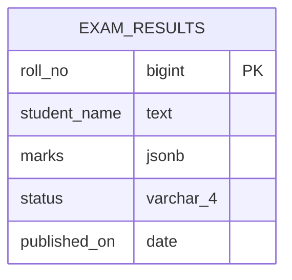
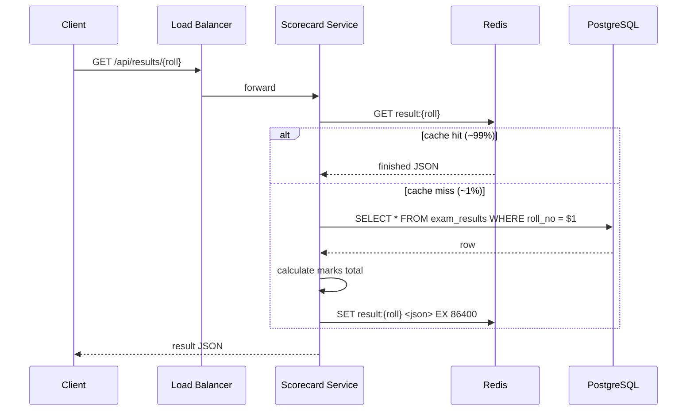
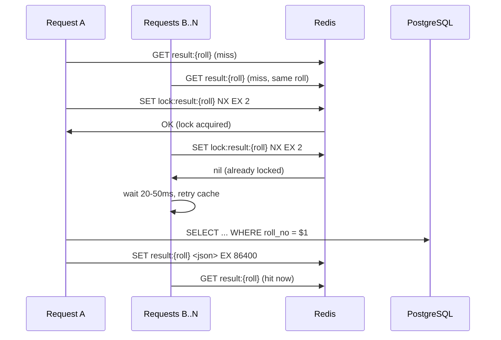
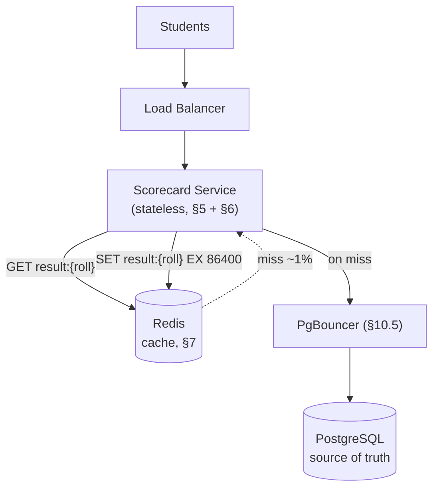

# Distributed Exam Result Service — System Design

This doc explains how to design a high-scale exam result service, one piece at a time. Each component gets two parts:
**the idea** (what it does and why, in plain language) and **the details** (the actual mechanics, numbers, and code).
Read it in order — later sections assume you've read the earlier ones.

---

## Contents

1. [The problem](#1-the-problem)
2. [The one big idea](#2-the-one-big-idea)
3. [The cast: what each piece does](#3-the-cast-what-each-piece-does)
4. [The database table](#4-the-database-table)
5. [Publishing the results — the write path](#5-publishing-the-results--the-write-path)
6. [Reading a result — the read path](#6-reading-a-result--the-read-path)
7. [Keeping Redis warm](#7-keeping-redis-warm)
8. [Protecting PostgreSQL from a traffic spike](#8-protecting-postgresql-from-a-traffic-spike)
9. [What happens when Redis is empty](#9-what-happens-when-redis-is-empty)
10. [How big does this need to be?](#10-how-big-does-this-need-to-be)
11. [How much storage and RAM do we need?](#11-how-much-storage-and-ram-do-we-need)
12. [Architecture recap](#12-architecture-recap)
13. [Scaling order](#13-scaling-order)
14. [How to build this in stages](#14-how-to-build-this-in-stages)
15. [Failure scenarios](#15-failure-scenarios)
16. [One-paragraph summary](#16-one-paragraph-summary)

---

## 1. The problem

An exam result service takes a roll number and returns the student's result:

```text
GET /api/results/4231765
```

returns something like:

```json
{
  "roll_no": 4231765,
  "student_name": "Rajesh Kumar Verma",
  "marks": {
    "mathematics": 87,
    "physics": 72,
    "chemistry": 90,
    "english": 78,
    "computer_science": 95,
    "hindi": 81
  },
  "status": "PASS",
  "published_on": "2026-05-20"
}
```

That sounds simple. Two things make it genuinely hard at scale:

1. **The traffic arrives all at once.** Millions of students know the exact minute results go live. Traffic jumps from
   almost nothing to an enormous number of requests in a very short window.
2. **The result never changes.** Once a student's result is published, their marks and pass/fail status are effectively
   immutable.

That second property is the one that saves us. Because a published result never changes, we don't have to treat every
request as a database request — we can read a result once, put it in Redis, and serve every request after that straight
from memory.

> The whole design follows from combining the two: a huge read spike + immutable data = cache aggressively and keep
> PostgreSQL out of the hot path.

---

## 2. The one big idea

The single most important decision in this design is this:

> PostgreSQL is the source of truth. Redis handles the traffic.

PostgreSQL stores every student's result permanently. Redis stores the finished result JSON temporarily, so that the
vast majority of requests never reach PostgreSQL at all.

Walk through what happens for one student, `4231765`. The **first** request for that roll number does the full amount of
work:

```text
Redis GET   → miss
PostgreSQL  → read the row
App         → calculate the marks total
Redis SET   → cache the finished result
→ return
```

Every request after that — potentially hundreds, as the student refreshes and shares the link — does almost nothing:

```text
Redis GET   → hit
→ return
```

PostgreSQL is never touched again for that student. That is the entire strategy: pay the full cost once, serve from
memory forever after.

This works because the read load dwarfs everything else, and because ~99% of it can be served from cache. If the service
handles 1,000 requests/sec at a 99% hit rate, then only:

```text
1,000 req/sec × 1% miss = 10 queries/sec
```

actually reach PostgreSQL once the cache is warm. The database never has to sustain the full request rate.

---

## 3. The cast: what each piece does

Here's every component this doc covers, in one line each. Come back to this table whenever you forget what something
does.

| Component                   | What it does                                                                              |
|-----------------------------|-------------------------------------------------------------------------------------------|
| **Load Balancer / Gateway** | The front door — routing, TLS termination, and rate limiting                              |
| **Scorecard Service**       | Stateless application instances that fetch results from Redis, falling back to PostgreSQL |
| **Redis**                   | Fast in-memory cache holding finished result JSON                                         |
| **PostgreSQL**              | Durable source of truth holding every exam result                                         |
| **PgBouncer**               | Sits in front of PostgreSQL and caps how many connections the app fleet can open          |

There are deliberately very few pieces here. This problem does **not** need Kafka, Elasticsearch, a distributed
database, or an event-processing pipeline. The result is immutable, and that single fact removes a huge amount of
complexity — no update propagation, no cache invalidation, no write contention.

---

## 4. The database table

The whole result fits in a single table. It's worth seeing up front, because every component below reads or writes it.



*Fig. 1 — One table, keyed by the one thing every request carries: the roll number.*

```sql
CREATE TABLE exam_results
(
    roll_no      BIGINT PRIMARY KEY,
    student_name TEXT       NOT NULL,
    marks        JSONB      NOT NULL, -- { "mathematics": 87, "physics": 72, ... }
    status       VARCHAR(4) NOT NULL, -- 'PASS' | 'FAIL'
    published_on DATE       NOT NULL
);
```

Two design choices worth explaining:

- **`roll_no` is the primary key** because it's the only lookup key the system ever uses. Every request is
  `roll number → result`. We never search by `student_name`, `published_on`, or `status`, so no other index is needed —
  the primary key already gives the hot query its index:

  ```sql
  SELECT * FROM exam_results WHERE roll_no = $1;
  ```

- **Marks live in a `JSONB` column** rather than one column per subject. Different boards and streams have different
  subject sets, and storing them as a key-value blob keeps the schema stable regardless of how many subjects a given
  student has. The marks are only ever read as a whole (to build the response), never filtered on, so there's no
  downside to keeping them opaque.

Unlike a system whose codes are random, `roll_no` is a natural sequential number, so it makes a perfectly good primary
key on its own — inserts land in order and there's no B-tree scattering to worry about.

---

## 5. Publishing the results — the write path

### The idea

Publishing is deliberately kept completely separate from the read path. Before results go live, every student's row is
loaded into PostgreSQL in a bulk job. By the time students start querying, the database is already fully populated — the
release-day request never triggers result generation, it only ever reads.

### The details

The publication job inserts all five million rows ahead of the release:

```text
5,000,000 student results  ──bulk insert──▶  exam_results (PostgreSQL)
```

This ordering matters. We never want a release-day request to compute anything expensive. The result must already exist
as a row, so the live request is only ever:

```text
roll number → indexed lookup → return
```

The one small computation left on the read path is summing the marks into a total. That happens at most once per student
(on the first, cache-missing request), and the finished payload — total included — is what gets cached, so no later
request repeats it.

---

## 6. Reading a result — the read path

### The idea

This is the path that runs millions of times in the release window, so it has to be as cheap as possible. Check Redis
first; almost every request finds its answer there and never touches PostgreSQL.

### The details



*Fig. 2 — Roughly 99% of requests are answered by Redis alone; PostgreSQL only sees the misses.*

The key detail is **what** gets stored in Redis: the *finished response*, not the raw database row. The cached value
already contains the computed total and every field the API returns:

```text
result:4231765  →  { roll_no, student_name, marks, total, status, published_on }
```

So a cache hit needs no database access **and** no computation — it's a straight memory read that's returned as-is. The
`EX 86400` on the `SET` gives each entry a 24-hour TTL, which matches the release window; after that the entry can
expire, because PostgreSQL still holds the permanent copy.

---

## 7. Keeping Redis warm

### The idea

There are two ways to get results into Redis, and this design picks the simpler one — but it's worth knowing both,
because the choice depends on how predictable your release is.

### The details

**Option 1 — pre-warm before release.** If there's enough Redis memory for all five million results (there is — see
§11), a job can load every result into the cache *before* students start querying. Then the release opens with nothing
but cache hits, and PostgreSQL sees essentially zero read traffic even in the first seconds. This is the cleanest option
for a single, predictable release event.

**Option 2 — cache on demand (cache-aside).** Don't pre-load anything. The first request for a roll number misses, reads
PostgreSQL, and caches the result; every request after that hits. This is what the read path in §6 already describes.

```text
Redis MISS → PostgreSQL → Redis SET → (all later requests hit)
```

This design uses **cache-aside** as the baseline, because it's simple and self-healing — if Redis is ever lost, it
refills itself naturally as requests come in. For a known high-stakes release, pre-warming (Option 1) is a good addition
on top, to flatten the very first spike. Either way, the invariant holds: PostgreSQL is the source of truth, and Redis
can be lost and rebuilt at any time.

---

## 8. Protecting PostgreSQL from a traffic spike

### The idea

Normally the ~1% miss rate is a small, steady trickle. But picture the cache empty — say Redis just restarted — and
10,000 requests for the *same* popular roll number arrive in the same instant. Every one of them misses, and without
protection every one fires the same `SELECT` at PostgreSQL simultaneously. That's thousands of identical queries for one
row — enough to overwhelm the database over a single result. This is a **cache stampede**, and this section prevents it.

### The details

The fix is a short-lived Redis lock, scoped to one roll number:

```text
SET lock:result:{roll_no} NX EX 2
```

`NX` means "only set the key if it doesn't already exist," so exactly one request wins the lock. `EX 2` makes it expire
on its own after 2 seconds, so the lock frees itself even if the winner crashes.



*Fig. 3 — Only the request that wins the lock reads PostgreSQL. Everyone else waits briefly and retries the cache.*

The one winner reads PostgreSQL and refills the cache. Every other concurrent request for that roll number waits 20–50ms
and re-checks Redis, by which point the winner has almost always already filled it. PostgreSQL sees roughly **one**
query instead of thousands.

**Why the lock must have a timeout.** If the winner acquired the lock and then crashed before refilling the cache, a
lock with no expiry would leave every other request waiting forever. `EX 2` guarantees the lock is coordination state,
not permanent state — after two seconds Redis removes it and another request can take over as loader.

---

## 9. What happens when Redis is empty

This scenario decides how big the database has to be, so it's worth being explicit about.

Suppose Redis loses everything — a restart, a failover, a flush. The results themselves are perfectly safe; they're all
still in PostgreSQL. The problem is purely load: with the cache cold, the next wave of requests all become misses and
fall through to the database at once.

```text
Redis empty
   │
   ▼
every request misses → PostgreSQL sees the full request rate
   = up to 1,000 queries/sec
```

This is why the capacity math (§10) does **not** size the database for the comfortable warm-cache number of ~10
queries/sec. It sizes for the cold-cache burst — the full **~1,000 queries/sec** — so that a cache wipe is a temporary
performance dip, not an outage. Sizing for the good case and hoping the bad case never happens is exactly the trap to
avoid here.

---

## 10. How big does this need to be?

This section works out the hardware from two numbers, step by step. Each step builds on the previous one.

### 10.1 The two numbers everything derives from

```text
5,000,000  students   → drives storage, Redis memory, publication
    1,000  requests/sec → drives application & database concurrency (cold-cache figure, §9)
```

The 1,000 req/sec is deliberately the *cold-cache* rate (§9), not the ~10 queries/sec warm-cache rate — we size for the
burst.

### 10.2 How long does one request hold a resource?

Two different resources are held for two different durations, and the gap matters. On a cache miss, the request does
three sequential steps:

```text
Redis GET result:{roll}   ~1ms   (check the cache)
PostgreSQL SELECT          ~2ms   (the point lookup, on a miss)
Redis SET result:{roll}    ~1ms   (write the finished result back)
```

The **database connection** is only checked out for the `SELECT`. The **application thread**, by contrast, is held for
the *whole* request — including the two Redis hops the connection never sees:

```text
DB connection held  =  SELECT                    =  2ms
App thread held     =  GET  + SELECT + SET        =  1 + 2 + 1  =  4ms
```

This is the key asymmetry: a thread is always held for longer than a connection, because it spans the cache operations
on either side of the database call. (On a cache *hit* the thread is held only ~1ms and no connection is used at all —
but we size for the miss, per §9.)

### 10.3 Turning that into concurrency — Little's Law

Little's Law says the number of things in flight equals arrival rate × how long each stays:

```text
L = λ × W
```

Apply it to each resource with *its own* hold time, under the cold-cache load:

```text
DB connections in flight = 1,000/sec × 0.002s = 2
App threads in flight    = 1,000/sec × 0.004s = 4
```

So even though 1,000 requests land every second, only about **2 database operations** and **4 application threads** are
actually in flight at any instant. Note the threads number is higher than the connections number — that's the §10.2
asymmetry showing up: threads are held twice as long, so twice as many are in flight.

### 10.4 From the floor to a provisioned pool

Those numbers — 2 connections, 4 threads — are the **floors**: the average concurrency the workload demands. You don't
provision exactly the floor; you round up and add headroom for latency variance, bursts, slow queries, and connection
setup:

```text
DB connection pool  = ceil(2) × 2 ≈ 4
App thread pool      = ceil(4) × 2 ≈ 8
```

Two things worth knowing, because they set practical floors *above* these tiny numbers:

- **Framework defaults already dwarf this.** Tomcat's default `maxThreads` is **200**; PostgreSQL's default
  `max_connections` is **100**; a typical JDBC pool (HikariCP) defaults to **10**. Nobody runs a 4-connection pool — the
  defaults alone are far more than 1,000 req/sec at these latencies demands. The real conclusion from Little's Law here
  is that concurrency is *not* the bottleneck: the workload barely registers against stock settings.
- **A thread pool of ~200 (Tomcat's default) is fine** — but understand what it means. It's not "the app can do 200
  req/sec forever"; it's "200 workers are available to absorb concurrent in-flight requests," most of which are
  momentarily waiting on the network or a downstream call. It's burst headroom, not sustained throughput. Also note
  **app threads should stay ≥ DB connections** (8 ≥ 4 here), since a thread outlives the connection it borrows —
  under-provisioning connections just parks threads in a wait queue.

### 10.5 Where PgBouncer comes in

The one real risk isn't a single box — it's *many* app instances each opening their own PostgreSQL connections and
collectively blowing past `max_connections`. The fleet must satisfy:

```text
(app instances × pool size per instance) + reserved slots  ≤  max_connections
```

PgBouncer sits in front of PostgreSQL and keeps that left-hand sum bounded no matter how many app instances exist —
which is why it's in the design even though the raw connection demand is tiny. This design provisions a PgBouncer pool
of ~20: comfortably above the ~4 the math calls for, still far under PostgreSQL's default 100.

### 10.6 Do we need many CPU cores?

No — and it's worth seeing why. The database workload is ~2 connections' worth of point lookups. Feeding even the
generous provisioned pool into PostgreSQL's cores rule of thumb:

```text
cores ≈ (connections − effective_spindle_count) / 2
      ≈ (4            − 1)                       / 2
      ≈ 1.5   →  ~2 cores
```

So the read/write workload itself barely needs 2 cores. CPU is nowhere near the binding constraint — RAM (§11) is what
actually sizes the box. (If you provisioned the full pool of 20, the same formula gives ~9-10 cores, but that's a
provisioning choice, not something the workload demands.)

---

## 11. How much storage and RAM do we need?

### 11.1 Storage on disk

Estimate one row, then multiply. A result row — name, a small marks blob, status, date — is on the order of **~0.5 KB**.
Then:

```text
raw data   = 0.5 KB × 5,000,000 = 2.5 GB
```

But the table isn't just raw payload — PostgreSQL adds tuple headers, page overhead, alignment, and index pages. Apply a
×3 planning factor for that overhead:

```text
on disk    ≈ 2.5 GB × 3 = 7.5 GB
```

So the whole database is about **~7.5 GB**. That's tiny — and it's the reason this system **never needs sharding**
(contrast §13): 7.5 GB fits on a single modest box with room to spare, so all the sharding/routing complexity simply
never applies. Five million rows sounds like a lot; as bytes, it isn't.

### 11.2 Database RAM — just pick a standard instance

Sizing database RAM precisely depends on too many moving parts — the hot working-set size, index size, `shared_buffers`,
the OS page cache, connection memory, and how much of the workload Redis is already absorbing. Trying to derive an exact
GB figure is false precision.

The practical move is to pick a standard managed instance whose RAM and cores comfortably cover the workload, rather
than computing a number. The workload here is tiny — ~7.5 GB of data (§11.1), almost all reads served by Redis, and
only ~2 cores of actual DB work (§10.6). So a modest general-purpose instance is plenty:

```text
e.g. AWS db.r6g.large  →  2 vCPU, 16 GB RAM
```

16 GB is far more than the hot working set of a 7.5 GB table needs, and the 2 vCPU cover the ~2-core demand (on
Graviton, `r6g`, a vCPU is a full physical core, so 2 vCPU ≈ 2 cores). If you wanted more headroom for the cold-cache
burst, step up to a `db.r6g.xlarge` (4 vCPU, 32 GB) — but that's buying comfort, not meeting a calculated requirement.
The point is to choose an instance off the shelf that clearly exceeds the workload, not to derive RAM to the gigabyte.

### 11.3 Redis memory

Redis holds the finished result JSON. If we cache all five million results (the pre-warm case from §7), at ~0.5 KB each:

```text
raw    = 5,000,000 × 0.5 KB = 2.5 GB
+ headroom (×2 for key overhead, allocator, fragmentation, replication):
target ≈ 2.5 GB × 2 = 5 GB
```

So **~5 GB of Redis** holds the entire result set — easily within one Redis instance. That's what makes the pre-warm
option (§7) practical: the whole dataset fits in memory at once, so there's no need to be selective about what to cache.

> All three of these are planning estimates. Real numbers depend on actual row sizes, `JSONB` encoding, Redis object
> overhead, and fragmentation, and should be confirmed against representative data and live measurements before
> provisioning.

---

## 12. Architecture recap

With every piece explained, here's the whole system in one diagram.



*Fig. 4 — PostgreSQL sits behind the cache, not behind every user request. Every arrow here is a step from a section
above.*

The whole system reduces to four moving parts — Load Balancer, stateless Scorecard Service, Redis, PostgreSQL (with
PgBouncer guarding its connections). The ideal release-day request touches only the first three and returns from Redis
without ever reaching the database.

---

## 13. Scaling order

When traffic grows, scale in the order that removes the *actual* bottleneck — don't jump to databases and shards first.

1. **Redis caching.** The first and biggest lever. If the hit rate is poor, adding database capacity just treats the
   symptom. Measure hit rate, cache latency, Redis memory, and Redis CPU before anything else.
2. **More stateless Scorecard instances.** The service holds no important local state, so scaling is just adding
   instances behind the load balancer — no coordination between them. Watch the connection-pool ceiling from §10.5 as
   instance count grows.
3. **PostgreSQL read replicas.** If cache misses or admin workloads make the primary a bottleneck, replicas absorb read
   traffic while the primary stays the source of truth. (A slightly stale read is usually fine for an immutable result.)
4. **Scale Redis by the actual limiting resource** — memory, CPU, network, or ops/sec — not reflexively. Find what's
   saturated first.

**Why sharding PostgreSQL isn't on this list.** Five million rows / ~7.5 GB (§11.1) is not remotely a reason to shard —
it's a single indexed table doing point lookups. Exhaust the simpler levers first (index → Redis → connection
management → read replicas → horizontal app scaling). Sharding adds routing, rebalancing, cross-shard queries, and
backup complexity, and there's no reason to pay that cost until a single database genuinely can't cope — which, at this
data size, it can.

---

## 14. How to build this in stages

1. **V1 — core functionality.** Load Balancer → Scorecard Service → PostgreSQL, implementing
   `GET /api/results/{roll_no}` as an indexed lookup. Functionally complete, no cache.
2. **V2 — add Redis.** Introduce cache-aside (§6) with the 24-hour TTL. Now the second request onward for any roll
   number is a cache hit.
3. **V3 — cache-stampede protection.** Add the `SET lock:result:{roll} NX EX 2` lock (§8) before this sees real release
   traffic, so a cold cache can't let thousands of identical queries through.
4. **V4 — add PgBouncer.** Put it between the app and PostgreSQL (§10.5). The goal isn't more throughput — it's capping
   total connections as the app fleet grows.
5. **V5 — high availability.** Add redundancy where the requirements justify it: an HA Redis deployment, and the org's
   standard HA/backup/failover for PostgreSQL. The invariant stays: PostgreSQL is durable truth, Redis is a disposable
   acceleration layer.

---

## 15. Failure scenarios

Walking the failures explicitly is the clearest way to see why the design is shaped as it is.

- **Redis goes down.** The cache is unavailable, so requests fall back toward PostgreSQL — which is exactly the
  cold-cache load §9 sized the database for. No result data is lost; it's a performance event, not a data event.
- **A Scorecard instance goes down.** Because the service is stateless, the load balancer just routes to the surviving
  instances. No user data is lost.
- **PostgreSQL goes down.** This is the serious one, because it holds the source of truth. Cache hits keep serving, but
  cache misses can't be filled and no new results can be published. This is why PostgreSQL — and only PostgreSQL — needs
  a real HA and backup strategy.
- **Two requests load the same result at once.** The Redis lock (§8) lets one through to the database; the other waits
  and gets a cache hit.
- **A result isn't found.** The app should tell "not published yet / invalid roll number" apart from a real result, and
  if bad roll numbers become a meaningful source of repeated misses, a short-TTL negative-cache entry
  (`result:not-found:{roll}`) stops them from repeatedly hitting PostgreSQL. Whether to use it depends on whether a
  result might later appear for that roll number.

---

## 16. One-paragraph summary

The hard part of an exam result service isn't storing five million rows — PostgreSQL handles a simple indexed lookup
easily. The hard part is surviving the enormous burst of students all checking at the same minute. The design solves it
by leaning on one property: a published result is immutable, so it can be cached hard. PostgreSQL is the durable source
of truth; Redis sits in front of it and absorbs the traffic. The Scorecard Service checks Redis first and returns the
cached, fully-finished JSON on a hit; only the ~1% of requests that miss reach PostgreSQL, where the row is read, the
marks total computed once, and the finished response cached for 24 hours. A short-lived Redis lock stops a cold cache
from letting thousands of identical requests stampede the database. The database is deliberately sized for the
cold-cache burst (~1,000 queries/sec) rather than the comfortable warm-cache rate, using Little's Law to show the actual
concurrency is only a couple of connections — so stock framework defaults are already ample, the whole dataset is ~7.5
GB on disk and ~5 GB in Redis, and sharding is never needed. Build it as PostgreSQL + Redis + stateless app instances,
then scale horizontally and add HA only when measurements demand it.