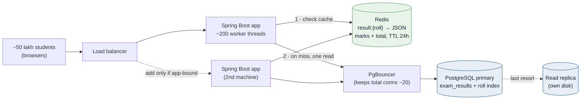
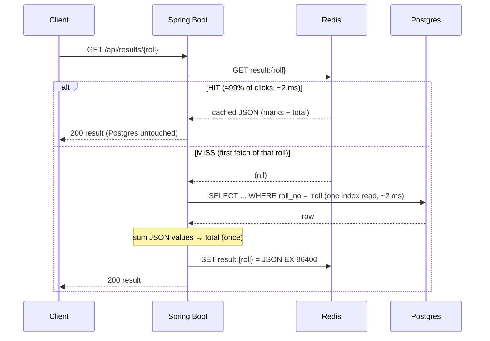
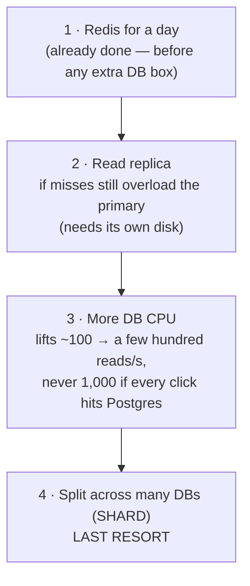

# Exam Result App — Step-by-Step Design & Capacity Plan

A build-and-scale guide for a **read-heavy, results-day** system: ~50 lakh
(5,000,000) students all open *"my result"* on a known day at roughly
**~1,000 requests/sec**. Each user sends a roll number and gets back name,
per-subject marks, total, and pass/fail from **a row that never changes** — so
it can be cached for a day.

> The 10 lakh (1,000,000) numbers appear next to the 50 lakh numbers
> throughout. The **method is identical**; only the student count changes.

**Stack:** Spring Boot (Java) · PostgreSQL · Redis · JMeter + pgbench for load.

**How to read this doc:** we do **nothing** numeric until the schema is final
and the one timing assumption is stated, because every later number is derived
from those two things. Then we go in a fixed order — **disk → DB RAM → Redis
RAM → DB connections → app → cache** — and each step opens with *why it follows
from the previous one*. No number appears without the step that produced it.

---

## 1. Finalize the database schema (do this before any calculation)

Marks are **multiple subjects as key→value pairs**, stored as **JSONB**. The
**total** is the sum of the values. Locking this now matters because the size
of one row is the seed for disk, RAM, and Redis sizing later — change the schema
and every downstream number moves.

```sql
-- schema.sql
CREATE TABLE exam_results (
    roll_no      BIGINT       PRIMARY KEY,     -- lookup key (PK ⇒ already indexed)
    student_name TEXT         NOT NULL,
    marks        JSONB        NOT NULL,        -- {"mathematics":87,"physics":72,...}
    status       VARCHAR(4)   NOT NULL,        -- 'PASS' | 'FAIL'
    published_on DATE         NOT NULL
);
```

A stored row looks like:

```json
{
  "roll_no": 4231765,
  "student_name": "Rajesh Kumar Verma",
  "marks": { "mathematics": 87, "physics": 72, "chemistry": 90,
             "english": 78, "computer_science": 95, "hindi": 81 },
  "status": "PASS",
  "published_on": "2026-05-20"
}
```

### Where do we compute the total? — in the app, once, not per read

We *could* sum inside SQL on every request:

```sql
-- works, but makes the hot read do extra work on every single call
SELECT roll_no, student_name, marks, status, published_on,
       (SELECT sum(v::int) FROM jsonb_each_text(marks) AS e(k, v)) AS total_marks
FROM exam_results
WHERE roll_no = :roll;
```

We deliberately **do not** do that. The whole capacity model (from §2 onward)
assumes the hot read is a **plain single-row index lookup**. If we bolt an
aggregation onto every read, the "a few ms" assumption stops being true. Since
a published row never changes, we instead:

1. fetch the row with a plain point lookup,
2. sum the JSON values **once** in Java, and
3. cache the finished object (marks **and** total) in Redis.

```java
int total = marks.values().stream().mapToInt(Integer::intValue).sum();
```

So the total is computed at most once per student (on the cache miss), then
served from cache forever after. **The database read stays trivial** — which is
exactly the property the next step depends on.

---

## 2. The one timing assumption everything rests on

**Assume a single point read takes a few milliseconds — we'll use ~2 ms.**

This is the *idle* latency of one indexed single-row lookup (Redis hit, or a
warm Postgres `Index Scan`). It is the number the entire throughput model is
built on, so we state it up front rather than discovering it halfway through:

```
one read ≈ 2 ms  ⇒  one worker/connection ≈ 1 / 0.002 = 500 reads per second
```

Two honest caveats, carried forward:

- **Latency grows under load.** 2 ms is the *quiet* case. When many requests
  pile up, each read slows down — that rise is precisely what we go looking for
  with pgbench in Step 4.
- **"A read" means one row, warm.** It is *not* an aggregate scan, and it is
  *not* the whole HTTP request (which also spends time on the framework, JSON
  serialization, and the network). We keep those separate as they come up.

Everything below flows from these two facts: **row shape (§1)** and **one read
≈ 2 ms (§2)**.

---

## 3. Size of one row (derived from §1)

Disk, RAM, and Redis all start from the size of a single row, so we compute it
before touching any of them.

| Part of the row | Rough bytes |
|---|---|
| Postgres tuple header + alignment | ~24 |
| `roll_no` (bigint) | 8 |
| `student_name` (text, ~20–30 chars) | ~30 |
| `marks` JSONB (~6–8 subjects, keys + values + JSONB overhead) | ~160–250 |
| `status` (varchar 4) | ~5 |
| `published_on` (date) | 4 |
| **Logical row total** | **~230–320 bytes** |

We round **up to ~0.5 KB per row** for planning headroom (longer names, more
subjects, JSONB structure). That is the single seed number:

> **one row ≈ 0.5 KB**  — everything in §5–§7 multiplies this.

If your rows are fatter (say ~1 KB with 15 subjects and long names), scale
every disk/Redis figure below **linearly** — the method doesn't change, only
this seed does. After real data exists you stop guessing and **measure** (§8).

---

## 4. Architecture & request flow





- **Hit** = roll already in Redis → no DB query, no re-summing.
- **Miss** = one Postgres read, sum the total once, write to Redis, return.
- **Correction** = delete that one key; it repopulates on next read.

---

## 5. Spring Boot implementation

### 5.1 Entity + DTO (marks as JSONB, total precomputed)

```java
// ExamResult.java
@Entity
@Table(name = "exam_results")
public class ExamResult {

    @Id
    @Column(name = "roll_no")
    private Long rollNo;

    @Column(name = "student_name", nullable = false)
    private String studentName;

    // Hibernate 6 maps a Map<String,Integer> straight to jsonb:
    @JdbcTypeCode(SqlTypes.JSON)
    @Column(name = "marks", columnDefinition = "jsonb", nullable = false)
    private Map<String, Integer> marks;

    @Column(nullable = false, length = 4)
    private String status;

    @Column(name = "published_on", nullable = false)
    private LocalDate publishedOn;

    // getters / setters / no-arg constructor omitted
}
```

```java
// ResultDto.java — cached & returned; total summed once, here
public record ResultDto(
        long rollNo,
        String studentName,
        Map<String, Integer> marks,
        int totalMarks,
        String status,
        LocalDate publishedOn) {

    static ResultDto from(ExamResult r) {
        int total = r.getMarks().values().stream()
                     .mapToInt(Integer::intValue).sum();   // sum the JSON values
        return new ResultDto(r.getRollNo(), r.getStudentName(),
                             r.getMarks(), total, r.getStatus(), r.getPublishedOn());
    }
}
```

### 5.2 Repository

```java
// ExamResultRepository.java
public interface ExamResultRepository extends JpaRepository<ExamResult, Long> {

    // Streamed read for optional cache preload (§10 caching notes).
    @QueryHints(@QueryHint(name = HINT_FETCH_SIZE, value = "5000"))
    @Query("select r from ExamResult r")
    Stream<ExamResult> streamAll();
}
```

### 5.3 Redis config + service (cache-aside)

```java
// RedisConfig.java
@Configuration
public class RedisConfig {
    @Bean StringRedisTemplate stringRedisTemplate(RedisConnectionFactory cf) {
        return new StringRedisTemplate(cf);
    }
    @Bean ObjectMapper objectMapper() {
        return new ObjectMapper().registerModule(new JavaTimeModule());
    }
}
```

```java
// ResultService.java
@Service
public class ResultService {

    private static final Duration TTL = Duration.ofHours(24);
    private static String key(long roll) { return "result:" + roll; }

    private final ExamResultRepository repo;
    private final StringRedisTemplate redis;
    private final ObjectMapper json;

    public ResultService(ExamResultRepository repo, StringRedisTemplate redis,
                         ObjectMapper json) {
        this.repo = repo; this.redis = redis; this.json = json;
    }

    /** Hot path: ~99% return here in ~2 ms without touching Postgres. */
    public ResultDto getResult(long rollNo) {
        String cached = redis.opsForValue().get(key(rollNo));
        if (cached != null) return read(cached);                 // HIT

        ExamResult row = repo.findById(rollNo)                   // MISS: one read
                .orElseThrow(() -> new ResultNotFoundException(rollNo));
        ResultDto dto = ResultDto.from(row);                     // sum total once
        redis.opsForValue().set(key(rollNo), write(dto), TTL);   // populate
        return dto;
    }

    /** After a mark correction: drop exactly one key. */
    public void invalidate(long rollNo) { redis.delete(key(rollNo)); }

    private String write(ResultDto d) {
        try { return json.writeValueAsString(d); }
        catch (JsonProcessingException e) { throw new IllegalStateException(e); }
    }
    private ResultDto read(String s) {
        try { return json.readValue(s, ResultDto.class); }
        catch (JsonProcessingException e) { throw new IllegalStateException(e); }
    }
}
```

### 5.4 Controller + `application.yml`

```java
@RestController
@RequestMapping("/api/results")
public class ResultController {
    private final ResultService service;
    public ResultController(ResultService service) { this.service = service; }

    @GetMapping("/{rollNo}")
    public ResultDto get(@PathVariable long rollNo) {
        return service.getResult(rollNo);
    }
}
```

```yaml
spring:
  datasource:
    url: jdbc:postgresql://pgbouncer:6432/exams
    hikari:
      maximum-pool-size: 20      # = the pgbench knee (§8), NOT max_connections
      minimum-idle: 20
  data:
    redis: { host: cache, port: 6379 }
server:
  tomcat:
    threads:
      max: 200                   # 200 = served AT ONCE, not 200/sec (§9)
```

Every value above (`20`, `200`) is *produced* by a step below, not guessed.

---

# The fixed-order sizing steps

## Step 1 — Database disk

**Why disk is first:** it answers the most basic question — *how much do we
store?* — and it needs nothing but the row size we already have (§3). It tells
us nothing about speed yet; that's deliberate. One question at a time.

**Rule:** `one row × students × 3`.

- Seed: **one row ≈ 0.5 KB** (§3).
- Multiply by students, then pad **×3** for Postgres per-row bookkeeping,
  unpacked pages, and the roll index:

| Students | `0.5 KB × N × 3` | Disk |
|---|---|---|
| 10 lakh (1M) | `0.5 KB × 1,000,000 × 3` | **~1.5 GB** |
| 50 lakh (5M) | `0.5 KB × 5,000,000 × 3` | **~7.5 GB** |

`×3` is a **safe first guess**, not a low one (a thin table + one index is often
really 1.5–2×). Note this is *smaller* than a flat-1-KB estimate would give —
the measured JSON row is genuinely under 1 KB, and **50 lakh rows is still
tiny**, which will matter when we resist over-engineering later.

**This number is not RAM and not connections.** A second DB copy needs the same
again; backups live elsewhere. Once data exists, replace the guess:

```sql
SELECT pg_size_pretty(pg_total_relation_size('exam_results'));
```

---

## Step 2 — Database RAM

**Why RAM follows disk:** Step 1 told us how much data exists, but disk is slow.
The instant we care about *speed*, the real question becomes *what must sit in
memory so reads don't wait on disk?* That "what must be in memory" set is
derived directly from Step 1's number — so RAM can only be sized after disk,
never before.

**Rule:** `(data we keep reading + indexes we keep using) × 2`.

We know the hot set **without any graphs**: every request is one lookup in
`exam_results` by roll number using the roll index (§1). So the hot set is
essentially *that table + that one index* = the **~1.5 GB / ~7.5 GB** from
Step 1. Admin screens, logs, and leftovers are cold and excluded. The **×2**
leaves room for the OS, Postgres itself, and per-connection RAM, so we never
fill the box to the brim.

| Plan | Hot set (from Step 1) | RAM (×2) | Box |
|---|---|---|---|
| 10 lakh | ~1.5 GB | ~3 GB | **4 GB** comfortable (2 GB if Postgres-only) |
| 50 lakh | ~7.5 GB | ~15 GB | **16 GB** |

Two things this step quietly establishes for later:

- **`shared_buffers` ≈ a quarter of RAM**; the rest is left to the **OS page
  cache**, where the table mostly lives. Don't try to force all data into one
  Postgres setting.
- **Connections cost RAM too.** 20 busy connections is nothing, but 200
  *allowed* connections each reserving RAM can eat the box even with this small
  table — the first hint that we must **cap** connections (Step 4).

---

## Step 3 — Redis RAM

**Why Redis RAM comes next:** the plan is to answer almost every read from Redis
(Step 6), so Redis must physically hold ~every result. That's a memory question
with the same shape as Step 2 — and it's *separate* memory from Postgres — so we
size it now, right after DB RAM, while the per-row number is in hand.

**Rule:** `students × size-of-one-result × 2`. The cached object is the DTO
(marks JSON **+** total), ≈ **0.5 KB** serialized.

| Plan | `N × 0.5 KB × 2` | Redis RAM |
|---|---|---|
| 10 lakh | `1,000,000 × 0.5 KB × 2` | **~1 GB** |
| 50 lakh | `5,000,000 × 0.5 KB × 2` | **~5 GB** |

Double it if a result is ~1 KB. Once data exists, measure and multiply:

```bash
redis-cli MEMORY USAGE result:4231765   # real bytes of one key
redis-cli DBSIZE                          # keys held
```

We've now answered *"how big is the box?"* three times (disk, DB RAM, Redis
RAM). The next two steps switch to the **other** question: *how many people can
we serve at once?*

---

## Step 4 — Database connections (measure with pgbench)

**Why connections come before the app:** the app will open a pool of DB
connections, so we must first learn how many connections Postgres can *usefully*
run at once. Sizing the app first would be guessing at a ceiling we haven't
measured. And this is the step where the **§2 assumption gets tested**: 2 ms is
the quiet case — pgbench shows what happens under load.

**Go database-first with pgbench** — not JMeter, and not pgbench's default
banking script. Use the **real lookup**.

**4a. Make one read fast (confirm the §2 assumption holds):**

```sql
EXPLAIN ANALYZE
SELECT roll_no, student_name, marks, status, published_on
FROM exam_results WHERE roll_no = 4231765;
-- want: Index Scan using exam_results_pkey ...   (NOT Seq Scan)
```

If it's a `Seq Scan`, the "2 ms" premise is already false — *if one read is
slow, 20 connections are just slow together.* Add the index and re-check:

```sql
CREATE INDEX idx_exam_results_roll ON exam_results (roll_no);  -- if not the PK
```

**4b. Ramp clients and watch for the knee:**

```sql
-- lookup.sql
\set roll random(1, 5000000)
SELECT roll_no, student_name, marks, status, published_on
FROM exam_results WHERE roll_no = :roll;
```

```bash
for c in 1 10 20 50 100; do
  pgbench -n -f lookup.sql -c "$c" -j "$c" -T 60 -P 10 exams
done
```

Watch **tps** (reads finished/sec), **latency** (time per read), and **failed
transactions** (must stay **0**). A representative run:

| clients `-c` | tps | latency |
|---|---|---|
| 1 | 500 | ~2 ms ← the §2 assumption |
| 10 | 2,800 | 3.5 ms |
| 20 | **3,000** | 6 ms |
| 50 | 3,050 | 16 ms |
| 100 | ~3,050 (flat) | 35 ms |

Notice the story ties back to §2: at `-c 1` one connection does `1/0.002 = 500`
reads/sec at ~2 ms — exactly the assumption. As clients climb, latency grows
(the caveat from §2), tps rises, then **flattens ~3,050 at the knee ≈ 20**;
`20 × (1/0.006 s) ≈ 3,300` matches the plateau. Past the knee, 50/100 clients
add no throughput and only slow every read.

**Conclusion:** the app opens **~20 connections** (or PgBouncer passes ~20
through); `max_connections` sits a little above, **~30**, for admin headroom.

**4c. Two numbers people confuse:** `-c` (clients you *sent in* during the test)
is **not** `max_connections` (the server's door limit).

```sql
SHOW max_connections;
```

A huge `max_connections` makes the DB **slower**, not faster — it lets too many
reads in at once. And `(cores × 2) + 1` is only a rough cap on usefully-busy
connections, **not** "students you can serve" — don't buy cores as the first fix.

---

## Step 5 — The app in front (measure with JMeter)

**Why the app is sized after connections:** now that we know Postgres tops out
around ~20 useful connections, we can reason about the app *feeding* it without
guessing. This step also carries the single most misunderstood idea in the whole
plan — so we test the real endpoint with JMeter (10, 50, 100 rps, then higher
until something breaks) and hold one distinction firmly.

**App workers and requests-per-second are different limits:**

```
users  →  ~200 app workers  →  ~20 DB connections  →  max_connections 30
```

**200 workers = 200 people served _at the same time_, not 200 per second.**
Using §2's ~2 ms per request: one worker finishes `1/0.002 = 500` requests/sec;
200 workers do `200 × 500 = 100,000` rps **in theory**:

```
rps  =  workers / time-per-request
```

So to serve **1,000 rps at ~2 ms** you need only `1,000 × 0.002 = 2` workers
busy. A pool of 200 is **spare chairs** for bursts and slower (miss) requests —
not a per-second number.

**Therefore, do NOT add five app machines "because 200 < 1,000."** That compares
*at the same time* with *per second* — different units. Worse, five apps each
opening 20 connections = **100 connections**, which overloads the ~20-useful
Postgres from Step 4. If you *do* add app machines, keep **total** connections
to Postgres near 20 (PgBouncer in front, or fewer per app).

**Detect app-bound vs DB-bound without Grafana** — run the same JMeter plan on
one app, then two identical apps:

| Result of one-app → two-apps | Meaning | Action |
|---|---|---|
| rps ~doubles, latency holds | app was full | **app-bound** → add machines |
| rps stays flat | both wait on the same DB | **DB-bound** → cache / replica |

Cross-check with `top`: app CPU **high** + DB **calm** = app-bound; app CPU
**low** + still **slow** = DB-bound.

---

## Step 6 — Redis: keep every result for a day

**Why this comes last and ties it together:** Steps 4–5 sized the DB path for
*misses and bursts*. This step is what makes that path almost idle in steady
state — it's the reason ~200 workers serve 1,000+ rps while Postgres sees a
trickle. Once a result is read it won't change, so we cache it under the
roll-number key for ~24h (flow in §4). Delete one key if a mark is corrected.

**The subtle point — there is no small "hot subset."** Each student wants
*their own* roll number; no rolls are shared. So at go-live **many different
rolls miss at once** (first wave hits the DB; each roll is cached after its
first fetch). To get **99% hits across 100 random students, Redis must already
hold ~99% of _all_ rolls** — i.e. keep ~10 lakh / 50 lakh keys. That's why:

```
cache size = all students × 0.5 KB × 2      and you plan for 100% of results
```

Aiming at 99% does **not** buy a smaller box: `0.99 ×` the same number is still
~1 GB / ~5 GB (matching Step 3). You *reach* 99% by giving Redis enough memory
for every result (too small → eviction → re-misses → you never hold 99%),
writing on first read (or **preloading** before opening if 99% must hold at
t=0), and keeping entries for a day.

**The payoff, quantified:** at **1,000 rps and 99% hits** the database sees only
**~10 reads/sec** (at 99.9%, ~1/sec). Compare that to the ~3,000/sec ceiling we
measured in Step 4 — so the 20 connections and the RAM exist for **misses, the
first wave, and admin**, not for 1,000 reads/sec all day. The box is idle by
design.

---

## 7. Verify under fake traffic (replace guesses with truth)

```sql
SELECT pg_size_pretty(pg_relation_size('exam_results'));          -- table only
SELECT pg_size_pretty(pg_total_relation_size('exam_results'));    -- table + index

-- hot? high reads / index scans:
SELECT relname, n_tup_read, idx_scan FROM pg_stat_user_tables
WHERE relname = 'exam_results';
-- index used? idx_scan = 0 ⇒ drop candidate, not in RAM:
SELECT indexrelname, idx_scan FROM pg_stat_user_indexes
WHERE relname = 'exam_results';
-- served from memory vs disk? many hits / few reads ⇒ it fits:
SELECT heap_blks_hit, heap_blks_read FROM pg_statio_user_tables
WHERE relname = 'exam_results';
SHOW max_connections;
```

```bash
redis-cli INFO stats | grep keyspace   # keyspace_hits vs keyspace_misses
```

---

## 8. Scaling escalation ladder (only after the steps above)



| Symptom | Fix |
|---|---|
| app CPU full **+** DB idle | more app machines |
| same rows read repeatedly | Redis, for a day |
| DB still busy **after** Redis | a second copy, or a bigger box |
| genuine size / write problem | split the data (rare) |

Extra app machines on a **tired primary won't help** (that's DB-bound), and
**sharding is a last resort** — 50 lakh JSONB rows is *small* (Step 1); split
only for a real size/write problem, never because many people click at once.

---

## 9. Results-day realities & test discipline

- 50 lakh people at a perfectly even 1,000/sec take `5,000,000 / 1,000 ≈ 80
  minutes` — but they **won't** arrive evenly. Plan for a **short burst above
  1,000/sec**, or **queue** the path that still hits the DB.
- **Change exactly one thing per test** — connections, *or* app count, *or*
  Redis — never all at once, or you can't tell what moved the number.

---

## 10. The finished capacity plan (the payoff — derived, not assumed)

Everything here traces back to **§1 (schema)** and **§2 (~2 ms read)**:

| Dimension | Rule | 10 lakh | 50 lakh | From |
|---|---|---|---|---|
| DB disk | `row × students × 3` | ~1.5 GB | ~7.5 GB | Step 1 |
| DB RAM | `(table + index) × 2` | ~4 GB box | ~16 GB box | Step 2 |
| Redis RAM | `students × result × 2` | ~1 GB | ~5 GB | Step 3 |
| Busy DB connections | pgbench knee | ~20 | ~20 | Step 4 |
| `max_connections` | knee + headroom | ~30 | ~30 | Step 4 |
| App workers | concurrency pool | ~200 | ~200 | Step 5 |
| Workers busy @ 1,000 rps | `rps × 0.002` | ~2 | ~2 | Step 5 |
| Cache hit target | hold ~all keys, TTL 24h | ~99% | ~99% | Step 6 |
| DB load @ 99% hits | `rps × (1 − hit)` | ~10/s | ~10/s | Step 6 |

**Build checklist**

- [ ] Schema **finalized first**: `marks` JSONB, total summed **in the app**,
  read stays a plain index lookup.
- [ ] State the assumption: **one read ≈ 2 ms** (verify it's an `Index Scan`).
- [ ] **Disk** `row × students × 3` → ~1.5 / ~7.5 GB, then measure.
- [ ] **DB RAM** `(table + index) × 2` → ~4 / ~16 GB; `shared_buffers` ≈ ¼.
- [ ] **Redis RAM** `students × result × 2` → ~1 / ~5 GB (separate memory).
- [ ] **pgbench** ramp → knee (~20) → Hikari pool ~20, `max_connections` ~30.
- [ ] **JMeter** one-app-vs-two → app-bound vs DB-bound. Remember **200 workers
  ≠ 200/sec** — don't add five apps because 200 < 1,000.
- [ ] **Redis holds every result for a day** (preload if 99% must hold at t=0);
  invalidate one key per correction.
- [ ] Second DB copy only if still needed. **Sharding almost never** here.

---

*Derived from the "General Rules for Scaling (Exam Results)" playbook, applied
to a Spring Boot + PostgreSQL + Redis implementation with a JSONB marks schema.*