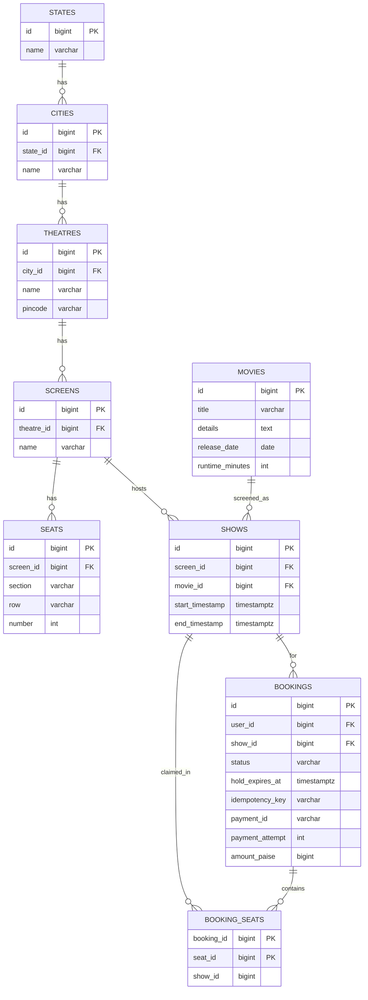
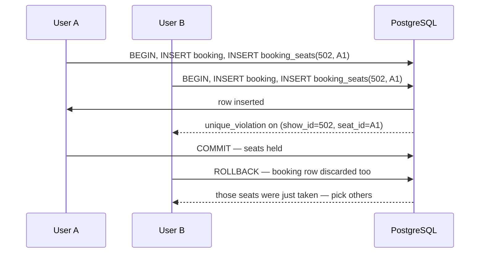
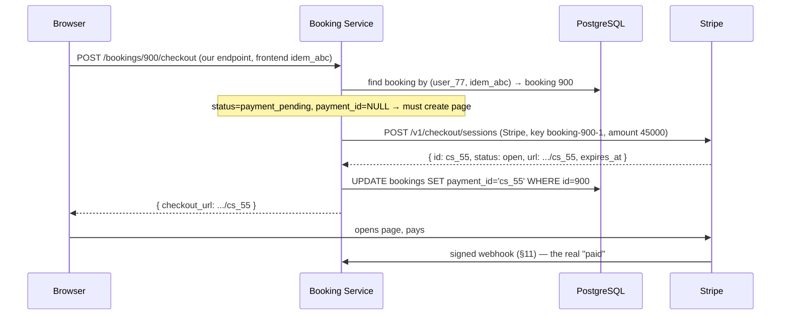
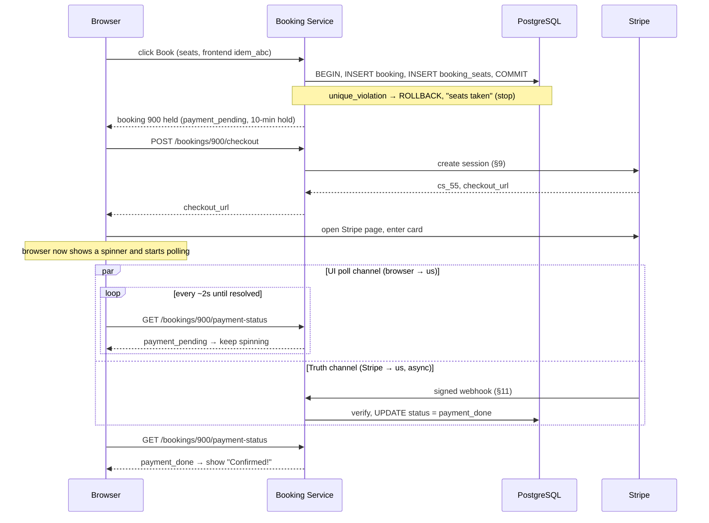
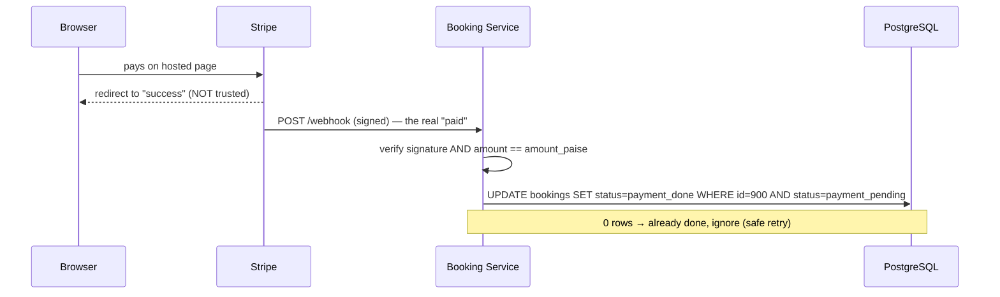
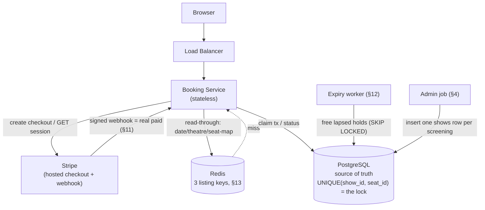

# Distributed Cinema Booking System — System Design

This doc explains how to design a Ticketmaster / BookMyShow-style cinema seat-booking service, one piece at a time. Each
component gets two parts: **the idea** (what it does and why, in plain language) and **the details** (the actual
mechanics, numbers, and code). Read it in order — later sections assume you've read the earlier ones.

---

## Contents

1. [The problem](#1-the-problem)
2. [The one hard rule](#2-the-one-hard-rule)
3. [The cast: what each piece does](#3-the-cast-what-each-piece-does)
4. [The database tables](#4-the-database-tables)
5. [Finding a show — the browse queries](#5-finding-a-show--the-browse-queries)
6. [Claiming seats — the unique-insert trick](#6-claiming-seats--the-unique-insert-trick)
7. [The hold — booking without paying yet](#7-the-hold--booking-without-paying-yet)
8. [Idempotency — surviving double-taps](#8-idempotency--surviving-double-taps)
9. [Paying — the Stripe checkout page](#9-paying--the-stripe-checkout-page)
10. [The full click-to-confirmation flow](#10-the-full-click-to-confirmation-flow)
11. [The webhook — the real "paid"](#11-the-webhook--the-real-paid)
12. [Freeing expired holds — the expiry job](#12-freeing-expired-holds--the-expiry-job)
13. [Browsing — the read path and Redis](#13-browsing--the-read-path-and-redis)
14. [Reconciliation & the helpline](#14-reconciliation--the-helpline)
15. [How big does this need to be?](#15-how-big-does-this-need-to-be)
16. [Architecture recap](#16-architecture-recap)
17. [Scaling order](#17-scaling-order)
18. [How to build this in stages](#18-how-to-build-this-in-stages)
19. [The "don't do this" list](#19-the-dont-do-this-list)
20. [One-paragraph summary](#20-one-paragraph-summary)

---

## 1. The problem

A cinema booking system lets a user pick a movie, a day, a theatre, a show time, and then some seats — and pay for them.

That sounds like a shopping cart. What makes it genuinely hard is a single rule that the shopping-cart model gets wrong.

The user's journey narrows step by step:

```text
movie  →  day  →  theatre  →  show time  →  seats  →  pay
```

Everything else in this design exists to make one guarantee hold under heavy concurrent load: **two people can never end
up holding the same seat for the same screening.**

---

## 2. The one hard rule

> Two people can never get the same chair for the same screening.

Note the careful wording — "for the same screening," not "ever." The same physical chair (say, seat `H12` in screen 3)
is booked over and over, once per show. What must never happen is *two live claims on the same chair for the same show*.

This shapes the entire data model, and it leads to the single most important decision in the design:

> There is no "sold" flag on a seat. A seat is taken **precisely when** a row exists claiming it for that show — and
> nowhere else.

We never copy the 500 physical chairs of a hall into a per-show table and flip a `sold` boolean. Instead, a seat's
status for a show is *derived*: the seat is free if and only if no row claims it. That "row exists = taken" model is
what lets a database uniqueness constraint enforce the hard rule for us, with no locking machinery of our own (§6).

---

## 3. The cast: what each piece does

Here's every component this doc covers, in one line each. Come back to this table whenever you forget what something
does.

| Component                     | What it does                                                                                                       |
|-------------------------------|--------------------------------------------------------------------------------------------------------------------|
| **Browser / client**          | Shows listings and the seat map; sends Book/Pay requests. Never trusted to say "I paid."                           |
| **Booking Service**           | Stateless app tier. Runs the claim transaction, talks to Stripe, serves reads.                                     |
| **PostgreSQL**                | The source of truth. Holds every show, booking, and seat claim. The uniqueness constraint here *is* the seat lock. |
| **Redis**                     | A read cache for the three listing pages (dates, theatres, seat map). A picture, never the ticket.                 |
| **Stripe** (payment provider) | Owns the actual charge. Hosts the checkout page and sends the authoritative "paid" webhook.                        |
| **Expiry worker**             | Background job that frees seats whose hold ran out before payment.                                                 |
| **Admin job**                 | Inserts one `shows` row per screening from a date range; never deletes shows that already sold tickets.            |

The recurring theme: **Postgres is the truth, Redis is a picture, and the browser is never trusted.**

---

## 4. The database tables

It's worth seeing the schema up front, because every component below reads or writes it. The layout mirrors the real
world — city → theatre → screen → seat — with shows and bookings layered on top.



*Fig. 1 — `seats` is layout only (no status). A seat's status for a show lives entirely in whether a `booking_seats` row
exists for that `(show_id, seat_id)`.*

The key points, table by table:

- **`states`** — the top of the location hierarchy, so a city always belongs to a state (and city names can repeat
  across states).
- **`cities`** — `UNIQUE(name, state_id)`, so the same city name can exist in two different states (there's more than
  one "Springfield").
- **`theatres`** — carry a `pincode` so we can find theatres *near* a user.
- **`screens`** and **`seats`** — `seats` has `UNIQUE(screen_id, section, row, number)` and is **layout only, no status
  column**. This is the "no sold flag" decision from §2.
- **`movies`** — carry `title`, a free-text `details` blurb, `release_date`, and `runtime_minutes` (used to compute a
  show's end time).
- **`shows`** — one row per screening. `UNIQUE(screen_id, start_timestamp)` means one film per hall per start time.
  `end_timestamp` is set to `start + runtime` at creation. A show is one screening — this film, this hall, this start
  time — so `2 Sep 14:00` and `2 Sep 22:00` are two different `show_id`s, which is why seat `A1` can be sold before the
  14:00 show and again before the 22:00 show.
- **`bookings`** — the one-per-checkout record. Carries `show_id` (which screening this booking is for), plus a `status`
  `CHECK` in (`payment_pending`, `payment_done`, `cancelled`, `expired`), `hold_expires_at`, `idempotency_key`,
  `payment_id`, `payment_attempt` (a counter bumped each time we deliberately create a fresh pay page — see §9), and
  `amount_paise`.
- **`booking_seats`** — the join row that *is* the seat claim. `PK(booking_id, seat_id)`, with `show_id` copied onto the
  row, `ON DELETE CASCADE`, and an index on `show_id`.

```sql
-- ============================================================
--  Location hierarchy: states → cities → theatres → screens → seats
-- ============================================================

CREATE TABLE states
(
    id   BIGINT GENERATED ALWAYS AS IDENTITY PRIMARY KEY,
    name VARCHAR(64) NOT NULL UNIQUE
);

CREATE TABLE cities
(
    id       BIGINT GENERATED ALWAYS AS IDENTITY PRIMARY KEY,
    state_id BIGINT      NOT NULL REFERENCES states (id),
    name     VARCHAR(64) NOT NULL,
    UNIQUE (name, state_id) -- same city name can exist in two states
);

CREATE INDEX idx_cities_state ON cities (state_id);

CREATE TABLE theatres
(
    id      BIGINT GENERATED ALWAYS AS IDENTITY PRIMARY KEY,
    city_id BIGINT       NOT NULL REFERENCES cities (id),
    name    VARCHAR(128) NOT NULL,
    pincode VARCHAR(12)  NOT NULL -- used to find theatres "near" a user
);

CREATE INDEX idx_theatres_city ON theatres (city_id);
CREATE INDEX idx_theatres_pincode ON theatres (pincode); -- browse-by-pincode (§5)

CREATE TABLE screens
(
    id         BIGINT GENERATED ALWAYS AS IDENTITY PRIMARY KEY,
    theatre_id BIGINT      NOT NULL REFERENCES theatres (id),
    name       VARCHAR(64) NOT NULL,
    UNIQUE (theatre_id, name) -- same screen name shouldn't duplicate within a theatre
);

CREATE INDEX idx_screens_theatre ON screens (theatre_id);

CREATE TABLE seats
(
    id        BIGINT GENERATED ALWAYS AS IDENTITY PRIMARY KEY,
    screen_id BIGINT      NOT NULL REFERENCES screens (id),
    section   VARCHAR(32) NOT NULL,
    row       VARCHAR(8)  NOT NULL,
    number    INT         NOT NULL,
    UNIQUE (screen_id, section, row, number) -- layout only, NO status column
);

CREATE INDEX idx_seats_screen ON seats (screen_id);
-- seat-map query (§5, §13)

-- ============================================================
--  Catalogue: movies, shows
-- ============================================================

CREATE TABLE movies
(
    id              BIGINT GENERATED ALWAYS AS IDENTITY PRIMARY KEY,
    title           VARCHAR(256) NOT NULL,
    details         TEXT, -- synopsis / cast / free-text blurb
    release_date    DATE         NOT NULL,
    runtime_minutes INT          NOT NULL
);

CREATE TABLE shows
(
    id              BIGINT GENERATED ALWAYS AS IDENTITY PRIMARY KEY,
    screen_id       BIGINT      NOT NULL REFERENCES screens (id),
    movie_id        BIGINT      NOT NULL REFERENCES movies (id),
    start_timestamp TIMESTAMPTZ NOT NULL,
    end_timestamp   TIMESTAMPTZ NOT NULL, -- start + runtime, set at creation
    UNIQUE (screen_id, start_timestamp)   -- one film per hall per start
);

CREATE INDEX idx_shows_movie_start ON shows (movie_id, start_timestamp); -- date-strip / theatre-list (§5)
CREATE INDEX idx_shows_screen ON shows (screen_id);

-- ============================================================
--  Users
-- ============================================================

CREATE TABLE users
(
    id         BIGINT GENERATED ALWAYS AS IDENTITY PRIMARY KEY,
    name       VARCHAR(128) NOT NULL,
    email      VARCHAR(256) NOT NULL UNIQUE,
    created_at TIMESTAMPTZ  NOT NULL DEFAULT now()
);

-- ============================================================
--  Bookings + the seat claim (the lock lives here)
-- ============================================================

CREATE TABLE bookings
(
    id              BIGINT GENERATED ALWAYS AS IDENTITY PRIMARY KEY,
    user_id         BIGINT      NOT NULL REFERENCES users (id),
    show_id         BIGINT      NOT NULL REFERENCES shows (id),
    status          VARCHAR(16) NOT NULL
        CHECK (status IN ('payment_pending', 'payment_done', 'cancelled', 'expired')),
    hold_expires_at TIMESTAMPTZ,
    idempotency_key VARCHAR(64) NOT NULL,
    payment_id      VARCHAR(64),
    payment_attempt INT         NOT NULL DEFAULT 1, -- bumped only when we mint a NEW pay page (§9)
    amount_paise    BIGINT      NOT NULL
);

-- One Book attempt from a user can't create two bookings (§8).
CREATE UNIQUE INDEX idx_bookings_idem
    ON bookings (user_id, idempotency_key);

-- Partial index the expiry job scans (§12).
CREATE INDEX idx_bookings_pending
    ON bookings (status, hold_expires_at) WHERE status = 'payment_pending';

CREATE TABLE booking_seats
(
    booking_id BIGINT NOT NULL REFERENCES bookings (id) ON DELETE CASCADE,
    seat_id    BIGINT NOT NULL REFERENCES seats (id),
    show_id    BIGINT NOT NULL, -- copied onto the row so the UNIQUE is simple
    PRIMARY KEY (booking_id, seat_id)
);

-- THE LOCK. This one line is the entire concurrency mechanism (§6).
CREATE UNIQUE INDEX idx_booking_seats_claim
    ON booking_seats (show_id, seat_id);

CREATE INDEX idx_booking_seats_show ON booking_seats (show_id);
```

Three things to say out loud about this schema:

1. **Seats have no status.** A chair is free precisely when no `booking_seats` row exists for it on that screen for this
   show.
2. **We never copy all 500 chairs into a table per show.** The seat map is always computed per `show_id`, not stored per
   hall.
3. **`UNIQUE(show_id, seat_id)` is the lock** — with no separate locking machinery, because Postgres simply refuses the
   second insert.

---

## 5. Finding a show — the browse queries

### The idea

Before a user ever claims a seat, they walk down the funnel — movie → date → theatre → show time — and each step is a
plain read. These reads are served through Redis (§13 covers the caching), but underneath each cached page is a SQL
query, and it's worth seeing them in order, because they explain what the seat-map step is actually working from.

### The details

The funnel is four reads. Each narrows the choice using the row the previous step returned.

```text
movie page  →  date strip  →  theatre + times  →  seat map  →  (then claim, §6)
```

**Step 1 — the movie.** The user opens a film's page; we show its details and (from their location) a pincode to search
near.

```sql
SELECT id, title, details, release_date, runtime_minutes
FROM movies
WHERE id = $movie_id;
```

**Step 2 — which dates have shows** near the user. "Near" is the pincode; a date qualifies if at least one show exists
that day in a theatre with that pincode. This is the `date_string` page.

```sql
SELECT DISTINCT sh.start_timestamp::date AS show_date
FROM shows sh
         JOIN screens sc ON sc.id = sh.screen_id
         JOIN theatres t ON t.id = sc.theatre_id
WHERE sh.movie_id = $movie_id
  AND t.pincode = $pincode
  AND sh.start_timestamp >= now()
ORDER BY show_date;
```

**Step 3 — which theatres, and at what times**, once the user picks a date. This is the `threatre_list` page: each
theatre near them showing the film that day, with its show times and timeline details.

```sql
SELECT t.id  AS theatre_id,
       t.name,
       sc.id AS screen_id, -- feeds into the seat-map query
       sh.id AS show_id,
       sh.start_timestamp,
       sh.end_timestamp    -- exposed for UI timeline display (e.g. 14:00 - 16:30)
FROM shows sh
         JOIN screens sc ON sc.id = sh.screen_id
         JOIN theatres t ON t.id = sc.theatre_id
WHERE sh.movie_id = $movie_id
  AND t.pincode = $pincode
  AND sh.start_timestamp::date = $date
ORDER BY t.name, sh.start_timestamp;
```

**Step 4 — the seat map** for the one show time they picked. This is the only step that touches `booking_seats`, and it
computes "taken" from whether a claim row exists — the read-side mirror of the write-side rule (§2). It's covered in
full in §13, but here's the query the funnel ends on:

```sql
SELECT s.id,
       s.section,
       s.row,
       s.number,
       (bs.seat_id IS NOT NULL) AS taken
FROM seats s
         LEFT JOIN booking_seats bs
                   ON bs.seat_id = s.id AND bs.show_id = $show_id
WHERE s.screen_id = $screen_id;
```

Notice what each step hands to the next: the movie page gives a `movie_id`, the date strip gives a `date`, the theatre
list gives a `show_id`, a `screen_id`, and the show timeline (`start_timestamp` and `end_timestamp`), and the seat map
is computed for exactly that `show_id` and `screen_id`. By the time the user claims (§6), the system already knows the
one screening they're booking. None of these four reads takes a lock — they're all plain `SELECT`s, which is why they
cache so cleanly (§13).

---

## 6. Claiming seats — the unique-insert trick

### The idea

Claiming seats is the heart of the whole design. The naive approach is to first `SELECT` to check if a seat is free,
then `INSERT` if it is. That's a race: two requests can both read "free" a millisecond apart, and both proceed. The fix
is to **never check first** — just insert, and let the database's uniqueness constraint be the check.

### The details

To claim seats, we run one short transaction:

```sql
BEGIN;

-- 1. Create the booking, held for 10 minutes, still unpaid.
INSERT INTO bookings (user_id, show_id, status, hold_expires_at, idempotency_key, amount_paise)
VALUES ($user, $show_id, 'payment_pending', now() + INTERVAL '10 minutes', $idem, $amount) RETURNING id;
-- → booking_id

-- 2. Claim each chair. This is the line that can fail.
INSERT INTO booking_seats (booking_id, seat_id, show_id)
VALUES ($booking_id, $seat_id, $show_id); -- one row per chair

COMMIT;
```

Now picture two people tapping seat `A1` for show `502` at the same instant. Both transactions try:

```sql
INSERT INTO booking_seats (booking_id, seat_id, show_id)
VALUES (..., 101, 502);
```

Exactly **one** `COMMIT` wins. The other hits the `UNIQUE(show_id, seat_id)` constraint and gets a `unique_violation`.
On that violation, the losing transaction does a full `ROLLBACK` — which throws away its `bookings` row too, so you
never leave a pending booking with no seats — and tells the user "those seats were just taken."

**Why the unique insert beats `SELECT ... FOR UPDATE`.** It's tempting to lock the seat rows first. But a free seat *has
no row* in `booking_seats` — the row only appears once someone claims it — so there's nothing to lock for a free seat.
`FOR UPDATE` would force a three-step "check then act": lock the parent `seats` rows, check `booking_seats`, then
insert — more round trips, more locks held, more code, and subtly wrong. The unique insert is *one step*, and the index
**is** the check.



*Fig. 2 — One `COMMIT` wins; the loser gets an instant `unique_violation` and rolls back cleanly.*

There's even a UX bonus: `unique_violation` is the *right* behaviour. The loser hears "taken" **instantly** and can pick
other seats — whereas `FOR UPDATE` would make them wait, only to get the same answer. The whole thing is just
lock-insert-commit; nothing slow, and the transaction stays entirely outside the payment flow (§7).

---

## 7. The hold — booking without paying yet

### The idea

We claim the seats *before* the user pays, so nobody steals them mid-checkout. But we cannot hold a database transaction
open while a card clears — that could take seconds to minutes, and an open transaction pinning rows that whole time
would wreck concurrency. So the claim commits immediately, and the "hold" is represented as *data*, not an open lock.

### The details

The booking is committed with `status = 'payment_pending'` and `hold_expires_at = now() + 10 minutes`. The claim
transaction (§6) is already over — the seats are really claimed, the lock is released. What keeps the seats reserved is
simply the existence of the `booking_seats` rows plus the pending status.

```text
Claim & commit successful
       │
       ├─► [pays in time] ──► status becomes `payment_done` (§11)
       │
       └─► [walks away]   ──► expiry job frees the seats     (§12)
```

The deadline lives in the row (`hold_expires_at`), and a background job (§12) is what actually frees the seats. You
*may* also mirror the deadline as a Redis TTL for a reminder, but Postgres still owns the seats — if Redis forgets, the
job still runs. The row is the truth; Redis is a convenience.

---

## 8. Idempotency — surviving double-taps

### The idea

A user taps **Book** and nothing visibly happens for a second, so they tap again. Or they have two tabs open. Or the
network retries. Without protection, one intent becomes two bookings. Idempotency makes "Book five times" produce
exactly one booking.

### The details

When the booking action is initiated, the client generates a unique `idempotency_key` (a UUID) locally and keeps it.
Every retry or Book attempt carries the same key. The database guards it with:

```sql
UNIQUE (user_id, idempotency_key)
```

On Book, the service first looks for an existing booking for `(user_id, idempotency_key)`:

- **A `payment_pending` row already exists** → don't insert again; jump straight to the payment step for that booking.
- **Nothing exists** → run the claim transaction (§6), backed by that unique key — so even a genuine race yields only
  one booking row.

Disabling the Book button in the browser is not enough — two tabs or a fast retry slip past a disabled button. The key
is what actually makes the operation safe, because it lives in the database where all the racing requests converge.

> Trusting a request rests on two different tokens, and it's worth not confusing them. The **login token** (JWT /
> session) proves *who you are* — and on its own proves nothing about a booking, since anyone could guess a booking id.
> The service checks the JWT **and** that the booking's `user_id` matches the caller (`booking.user_id == caller`), so
> user 77 can't read user 42's booking by guessing the id. An optional random public UUID on the booking adds another
> layer against people walking the id sequence.

> **Note — this is the *first* of two idempotency keys in the system.** This one (`user_id, idempotency_key`) guards
> *our* booking creation. A second, unrelated one — the Stripe `Idempotency-Key` header — guards *Stripe's* page creation
> (§9). They live in different places and solve different problems; don't conflate them.

---

## 9. Paying — the Stripe checkout page

### The idea

We never handle card details ourselves — Stripe hosts the checkout page and does the charge. Our job is to create that
page, hand its URL to the browser, and later find out authoritatively whether it was paid. The tricky part is doing this
so that a user who reloads, loses their network mid-request, retries a declined card, or double-taps still ends up with
**exactly one charge**. This section walks the whole flow step by step, including exactly what we send Stripe and what
happens on a retry.

### First, the two keys that make retries safe

A single "Book, then pay" attempt threads through **two different idempotency keys**, and almost every retry bug comes
from confusing them. Keep them straight from the start:

| Key                                                 | Set by                                                         | Guards                                                                                          | Where it's checked                                        |
|-----------------------------------------------------|----------------------------------------------------------------|-------------------------------------------------------------------------------------------------|-----------------------------------------------------------|
| **Frontend `idempotency_key`** (e.g. `idem_abc`)    | The **browser**, once, when checkout opens                     | *One Book intent → one **booking row***. Stops a retry from creating a second booking.          | Our Postgres, via `UNIQUE(user_id, idempotency_key)` (§8) |
| **Stripe `Idempotency-Key`** (e.g. `booking-900-1`) | Our **backend**, derived from `booking_id` + `payment_attempt` | *One create call → one **Stripe page***. Stops a retry from creating a second checkout session. | Stripe's servers                                          |

Two facts about these that matter for everything below.

**Fact 1 — they protect different things.** The frontend key protects the *booking*. The Stripe key protects the *Stripe
page*.

A retried `POST /bookings/900/checkout` (our endpoint) passes through both guards in turn. First it answers "which
booking?" using the frontend key. Then it answers "which page?" using the Stripe key. Neither guard alone is enough; the
two together are what make the retry safe.

**Fact 2 — the Stripe key is *derived*, never stored.** We compute it from two columns already on the booking row:

```text
stripe_key = "booking-" + booking_id + "-" + payment_attempt
           = "booking-900-1"
```

Because it is computed, not remembered, it can never be "lost." A crash, a redeploy, or a different server handling the
retry all recompute the identical `booking-900-1` from the same booking row.

Contrast the unsafe alternative. If the backend instead generated a *random* Stripe key per attempt and lost it before
the retry, the retry would invent a fresh random key. Stripe would then see a brand-new key, make a *second* page, and
expose us to two charges. Deriving the key from stable columns closes that hole — there is nothing to lose.

The `payment_attempt` suffix is what lets us mint a genuinely new page when we need one (an expired page, §"Case C"
below). It starts at `1`, and we bump it *only* when we deliberately create a new page — never on an ordinary
lost-response retry. That distinction is the whole game, and the retry cases below make it concrete.

### The two endpoints and the fields in play

The booking row carries a `payment_id` — Stripe's checkout-session id, e.g. `cs_55`. **Our** Booking Service exposes two
endpoints (both called by the browser, both keyed by `booking_id`):

```text
# OUR Booking Service (browser → us)
POST /bookings/900/checkout        → returns a checkout_url (or "paid" if already done)
GET  /bookings/900/payment-status  → returns the booking's status + payment_id
```

While handling those, our backend may call **Stripe's** API (backend → Stripe):

```text
# STRIPE (our backend → Stripe)
POST /v1/checkout/sessions         → create a hosted pay page
GET  /v1/checkout/sessions/cs_55   → read a page's live status
```

The fields that matter, and where they live:

| Field             | Lives on                                | What it is                                                                                       |
|-------------------|-----------------------------------------|--------------------------------------------------------------------------------------------------|
| `idempotency_key` | our `bookings` row (set by the browser) | e.g. `idem_abc` — the **frontend** key; one Book intent → one booking row (§8)                   |
| `booking_id`      | our `bookings` row                      | e.g. `900` — our order id, the anchor for everything (and part of the Stripe key)                |
| `payment_attempt` | our `bookings` row                      | a counter (starts at `1`); the other part of the Stripe key, bumped only when we mint a new page |
| `amount_paise`    | our `bookings` row                      | the price, in the smallest currency unit; sent to Stripe and re-checked on the webhook (§11)     |
| `payment_id`      | our `bookings` row                      | the Stripe session id (`cs_55`) of the **current live** pay page                                 |
| `Idempotency-Key` | HTTP header we send Stripe              | the **backend** key, derived as `booking-900-1`; makes the *create-session* call safe to retry   |
| `status`          | Stripe **session**                      | `open` / `complete` / `expired` — read by doing a live `GET` on the session id                   |
| `expires_at`      | Stripe session                          | when the pay page dies; **we set this**, up to a 24h maximum (see below)                         |

**A note on `expires_at`.** Stripe lets a checkout page live at most 24 hours, but *you choose* the actual lifetime when
you create the session. For seat booking, the sensible choice is to tie it to the **10-minute seat hold** (§7): there's
no point in a pay page that outlives the seats under it. So we'd set a short window — say **15 minutes**, comfortably
longer than the 10-minute hold but far below the 24h ceiling. The examples below use a short expiry for exactly this
reason. (The 24h figure shows up again separately, as the lifetime of Stripe's *idempotency-key memory* — a different
clock, covered later.)

### What we send Stripe to create a checkout

When we do need to create a page, the call carries the booking's money and identity, plus the idempotency header:

```text
POST https://api.stripe.com/v1/checkout/sessions
Idempotency-Key: booking-900-1               ← booking_id 900, payment_attempt 1
Body:
  mode                 = payment
  line_items[0].amount = 45000                ← amount_paise from our booking row
  line_items[0].quantity = 1
  expires_at           = now + 15 min          ← tied to the seat hold, not the 24h max
  success_url          = https://ours/bookings/900/return
  cancel_url           = https://ours/bookings/900/cancel
  metadata[booking_id] = 900                  ← so the webhook can find our row
```

Stripe replies with a session object:

```json
{
  "id": "cs_55",
  "status": "open",
  "payment_status": "unpaid",
  "expires_at": 1716400000,
  "url": "https://checkout.stripe.com/c/pay/cs_55"
}
```

which we persist onto the booking:

```sql
UPDATE bookings
SET payment_id = 'cs_55'
WHERE id = 900
  AND status = 'payment_pending';
```

### The happy path, step by step



*Fig. 3 — Create once, store the `payment_id`, hand back the URL. The actual "paid" arrives later via the webhook (§11),
not from the browser.*

1. Browser calls `POST /bookings/900/checkout` (**our** Booking Service), carrying the **frontend** `idempotency_key`
   (`idem_abc`).
2. Backend resolves *which booking* via `(user_id, idem_abc)` → booking 900. It's `payment_pending` with
   `payment_id = NULL`, so no page exists yet.
3. Backend derives the **Stripe** key `booking-900-1` (from `booking_id = 900` and `payment_attempt = 1`) and calls
   **Stripe** (`POST /v1/checkout/sessions`) with it and `amount = 45000`.
4. Stripe returns session `cs_55` (`status: open`).
5. Backend saves `payment_id = 'cs_55'` and returns the URL to the browser.
6. Browser opens the page and pays. The truth of "paid" comes from the signed webhook (§11) — never from the browser's
   redirect.

Notice the two keys doing their two jobs, in order. Step 2 uses the **frontend** key to land on the one booking. Step 3
uses the **backend/Stripe** key to land on the one page.

### The branch logic on `POST /bookings/{id}/checkout` (our endpoint)

First, whose endpoint is this? Two different "checkout" calls exist, and it's easy to conflate them:

- **`POST /bookings/900/checkout`** — a call from the **browser to our Booking Service**. This is the one we're
  describing here.
- **`POST /v1/checkout/sessions`** — a call from **our backend to Stripe**, which we may make *while handling* the
  request above.

So the browser hits *our* endpoint; our backend then decides whether it needs to talk to Stripe at all. Its job is to
hand back a usable `checkout_url`, and it decides what to do from the booking's `status` and `payment_id`:

| Booking state           | What our backend does                                                                                         |
|-------------------------|---------------------------------------------------------------------------------------------------------------|
| `status = payment_done` | Return `"paid"` — no link needed.                                                                             |
| `payment_id` is empty   | No Stripe page exists yet. Call Stripe to create one, save the returned `payment_id`, return its url.         |
| `payment_id` is set     | A page may exist. **`GET` that session from Stripe** to read its *live* status, then act on it (table below). |

When `payment_id` is set, we ask Stripe for the session's current state and branch on it:

| Live session `status` (from the GET) | Meaning                   | Our backend does                                                                               |
|--------------------------------------|---------------------------|------------------------------------------------------------------------------------------------|
| `open`                               | still payable             | return the **same** url                                                                        |
| `complete`                           | paid                      | mark the booking `payment_done`                                                                |
| `expired`                            | url is dead (`url: null`) | bump `payment_attempt`, create a fresh Stripe page, overwrite `payment_id`, return the new url |

**The one rule to hold onto:** to find out whether a Stripe page is still alive, do a live **`GET`** on the session
(`GET /v1/checkout/sessions/cs_55`, a Stripe call). Do **not** try to learn it by calling Stripe's *create* again — as
the next subsection shows, create replays a frozen recording, so it can report a dead page as alive.

### How Stripe's idempotency key actually behaves (the important part)

This is the subtle bit, and it's where it's easy to write something contradictory. Stripe's rule, precisely:

> **A reused `Idempotency-Key` replays the *stored response* from the first call. It does not re-run the create.**

"Replays the stored response" is the phrase to hold onto. When you first POST create, Stripe runs the operation, then
**saves a copy of exactly what it sent back** and files it under your key. Any later POST with that same key doesn't
execute anything — Stripe just finds the saved copy and hands it back, byte for byte, as if it were a recording. Two
consequences follow:

1. **Within ~24h, the same key always returns that saved recording** — same `cs_55`, same url, and crucially the
   `status` field is **frozen at whatever it was when the recording was made** (`open`). It is a playback, not a fresh
   look, so it can never tell you the page has *since* become `expired`.
2. **After ~24h Stripe deletes the recording**, so the same key now runs a real create and makes a brand-new session.

#### Why this creates a trap

Say you want to answer the question *"is booking 900's pay page still usable?"* It's tempting to just POST create again
with `booking-900-1` and look at the `status` in the reply. Here's why that's wrong — the two API calls answer different
questions:

```text
Situation: cs_55 was created at 10:00 with a 15-min expiry, so it died at 10:15.
           It is now 10:30. You want to know if it's still usable.

┌─ POST /v1/checkout/sessions (Stripe) — key booking-900-1 ────────────┐
│   Stripe replays the RECORDING from 10:00                            │
│   → returns { id: cs_55, status: "open",   url: ".../cs_55" }        │
│   ✗ says "open" — but that's the FROZEN 10:00 value. The page is     │
│     actually dead. You'd hand the user a url that 404s on Stripe.    │
└──────────────────────────────────────────────────────────────────────┘

┌─ GET /v1/checkout/sessions/cs_55 (Stripe) — read by id ──────────────┐
│   Stripe reads the session's CURRENT state                          │
│   → returns { id: cs_55, status: "expired", url: null }             │
│   ✓ tells the truth: the page is dead, time to make a new one.      │
└──────────────────────────────────────────────────────────────────────┘
```

So the rule is: **to check whether a page is alive, always `GET` the session by its id**
(`GET /v1/checkout/sessions/cs_55`) — that reads the session's live status. The POST-with-idempotency-key is only for
*creating* safely, never for *checking*.

#### And to make a genuinely new page

Once the `GET` tells you `cs_55` is `expired`, you need a fresh page. You get one by **bumping `payment_attempt`** on
the booking (1 → 2), which changes the derived key from `booking-900-1` to `booking-900-2`.

Why bump it rather than reuse `booking-900-1`? Because within ~24h of the first create, Stripe still holds the recording
for `booking-900-1`. Reusing that key would just replay the dead `cs_55`, not make a new page. The new key
`booking-900-2` has no recording, so Stripe runs a real create and returns a live `cs_66`.

The `payment_attempt` counter is the piece that makes this reproducible and concurrency-safe (worked out in Case C
below). It's stored on the row, so any server handling the request derives the same current key — and a retry of the
*same* attempt reuses the same key, while only a deliberate new attempt advances it.

To summarize the division of labour between the three calls:

| You want to…                    | Use                                                          | Because                                                        |
|---------------------------------|--------------------------------------------------------------|----------------------------------------------------------------|
| Create a page, safely retryable | `POST` with the current key `booking-900-N`                  | the key collapses lost-response retries onto one page (Case A) |
| Know if a page is still alive   | `GET /v1/checkout/sessions/cs_55`                            | it reads current status, not a frozen recording                |
| Force a brand-new page          | bump `payment_attempt`, then `POST` with `booking-900-(N+1)` | the old key would just replay the old recording                |

### Network failure and retry — worked with examples

**Case A — the response is lost after Stripe already created the page.** This is where *both* keys fire, one after the
other.

```text
t0  Browser → POST /bookings/900/checkout  (our endpoint; frontend idem_abc)
t1  Backend: find booking by (user_77, idem_abc) → booking 900,
    payment_id=NULL, payment_attempt=1
t2  Backend → Stripe create (Idempotency-Key: booking-900-1)
t3  Stripe creates cs_55, replies... but the network drops the reply
    → Backend never saw cs_55, so payment_id is STILL NULL in our DB
t4  Browser times out, retries → POST /bookings/900/checkout again (SAME idem_abc)
t5  Backend: find booking by (user_77, idem_abc) → finds the SAME booking 900
    → does NOT create a second booking (frontend key did its job)
    → booking 900 still has payment_id=NULL, payment_attempt STILL 1
    → must (re)create the page — this is the SAME attempt, so DON'T bump
t6  Backend → Stripe create AGAIN with the SAME Idempotency-Key: booking-900-1
t7  Stripe REPLAYS the stored response → the SAME cs_55, still open
    → NOT a second page, NOT a second potential charge (Stripe key did its job)
t8  Backend saves payment_id=cs_55, returns its url
```

Two safety nets fire in sequence, and you need both:

- The **frontend key** at t5 means the retry re-finds booking **900** instead of creating booking 901.
- The **Stripe key** at t7 means booking 900's create call re-finds page **cs_55** instead of creating cs_56.

Without the frontend key, t5 would make a duplicate *booking*. Without the Stripe key, t7 would make a duplicate *page*.
Together they collapse the whole retry back onto exactly one booking and one page.

**Case B — the user reloads / taps Book again while the page is still open.**

```text
Browser → POST /bookings/900/checkout (our endpoint; again, same idem_abc)
Backend: (user_77, idem_abc) → booking 900, payment_id=cs_55 already set
       → GET cs_55 from Stripe → status = open
       → return the SAME url
```

No new booking, no new page, no new charge — a declined card can even retry on this same page. (Note we learned "open"
from a **GET on cs_55**, not from re-POSTing create.)

**Case C — they come back after the page has expired.** This is the one case that bumps `payment_attempt`.

```text
Browser → POST /bookings/900/checkout (our endpoint; later, same idem_abc)
Backend: (user_77, idem_abc) → booking 900, payment_id=cs_55, payment_attempt=1
       → GET cs_55 from Stripe → status = expired, url = null
       → this is a DELIBERATE new page, so bump the counter (guarded):

         UPDATE bookings
         SET payment_attempt = payment_attempt + 1     -- 1 → 2
         WHERE id = 900 AND payment_id = 'cs_55';       -- guard, see below

       → derive new key booking-900-2 → Stripe create → cs_66
       → UPDATE bookings SET payment_id = 'cs_66' WHERE id = 900
       → return the new url
```

Two things make this correct:

**The counter is persisted, so the `-2` is never invented on the fly.** Any server, retry, or redeploy reads
`payment_attempt = 2` from the row and derives the same `booking-900-2`. If the suffix were a random guess instead, two
requests could pick different suffixes and mint two pages.

**The `WHERE payment_id = 'cs_55'` guard makes the bump safe under concurrency.** Suppose two requests both see `cs_55`
expired at the same moment. Both try the `UPDATE`, but it only matches while `payment_id` is still `cs_55`. The first
request wins and moves the row to attempt 2. The second request's `UPDATE` now matches zero rows (the row no longer says
`cs_55`), so it does not bump again — it re-reads the booking and finds attempt 2 (and soon `cs_66`) already there. One
booking, one advance, one new page — never two independent `booking-900-2` creates.

A note on the 24h key window, for completeness. Bumping the key is what makes a new page *within* 24h possible at all,
since the old key would replay. After 24h Stripe would have pruned `booking-900-1` anyway, so even reusing it would
create fresh — but because we always bump, we never have to reason about which side of 24h we're on. The rule is simply:
**a deliberate new page bumps `payment_attempt`; a lost-response retry does not** (Case A keeps the same attempt).

### The two clocks (don't confuse them)

- **The pay page's clock** — `expires_at`, which *we set* (e.g. 15 minutes, tied to the seat hold), up to a 24h maximum.
  Check it with a live `GET` on the session, not by inferring from elapsed time.
- **The idempotency key's clock** — Stripe remembers a key for ~24h and replays its frozen response during that window,
  then prunes it. These two clocks are independent: a page can expire in 15 minutes while its key still replays for 24
  hours, so **same-key reuse can hand back a dead page long after the page died** (until the key itself is pruned at
  24h). That mismatch is exactly why deliberately minting a new page bumps `payment_attempt` for a fresh key.

The safe rule, stated once: **tie the decision to the session's live status (via `GET`), not to how much time has
passed.** Reuse the url while the session is `open`. Once it is `expired`, bump `payment_attempt` and mint a new page
with the fresh derived key.

> The net effect is **one charge, always** — a new page is created only when a live `GET` shows the old one is dead or
> missing, never while a live one exists. A user tapping Book five times, reloading, and retrying a declined card still
> gets one checkout and one charge, because the frontend key keeps them on one booking and the Stripe key keeps that
> booking on one page.

---

## 10. The full click-to-confirmation flow

### The idea

The doc has now covered the claim, the hold, and the checkout separately. This section stitches them into the one
timeline a user actually experiences, from tapping **Book** to seeing "confirmed" — because the pieces cross several
channels, and it's easy to blur them.

The one thing that trips people up: **the browser never directly observes "payment done."** The user pays on Stripe's
page, not ours, so our backend learns of success from a *webhook* (server-to-server, §11), while the browser learns of
it by *polling* our own status endpoint. Those are two different channels, and the spinner the user sees is the poll
loop, not a wait on the webhook.

### The details



*Fig. 4 — The claim commits first (releasing the DB connection), payment happens on Stripe, and two independent channels
report the result: the webhook writes the truth, the poll reads it.*

Step by step:

1. **Click Book.** The claim transaction (§6) runs: insert the booking and the seat rows in one `BEGIN … COMMIT`. If a
   seat was just taken, the `unique_violation` rolls the whole thing back and the user is told to pick again. Otherwise
   booking 900 is held as `payment_pending` with a 10-minute hold.
2. **Get a checkout page.** A separate `POST /bookings/{id}/checkout` (our endpoint) makes our backend create the Stripe
   session (§9) and returns its `checkout_url`.
3. **User pays on Stripe.** They enter their card on Stripe's hosted page — not ours. Our backend is not involved in
   this step and holds no DB connection during it.
4. **The browser polls us.** After returning to our `success_url`, the browser shows a spinner and calls
   `GET /payment-status` every couple of seconds. While the answer is `payment_pending`, it keeps spinning.
5. **The webhook writes the truth.** Independently and asynchronously, Stripe POSTs the signed webhook to our backend
   (§11), which verifies it and flips the booking to `payment_done`.
6. **The next poll sees it.** The browser's next `GET /payment-status` now reads `payment_done`, so the spinner stops
   and shows success.

Two channels, two jobs:

| Channel     | Direction             | Role                                                          |
|-------------|-----------------------|---------------------------------------------------------------|
| **Webhook** | Stripe → our backend  | Authoritative. It *writes* the result into our DB.            |
| **Poll**    | Browser → our backend | UI-only. It *reads* the DB so the spinner knows when to stop. |

The spinner is a **poll loop against our status endpoint**, not a wait on the webhook. The browser and the webhook never
talk to each other; they meet only in the database row, which the webhook updates and the poll reads.

**One edge worth knowing.** There's a race between the 10-minute hold expiring and the payment landing. If the user pays
right at the edge, the webhook can arrive *after* the expiry job already freed the seats. That case is handled in §11:
if the booking is already `expired`, the webhook does **not** silently mark it sold — it refunds, because someone else
may have taken the seats. So step 6 has a rare third outcome, "paid but too late → refunded," alongside success and
failure.

---

## 11. The webhook — the real "paid"

### The idea

The browser being redirected to a "success" URL is **not** proof of payment — a user can just visit that URL, and the
browser can lie. The only authoritative signal that money moved is a signed webhook that Stripe's servers POST to us,
out of band.

### The details

When the payment settles, Stripe POSTs to our webhook. Before believing it, we verify two things:

1. The **signature** — that the request genuinely came from Stripe (guards against a forged POST).
2. The **amount** — that the amount paid matches the booking's `amount_paise` (guards against a tampered or wrong-amount
   payment).

Only after both check out do we run:

```sql
UPDATE bookings
SET status          = 'payment_done',
    hold_expires_at = NULL
WHERE id = 900
  AND status = 'payment_pending';
```

A few deliberate choices in that one statement:

- **0 rows updated is a harmless retry** (webhooks can be delivered more than once, or late) — treat it as already-done,
  do nothing.
- **Never mark sold if the booking is already `expired` or `cancelled`** — that means the hold ran out and the seats may
  be gone; issue a refund instead, never silently hand over released seats.
- **Never delete `booking_seats` on success** — those rows *are* the tickets.



*Fig. 5 — The redirect is for the user's eyes; the signed webhook is the truth.*

Because webhooks can be late or lost, the **backup is to poll** Stripe's payment API by `payment_id`. Reconciliation and
the helpline (§14) follow the exact same rules as the webhook, so the two can never disagree.

---

## 12. Freeing expired holds — the expiry job

### The idea

A hold that's never paid must be released, or those seats are dead forever. A background worker periodically finds
bookings whose 10-minute hold lapsed while still `payment_pending` and frees their seats.

### The details

The job selects a batch of lapsed holds with `SKIP LOCKED`, so many workers can run at once without colliding:

```sql
-- Find lapsed holds; SKIP LOCKED lets many workers run in parallel.
SELECT id
FROM bookings
WHERE status = 'payment_pending'
  AND hold_expires_at < now()
ORDER BY hold_expires_at LIMIT 50
FOR
UPDATE SKIP LOCKED;

-- Then, for that batch of ids:
UPDATE bookings
SET status = 'expired'
WHERE id = ANY ($ids);
DELETE
FROM booking_seats
WHERE booking_id = ANY ($ids); -- frees the seats
COMMIT;
```

Deleting the `booking_seats` rows is what frees the seats — remember, a seat is free precisely when no row claims it
(§2). The moment those rows are gone, the `UNIQUE(show_id, seat_id)` slot is open again and the next person can claim
it.

Two things to note:

- **`FOR UPDATE` appears here** — but only for the *job*, never for the customer's claim (§6). Locking a handful of rows
  you're about to modify in a batch job is fine; locking on the hot claim path is what we avoid.
- **A user cancelling before paying** takes the same shape: set `status = 'cancelled'`, delete that booking's
  `booking_seats`, and the seat map is free again on the next read.

---

## 13. Browsing — the read path and Redis

### The idea

Browsing (picking a movie, a date, a theatre, seeing the seat map) is pure reads and vastly outnumbers bookings. None of
it needs a lock. Redis caches the three listing pages so the browse path barely touches Postgres; the seat map is
computed fresh but cheaply.

### The details

The browse flow has **no locks anywhere** — plain `SELECT`s (from §5) with Redis in front:

```text
open the movie      → date strip   (which days have at least one show)
pick a day          → theatre list (theatres + show times near you)
pick a show + seats → seat map     (which chairs are free for THIS show)
```

Redis holds exactly three keys, each dropped when an admin adds or cancels a show:

```text
date_string:{movie_id}:{pincode}            → dates with at least one show
threatre_list:{movie_id}:{pincode}:{date}   → theatres + show times
seat_map:{show_id}                          → chairs taken / free for one screening
```

Each is a **read-through**: check Redis first, and on a miss fall back to the matching SQL query from §5 and repopulate.
The two *listing* keys (`date_string` and `threatre_list`) don't change when someone books a seat — only when the set of
shows changes — so they're dropped on admin change, not on every booking. Only `seat_map:{show_id}` changes on a
booking, and it's refreshed right after a claim.

> **"Green" is only a hint.** A seat showing free on the map can still be taken by someone a moment later — the map can
> even be served from a Redis replica that lags slightly, and that's fine. The map is a *picture*; the only real check is
> the unique insert at claim time (§6). Never let the map's "green" be trusted as a reservation.

The seat-map query (from §5) — `LEFT JOIN` with `taken = (a claim row exists)` — is the read-side mirror of the
write-side rule that a seat is taken precisely when its row exists.

---

## 14. Reconciliation & the helpline

### The idea

Webhooks can be late, lost, or duplicated, and support agents sometimes have to resolve a stuck booking by hand. The
safety principle: **everyone who can change a booking obeys the exact same rules, so they can never disagree.** There is
one source of truth (Postgres) and one set of transitions, whether the actor is the webhook, a reconciliation poller, or
a human agent.

### The details

The backup for a missing webhook is a poller that reads Stripe's payment API by `payment_id` and applies the **same**
`UPDATE` the webhook would (§11). Because it's the same rules, a double-delivery and a poll can't produce conflicting
states.

A helpline agent opens the booking, reads its `payment_id`, asks the payment company, and acts on exactly three
outcomes:

| Situation                       | Action                                                          |
|---------------------------------|-----------------------------------------------------------------|
| Paid, but we still show pending | Run the same `UPDATE` (mark `payment_done`)                     |
| Already done                    | Nothing                                                         |
| They say the payment failed     | Mark `cancelled` and free the seats — **only if still pending** |

The one rule that keeps this safe: the webhook and the agent can never disagree, because they run the identical
transitions. Refunds are issued (never a quiet "un-sell"), sold bookings are never deleted, and seats are never silently
handed over.

---

## 15. How big does this need to be?

This section works out the hardware from a target rate, step by step. Each step builds on the previous one.

### 15.1 The number everything derives from

Take a hot on-sale (a blockbuster opening) as the target:

```text
1,000 bookings/sec
```

### 15.2 How long does one booking hold a database connection?

One booking is the short claim transaction from §6 — a couple of inserts and a commit, dominated by the commit's
durable-disk write. Take it as ~20ms:

```text
one booking uses a Postgres connection ≈ 20 ms
```

This is **claim-only**, and that's deliberate. The 20ms measures how long a booking holds a *connection*, and the
connection is released at `COMMIT` — before the user ever reaches the payment page.

The minutes the user then spends on Stripe's checkout hold **no** database connection at all (§10): that time lives on
Stripe's servers and in the browser, not our DB. So the payment wait must **not** be added to the 20ms — including it
would wildly over-size the pool, as if each booking tied up a connection for minutes.

The payment confirmation does touch the DB once — the webhook's `UPDATE` (§11) — but that's a *separate* ~2ms operation,
sized on its own below, not part of the claim.

### 15.3 Turning that into connections — Little's Law

Little's Law says the number in flight equals arrival rate × how long each stays (`L = λ × W`). Framed the intuitive
way, both give the same answer:

```text
one connection does           1 / 0.020s   = 50 bookings/sec
so for 1,000 bookings/sec:     1,000 / 50   = 20 busy connections

cross-check with Little's Law:  1,000/sec × 0.020s = 20   ✓ same number
```

So about **20 connections** are actively doing the *claim* work at peak. That's the floor.

Now add the webhook confirmations. Roughly every booking that gets paid produces one webhook `UPDATE` (§11), so they
arrive at a similar rate — but each holds a connection for only ~2ms:

```text
webhook UPDATEs:  1,000/sec × 0.002s  = 2 busy connections
claim + webhook:  20 + 2              = 22 busy connections (combined floor)
```

The webhook adds only ~2 — small enough that it rounds away into the headroom below, but worth counting once so the
number is honest.

### 15.4 From connections to cores

Postgres's rule of thumb relates a connection count to CPU:

```text
connections ≈ (cores × 2) + 1
→ inverting:  cores ≈ (connections − 1) / 2
            ≈ (22 − 1) / 2
            ≈ 10.5   →  ~10 cores
```

### 15.5 Picking a machine

`~10 cores` maps to roughly a **`db.r6g.2xlarge` (8 vCPU)** — a hair under, so you'd sanity-check against
`db.r6g.4xlarge` (16 vCPU) under load — as a starting guess. Load-test either way, because the ~20ms-per-booking figure
is only an estimate until measured.

> **A note on "8 vCPU" vs. cores.** On **x86** (Intel/AMD) instances, hyperthreading makes 1 physical core show up as 2
> vCPUs, so you'd halve: 8 vCPU ≈ 4 physical cores. But `r6g` is **AWS Graviton**, which has *no* hyperthreading — 1
> vCPU = 1 physical core — so `db.r6g.2xlarge` really is **8 physical cores**. Worth knowing the rule, because the same "8
> vCPU" label would mean only ~4 real cores on an x86 box.

### 15.6 The connection-pool inequality

The app connects through a pool (HikariCP), and the fleet's total connections must stay under Postgres's ceiling:

```text
(app instances × Hikari pool per instance) + spares  ≤  max_connections
```

Starting point: Hikari pool of **10** per instance, with ~2 app instances:

```text
2 instances × 10 = 20   →  set max_connections ≈ 40-50   (pool + spares + headroom)
```

Hikari's pool **is** the ceiling on how many DB connections one instance can open — which is why `max_connections` must
exceed `instances × pool` plus spares, or instances start failing to get connections.

### 15.7 Application thread pool

The app tier needs enough threads to handle in-flight requests. A booking request holds a thread for its *whole*
duration — the claim transaction plus the two small Redis/Stripe hops around it — which is longer than the ~20ms it
holds a DB connection. Call the whole request ~30ms:

```text
threads in flight = 1,000/sec × 0.030s = 30   (floor)
→ round up + headroom (×2) → ~60 threads
```

Two practical notes. **App threads should stay ≥ DB connections**, since a thread outlives the connection it borrows —
otherwise threads pile up waiting for a free connection. And framework defaults already exceed this: **Tomcat** ships
with `maxThreads = 200`, comfortably above the ~60 needed, so threads are not the bottleneck here.

### 15.8 The 5,000/sec case

If the target were five times higher:

```text
5,000 bookings/sec → 5,000 / 50 = 100 busy connections
```

100 busy connections needs more app instances, a bigger RDS class (16-32 vCPU), and faster disk — all still load-tested,
not assumed.

### 15.9 Database size over 5 years

Storage is driven by the *sustained average* booking rate, not the on-sale peak (the 1,000/sec spike only lasts
minutes). Assume a steady **~50 bookings/sec** on average across the day:

```text
50/sec × 86,400 s/day        ≈ 4.32 million bookings/day
× 365 days × 5 years         ≈ 7.9 billion bookings over 5 years
```

Each booking is one `bookings` row plus ~2.5 `booking_seats` rows (average seats per booking):

```text
bookings rows       ≈ 7.9 billion
booking_seats rows  ≈ 7.9B × 2.5 ≈ 19.7 billion
```

Row sizes, added up column by column, then × 3 for indexes and overhead:

```text
bookings row  (id8, user8, show8, status~10, hold_ts8, idem~40,
               payment_id~30, attempt4, amount8)      ≈ 124 bytes
booking_seats row  (booking8, seat8, show8)           ≈  24 bytes

bookings:       7.9B × 124 ≈ 0.98 TB  → × 3 ≈ 2.9 TB
booking_seats: 19.7B ×  24 ≈ 0.47 TB  → × 3 ≈ 1.4 TB
catalogue (shows/seats/movies)          ≈ small, ~0.01 TB
                                         ─────────────
total                                    ≈ 4.4 TB
```

**~4.4 TB fits on one large box** (RDS goes to ~64 TiB), so this design does **not** need sharding over a 5-year
horizon — the same "it comfortably fits" conclusion the numbers keep giving. If you ever did outgrow one box, the
natural shard key is `show_id` (a booking and its seats always belong to one show, so a show's rows stay together).

### 15.10 Redis cache size

Redis holds the three read-through keys (§13): the two listing pages and the `seat_map` for hot shows. It only needs the
**currently hot** working set, not every show ever.

```text
seat_map:{show_id}   ~500 seats × ~20 bytes  ≈ 10 KB per show
hot shows in play (a day's worth browsing)    ≈ 50,000 shows
   → seat maps        50,000 × 10 KB          ≈ 0.5 GB

listing keys (date_string + threatre_list,
   hot movie × pincode × date combos)         ≈ 0.4 GB
                                               ─────────
raw                                            ≈ 0.9 GB
× 2 headroom (overhead, fragmentation)         ≈ 1.8 GB
```

So **~2 GB of Redis** holds the hot listings and seat maps — trivially one box. TTLs and admin-change invalidation keep
it to the hot set, exactly as in §13.

### 15.11 The reassurance that makes all this safe

Here's the payoff of the §6 design: even with all 1,000 (or 5,000) people fighting for the *same* seat, that does
**not** produce many successful bookings. The `UNIQUE(show_id, seat_id)` key lets exactly one win; the other 999 get an
instant `unique_violation` and roll back. The unique key is doing its job — the contention is absorbed by the index, not
by locks or by us.

---

## 16. Architecture recap

With every piece explained, here's the whole system in one diagram.



*Fig. 6 — Postgres is the truth and holds the lock; Redis is a picture; Stripe owns the charge; the browser is never
trusted.*

---

## 17. Scaling order

Scaling comes **last and in order** — don't reach for it early:

1. **V1: one app + one Postgres**, with the unique insert and hold+expiry. This alone is correct under concurrency.
2. **Redis seat-map read-through**, refreshed right after a claim.
3. **More app copies on the same Redis and Postgres** — the unique insert still picks exactly one winner across all
   boxes, so adding app instances is safe.
4. **Connection pool with Hikari**, starting at 10 per instance, sized so `instances × pool ≤ max_connections` minus
   spares (§15.6).
5. **Load-test to measure real TPS** and how long a booking actually holds Postgres — the 20ms figure is a guess until
   measured.
6. **A read replica** for the `movie` / `date-strip` / `theatre-list` `SELECT`s, while booking inserts stay on the
   primary.
7. **Redis for listings**, dropped on admin change.
8. **Redis Sentinel later**, only for keeping Redis up.

The ordering reflects the priorities: correctness first (the unique insert), then read offload, then horizontal app
scale, and only much later the heavier database and HA machinery.

---

## 18. How to build this in stages

1. **V1 — correctness on one box.** One Booking Service, one Postgres. Implement the claim transaction (§6), the
   10-minute hold, and the expiry worker (§12). The uniqueness constraint guarantees the hard rule even before any
   scaling.
2. **V2 — payment.** Wire in Stripe checkout (§9) and the signed webhook (§11), with idempotency keys (§8) so
   double-taps produce one charge.
3. **V3 — Redis read-through.** Add the seat-map cache and the two listing keys (§13), refreshing/dropping them at the
   right moments.
4. **V4 — horizontal app scale + pooling.** Multiple stateless Booking Service instances behind the load balancer,
   HikariCP pools sized against `max_connections` (§15.6).
5. **V5 — read replica + reconciliation.** Move listing reads to a replica; stand up the webhook-poll backup and
   helpline transitions (§14).
6. **V6 — HA.** Redis Sentinel and the org's standard Postgres HA/backup, once the traffic justifies it.

---

## 19. The "don't do this" list

The design is as much about what to avoid as what to do:

- **Don't pre-check the seat with a `SELECT` ("is it free?") then insert** — that's the race. The unique insert is the
  only check.
- **Don't hold the transaction open during payment** — claim + commit first, pay after (§7).
- **Don't trust the browser's "I paid" redirect** — the signed webhook is the truth (§11).
- **Don't re-POST create with the same idempotency key to check liveness** — it replays a frozen response; `GET` the
  session instead (§9).
- **Don't `ROLLBACK` half-way** — on a seat clash, roll back the *whole* claim, or you leave a pending booking with no
  seats.
- **Don't make the seat map per-hall** — it's per `show_id`; a hall hosts many shows.
- **Don't refresh the map only after payment** — refresh right after the *claim*, or the map shows green for held seats
  and users fight over them.
- **Don't `SELECT FOR UPDATE` on the map or on a search** — that's a pointless lock on a read.
- **Don't put `SELECT FOR UPDATE` on the Book path** — the unique insert already does the job.
- **Don't build a `show_seats` table with 500 rows per show up front** — wasteful; free = the absence of a row.
- **Don't keep inventory only in Redis** — Redis is a picture, not the ticket.
- **Don't sell a date range as one row** — that would block seat `A1` every night; a range is admin input, and each
  night is its own `shows` row.
- **Don't put payment inside the seat transaction** — the charge lives entirely outside `BEGIN…COMMIT`.

---

## 20. One-paragraph summary

This is a BookMyShow-style cinema booking system where a user picks a movie, a day, a theatre, a show time, then seats —
under one hard rule: two people can never get the same chair for the same screening. Postgres is the truth (who owns a
seat, who paid), Redis is only a picture (listings and seat maps served from cache, falling back to Postgres on a miss),
and the browser is never trusted to say "I paid." The hard part is the double-book, and everything hangs off a single
database rule: one live claim per `(show_id, seat_id)`, enforced by a `UNIQUE` index that *is* the lock — no separate
locking machinery, because Postgres simply refuses the second insert, and the loser gets an instant `unique_violation`
(better UX than waiting on a `FOR UPDATE` only to be told "taken"). Seats have no "sold" flag; a chair is free precisely
when no `booking_seats` row claims it for that show, and the seat map is always computed per `show_id`, never stored per
hall. Because we can't hold a DB transaction open while a card clears, the claim commits immediately as a
`payment_pending` booking with a 10-minute `hold_expires_at`, and a background expiry worker (using `SKIP LOCKED`) frees
seats whose hold lapsed unpaid. Payment lives outside the DB lock and is guarded by *two* idempotency keys: a frontend
key (browser-generated, `UNIQUE(user_id, idempotency_key)`) that keeps one Book intent on one booking row, and a backend
Stripe `Idempotency-Key` **derived from `booking_id` + a persisted `payment_attempt` counter** (never stored as a
secret, so it can't be lost and cause a second page) that keeps one booking on one Stripe page. Stripe *replays the
frozen first response* for a reused key for ~24h, so page liveness is always checked with a live `GET` on the session
(not by re-POSTing create), and deliberately minting a new page after expiry bumps `payment_attempt` (`booking-900-1` →
`booking-900-2`) under a `WHERE payment_id = <old>` guard so concurrent requests can't both advance it — while an
ordinary lost-response retry keeps the same attempt and same key. Together these guarantee exactly one charge no matter
how many times the user taps Book; the signed webhook — verified by signature *and* amount — is the only authoritative
"paid," with a poll-based backup and a helpline that obey the identical transitions so they can never disagree. On the
client side, the spinner the user sees while paying is a *poll loop* against our `/payment-status` endpoint, not a wait
on the webhook — the webhook writes the truth into the DB, the poll reads it out. Scaling comes last and in order: one
app + one Postgres with the unique insert, then Redis read-through, then more app copies (the unique insert still picks
one winner across all of them), then Hikari pools sized so `instances × pool ≤ max_connections`, then load-testing to
replace the ~20ms-per-booking guess — with the worked example that at 1,000 bookings/sec a ~20ms claim means one
connection does 50/sec so you need ~20 busy connections (plus ~2 for the webhook `UPDATE`s), giving ~10 cores on a
`db.r6g.2xlarge`, roughly 60 app threads (well under Tomcat's default 200), and — sized on a sustained ~50 bookings/sec
average — about 4.4 TB of Postgres over 5 years (one box, no sharding) and ~2 GB of Redis for the hot seat maps and
listings; the closing reassurance is that all 1,000 people fighting for one seat still produce only one success, because
the unique key is doing its job.