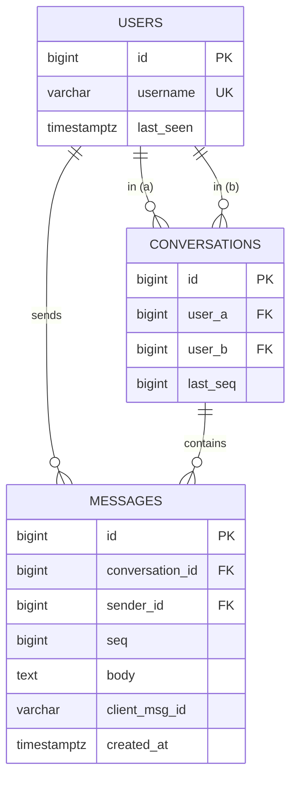
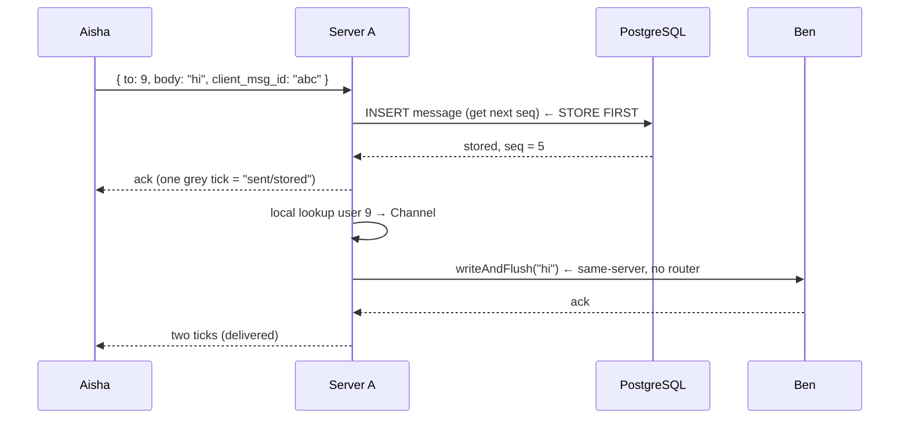
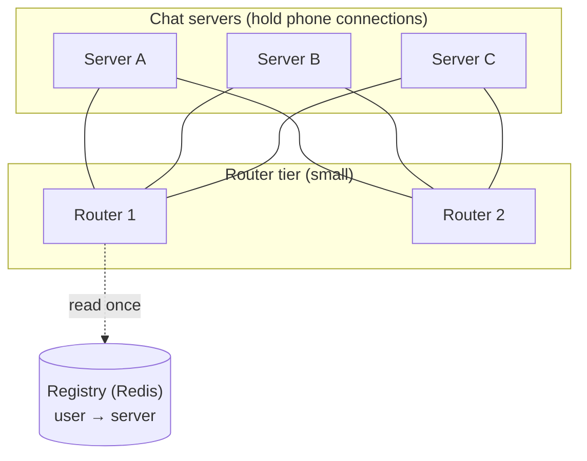
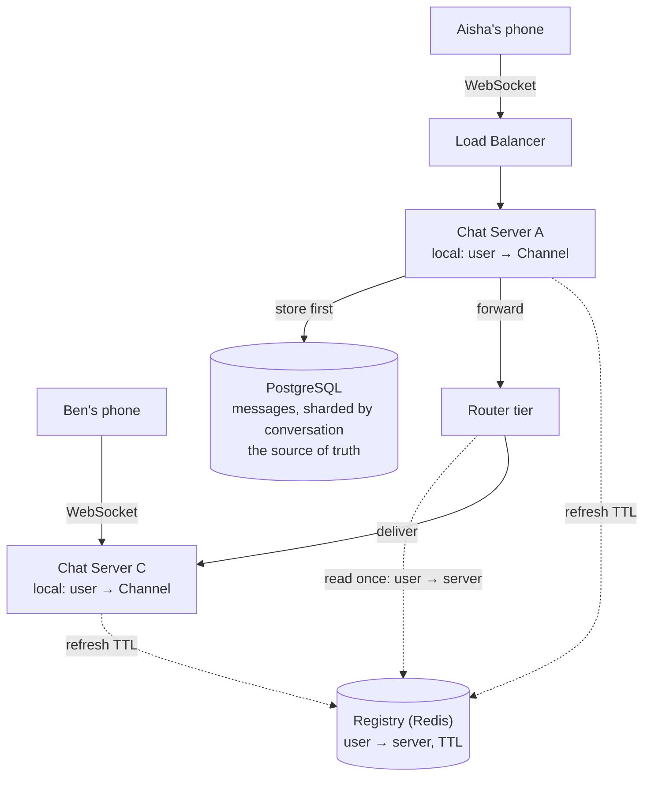

# Distributed Messaging System — System Design

This doc explains how to design a WhatsApp-style 1:1 chat service, one piece at a time. Each component gets two parts:
**the idea** (what it does and why, in plain language) and **the details** (the actual mechanics, numbers, and code).
Read it in order — later sections assume you've read the earlier ones.

---

## Contents

1. [The problem](#1-the-problem)
2. [The one big idea](#2-the-one-big-idea)
3. [The cast: what each piece does](#3-the-cast-what-each-piece-does)
4. [The database tables](#4-the-database-tables)
5. [The long-lived connection — WebSocket](#5-the-long-lived-connection--websocket)
6. [Opening a connection, step by step](#6-opening-a-connection-step-by-step)
7. [The two maps — local Channel and shared registry](#7-the-two-maps--local-channel-and-shared-registry)
8. [Sending a message, same server](#8-sending-a-message-same-server)
9. [Sending across servers — the router tier](#9-sending-across-servers--the-router-tier)
10. [Ordering messages — the seq counter](#10-ordering-messages--the-seq-counter)
11. [Delivery guarantees — at-least-once and dedup](#11-delivery-guarantees--at-least-once-and-dedup)
12. [Offline delivery — the cursor](#12-offline-delivery--the-cursor)
13. [Staying alive — heartbeats and dead sockets](#13-staying-alive--heartbeats-and-dead-sockets)
14. [How big does this need to be?](#14-how-big-does-this-need-to-be)
15. [Architecture recap](#15-architecture-recap)
16. [Scaling order](#16-scaling-order)
17. [How to build this in stages](#17-how-to-build-this-in-stages)
18. [One-paragraph summary](#18-one-paragraph-summary)

---

## 1. The problem

A 1:1 chat service does something that sounds trivial: Aisha sends Ben a message, and Ben should see it *right away* if
he's online — or the moment he opens the app if he's offline.

That "right away" is the whole difficulty, and it breaks the model most web apps are built on.

Two truths run through everything below, and keeping them straight is the key to the whole design:

1. **The network can drop, but storage doesn't.** A message isn't "sent" until it's *stored*. The database is the truth;
   the open connection is just a fast pipe on top of it.
2. **A conversation has two people, and either can be offline.** So the system must handle instant delivery to an online
   user *and* catch-up delivery to an offline one, from the same stored history.

Everything here hangs off one question: **how does a message reach Ben the moment it's sent?** The answer has three
parts, and the doc builds them up in order:

- a **connection that stays open** (§5), so the server can push without being asked;
- a **registry** that knows which server holds each user's connection (§7);
- a **message store** that keeps every message safe and ordered (§4), written *before* anything else.

---

## 2. The one big idea

A normal web request is "client asks, server answers." The server may not speak on its own. That rule makes instant
delivery impossible — the server can't tell Ben "you have a message" unless Ben happens to ask.

So the central decision:

> Every online user holds a **long-lived connection** to a chat server, and the server pushes messages down it. The
> database is written first and is the source of truth; the connection is a fast delivery pipe layered on top.

This flips the request/response rule. Instead of "ask then answer," either side can send at any time. And it means:

- **Delivery is a push**, not a poll. A held-open pipe delivers the instant a message arrives. Polling is rejected —
  it's wasteful (most polls find nothing) and slow (a message waits until the next poll). Long-polling is only a
  fallback for networks that block WebSockets.
- **The pipe is disposable; the database is not.** If the connection drops (a tunnel, a lift, a backgrounded app), the
  phone just opens a new one and catches up on what it missed — possibly landing on a *different* server, which is fine,
  because nothing important lives only in a server's memory. The map is a fast pointer to a live pipe; the truth is the
  database.

---

## 3. The cast: what each piece does

Here's every component this doc covers, in one line each. Come back to this table whenever you forget what something
does.

| Component                    | What it does                                                                                                                                                            |
|------------------------------|-------------------------------------------------------------------------------------------------------------------------------------------------------------------------|
| **Phone / client**           | Holds one long-lived connection; sends and receives messages; keeps a local outbox and a per-conversation cursor.                                                       |
| **Load balancer**            | Spreads new connections across chat servers.                                                                                                                            |
| **Chat server**              | Holds tens of thousands of open connections; pushes messages down them. Stateful only in the narrow sense that a user's *live* connection sits on one server at a time. |
| **Router tier**              | A small middle tier so chat servers never talk to each other directly — they hand a message to a router, which finds the recipient's server.                            |
| **Registry** (Redis)         | The shared lookup `user → which chat server holds their connection`. TTL'd, refreshed by heartbeat.                                                                     |
| **Message store** (Postgres) | The durable truth: every message, ordered per conversation. Written before anything else.                                                                               |

The recurring theme: **the database is the truth, the registry is a fast pointer, and the open pipe is a disposable
accelerator.**

---

## 4. The database tables

It's worth seeing the schema up front, because delivery, ordering, and dedup all lean on it. Three tables carry the
whole 1:1 model.



*Fig. 1 — `seq` orders messages within a conversation; the two `UNIQUE` constraints on `messages` are what make ordering
and dedup work (§10, §11).*

```sql
CREATE TABLE users
(
    id        BIGINT GENERATED ALWAYS AS IDENTITY PRIMARY KEY,
    username  VARCHAR(64) NOT NULL UNIQUE,
    last_seen TIMESTAMPTZ
);

CREATE TABLE conversations
(
    id       BIGINT GENERATED ALWAYS AS IDENTITY PRIMARY KEY,
    user_a   BIGINT NOT NULL REFERENCES users (id),
    user_b   BIGINT NOT NULL REFERENCES users (id),
    last_seq BIGINT NOT NULL DEFAULT 0, -- the per-conversation counter (§10)
    -- store the pair with user_a < user_b, so one pair is stored exactly once
    UNIQUE (user_a, user_b),
    CHECK (user_a < user_b)
);

CREATE TABLE messages
(
    id              BIGINT GENERATED ALWAYS AS IDENTITY PRIMARY KEY,
    conversation_id BIGINT      NOT NULL REFERENCES conversations (id),
    sender_id       BIGINT      NOT NULL REFERENCES users (id),
    seq             BIGINT      NOT NULL, -- order within THIS conversation
    body            TEXT        NOT NULL,
    client_msg_id   VARCHAR(64) NOT NULL, -- the phone's id for this message
    created_at      TIMESTAMPTZ NOT NULL DEFAULT now(),

    -- two messages in one conversation can never share an order slot (§10)
    UNIQUE (conversation_id, seq),
    -- a resent message maps to the same row instead of a duplicate (§11)
    UNIQUE (sender_id, client_msg_id)
);

-- History scroll and catch-up read newest-first within a conversation (§12).
CREATE INDEX idx_messages_conv_seq ON messages (conversation_id, seq DESC);
```

Three things worth calling out, because the rest of the doc depends on them:

- **One conversation row per pair, stored once.** The `CHECK (user_a < user_b)` plus `UNIQUE(user_a, user_b)` means
  (Aisha, Ben) and (Ben, Aisha) resolve to the *same* row — you always look it up with the smaller id first.
- **`seq` is per-conversation, not global.** Order only has to make sense *within* one chat, so each conversation has
  its own 1, 2, 3, … counter (§10). `created_at` is only for display — two messages can share a wall-clock timestamp, so
  it can't be the source of order.
- **`client_msg_id` makes sends idempotent.** The phone generates it *before* sending, so a retry carries the same id
  and maps to the same row (§11) — one tap is one message, even across retries.

---

## 5. The long-lived connection — WebSocket

### The idea

The whole design rests on a connection that stays open so the server can push. That connection is a **WebSocket**. The
common confusion is "a web connection can't stay open" — but it can; what's really different is the *rule* about who's
allowed to speak.

### The details

Under the hood, a WebSocket is just a normal TCP connection that both sides keep open and use in both directions. A
plain HTTP connection *can* stay open too — the difference isn't the pipe, it's the **application-level protocol layered
on top**:

- **HTTP's rule:** "client asks, server answers." The server may not speak on its own.
- **WebSocket's rule:** either side sends at any time.

Same pipe underneath (a two-way socket that never cared who spoke first), different rulebook on top. WebSocket drops the
ask-then-answer rule, which is exactly what lets the server push a message to Ben without Ben asking.

That "either side, any time" property is the one thing a chat system cannot do without, and it's why polling (§2) is
only a fallback: with a held-open WebSocket the server delivers the instant a message arrives, no wasted round trips.

---

## 6. Opening a connection, step by step

### The idea

Before the server can push to Aisha, her phone has to open the pipe *and prove who she is*. The connection is "unknown"
until a login token is checked — only then does the server record "this pipe belongs to Aisha."

### The details

Say Aisha is user 7, connecting to Server A. The steps:

```text
1. TCP handshake        → the OS gives the server a numbered handle:
                          a file descriptor, e.g. fd 1234
2. Netty wraps the fd    → a Channel object that holds the fd and gives
                          clean methods (channel.writeAndFlush(msg),
                          channel.close())  — "fd" = the raw OS pipe
3. TLS handshake         → everything on the pipe is now encrypted
4. Upgrade request       → the phone sends an HTTP "upgrade" request,
                          carrying Aisha's signed login token (first real data)
5. Server checks token   → bad/missing → refuse and close
                          good → read "user 7" out of it
                          (this is how the server knows the socket is Aisha's;
                           the phone never just *claims* "I'm 7")
6. Now a WebSocket       → the pipe becomes a free-form two-way channel
7. Record the mapping    → Server A memory: user 7 → Channel
```

The important timing detail: the socket is *born* at step 1, but the `user 7 → Channel` mapping is only made at step
6–7, **after** the token checks out. Between those steps the connection is open but "unknown." That's deliberate — a
server gives a new connection only a few seconds to present a valid token, and drops it otherwise.

Once the mapping exists, delivery is easy: whenever Server A needs to reach user 7, it looks up this local map, gets the
`Channel`, and writes the bytes down that pipe. Note the server stores the **`Channel`** (the thing its code acts on),
not the raw fd — the `Channel` carries its user, stamped on it right after the token check:

```java
// Right after the token check, stamp the user onto the connection object.
channel.attr(USER_ID).

set(7L);

// Later, to read who a socket belongs to (no reverse fd → user map needed):
Long userId = channel.attr(USER_ID).get();   // → 7

// To deliver a message to a connection this server holds:
channel.

writeAndFlush(message);
```

Attaching the user to the `Channel` (rather than keeping a separate `fd → user` map) means nobody can send as someone
else — you'd have to be on *that person's* authenticated pipe. The phone never re-claims "I'm 7" per message; identity
comes from the connection.

---

## 7. The two maps — local Channel and shared registry

### The idea

Delivery needs to answer one question: **"who is connected where?"** That takes two different maps, and confusing them
is the classic mistake. One is local to a server (how to actually write bytes), the other is shared (how any server
finds a user).

### The details

| Map           | Where it lives           | Key → value      | Used for                                                                                     |
|---------------|--------------------------|------------------|----------------------------------------------------------------------------------------------|
| **Local map** | One chat server's memory | `user → Channel` | Actually writing bytes down that user's pipe. Only usable by the server that holds the pipe. |
| **Registry**  | Redis (shared)           | `user → server`  | Any server discovering which chat server holds a user's connection.                          |

The split matters because a `Channel` only means something *inside the process that owns it* — Server A can't write to a
`Channel` that lives on Server B. So the registry stores the **server name**, not the `Channel`.

When a user connects, the server writes **two** entries, doing two different jobs:

```text
On Ben (user 9) connecting to Server B:

  Local (Server B memory):   user 9 → Channel   (how B writes bytes down Ben's pipe)
  Registry (Redis, shared):  conn:ben → "Server B"   (how any server finds Ben)
```

The registry entry has a **TTL** and is refreshed by heartbeat (§13), so it points at a live server, not a dead one. The
lifecycle writes both on connect and removes both on a clean disconnect; on a crash or phone-death, the local map
vanishes with the process while the registry entry simply *expires* on its own.

Because the local map and the registry are separate stores, they can briefly disagree — the registry might still say
"Server B" for a moment after B crashed, or a connect might land locally a beat before the registry write lands.
Delivery treats "registry says B, but B has no such pipe" as simply **"deliver later from the database,"** never as an
error. The brief wrong-state gap just means one push fails or the entry expires, and the phone reconnects and pulls what
it missed — nothing is lost, because the message was already stored.

---

## 8. Sending a message, same server

### The idea

Start with the simplest case: both people are connected to the *same* chat server. This shows the golden rule — **store,
then deliver** — without the router complexity yet.

### The details

Aisha (user 7 on Server A) sends "hi" to Ben (user 9, also on Server A):



*Fig. 2 — Store first, then deliver. The sender's "sent" tick means stored; "delivered" comes after the recipient's pipe
accepts it.*

Walking through it:

1. **Store first.** Server A inserts the message and gets its `seq` (§10). This is the golden rule: **store, then
   deliver.** If we pushed to Ben *before* storing and the server crashed, the message would exist on Ben's screen but
   nowhere else — lost on his next reload. So the database write always comes first.
2. **Ack the sender.** Once stored, Aisha's app shows one grey tick ("sent" = safely stored).
3. **Local lookup and deliver.** Since Ben is on the same server, A looks up `user 9 → Channel` in its *local* map and
   writes "hi" straight down Ben's pipe. No registry, no router needed — the sender happened to be on the same server as
   the recipient.
4. **Delivered tick.** When Ben's side accepts it, Aisha's app shows two ticks ("delivered").

This same-server path is the fast, common case within one server. The next section handles the general case, where Ben
is on a *different* server.

---

## 9. Sending across servers — the router tier

### The idea

One server can't hold all the connections, so we run many chat servers. That creates the core problem: **Aisha is on
Server A, Ben is on Server B, and A has no pipe to Ben.** The fix is a small middle tier of routers — not wiring every
server to every other.

### The details

**Why not just wire every chat server to every other?** That's a full mesh, and it explodes:

```text
full mesh links = n × (n − 1) / 2
for 200 servers  = 200 × 199 / 2 = 19,900 links

each server tracks 199 others → too many connections, too much churn
```

Instead, put a small set of **routers** in the middle. Chat servers connect only to routers, and routers connect to
every chat server:

```text
router links = chat_servers × routers
for 200 servers, 5 routers = 200 × 5 = 1,000 links
```

A chat server keeps one link per router; a router keeps one link per chat server. The link count grows with the number
of *servers*, not the millions of *users* — a router still only counts servers.



*Fig. 3 — Chat servers talk only to routers; routers talk to every chat server. Links scale with servers, not users.*

Now the full cross-server path. Aisha (user 7 on C1) sends "hi" to Ben (user 9 on C3):

```text
1. C1 reads Aisha's bytes off her socket, decodes { to: 9, body: "hi" }
2. C1 stores the message in the database (gets its seq), acks Aisha (one tick)
3. C1 forwards to a router — WITHOUT looking up where Ben is —
   by writing to ANY router (say R1); every router links every chat server,
   so C1 just hashes the user id to pick one, no "which router?" step
4. R1 looks up user 9 → C3 in the registry (Redis), turning the name "C3"
   into a live link via its own local  server → Channel  map
5. R1 forwards "hi" to C3 down that link
6. C3 reads it off, looks up user 9's Channel in ITS local map, writes "hi"
   down Ben's pipe → Ben sees it
7. a "delivered" ack travels the same path in reverse over the same sockets
```

Two facts make this scale, and they're the whole point of the tier:

- **Two network hops, but only one registry lookup.** The path `C1 → R1 → C3` adds a little latency (the price of the
  tier), but Redis is read **exactly once** — by the router, not by C1 and not by C3. C1 doesn't look anything up to
  pick its router (it sends to *any* router), and there's no "which router is C3 on?" step because every router already
  links every chat server. As you grow, that whole trip stays one Redis read.
- **Every hop is the same move:** "read one fd, look up the next hop, write that fd." Chat servers stay simple — they
  only know their own users. Routers are cheap — no phones, no history, just links plus a lookup. Add or remove a chat
  server and the routers adjust; scale routers by running several and splitting users across them by hashing the user
  id.

**Failure is a delay, never a loss.** If a router or chat server dies mid-hand-off, the forward fails — but the message
is already in the database (step 2). The receiver reconnects to some server, the registry updates, and the phone catches
up from the database. The delivery layer is a fast path; the database is the backstop.

---

## 10. Ordering messages — the seq counter

### The idea

Messages in a conversation need a definite order, even when two are sent almost simultaneously. Wall-clock time can't do
it (clocks drift, timestamps tie), so each conversation carries its own counter: `seq` = 1, 2, 3, …

### The details

`seq` is handed out per conversation, and two messages must never get the same one or leave a gap. Something has to hand
out the next `seq` atomically. Two options:

**Option A — a counter row (chosen here).** Bump `last_seq` on the conversation and use the returned value, in the
*same* transaction as the insert:

```sql
BEGIN;
UPDATE conversations
SET last_seq = last_seq + 1
WHERE id = 12 RETURNING last_seq; -- → 5, say

INSERT INTO messages (conversation_id, sender_id, seq, body, client_msg_id)
VALUES (12, 7, 5, 'hi', 'abc');
COMMIT;
```

Two racing sends serialize on that one conversation row, giving clean, gap-free order. The cost is a per-conversation
lock — which is fine, because a 1:1 chat is low-rate (two people typing).

**Option B — insert and retry.** Skip the counter; let the `UNIQUE(conversation_id, seq)` constraint reject a clash, and
retry with the next value. No counter row, but retries under contention.

V1 picks Option A (the counter row) for its clean, predictable ordering.

Either way, the `UNIQUE(conversation_id, seq)` constraint is the backstop: two messages in one conversation can never
share an order slot. And `created_at` stays display-only — `seq` is the source of truth for order, because two messages
can share a wall-clock timestamp but never a `seq`.

---

## 11. Delivery guarantees — at-least-once and dedup

### The idea

Networks drop acks. So the system delivers **at-least-once**: a message may be delivered or acked more than once, but
never zero times. A rare duplicate is better than a lost message — and dedup then hides the duplicates from the user.

### The details

Duplicates come from retries. The ack for Aisha's message gets dropped, so her phone resends the *same* message. Without
protection she'd see it twice. The guard is the second unique constraint:

```sql
UNIQUE (sender_id, client_msg_id)
```

Because the phone generated `client_msg_id` *before* the first send, the retry carries the **same** id. The resent
insert maps to the same row instead of creating a duplicate:

```text
Aisha sends  { client_msg_id: "abc", body: "hi" }  → INSERT → row (seq 5)
[ack dropped]
Aisha resends { client_msg_id: "abc", body: "hi" } → INSERT → UNIQUE clash
   → maps to the SAME row (seq 5), NOT a new message
```

The same idea covers redelivery on reconnect: the server may replay a message the client already has, but the client
dedups on `client_msg_id` / `seq` (it already has seq 40, so a replay of 40 is ignored). So **both sides carry an id
that makes repeats harmless** — `client_msg_id` on the way in, `seq` on the way out — and we can retry freely without
ever double-showing a message.

---

## 12. Offline delivery — the cursor

### The idea

If Ben is offline, his messages pile up in the database (already stored — §8). When he reconnects, he needs to pull
exactly what he missed, no more. The simple, recommended way: a per-user **cursor** — "I have up to seq 40 in
conversation 12."

### The details

On reconnect, Ben's client tells the server its cursor, and the server replays everything after it:

```sql
-- Ben reconnects saying "I have up to seq 40 in conversation 12"
SELECT id, sender_id, seq, body, created_at
FROM messages
WHERE conversation_id = 12
  AND seq > 40
ORDER BY seq LIMIT 50; -- page through in chunks
```

The database *is* the offline queue, and the cursor is just a bookmark into it. (An explicit Redis offline queue is a
possible optimization — faster to read, but a second thing to keep in sync — so V1 keeps the cursor over the database.)

Two practical points:

- **Don't loop over every conversation.** If Ben has 300 chats, first ask a cheap "which conversations changed since I
  was last here?" (using a per-conversation `last_activity` marker), then pull the cursor catch-up only for the few that
  moved.
- **Catch-up fills the gap, then the socket takes over.** After the pull, the phone stops asking and goes back to live
  pushes on the open socket. The pull is one-time; steady state is push.

**Sending while offline** is the mirror image. If Aisha composes a message with no connection, her phone saves it in a
local **outbox** with its `client_msg_id`, shown as pending (a clock icon). On reconnect the outbox flushes; the server
stores it, assigns `seq`, and acks — and the clock becomes a tick. The key subtlety: `seq` is set when the message
**reaches the server**, not when it was typed — so an offline-composed message slots into order *at arrival*, landing
after whatever reached the server first. If both people are offline, the message simply waits in whichever store has it
(phone outbox or database) until each side comes back. It's never lost, because at every moment it sits safely
*somewhere*.

---

## 13. Staying alive — heartbeats and dead sockets

### The idea

A socket can look perfectly open while the phone is actually gone (a tunnel, a dead battery, a force-kill with no clean
close — a "half-open" connection). So the server can't trust "the socket is open" to mean "the user is here." It needs a
heartbeat.

### The details

The phone sends a small **ping** every N seconds. The server tracks "last time I heard from user 9," and a background
sweep declares a socket dead if no ping arrives within, say, 30–60 seconds:

```text
phone --ping--> chat server --refresh TTL--> registry

no ping within 30-60s → close the fd, drop the local map entry,
                        stop refreshing the registry TTL → the entry expires
```

Why a heartbeat, and not just the OS or a failed write?

- **A failed write only fires when there's something to send.** It can't detect a dead *idle* connection — one that's
  been silent for an hour with no messages.
- **TCP keepalive exists but is too slow by default** (its default timing is hours). Teams either tune it way down or,
  more commonly, rely on the application heartbeat instead.

The ping does double duty. It's proof the phone is alive *and* it refreshes the user's TTL in the registry — so there
are two links, each kept honest by the side that can see it: the phone's ping keeps the phone→server link honest, and
the server's refresh keeps the server→user registry entry honest. If the server itself dies, it simply stops refreshing,
and the registry entry expires on its own — so the registry never points at a dead server forever.

None of this is dangerous, because the message was already stored (§8). A push during the brief wrong-state gap just
fails or the entry expires; when the phone reconnects (maybe to another server), the registry updates and the phone
pulls what it missed (§12).

---

## 14. How big does this need to be?

This section works out the hardware from two numbers, step by step. The trick is that chat conflates two *different*
questions, and sizing them separately is the whole game.

### 14.1 The two questions people conflate

```text
Question 1: how many open CONNECTIONS?  → drives the number of chat servers
Question 2: how many MESSAGES per second? → drives the database size
```

These are wildly different magnitudes, because **people stay connected all day but type rarely.** Sizing them as one
number is the classic mistake.

### 14.2 Question 1 — connections → chat servers

A chat server holds only so many open pipes, capped by whichever runs out first: **memory** (a receive buffer plus a
little state per connection) or the **OS open-file limit**. Memory is usually the cap. So pick a number one box holds
comfortably — say **50,000** connections — and run many servers behind a load balancer.

```text
online users        = 10,000,000
per server          = 50,000
chat servers        = 10,000,000 / 50,000 = 200 servers
```

Sanity-check the memory:

```text
50,000 connections × ~40 KB each ≈ 2 GB RAM   (just for connection buffers)
```

2 GB for connection state is comfortable on a normal box. And you deliberately **don't** pack a box to its limit, for
two reasons: a server holding a million connections that crashes drops a million phones into a **simultaneous reconnect
stampede**, whereas smaller servers drop ~50k and spread the reconnects; and you want **headroom** for a spike.

### 14.3 Question 2 — messages/sec → database size

Holding connections is cheap (people are online but quiet). The real cost is the **message rate**, because every message
is a database write plus a registry lookup. Size it like any other workload — rate × how long one "store a message"
takes.

The gut-check that shows the two questions are different:

```text
50,000 connections × ~40 KB  ≈ 2 GB RAM   (memory caps CONNECTIONS)
but maybe only ~500 messages/sec actually flow   (the DB handles that easily)
```

So a box can hold tens of thousands of connections while only a few hundred messages per second cross it. Memory caps
connections; CPU and the database cap the *talking*.

### 14.4 Five-year storage

At a sustained ~500 messages/sec:

```text
500/sec × 86,400 s/day        ≈ 43.2 million messages/day
× 365 × 5 years               ≈ 79 billion messages over 5 years
```

Row size, then × 3 for indexes and overhead:

```text
message row (id8, conv8, sender8, seq8, created8, body~200, client_msg~40) ≈ 280 bytes
79B × 280 bytes ≈ 22 TB  → × 3 ≈ 66 TB
```

**~66 TB is well past one box, so `messages` is sharded — by `conversation_id`.** Sharding by conversation keeps all of
a conversation's messages on one shard, so the per-conversation `seq` ordering (§10) stays simple (no cross-shard
counter). Add **read replicas** for history scrolls, which are read-heavy.

### 14.5 The one-line split

The whole capacity story reduces to one rule:

```text
too many CONNECTIONS  → add chat servers (cap each, spread with a load balancer)
too many MESSAGES/sec → scale the database (shard by conversation, replicas for history)
```

The connection cap answers Question 1 and makes adding servers safe — but it does *nothing* for Question 2, which you
size on the far smaller message rate. Keep them separate and each is easy.

---

## 15. Architecture recap

With every piece explained, here's the whole system in one diagram.



*Fig. 4 — Store first in Postgres, then deliver: same-server via the local map, cross-server via a router that reads the
registry once. The registry is a fast pointer; the database is the truth.*

---

## 16. Scaling order

Scale in this order — each step assumes the previous one is in place:

1. **One chat server + one Postgres**, WebSocket push, store-then-deliver. Correct for a small user base with no router
   at all (everyone's on one server).
2. **Redis registry + offline cursor.** Add the `user → server` lookup and the catch-up pull, so a reconnecting phone
   finds its history.
3. **More chat servers behind a load balancer.** Split users across them; each holds its own local map and registers its
   users. The registry is what lets any server find any user.
4. **The router tier.** Once there's more than one chat server, add routers so servers never full-mesh. Scale routers by
   hashing user id across a few of them.
5. **Read replicas for history.** History scrolls are read-heavy; move them off the primary.
6. **Shard `messages` by conversation.** Only once the message volume (~66 TB over 5 years, §14.4) outgrows one primary.
   Conversation-sharding keeps `seq` ordering local.

The ordering reflects the priorities: correct store-then-deliver first, then the registry and offline catch-up, then
horizontal connection scale (servers + routers), and only last the heavy database sharding.

---

## 17. How to build this in stages

1. **V1 — one server, correct core.** A single chat server holding WebSockets, one Postgres. Implement
   store-then-deliver (§8), the `seq` counter (§10), `client_msg_id` dedup (§11), and the offline cursor (§12). This is
   a working 1:1 chat for a small user base.
2. **V2 — registry + heartbeats.** Add the Redis registry (§7) and the heartbeat/TTL machinery (§13), so connection
   state is tracked and dead sockets are reaped.
3. **V3 — many chat servers.** Put chat servers behind a load balancer; each registers its users. Cross-server delivery
   still works because the registry knows who's where.
4. **V4 — router tier.** Add routers (§9) so chat servers hand off via a small middle tier instead of a full mesh.
5. **V5 — read replicas.** Move history reads to replicas.
6. **V6 — shard messages by conversation.** Only when storage or write volume demands it (§14.4).

---

## 18. One-paragraph summary

This is a WhatsApp-style 1:1 chat system where Aisha sends Ben a message and he should see it the instant it's sent if
he's online, or the moment he reconnects if he's offline — under two truths: the network can drop but storage doesn't (a
message isn't "sent" until it's *stored*, so the database is the source of truth and the open connection is just a fast
pipe), and a conversation has two people either of whom may be offline. Delivery reaches Ben the moment it's sent via
three parts: a connection that stays open (a WebSocket, which is just a TCP pipe whose application-level rulebook lets
either side speak at any time, unlike HTTP's ask-then-answer), a registry that knows which chat server holds each user's
live connection, and a message store written first. Chat servers each hold tens of thousands of open connections and are
stateful only in the narrow sense that a user's live pipe sits on one server at a time; they never talk to each other
directly but hand messages to a small router tier that finds the recipient's server, avoiding the full mesh (`n×(n−1)/2`
links) that 200 servers would otherwise need. Two maps drive delivery: a local `user → Channel` (only the server holding
the pipe can write bytes) and a shared registry `user → server` in Redis on a heartbeat-refreshed TTL — separate stores
that can briefly disagree, so "registry says B but B has no such pipe" is treated as "deliver later from the database,"
never as broken. The golden rule is store-then-deliver (push before storing risks a message that exists on the screen
but nowhere else), ordering comes from a per-conversation `seq` counter
(`UPDATE conversations SET last_seq = last_seq + 1 RETURNING`, backed by `UNIQUE(conversation_id, seq)`) rather than
wall-clock time, delivery is at-least-once with `client_msg_id` dedup (`UNIQUE(sender_id, client_msg_id)`) so retries
never double-show, and offline catch-up is a per-user cursor ("I have up to seq 40 in conversation 12" →
`SELECT ... WHERE seq > 40`). Heartbeats catch half-open sockets (a silent dead connection looks open, and a failed
write only fires when there's something to send) while doubling as the registry TTL refresh, so a dead server stops
refreshing and its entries expire on their own. Capacity separates two conflated questions: how many *connections* (→
number of chat servers: 10M online ÷ 50k per box ≈ 200 servers, ~2 GB RAM each, deliberately not packed to avoid
reconnect stampedes) and how many *messages/sec* (→ database size: people stay online but type rarely, so ~500 msg/sec
means ~79 billion messages and ~66 TB over five years, sharded by conversation with read replicas for history) — too
many connections adds chat servers, too many messages scales the database, and keeping the two separate is what makes
each easy.